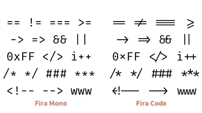

# 提高 VSCode 的生产率

> 原文：<https://medium.com/geekculture/increasing-productivity-in-vscode-b608d71b7aaf?source=collection_archive---------10----------------------->

VSCode 系列(Mac 版)第 3 部分，共 3 部分


Photo by [Carl Heyerdahl](https://unsplash.com/@carlheyerdahl?utm_source=unsplash&utm_medium=referral&utm_content=creditCopyText) on [Unsplash](https://unsplash.com/s/photos/productivity?utm_source=unsplash&utm_medium=referral&utm_content=creditCopyText)

读者们好。我希望你一切都好。今天，我们将浏览 VSCode 中的各种设置、扩展和键盘快捷键，并了解如何提高工作效率。我将避开沉重的 IDE 类功能，任何需要大量前期投资或类似的东西。这是关于获得即时提升，这样你可以更快地工作，赚更多的钱，或者在一天结束时有更多的空闲时间。如何利用这段时间完全取决于你自己。想睡午觉就去睡，想跳伞就去跳伞！

如果你还没有安装 VSCode，可以按照这个启动运行指南:[https://dean-draper . medium . com/Up-and-Running-with-vs-code-795 ed9 c 5906 c](https://dean-draper.medium.com/up-and-running-with-vs-code-795ed9c5906c)

我将在最后包含一个代码块，您可以将它添加到 settings.json 文件中，这样可以节省一些时间。毕竟这篇文章是关于节省时间的。

# 第 1 部分—设置

首先，我们要改变一些设置来提高可读性、屏幕空间和脑力消耗。如果你不努力阅读，你会走得更快。如果你能在屏幕上看到更多，你就不用来回滚动了。如果你长期从事编码工作，你就会理解长时间工作结束时的精神疲惫。你可以节省的每一点脑力也可以节省时间。

# 字体

任何 IDE 或代码编辑器最重要的部分就是你的字体。并非所有的字体都是一样的。我个人推荐的是 Fira 码。对我来说，即使是较小的字体也清晰可辨。它有连字，连字是用单个符号替换字符串的特殊字符。



Fira Code ligatures

即使你不决定使用 Fira 代码，你也需要找到一种对你来说非常易读的字体，一种即使在较小的字体大小下，你也可以随时阅读而不会紧张的字体。可以去[https://fonts.google.com/?category=Monospace&preview . size = 18](https://fonts.google.com/?category=Monospace&preview.size=18)找个好字体安装。根据屏幕的大小和比例，如果需要的话，可以降到 12 左右。安装很简单。双击想要下载的字体，然后选择`Install Font`。接下来，进入你的 VSCode，点击`Cmd + ,`调出设置。键入`Editor: Font Family`,它会把选项带到顶部。选择你的新字体，把它设置成你能舒服阅读的最小尺寸。如果你在努力，你就没有达到目的。

如果您的字体支持连字，您也可以搜索`Editor: Font Ligatures`并打开它们。它会将您发送到 settings.json 文件，您可以在其中添加下面一行:`”editor.fontLigatures”: true`(不要忘记在前一行的末尾添加一个逗号)

# 主题和视觉增强

在我的上一篇文章中，我以四个扩展开始，我认为这四个扩展立即增加了可读性。您可以通过以下链接查看它们:

[](https://dean-draper.medium.com/essential-extensions-for-productivity-in-vscode-a53c73649aaa) [## VSCode 中生产力的最佳扩展

### VSCode 系列的第 2 部分，共 3 部分

dean-draper.medium.com](https://dean-draper.medium.com/essential-extensions-for-productivity-in-vscode-a53c73649aaa) 

但是，每个人都有自己的个人喜好。你不必选择我的主题。我希望你选择对你的眼睛来说容易的，并且增加语法的易读性。你的语法颜色应该对你有意义。你可能会花一两周的时间找到一个感觉合适的。我相信这是值得的。

# 其他设置

关掉你的小地图。就是没啥用，还偷屏幕不动产。进入设置`Cmd + ,`并输入`Editor > Minimap: Enabled`。取消选中该框。你刚刚找回了一些空间。

关掉你的面包屑。它很酷，但是除非你喜欢在你的代码中重用文件名(提示:你不应该这样做)，它只会窃取屏幕空间，尤其是在小屏幕上。`Breadcrumbs: Enabled`应该是关机了。注意:如果你有一个巨大的 4k 显示器，这可能对你完全没有必要。我将让你来判断。

向右移动侧边栏。这样，当你切换侧边栏时，你就不会有文本移动，而必须重新找到你的位置。把你的智慧留给重要的事情。`Workbench > Side Bar: Location`应设置为右。

接下来，在侧栏中，我们将删除打开的编辑器。那么文件夹层次结构将占据整个范围。在你的文件夹中移动要容易得多。`Explorer > Open Editors: Visible`应设置为 0。这也可以从侧边栏关闭。点击右上角的`...`，取消选择`Open Editors`。如果我没记错的话，一旦你把 visible 设置为 0，这就不可能了。

# 集成终端

您可以点击键盘快捷键`Ctrl + `` 来打开您的集成终端。打开后，点击`Cmd + \`打开另一个。我在底部把它做得很小，在一个终端运行我的服务器进程，在另一个终端运行我的构建进程，如果我刚刚保存了错误的代码，我会立即显示红色。这可以节省你大量的时间。当你实现了一个 bug 或者破坏了一些东西的时候，这给了你即时的通知。

这就引出了下一个技巧。确保你一直在运行你的服务器，并且一直在运行你的构建过程。当你偏离轨道时，它们会提供即时反馈，这比以后没有起点地调试要快得多。这可能是这里最能节省时间的提示。如果不用别的，那就习惯一体化终端，让瞬红成为你最好的哥们。

# 第 2 部分—键盘快捷键

下一个需要重大改进的领域是键盘快捷键。为了快速有效地编辑，我收集了一个最有用的列表。

从列表开始是命令选项板。它允许您通过在调色板中键入来查找一些设置、命令等。键入`Cmd + Shift + P`调出命令面板。会显示一个预先填充的选项列表，让您了解可以使用的命令。


Command Palette in action

如果你不确定在哪里寻找一个特定的选项，这个窗口非常灵活。

# 棒形纽扣

`Ctrl + ``将隐藏和显示您的集成终端。我建议大部分时间都打开它，但是如果你需要更多的空间，你可以切换它。`Cmd + B`将切换你的工具条。如果你想恢复侧边栏，特别是浏览器，你可以点击`Cmd + Shift + E`。我还为我的笔记本电脑添加了一个活动栏开关，因为我没有足够的空间。进入你的命令面板`Cmd + Shift + P`并输入`Preferences: Open Keyboard Shortcuts`。

# 查找/选择下一个事件

需要帮助查找页面上出现的单词吗？`Cmd + F` (find)将帮助您找到该变量的第一个实例。`Ctrl + D`(选择当前所选文本的下一个出现位置)将帮助您逐个选择它们。您可以开始键入并覆盖整个选择。你也可以使用箭头键移动到名称中的特定位置，然后添加文本，而不是覆盖整个内容。您也可以使用`Cmd + Shift + L`来代替，只需在一次按键中选择页面上的每个事件。

# 查找和替换

作为替代，还有`Alt + Shift + F`(查找和替换)。你输入你想要查找的单词和你想要替换的单词，然后你有两个选择。`Enter`将替换当前高亮显示的值。`Cmd + Enter`将替换所有事件。当您在当天早些时候编写了`variableB`之后，终于想起一个可靠的变量名时，这尤其有用。

# 扩展/缩小选择

如果您正处于想要删除的代码块的中间，我认为使用下面的命令来删除文本块比试图找出要删除的内容要容易得多。每隔几次，我总是选择太多的括号或者在某处漏掉一个括号，然后几分钟后，调试开始。`Ctrl + Shift + →`将扩展选择，适当地扩展到代码块的边界、括号、函数调用等。`Ctrl + Shift + ←`走得太远就缩小。

# 向上/向下移动线条

`Option + ↑`或`↓`将当前高亮显示的文本上移一行。当你决定要把你写的东西放在括号里，一个函数调用，这是很有用的。打开函数，在括号之间按 enter 键，然后突出显示要移入括号中的内容。使用快捷键将其向上或向下移动。

# 向上/向下复制行

刚刚为一个路由、console.log 或其他您想要重复复制的内容编写了一个框架，这样您就不必再次键入了？`Alt + Shift + ↑`或`↓`向上或向下复制您高亮显示的选择。我不认为我真的点击过`↑`，但是如果你需要的话，它就在那里。

# 多光标选择

按住`Alt`同时点击多个位置会创建多个光标实例，它们都将输入相同的内容。`Cmd + Alt + ↑`或`↓`将允许您直接上下移动并选择多个位置。如果您想要突出显示的选择都完美排列，我最喜欢的选择之一是`Shift + Alt + click or drag selection`突出显示一整个框。您选择左上角，按住`Shift + Alt`并单击您希望选择右下角结束的位置。

还有很多键盘快捷键，但我相信这些是你应该首先学习的。这些对于提高生产率至关重要。当您准备探索更多内容时，可以使用命令面板或帮助菜单来查找更完整的 VSCode 键盘快捷键列表。

您可以将它添加到您的 settings.json 中，而不必阅读教程中的所有不同说明。你的 settings.json 应该只有一组括号。如果您已经有 settings.json 文件，请仅粘贴单个设置。搜索`Preferences: Open Settings (JSON)`然后输入这个。

```
{"editor.fontFamily": "'Fira Code'","editor.fontLigatures": true,"editor.tabSize": 2,"editor.minimap.enabled": false,"editor.detectIndentation": false,"editor.linkedEditing": true,"editor.fontSize": 13,"editor.inlineSuggest.enabled": true,"breadcrumbs.enabled": false,"workbench.sideBar.location": "right","explorer.openEditors.visible": 0}
```

给这篇文章做个书签，回来一两次来刷新你的记忆。从长远来看，这些设置将为你节省大量的时间。记住，时间就是金钱，朋友！