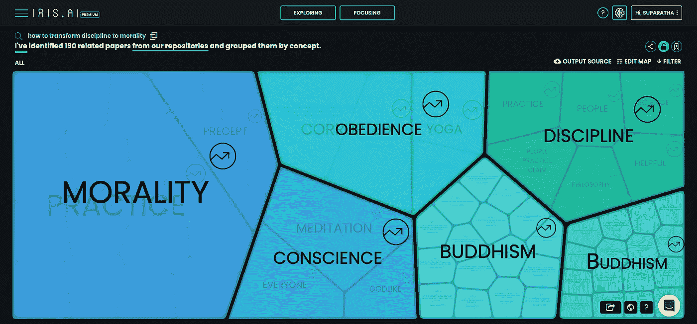
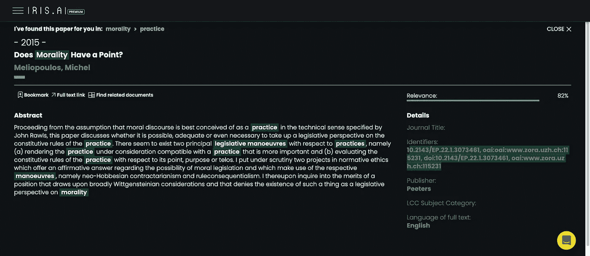

# 难以置信！我们，作家，将会用这个人工智能立刻统治世界

> 原文：<https://medium.com/geekculture/incredible-we-the-writers-will-dominate-the-world-with-this-ai-instantly-b5506125739c?source=collection_archive---------25----------------------->

## 这是我花了一天时间写的一份报告

Map of relevance resource in Iris.AI

> 如果你在研究上花费 10 倍的写作时间，那么你可以用这个人工智能写快 10 倍。

写作中最无聊最长的部分就是调研。你也这么想，对吧？我一直向往有哪个 AI 能为我的文章找到证据，而不是一篇一篇的搜索阅读。虽然它不能像我希望的那样自动工作，但是尝试一次就足够了。

她叫 Iris.AI。

首先，你需要知道这个人工智能并不便宜。这是€每月 75 英镑！所以，我尝试了免费版，看看是否可以不用付费就能使用这个强大的工具。

可以免费使用吗？

是的，你可以通过输入相关研究的网址来做，但它并不像我预期的那样工作。大多数 URL 不起作用。它需要一个摘要，我来满足它。然而，它不能读取上面的信息。我认为它们是动态页面，因为我曾经成功地在简单的 HTML 页面上创建了一个摘要。

那么，我们如何在我们的博客中使用它呢？

我试图让她阅读维基百科，但失败了。

我试着让她在媒体上阅读我的草稿，但是失败了。

我试图让她读一篇我在 WordPress 网站上写的关于我的帖子的假摘要，但是失败了。

她是故意挑剔还是装傻？

我不知道，也不会评价她。

好了，我该试试她的高级版了。是的，这是一个试验。

你需要至少 100 字的问题陈述，不包括你的研究问题。如果你没有明确的目标，那会很麻烦。嗯，我不知道我在找什么。

我只想知道，如何将纪律转化为道德。所以，我在脑子里写了一个随机的东西，包括“我不想在学校里做关于纪律的研究”,她理解了这句话。

为什么我在这个问题陈述中提到了那句话？

因为当我在谷歌学术寻找关于纪律的文章时，许多关于学校纪律的论文出现在我面前，这不是我想要的。

问题陈述只需要 100 个单词，但我不知道我应该关注什么。我把破窗理论作为一个很好的例子放在问题陈述中，但我不知道它与我想写的东西有什么关系。

嗯，你可以猜猜结果。是的，她展示了我不想知道的东西。

然后我试了试 PaperOwl 的论文陈述生成器，但是她看不懂。嗯，我想她至少应该说一说我喂她吃了什么，这样我就能更好地理解她，不过没关系。

再次，我手动写一个新的问题陈述，提到佛教中的五戒应该是这个任务的最佳实践。

她从自己的资料库中找出了 190 篇相关论文，并按照概念进行了分组。这里是我从结果中导出的[CSV 文件](https://icedrive.net/0/94cEVDE69Y)。

## 这些是一些有趣且有前途的标题:

*   佛教:科学、哲学、宗教
*   社会工作的伦理化和伦理的社会化――一个非洲的挑战
*   道德有意义吗？
*   反对与超越——为了社会学:英国社会学家的自我理解研究
*   科学与伦理教学的伦理:合作提案。
*   常识的道德性:来自西德维克的问题
*   劳动力与宗教信仰之间的伦理问题
*   生物医学伦理学的理论与实践:一个令人困扰的分歧
*   叔本华与佛教中的伦理学
*   打断道德技术，改造生物医学伦理——读《卡尔·巴特》反对世俗道德的“罪恶”,支持人类繁荣的姿态
*   验光实践中的伦理问题
*   援助之手还是仆人纪律？解读关于社会科学在参与性决策中的作用的非学术观点
*   作为科学和学科的心理学:德国的案例。
*   道德科学，或者说，义务哲学

Does Morality Have a Point?

好吧，我选择看《道德有没有意义》全文。首先，它似乎对我不清楚我想写什么有用。

我希望人工智能可以找到资源来支持我的帖子，但这个人工智能的顺序是相反的。由于不确定我应该读什么，Iris 帮助我完成了最艰巨的工作，从数以百万计的资源中找到这些资源。他们也不会出现在谷歌学术，这是你可以从这个 AI 中得到的好处。

只需在那里输入你的概念，然后从这些资源中写出大量的内容！