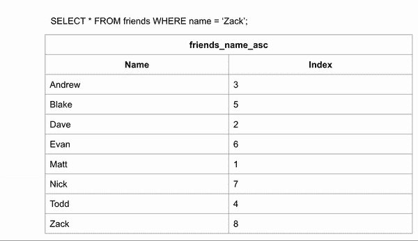
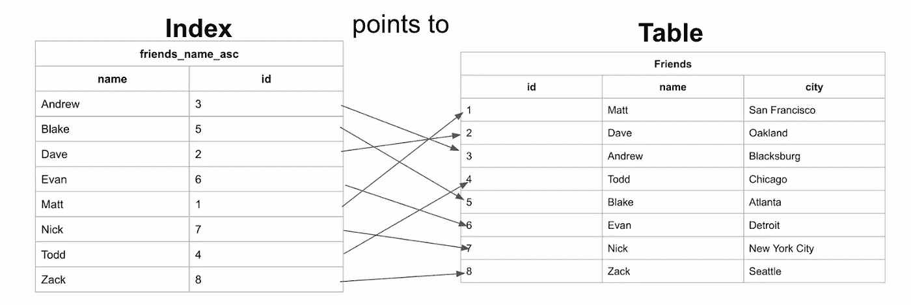
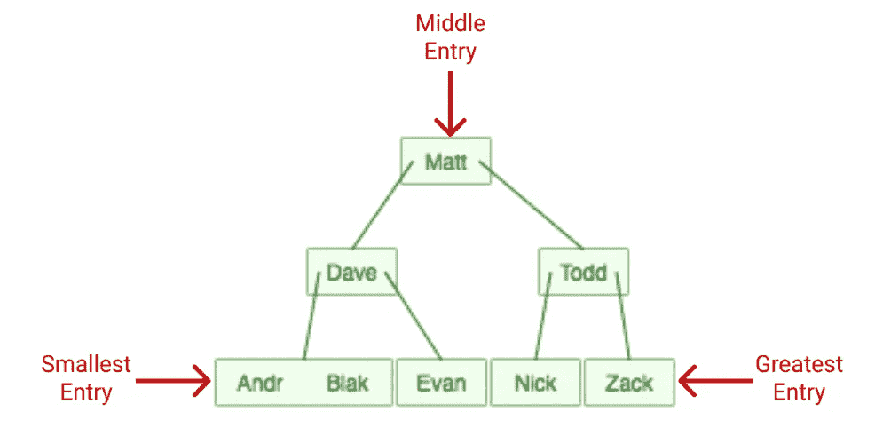
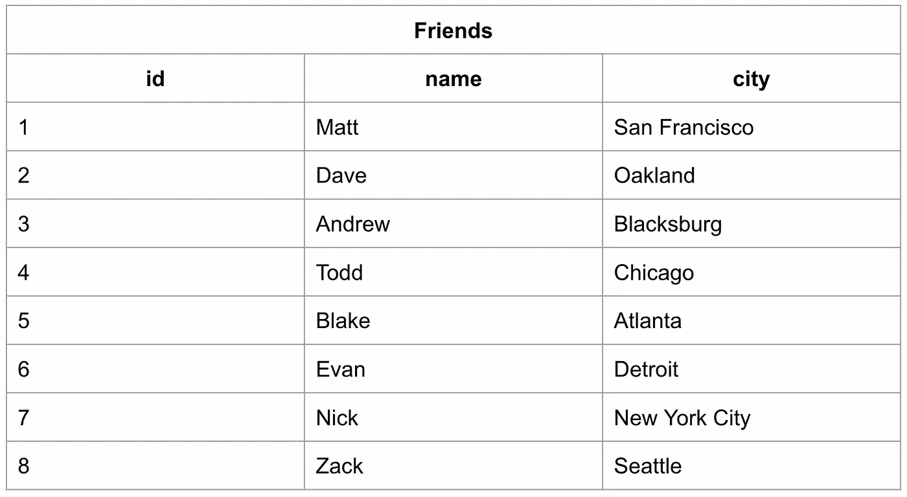
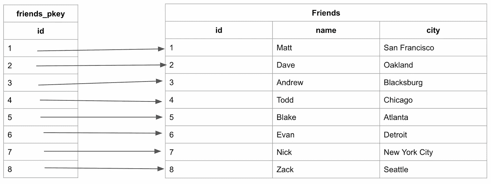
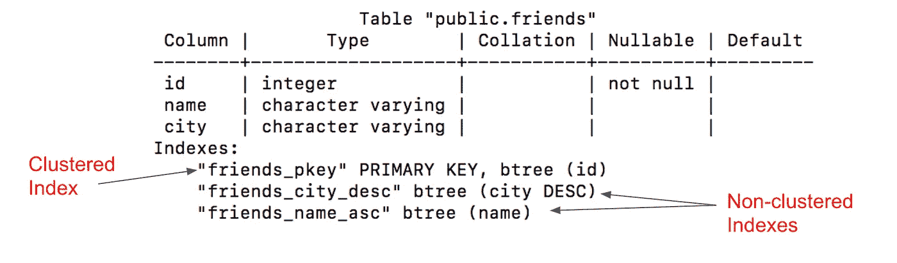
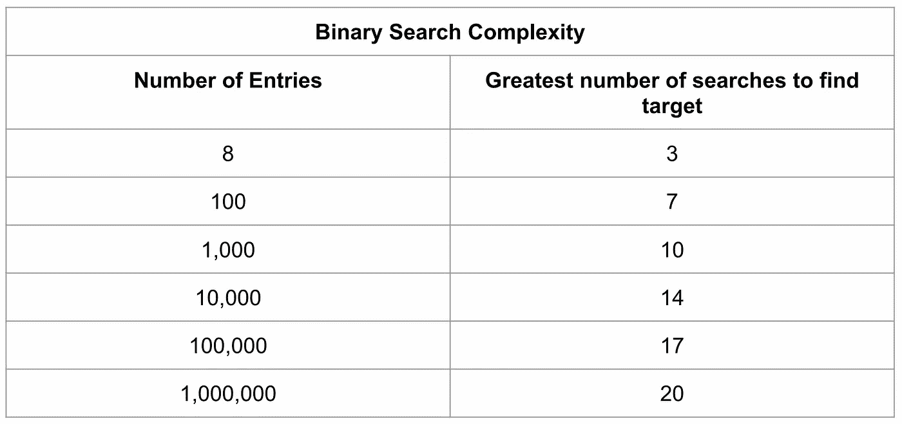
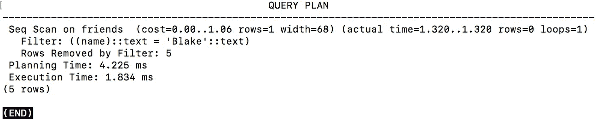
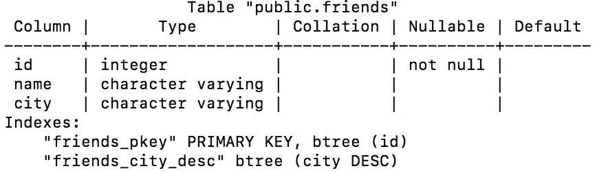

# Postgres 中的索引

> 原文：<https://medium.com/geekculture/indexing-in-postgres-db-4cf502ce1b4e?source=collection_archive---------1----------------------->

# 什么是索引？

索引通过创建指向数据库中数据存储位置的指针来加快列的查询速度。

假设您想在一个大型数据库中查找一条信息。为了从数据库中得到这些信息，计算机将检查每一行，直到找到为止。如果您要查找的数据接近末尾，这个查询将需要很长时间来运行。

*寻找最后一个条目的可视化*:


如果表是按字母顺序排序的，搜索名字会快得多，因为我们可以跳过在某些行中查找数据。如果我们想搜索“Zack ”,并且我们知道数据是按字母顺序排列的，我们可以跳到数据的中间，看看 Zack 是在那一行之前还是之后。然后，我们可以将剩下的行减半，进行同样的比较。



这需要 3 次比较才能找到正确的答案，而不是在无索引数据中的 8 次。

索引允许我们创建排序列表，而不必创建所有新的排序表，这将占用大量的存储空间。

# 指数到底是什么？

索引是一种结构，它保存索引排序的字段和一个指针，该指针从每个记录指向实际存储数据的原始表中相应的记录。索引用于类似联系人列表的东西，其中数据可能按照您添加联系人信息的顺序进行物理存储，但如果按照字母顺序列出，则更容易找到联系人。

让我们看看上一个示例中的索引，看看它是如何映射回原始的 Friends 表的:



我们在这里可以看到，表中存储的数据是按照基于数据添加顺序的递增 id 排序的。索引中的名字是按字母顺序存储的。

# 索引的类型

有两种类型的数据库索引:

1.  **集群**
2.  **非集群**

聚集和非聚集索引都作为 B 树存储和搜索，B 树是一种类似于[二叉树](https://en.wikipedia.org/wiki/Binary_tree)的数据结构。B 树是一种“自平衡的树数据结构，它维护分类的数据，并允许在对数时间内进行搜索、顺序访问、插入和删除。”基本上，它创建了一个树状结构，对数据进行排序以便快速搜索。



这是我们创建的索引的 B 树。最小的条目在最左边，最大的条目在最右边。所有查询都将从顶部节点开始，并沿着树向下进行，如果目标条目小于当前节点，则遵循左侧路径，如果大于当前节点，则遵循右侧路径。在我们的案例中，先是马特，然后是托德，然后是扎克。

为了提高效率，许多 B 树会限制输入条目的字符数。B 树会自己完成这项工作，不需要限制列数据。在上面的示例中，下面的 B 树将条目限制为 4 个字符。

# 聚集索引

聚集索引是每个表的唯一索引，它使用主键来组织表中的数据。聚集索引确保主键以递增的顺序存储，这也是表在内存中的顺序。

*   对于 Postgres，聚集索引必须显式声明。
*   在创建表时创建。
*   使用按升序排序的主键。

## 创建聚集索引

定义主键时，将自动创建聚集索引:

```
**CREATE** **TABLE** friends (id INT **PRIMARY** **KEY**, name VARCHAR, city VARCHAR);
```

一旦填写完毕，该表将如下所示:



创建的表“friends”将有一个自动创建的聚集索引，该索引是围绕名为“friends_pkey”的主键“id”组织的:



当按“id”搜索表格时，列的升序允许执行最佳搜索。因为数字是有序的，所以搜索可以在 B 树中导航，允许在对数时间内进行搜索。

但是，为了在表中搜索“名称”或“城市”,我们必须查看每个条目，因为这些列没有索引。这是非聚集索引非常有用的地方。

# 非聚集索引

非聚集索引是对主表中特定字段的排序引用，它保存指向表原始条目的指针。我们展示的第一个示例是非聚集表的示例:


它们通过创建更容易搜索的列来提高表的查询速度。在创建和填充表之后，数据分析师/开发人员可以创建非聚集索引。

非聚集索引指向内存地址，而不是存储数据本身。这使得它们的查询速度比聚集索引慢，但通常比非索引列快得多。

您可以创建许多非聚集索引。截至 2008 年，SQL Server 中最多可以有 999 个非聚集索引，PostgreSQL 中没有限制。

## 创建非集群数据库(PostgreSQL)

## 部分索引

部分索引只覆盖表数据的一个子集。这是一个带有 WHERE 子句的索引。这个想法是通过减少索引的大小来提高索引的效率。较小的索引占用较少的存储空间，更易于维护，并且扫描速度更快。

例如，假设您允许用户在您的站点上标记评论，这反过来会将`flagged`布尔值设置为 true。然后，您可以成批处理标记的注释。您可能希望创建如下所示的索引:

```
CREATE INDEX articles_flagged_created_at_index ON articles(created_at) WHERE flagged IS TRUE;
```

这个索引将保持相当小，并且还可以与其他索引一起用于可能需要它的更复杂的查询。

## 表达式索引

表达式索引对于匹配某些函数或数据修改的查询非常有用。Postgres 允许您对该函数的结果进行索引，从而使搜索变得与通过原始数据值进行搜索一样高效。例如，您可能要求用户存储他们的电子邮件地址以便登录，但是您想要不区分大小写的身份验证。在这种情况下，可以原样存储电子邮件地址，但在`WHERE lower(email) = '<lowercased-email>'`进行搜索。在这种查询中使用索引的唯一方法是使用表达式索引，如下所示:

```
CREATE INDEX users_lower_email ON users(lower(email));
```

另一个常见的例子是查找给定日期的行，其中我们在 datetime 字段中存储了时间戳，但希望通过 date casted 值来查找它们。包含`WHERE date(articles.published_at) = date('2011-03-07')`的查询可以使用像`CREATE INDEX articles_day ON articles ( date(published_at) )`这样的索引。

## 唯一索引

唯一索引保证了表中不会有多个具有相同值的行。创建唯一索引的好处有两个:数据完整性和性能。对唯一索引的查找通常非常快。

就数据完整性而言，在 ActiveModel 类上使用`validates_uniqueness_of`验证并不能真正保证唯一性，因为可能会有并发用户创建无效记录。因此，您应该始终在数据库级别创建约束——要么使用索引，要么使用唯一约束。

唯一索引和唯一约束之间几乎没有区别。唯一索引可以被认为是较低的级别，因为表达式索引和部分索引不能被创建为唯一约束。甚至表达式上的部分唯一索引也是可能的。

**多栏索引**

虽然 Postgres 能够创建多列索引，但是理解何时这样做是有意义的是很重要的。通过执行位图索引扫描，Postgres 查询规划器能够在多列查询中组合和使用多个单列索引。一般来说，您可以在包含查询条件的每一列上创建一个索引，并且在大多数情况下 Postgres 都会使用它，所以在创建多列索引之前，请确保对其进行基准测试和论证。与往常一样，索引是有代价的，多列索引只能优化以相同顺序引用索引中的列的查询，而多个单列索引为大量查询提供了性能改进。

但是，在某些情况下，多列索引显然是有意义的。包含`WHERE a = x AND b = y`的查询或仅使用`WHERE a = x`的查询可以使用列`(a, b)`上的索引，但是使用`WHERE b = y`的查询不会使用该索引。因此，如果这与应用程序的查询模式相匹配，那么多列索引方法是值得考虑的。还要注意，在这种情况下，单独为`a`创建一个索引是多余的。

# 查看索引

在 PostgreSQL 中，“\d”命令用于列出表的详细信息，包括表名、表列及其数据类型、索引和约束。

我们的朋友表的详细信息现在如下所示:

**查询提供好友表详情** : \d 好友；



看上面的图像，“friends_name_asc”现在是“friends”表的关联索引。这意味着[查询计划](https://dataschool.com/sql-optimization/what-is-a-query-plan/)，即 SQL 在确定执行查询的最佳方式时创建的计划，将在进行查询时开始使用索引。请注意,“friends_pkey”被列为一个索引，尽管我们从未将其声明为一个索引。这就是本文前面提到的基于主键自动创建的**聚集索引**。

我们还可以看到有一个“朋友 _ 城市 _desc”索引。该索引的创建类似于 names 索引:

```
**CREATE** **INDEX** friends_city_desc **ON** friends(city **DESC**);
```

这个新的索引将用于对城市进行排序，并且将按照相反的字母顺序进行存储，因为关键字“DESC”被传递了，它是“降序”的缩写。这为我们的数据库提供了一种快速查询城市名称的方法。

# 搜索索引

创建非聚集索引后，可以开始使用它们进行查询。索引使用一种被称为[二分搜索法](https://en.wikipedia.org/wiki/Binary_search_algorithm)的最佳搜索方法。二进制搜索的工作方式是不断将数据切成两半，并检查您要搜索的条目是在当前数据部分中间的条目之前还是之后。这在 B 树中工作得很好，因为它们被设计成从中间入口开始；要在树中搜索条目，您知道左侧路径中的条目会较小或在当前条目之前，右侧的条目会较大或在当前条目之后。在表格中，它看起来像这样:


将这种方法与本文开头的非索引表的查询进行比较，我们能够将搜索总数从八个减少到三个。使用这种方法，在一个二分搜索法中搜索 100 万个条目可以减少到 20 次。



# 何时使用索引

索引旨在提高数据库的性能，因此只要索引能显著提高数据库的性能，就使用索引。随着数据库变得越来越大，您越有可能从索引中受益。

# 何时不使用索引

当数据写入数据库时，首先更新原始表(聚集索引),然后更新该表的所有索引。每次对数据库进行写入时，索引在更新之前都是不可用的。如果数据库不断接收写操作，那么索引将永远无法使用。这就是为什么索引通常应用于数据仓库中按计划(非高峰时间)更新新数据的数据库，而不是可能一直接收新写入的生产数据库。

注意:Postgres 的最新版本(目前在测试中)将允许你在更新索引的同时查询数据库。

# 测试索引性能

若要测试索引是否会开始减少查询时间，可以在数据库上运行一组查询，记录完成这些查询所需的时间，然后开始创建索引并重新运行测试。

为此，请尝试在 PostgreSQL 中使用 EXPLAIN ANALYZE 子句。：

```
**EXPLAIN** **ANALYZE** **SELECT** ***** **FROM** friends **WHERE** name **=** 'Blake';
```

在我的小数据库里产生了:



这个输出将告诉您选择了查询计划中的哪种搜索方法，以及查询的计划和执行花费了多长时间。

一次只创建一个索引，因为并非所有索引都会减少查询时间。

*   PostgreSQL 的查询规划非常高效，因此添加新索引可能不会影响查询的执行速度。
*   添加索引总是意味着存储更多的数据
*   添加索引会增加写操作后数据库完全更新所需的时间。

如果添加索引不能减少查询时间，可以简单地从数据库中删除它。

要删除索引，请使用 DROP INDEX 命令:

```
**DROP** **INDEX** friends_name_asc;
```

数据库的轮廓现在看起来像这样:



这表明成功地移除了用于搜索姓名的索引。

**指数类型**

*   ***B 树*** 是你做`CREATE INDEX`时得到的默认。几乎所有的数据库都有一些 B 树索引。b 树试图保持平衡，树的每个分支中的数据量大致相同。因此，为了找到行而必须遍历的级别数总是大致相同。b 树索引可以有效地用于等式和范围查询。它们可以对所有数据类型进行操作，也可以用于检索空值。b 树被设计成可以很好地进行缓存，即使只是部分缓存。
*   ***散列索引*** pre-Postgres 10 只对等式比较有用，但你几乎不会想使用它们，因为它们不是事务安全的，需要在崩溃后手动重建，并且不能复制到追随者，所以相对于使用 B 树的优势相当小。在 Postgres 10 和更高版本中，散列索引现在被预写记录并复制到跟随者。
*   [***广义倒排索引(GIN)***](http://www.postgresql.org/docs/current/static/gin.html) 当一个索引必须将多个值映射到一行时很有用，而 B 树索引针对一行只有一个键值的情况进行了优化。gin 适用于索引数组值以及实现全文搜索。
*   [***广义搜索树(GiST)***](http://www.postgresql.org/docs/current/static/gist.html) 索引允许您构建通用的平衡树结构，并可用于等式和范围比较之外的操作。它们用于索引几何数据类型，以及全文搜索。

## 是什么让索引如此有效？

索引不会改变它所应用的现有文档/表格(除非它是聚集索引，我将在后面的博客中讨论)，相反，它会创建一个新的数据结构，每个条目有两个块。这两个模块是:

1.  创建索引的数据字段
2.  指向数据库中存储数据字段的行/文档的指针(地址)

## 实现索引后搜索如何提升？

1.  现在，不是线性地搜索数据库中的所有字段，而是以二分搜索法方式进行搜索。[这将搜索从 N 减少到(Log N)]。因此，拯救我们电脑。
2.  通过存储器中的连接块的顺序流也减少到只有 2 个，因为在索引之后，在创建的新数据结构中只有两个字段。