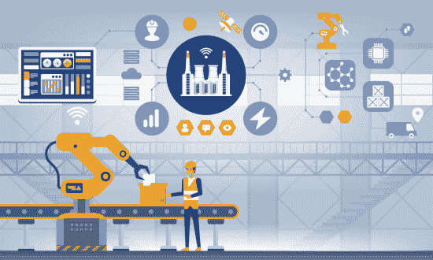
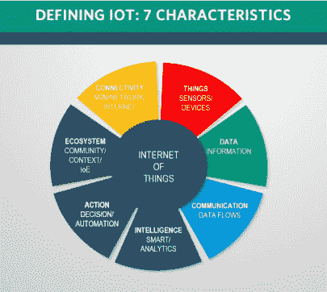

# 制造业中的工业 4.0 物联网

> 原文：<https://medium.com/geekculture/industry-4-0-iot-in-the-manufacturing-sector-70683cb24417?source=collection_archive---------12----------------------->

# 介绍

工业物联网(IIOT)被确定为物联网(IOT)的子类。它实践了一种数据驱动的方法来将能力驱动到行业中。这是一个唯一的概念，包括嵌入式传感器、基于云的数据和互联设备，以确保更健康的工业性能。制造业中的工业 4–0 物联网影响着广泛的企业工具，并采用智能方法来实现廉价优势。

# 制造业领域的工业 4–0 物联网带来哪些好处？

[制造业中的工业 4–0 物联网](https://www.epicor.com/en/resource-center/articles/what-is-industry-4-0/#:~:text=Industry%204.0%2C%20also%20sometimes%20referred,manufacturing%20and%20supply%20chain%20management.)支持节省时间和额外运营成本。例如，摩托车制造商公司 Harley-Davidson 利用物联网技术对其制造工厂进行了真正的改造。它有助于将自行车的总生产时间从 21 天减少到 6 小时。[因此，将工业物联网引入制造业有望提高产量、节约成本和时间，并提高安全性。以下是制造业使用物联网的一些好处:](https://www.technologiesinindustry4.com/2020/11/internet-of-things-what-is.html)

*   增强的库存管理
*   供应链反射率
*   改进产品质量控制
*   实时视觉
*   价格节约
*   资产安全

# 工业 4–0 物联网在制造业的应用

思科、福特、通用电气、哈雷戴维森、微软和丰田等公司已经将物联网制造部门应用于制造业发展。由于对能力、可追溯性和透明度的需求增加，这些公司一直在采取措施提供收集数据和分析其供应链和制造的方法。他们已经完成了一个物联网设备的使用，不仅使整个过程变得清晰和可评估，同样也有助于更好的决策和过程开发。

实时可视性都是通过应用移动设备和传感器来实现的。这些设备包含射频识别(RFID)和定位技术。无能和供应链 24 小时护理的改善是可以实现的。通过从传感器到智能手机或平板电脑的所有这些可见性和即时数据，工厂看到机器停工时间更短，供应链堵塞更少。

物联网产业 4–0 的变化将取决于对众多新技术的卓有成效的接受，例如超宽带、最新版本的 Wi-Fi、5G、专用 5G、云计算、人工智能等。此外，支付机器和运营的数字双胞胎，以及生产自动化和设备和任务的实时控制，以加快智能制造，将是至关重要的。

数字孪生是计算机生成的真实世界产品或资产的图片。[制造业的工业 4–0 物联网将提高生产率，并有助于让智能机器变得更加智能。](https://www.technologiesinindustry4.com/2020/11/internet-of-things-what-is.html)它将为公司、高管和员工提供数十亿比特的数据，以修正实时决策。这将有助于他们理解成为工厂的目的，无论建筑物内是否有人干预。

# 在制造区使用物联网的影响

制造业中的工业 4–0 物联网凭借其数据驱动的技术正在改变制造业。它正在给各行各业带来一场数字革命。制造商多年来一直在尝试定制、更好的生产率和可操作性。随着工业物联网在制造业领域的出现，对制造业领域的影响比任何其他领域都大。

## 更高的收入

制造业中的工业 4–0[物联网](https://propane.agency/lux/the-internet-of-things-how-businesses-can-increase-revenue-in-digital-commerce/)允许高级功能减轻所有可能的工业查询，以应对制造业的巨大变化。此外，它还使制造商的收入大幅增加。通常情况下，收入数字的上升受业务生产的影响。添加物联网驱动的解决方案不仅会大幅提高生产水平，还会显著提高生产质量，从而影响收入增长。物联网技术救济实时监控机器，并为更健康的决策做出精确报告。

## 事物互联性

制造业中的工业 4–0 物联网技术允许事物之间的连接。制造部门包括大型机器和需要严密监控才能更好运行的部门。例如，如果发生机器故障，整个工厂遭受巨大损失，机器很有可能失去效率。

[制造业中的工业 4–0 物联网借助传感器设备将资产与其性能之间的差距联系起来。](https://www.technologiesinindustry4.com/2020/11/internet-of-things-what-is.html)这些设备提取数据以呈现资产性能的完美画面。此外，将整个工厂设施相互连接，以方便及时监控。这对于管理者增加关于设备状况的实时信息并做出相应的决策非常有帮助。

## 改进的供应链

制造业中的工业 4–0 物联网可能会在最重要的层面上改善供应链运营。我们可以安装智能物联网解决方案来实现实时监控和安全。此外，我们可以实施基于条件的监控，尤其是对冷链产品。制造业目前可以增加对每种产品的洞察力，并将这些信息保存在云平台上，以便通过物联网带来的重大变化供以后使用。

工业 4–0 物联网在制造业领域的有益影响正在留下一条转型之路，只会大幅提升该行业的潜力。我们在制造业中也有一些物联网应用，有助于提高生产率。

## 制造业中的工业 4–0 物联网技术示例

*   物联网
*   工业物联网(IIoT)
*   信息物理系统
*   智能制造。
*   智能工厂。
*   云计算。
*   认知计算。
*   人工智能。
*   大数据和分析。
*   自主机器人。
*   模拟/数字双胞胎。
*   水平和垂直系统。

更多详情请访问:[https://www . technologiesinindustry 4 . com/2021/06/industry-4-0-IOT-in-the-manufacturing-sector . html](https://www.technologiesinindustry4.com/2021/06/industry-4-0-iot-in-the-manufacturing-sector.html)