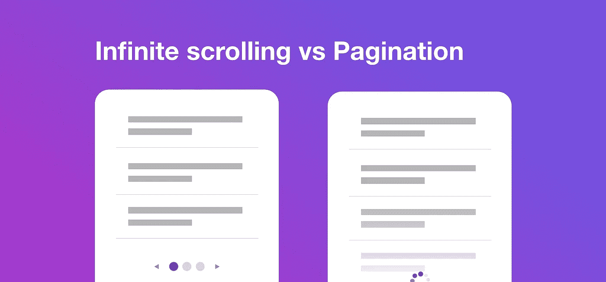

# UX 设计中的无限卷轴与分页

> 原文：<https://medium.com/geekculture/infinite-scroll-vs-pagination-in-ux-design-70d9c4956405?source=collection_archive---------4----------------------->

在网站上显示大型数据集时，有两种主要选择:无限滚动和分页。两者都有各自的优点和缺点，这使得一个比另一个更适合特定的网站。在本文中，我们将看看无限滚动和分页的优缺点，这样您就可以决定哪种适合您的网站。但首先，我们来看看什么是无限卷轴。

[www.indiehackers.com](https://www.google.com/url?sa=i&url=https%3A%2F%2Fwww.indiehackers.com%2Fpost%2Fux-infinite-scrolling-vs-pagination-summary-4893f937de&psig=AOvVaw2a575MKlvEYNrQromZmQzh&ust=1646078015621000&source=images&cd=vfe&ved=0CA0Q3YkBahcKEwiA0cXQ1KD2AhUAAAAAHQAAAAAQAw)