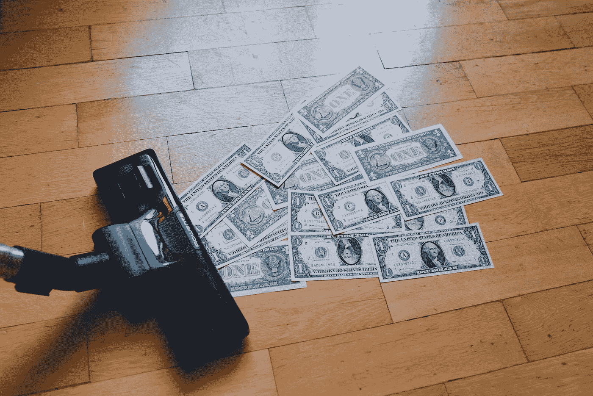
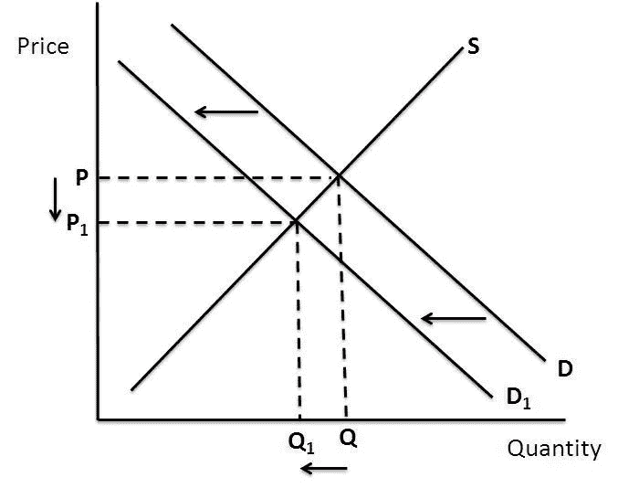
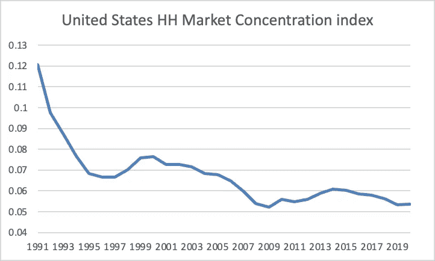

# 通货膨胀、垄断和自由市场的幻觉

> 原文：<https://medium.com/geekculture/inflation-monopolies-and-the-illusion-of-the-free-market-67b758b16950?source=collection_archive---------13----------------------->

2022 年 6 月，美国的通胀率达到 9.06%，由于工资无法满足快速上涨的商品成本，数百万人难以维持生计。然而，当你我都在发放薪水的时候，大企业却在攫取创纪录的利润，它们利用这种形势，将价格提高到远远超出弥补最近供应链中断成本所需的水平。这揭示了我们自由市场经济的一个严重缺陷，过去几十年来，垄断者的出现削弱了这一缺陷。

Photo by [regularguy.eth](https://unsplash.com/@moneyphotos?utm_source=medium&utm_medium=referral) on [Unsplash](https://unsplash.com?utm_source=medium&utm_medium=referral)

最近的劳动力短缺、乌克兰战争和新冠肺炎疫情的结合为企业创造了具有挑战性的条件。巨大的供应链中断迫使企业提高价格，以弥补增加的运营成本，从而加剧了通胀。这给消费者带来了很大的压力，由于工资跟不上，降低了他们的购买力。通货膨胀对所有人的影响并不一样，IFS 的一项研究显示，最贫穷的 10%的人经历的通货膨胀率比最富有的 10%的人高 3%。这是因为他们收入的很大一部分花在了煤气和电力上，而这两个部门受通货膨胀的影响最大。这种影响是如此极端，以至于对于一些单身成年家庭来说，仅能源成本预计就将达到收入的 120%。然而，当普通人处于贫困的边缘时，公司却创造了创纪录的利润，并向首席执行官和股东支付丰厚的奖金和股息。来自[的研究负责。美国](https://accountable.us/report-major-corporations-pump-up-own-prices-despite-billions-in-profits-while-republicans-play-blame-game-on-inflation/)关注 12 家宣布通货膨胀相关价格上涨的大公司。2021 年第三季度，他们总共赚了 110 亿美元的利润，并宣布了超过 340 亿美元的股票回购和股息。突出的是宝洁公司、百事公司和可口可乐公司，它们在大规模裁员和工作场所侵犯人权的指控中报告了创纪录的利润。

起初，利润水平似乎可能被通货膨胀的影响夸大了，通货膨胀导致 2018 年至 2022 年美元购买力下降了 15%。因此，这些利润的相对价值并不代表在疫情之前的水平上有显著的增长。通过对公司利润率的分析，这一理论很容易得到验证。利润率是表示每一美元销售产生多少美分利润的百分比。如果企业只是通过提高价格来弥补增加的运营成本，那么利润率应该保持不变。然而，彭博的一份报告显示，标准普尔 500 指数 T2 公司的利润率从 2020 年的 9%大幅上升到 2021 年的 13%，预计 2022 年将进一步上升到 14%。这表明，企业正在利用通胀，将价格提高到远远超过弥补运营成本增加所需的水平。通过这样做，他们增加了已经受到高通胀压力的消费者的压力。经济理论表明，自由市场的竞争应该保护我们免受这种剥削，因为那些大幅提高价格以追求更高利润的公司将被竞争对手削弱。这导致对该公司产品的需求下降，导致他们降低价格，以减少供应突然过剩。这个新价格被称为均衡价格，它标志着一个产品的价格为买卖双方所接受。这种现象被称为供给定律，如下图所示:

[https://businessinvestments11.weebly.com/what-events-would-move-the-demand-curve.html](https://businessinvestments11.weebly.com/what-events-would-move-the-demand-curve.html)

然而，许多行业的价格目前都远高于平衡点，这表明我们的自由市场体系出了很大问题。

对这一失败的一个令人信服的解释是，我们正在经历的只是一个自由市场的幻觉，而在过去几十年里，这一幻觉被垄断的出现所破坏。在这种情况下，我指的不是传统意义上的垄断，即一家公司控制了整个市场，而是遵循监管者的定义，即当一个实体控制了特定市场的 25%以上时，就定义为垄断。这个单一的实体被称为垄断者。垄断者的出现通过一个市场集中度不断提高的过程，将大多数部门集中到少数几个主要参与者手中，这可以用赫芬达尔-赫希曼指数(HHI)来衡量。HHI 使用公司的市场份额来衡量特定市场的竞争水平。世界银行的数据显示，自 20 世纪 90 年代初以来，美国的经济竞争显著下降，表明市场集中度显著提高。

[United States HH Market concentration index 1991–2020 | WITS Data (worldbank.org)](https://wits.worldbank.org/CountryProfile/en/Country/USA/StartYear/1991/EndYear/2020/Indicator/HH-MKT-CNCNTRTN-NDX#)

诚然，这种竞争的急剧下降在很大程度上受到大型科技公司崛起的影响，这些公司已经开始主导标准普尔 500 的顶层，并相应地扭曲数据。然而，Brookings Institute 的一项研究显示，市场集中度的上升不能仅仅归因于技术行业，在过去二十年中，超过 75%的行业的市场集中度有所提高。美国零售业的集中度在 1982 年至 2012 年间上升了 416%,金融业的集中度在 1992 年至 2012 年间上升了 135%。垄断者的巨大市场份额使他们可以提高价格，而不用担心被竞争者削弱。

这种现象可以在你去当地超市的旅途中看到。例如，如果你想买一个冰淇淋，你可能会面临一个大的选择，包括本和杰里的，马格南，沃尔的，科尔内托和卡特迪奥。起初，它可能看起来像来自几个企业的各种产品。然而，事实上你别无选择，所有这些品牌都被零售巨头联合利华拥有。同样，如果你想买一副太阳镜，你面前会有更多的产品，比如雷朋、迈克高仕、奥克利、阿内特和范思哲。然而，这种选择又是一种错觉，这只是依视路 Luxxotica 拥有的 62 个眼镜品牌和零售连锁店中的一部分。垄断者很容易提高产品价格，因为他们的产品往往是消费者的唯一选择。

市场集中度不断提高，使得垄断者得以利用通胀，将价格提高到远远超过弥补供应链中断所需的水平。这证明，随着商品成本远高于均衡点，自由市场体系正在失效。这些事件是一个警告信号，表明是时候改革反垄断法，挑战垄断者，确保我们的经济再次为所有人而不仅仅是大企业服务了。