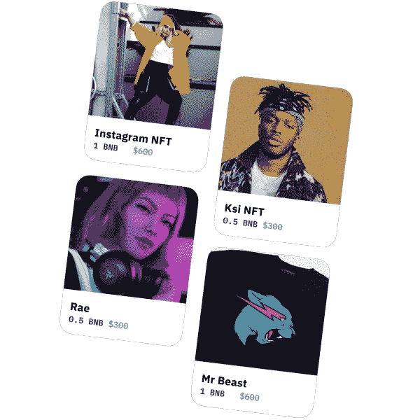
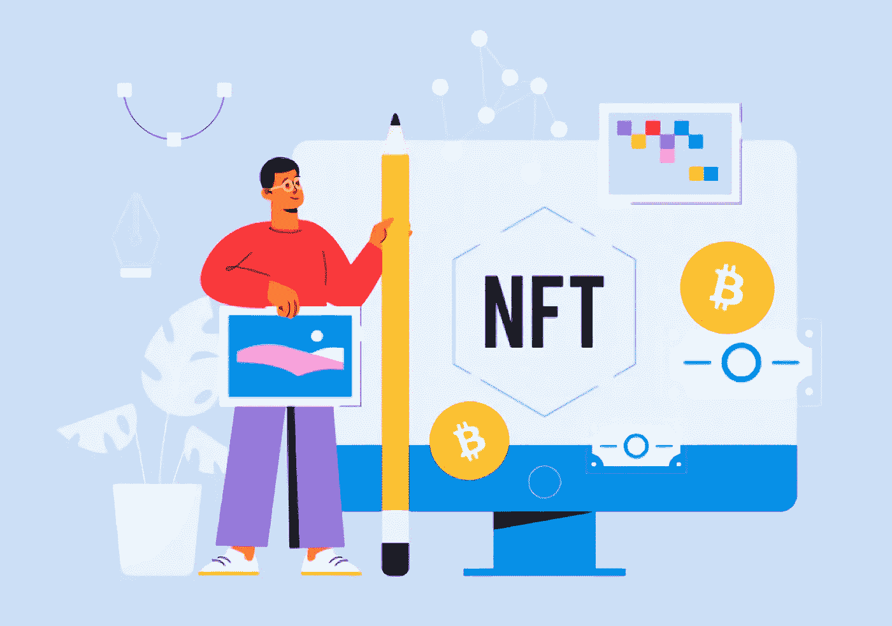

# 影响者 NFT 市场开发:为什么要为影响者推出 NFT 市场？

> 原文：<https://medium.com/geekculture/influencer-nft-marketplace-development-why-launch-an-nft-marketplace-for-influencers-ced40865228e?source=collection_archive---------14----------------------->

影响者是那些对今天的营销和销售产生巨大影响的人。无论是销售发圈的小企业，还是发布货币的加密项目，影响者如今都扮演着重要角色。你知道 Youtube 在区块链开始讨论为有影响力的人推出 NFT 市场的可能性吗？不仅仅是 youtube，Instagram、Twitter 和脸书都在努力让那些如今被低估、薪酬过低的有影响力的人得到认可。

你是一个努力寻找解决方案的有影响力的人吗？或者，一个企业家是在试图认可这些不重视品牌的创意思维吗？当人们心中有想法却犹豫着要不要迈出第一步时，他们会很挣扎。这是一个博客，以未来的眼光为所有企业家策划，让他们与 [**有影响力的 NFT 市场发展**](https://www.appdupe.com/nft-marketplace-development) 一起深入了解区块链技术。

# **面向影响者的 NFTs】**

影响者是社交媒体平台上的内容创造者。他们每次都提供独特和有创意的内容，却没有获得任何学分。品牌与这些有影响力的人取得联系，以便向他们的追随者推销他们的最终产品。从美容产品到竞选活动，每个领域都有影响者对公众产生影响。影响者营销是目前最受欢迎的真正改变游戏规则的营销策略。尽管他们在社会中的作用很大，但不像主流广告那样，他们的工作没有报酬。

区块链为游戏带来了不可替代的代币，为独特的创作在区块链拥有专属所有权提供了机会。这些非功能性交易是不可兑现和不可修改的，这给了他们一个赚钱的机会。

为影响者视频、帖子、博客、迷因、照片等创建 NFT 将有助于他们拥有自己作品的权利，同时将它们转化为收入。这些天来，有影响力的人正在努力为他们的内容赢得信任。他们为一个品牌或企业创造的内容曾经被多次使用并持续很长一段时间，但他们获得的收入并不是他们投入所有工作应得的。影响者独自创造内容，而营销机构与许多专业人士一起做同样的工作。为有影响力的人带来专门的 NFT 和一个他们可以分发内容的市场，这不仅可以帮助他们赚得更多，还可以提高他们为品牌工作的质量。

# **NFT 影响者市场**

NFT 市场是一个平台，人们可以在这里购买和出售非功能性食物。也有一些市场，创作者可以轻松地打造自己的 NFT，而无需了解任何技术细节和代码。已经有一些市场，艺术家和其他创作者铸造他们自己的 NFT，打开了一扇新的艺术和设计货币化的大门。NFT 市场平台提供了两种方式，通过这两种方式，NFT 创作者可以出售或购买他们独特的 NFT。

*   **直接购买-**NFT 将贴上价格标签，智能合同将以这样一种方式编写，即无论谁提供这个价格，都可以拥有它，所有者将自动转变。智能合约是区块链中的代码，在满足特定条件时执行。
*   **拍卖-** 类似于网上拍卖。一个基本的投标价格将被设定，买家将不得不为 NFT 出价。拍卖将持续一段时间，出价最高者将在拍卖结束时自动成为 NFT 的所有者。

如今，市场有两种拍卖形式。

*   **英式拍卖**——出价提高，出价最高者胜出
*   荷兰式拍卖更像是谈判价格。这里的投标价格定得很高，买方可以为非功能性交易提供一个较低的价格。当买卖双方就条款达成一致时，NFT 将通过智能合约出售。

虽然大多数市场都使用英式拍卖，但荷兰式拍卖也用于出售艺术品和手工艺品的市场。

## **入门前**

在任何项目的开发过程中，迈出第一步总是很困难的。健全的研究对于 [**推出一个面向有影响力人士的 NFT 市场**](https://www.appdupe.com/nft-marketplace-development) 是必要的。在迈出第一步之前，检查以下必需品。这可能有助于你为这个项目提出清晰的想法。

*   你的目标受众是谁？有影响者提供从博客、图片、迷因到视频的各种内容。NFT 是针对品牌和企业还是追随者？这对企业家和买家都有好处？
*   应该考虑 NFTs 的令牌标准。ERC 721、ETC 1155 或 ERC 998 是现在广泛使用的一些 NFT 标准。
*   NFT 市场平台的区块链决定了交易速度和成本。因此，仔细选择区块链非常重要
*   用户界面必须简单易懂，这样即使非技术人员也能轻松使用该平台

## **影响者的 NFT 市场发展**

像所有其他市场一样，NFT 的影响者市场提供了相同的功能，如制造 NFT，购买，销售和拍卖。从头开始开发区块链平台可能需要大量的时间、资源和耐心。开发和测试过程可能需要时间，这不是一个立即推出的解决方案。

最近，白标解决方案成为加密开发社区的趋势。企业家拿到已经开发的 NFT 市场复制品，根据他们的需求定制，并在几周内开发出一个全新的平台。这使得许多企业家能够很快进入区块链的世界。

但是你仍然必须仔细注意你将要克隆和定制的平台。有这么多选择，真难抉择。

*   因为非功能性测试是一种趋势，所以有许多市场致力于特定的类型。选择一个符合您要求的
*   虽然基本功能是造币、购买和销售，但你必须根据目标市场的需求定制市场。
*   您应该能够提出一个比现有平台更强大的解决方案
*   选择开发商是另一项主要任务。留意他们以前在区块链领域的工作和经验

## **外卖**

影响者群体是现在最需要关注的群体。在他们的系统中引入 NFT 可以帮助他们建立更好的档案。 [**NFT 市场开发**](https://www.appdupe.com/nft-marketplace-development) 现在是区块链行业最想要的任务。企业家正在为各种创作者想出许多创造性的解决方案。影响者是那些有需求但仍被忽视的人。为有影响力的人建立一个 NFT 市场，让你自己处于这个链条的顶端。