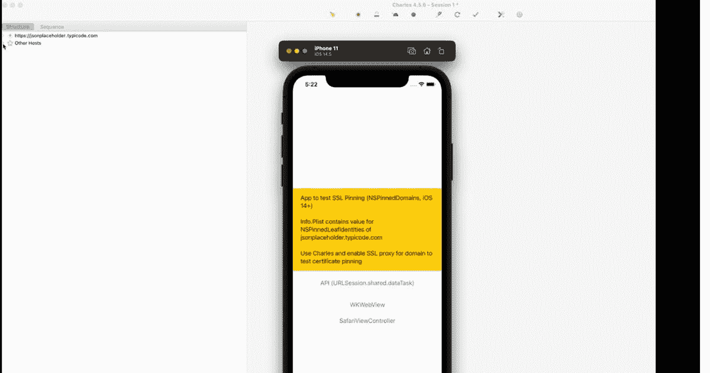

# iOS 上基于 Info.plist 的证书锁定

> 原文：<https://medium.com/geekculture/info-plist-based-certificate-pinning-on-ios-7bd87c52c24d?source=collection_archive---------5----------------------->

过去，你可能会使用第三方库，如 [TrustKit](https://github.com/datatheorem/TrustKit) 或 [Alamofire](https://github.com/Alamofire/Alamofire) 来保护你的应用免受[中间人攻击](https://www.raywenderlich.com/1484288-preventing-man-in-the-middle-attacks-in-ios-with-ssl-pinning)，因为这些库支持 SSL 公钥锁定。

你可能不知道，苹果在 iOS 14 🥳中引入了对 SSL 公钥锁定的原生支持

如果你不熟悉这个原生功能，我推荐你阅读苹果的文章[身份锁定:如何为你的应用配置服务器证书](https://developer.apple.com/news/?id=g9ejcf8y)。以下是总结:

*   您可以在您的`Info.plist`中指定一组证书，App Transport Security (ATS)在连接到命名域时会用到这些证书。
*   固定的 CA 公钥必须出现在证书链中的中间证书或根证书中
*   pin 码始终与一个域名相关联，除非满足 pin 码要求，否则应用程序将拒绝连接到该域名。
*   您可以将多个公钥与一个域名相关联。

这种内置的锁定对`URLSession`很有效，但是**对** `**CFNetwork**`之上的所有 API 都有效吗？

可悲的事实是**没有**。😔

如果 SSL 公钥与`Info.plist`中指定的不一致，则`WKWebView`仍将连接并从域中加载内容。

`SFSafariViewController`也不支持`Info.plist`中的设置。考虑到`SFSafariViewController` [在一个单独的进程](https://developer.apple.com/videos/play/wwdc2015-504/?time=494)中运行，这种行为可能不那么令人惊讶。

我在各种版本上测试了这些 API，包括最新的 iOS 15.4。

你可以用我开源的一个测试应用来验证我的观察。

 [## GitHub-MarcoEidinger/TestingNSPinnedDomains:测试 SSL 锁定的应用程序(NSPinnedDomains，iOS 14+)

### 测试 SSL 锁定的应用程序(NSPinnedDomains，iOS 14+)测试 NSPinnedDomains.mov 苹果承认 WKWebView 的错误…

github.com](https://github.com/MarcoEidinger/TestingNSPinnedDomains) 

苹果的[回答并不令人满意](https://developer.apple.com/forums/thread/681734)，因为还不清楚哪些 API 应该遵守`Info.plist`中指定的证书。

我相信基于`NSPinnedDomains`的 SSL pinning 应该可以自动与所有基于 CFNetwork 的 API 一起工作，比如

*   `URLSession`
*   `WKWebView`。
*   `SFSafariViewController`
*   `ASWebAuthenticationSession`

也许有一天…

*最初发布于*[*https://blog . ei dinger . info*](https://blog.eidinger.info/infoplist-based-certificate-pinning-on-ios)*。*