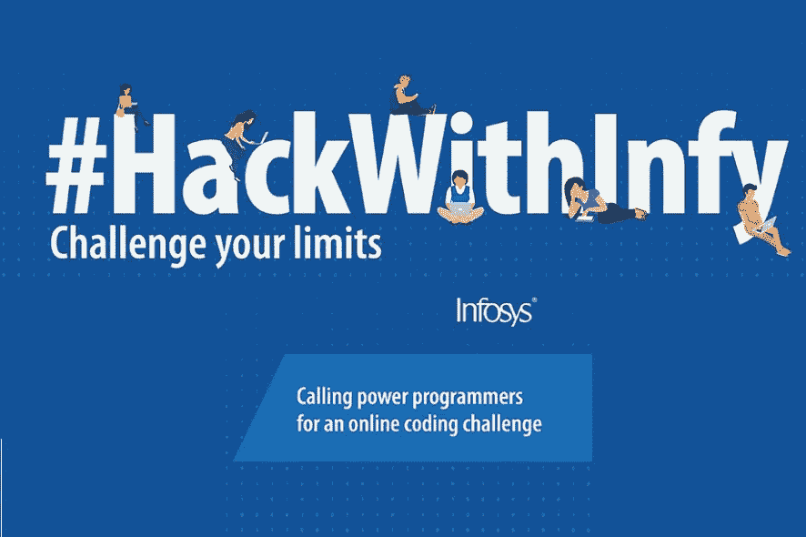
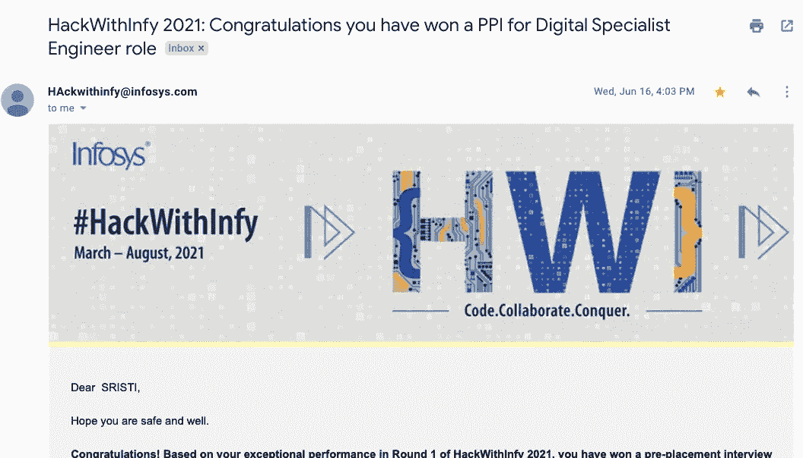
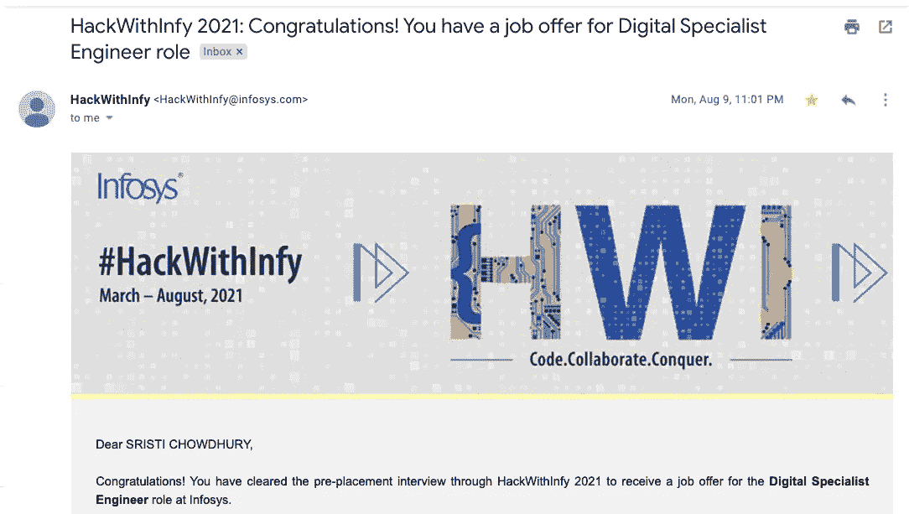

# 印孚瑟斯面试经历— 2021

> 原文：<https://medium.com/geekculture/infosys-interview-experience-2021-b2d5e114a3bf?source=collection_archive---------11----------------------->

HackWithInfy 编码和面试经验

你在你的第三年有编程的诀窍吗？那么，你一定要看看这篇文章！

这一切都始于 2021 年 4 月发布的 **HackWithInfy 编码挑战**。

## 涉及的步骤~

1.  在 Infosys 门户网站上注册
2.  收到一封附有模拟测试的注册成功邮件。
3.  5 月 8 日收到测试邀请。
4.  测试被安排在 5 月 9 日下午 3 点。

## 测试模式:

这是一个包含 3 个问题的编码挑战:

1.  **中等复杂度:背包问题的变种**
2.  **硬复杂度:动态规划**
3.  **硬复杂度:又是动态编程。**

我设法部分完成了所有 3 个代码，并得到了 100/300 的综合分数。我甚至没想到会收到采访邀请。

6 月 16 日**，在编码挑战一个多月后，我在屏幕上看到了下面的电子邮件。**

## 这是预安置面试电话！！！！

Pre Placement Interview Call

这是我第一次面试全职工作。对于这次经历，我既紧张又兴奋。我们被告知，在面对面面试之前，我们有大约一个月的时间。

**面试形式:**

**1 Webex 平台技术+ HR 面对面面试。**

## 2021 年 5 月 10 日收到面试邀请函。

Interview Invite

然而，我的面试被重新安排在 7 月 11 日上午 9 点

所以，在 7 月 11 日(T19)，我的采访在 9 点整开始。我非常紧张，因为这是我第一次面试全职工作。我的面试官在 Infosys 工作了 13 年，有超过 15 年的经验。

采访从我的介绍开始，然后是他的介绍。问我的问题完全围绕着我的简历和 CS 基础知识。我的面试官非常友好，能感觉到我的紧张。他通过谈论我喜欢的编程语言、我的兴趣和爱好让我平静下来。

## **问的几个问题是~**

1.  为什么是 C++？C++和 C 的区别。
2.  什么是方法重载？
3.  SQL /非 SQL 之间的区别
4.  聚集索引和非聚集索引
5.  React 以及使用它优于其他 JS 框架的好处。
6.  什么是节点？
7.  解释你的任何一个项目。一些问题是在我使用的技术堆栈上提出的。
8.  解释 C++中的异常处理
9.  多重继承举例。
10.  面临的最具挑战性的情况。
11.  你认为自己五年后会怎样？
12.  团队合作、实习经历和项目。

我搞砸了几个问题，对结果很紧张！

# 但是，

采访后近一个月，**在 8 月 9 日**晚上 11 点收到这封邮件。得到这份工作后，我感到高兴和宽慰。

Finallly!!

这只是一个开始，我重新开始工作，并接到了很多面试电话和邀请。我将在下一篇文章中讨论它们。

请继续关注这个空间，了解更多的面试经历、开发和编码内容。

谢谢你读到这里。

 [## srist 27-概述

### 特雷尔 https://sristi2705.medium.com/-斯里斯蒂 27 SDE 实习生

github.com](https://github.com/Sristi27)  [## 斯里斯蒂·乔杜里- SDE 实习生-特雷尔| LinkedIn

### 你好，我现在是一名三年级学生，正在攻读信息技术专业的学士学位

www.linkedin.com](https://www.linkedin.com/in/sristi-chowdhury-3660941a5/)