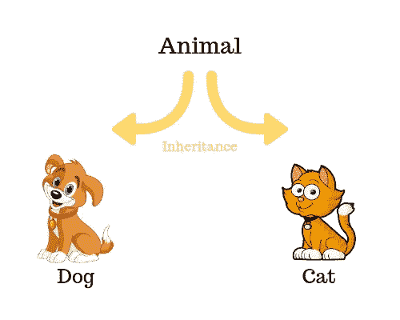

# Ruby 中的继承:理解“super”关键字

> 原文：<https://medium.com/geekculture/inheritance-in-ruby-understanding-the-super-keyword-17f66d130107?source=collection_archive---------38----------------------->

尽管继承的概念非常简单，但是对于初学 Ruby 的人和/或不熟悉面向对象编程(OOP)的人来说，它在 Ruby 中的实现以及“super”关键字的使用很麻烦。

这篇博客讨论了 Ruby 中的继承是如何工作的，特别关注“super”关键字的使用。通过代码片段和例子，这个博客以一种初学者可以容易理解的方式展示了这个实现。

**OOP 中的继承是什么？**

继承是 OOP 的许多核心概念之一，它指的是从共享一组属性和方法的另一个类派生一个类的方法。这是一个基本的 OOP 概念，因为它为可重用性打开了大门，这意味着编写更少的代码行，并在编写代码时避免重复。通过对共享某些特征和行为的不同类之间的层次关系进行建模，可以显著减少所需的代码量。



[https://tutorials.supunkavinda.blog/php/oop-inheritance](https://tutorials.supunkavinda.blog/php/oop-inheritance)

在最基本的层面上，继承可以通过左边的图表来理解。该图显示了从父动物类继承的狗和猫子类。这是可能的，因为狗和猫都是动物，它们有着共同的特征来定义动物。因此，通过分解出共同的特征并创建子类可以继承的父类，就可以实现继承。

## Ruby 继承语法

在 Ruby 中创建继承的关键符号是“

```
class Animal def i_am_animal_sentence
        puts "I am an animal!"
    endendclass Cat < Animal def i_am_a_cat
        i_am_animal_sentence
    endendclass Dog < Animal def i_am_a_dog
        i_am_animal_sentence
    endend
```

从上面的示例代码片段中可以看出，Cat 和 Dog 类都继承了 Animal 类，这意味着 Cat 或 Dog 类的一个实例将使用#i_am_animal_sentence 方法来打印“我是一只动物！”句子，因为这两个类的父类都包含此方法。这意味着:

```
cat1 = Cat.new
cat1.i_am_a_cat
#=> "I am an animal!" dog1 = Dog.new
dog1.i_am_a_dog
#=> "I am an animal!" 
```

因为#i_am_animal_sentence 实例方法对 Dog 和 Cat 类都可用，并且因为这些类中的#i_am_a_cat 和#i_am_a_dog 方法调用#i_am_animal_sentence 方法，所以“我是一只动物！”通过调用这两种方法，句子被打印出来。这表明，如果我们有两个不同类的重复代码，在这种情况下打印出“我是一种动物！”句子中，我们可以写一个父类，子类可以继承它。在这个例子中，父类是 Animal 类，它包含了共享的功能。

## 扩充继承的方法

到目前为止，可以清楚地看到继承的重要性以及它是如何工作的。然而，我们还没有考虑过这样一种情况，即我们可能想要从学生类修改父类中定义的方法。到目前为止，我们只研究了只需要继承方法而不需要增加功能的情况。

因此，我们如何在保留部分功能的同时修改方法呢？

这就是“超级”关键词的用武之地。这个关键字在一个方法中被调用，它告诉 Ruby 继承父类中同名方法的所有功能，然后它给我们提供了添加更多功能和对继承的功能做更多事情的选项。

举个例子，

```
class Animal def i_am_animal_sentence
        puts "I am an animal!"
    endendclass Cat < Animal def i_am_animal_sentence
        super
        puts "I am a cat!"
    endendclass Dog < Animal def i_am_animal_sentence
        super
        puts "I am a dog!"
    endend
```

现在，我们可以在猫或狗实例上调用#i_am_an_animal_sentence 方法，并在父类中获得该方法的功能，以及我们使用 super 增强的功能，如下所示:

```
cat1 = Cat.new
cat1.i_am_an_animal_sentence
#=> "I am an animal!"
"I am a cat!"dog1 = Dog.new
dog1.i_am_an_animal_sentence
#=> "I am an animal!"
"I am a dog!"
```

因此，“super”允许我们向从父类继承的现有方法添加特性。这为更多的灵活性打开了大门，同时保持了面向对象编程的组织性质。

虽然在开始学习 Ruby 的时候不是很相关，但是知道 Ruby 不支持多类继承是很重要的。相反，仅支持单个类继承。这意味着单个类可以从单个父类继承属性和方法，而不能从其他父类继承。这通过下面的演示来说明:

```
class Animal def i_am_animal_sentence
        puts "I am an animal!"
    endendclass Fourlegs def i_have_four_legs
        puts "I have four legs!"
    endendclass Cat < Animal < Fourlegs def i_am_animal_sentence
        super
        i_have_four_legs
        puts "I am a cat!"
    endendclass Dog < Fourlegs < Animal def i_am_animal_sentence
        super
        i_have_four_legs
        puts "I am a dog!"
    endend
```

如果我们尝试调用我们刚刚定义的类，不管我们尝试继承类的顺序如何，我们都会得到如下错误:

```
cat1 = Cat.new
cat1.i_am_an_animal_sentence
#=> superclass must be a Class (NilClass given) (TypeError)dog1 = Dog.new
dog1.i_am_an_animal_sentence
#=>  superclass must be a Class (NilClass given) (TypeError)
```

出现这个错误是因为 Ruby 不能识别参考的作品

```
class Animal
    ...
endclass Fourlegs < Animal
    ...
endclass Cat < Fourlegs
    ...
endclass Dog < Fourlegs
    ...
end
```

Ruby |继承- GeeksforGeeks

Ruby 是理想的面向对象语言。在面向对象的编程语言中，继承是最重要的…

www.geeksforgeeks.org

[](https://www.geeksforgeeks.org/ruby-inheritance/) [## PHP 继承

### 在面向对象的编程中，当一个类从另一个类派生时，这被称为继承。派生类是…

tutorials.supunkavinda.blog](https://www.geeksforgeeks.org/ruby-inheritance/) [](https://tutorials.supunkavinda.blog/php/oop-inheritance) [## PHP Inheritance

### In Object-Oriented Programming, when a class derives from another class, it is called inheritance. The derived class is…

tutorials.supunkavinda.blog](https://tutorials.supunkavinda.blog/php/oop-inheritance)