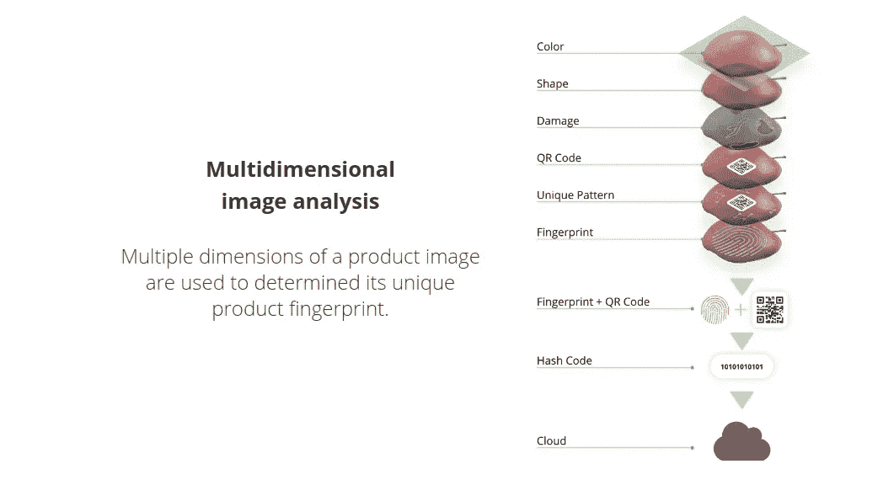
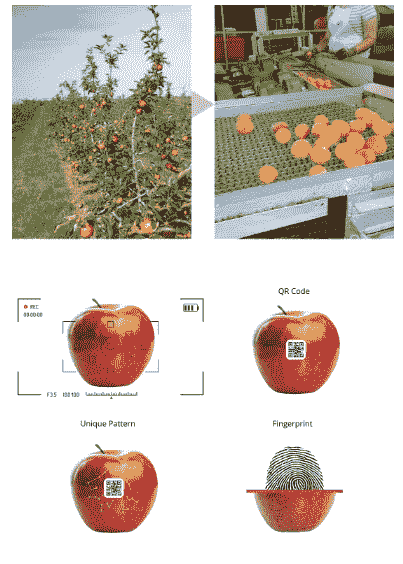
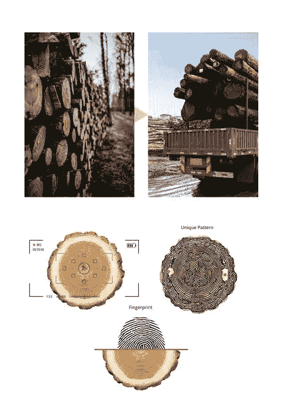

# 人工智能的创新:视觉产品指纹

> 原文：<https://medium.com/geekculture/innovations-in-ai-visual-product-fingerprinting-7cd7545f16f3?source=collection_archive---------19----------------------->

Photo by [Sydney Rae](https://unsplash.com/@srz?utm_source=medium&utm_medium=referral) on [Unsplash](https://unsplash.com?utm_source=medium&utm_medium=referral)

跟踪、追溯和产品识别是供应链中最重要的措施，如果不是所有行业的话。从盗窃控制到质量控制，可追溯性解决方案在功能上通常是机械的。

现在，随着人工智能发展的最新进展，*视觉检查本身*已经被证明是为许多类型的产品创建独特的视觉产品指纹所需要的全部。

Photo by [hessam nabavi](https://unsplash.com/@hessamnbv?utm_source=medium&utm_medium=referral) on [Unsplash](https://unsplash.com?utm_source=medium&utm_medium=referral)

长期以来，指纹一直被用作身份识别的方法，因为每个人的指尖上都有独特的螺纹和纹路。

同样的概念也适用于许多类型的农产品。以苹果为例，在苹果皮上发现的独特图案，结合其大小、形状和颜色，可以提供足够的数据来为该物体创建独特的*产品指纹*。

# 什么是产品指纹？

对人类的眼睛来说，一篮子苹果可能看起来非常相似。对于这个[人工智能引擎](https://productfingerprint.com/)，每一个苹果都是完全独一无二的。仅使用视觉线索(颜色、大小、形状、皮肤图案)创建一个多维参考图像，该图像是该商品独有的——一个*视觉产品指纹*。

该产品指纹可在运输过程中随时与实际产品进行比较，以进行识别和验证。产品指纹可与外部产品标签(如 QR 码)一起使用或独立使用，并提供真正的视觉识别和验证方法。

# 从农场到餐桌的可追溯性

这项技术的应用和使用案例非常广泛。如果苹果的产品指纹在收获时采集，并在销售时再次采集，那么消费者和生产者都可以获得大量的信息。

该信息可以包括(每个项目)、新鲜度评估、条件/腐烂、运输中的损坏和整体健康状况。此外，基于收集的数据的粒度，从每个苹果收集的信息可以聚合到篮子、托盘和容器级别。

从农场到餐桌的可追溯性只是这项技术的一个应用。还有非农业应用。

# 林业部门

视觉产品指纹也可以应用于林业部门。在原木横截面上发现的独特图案很好地利用了这一技术。

原木的产品指纹将包括存在于单根原木的环内的独特图案。

这种视觉指纹可以进一步分析，以包括对年龄、物种、健康状况和原木总体评级的评估。

视觉产品指纹可在整个供应链中方便地对未加工木材进行视觉验证和鉴定，可单独使用或与其他标记或追踪方法结合使用。

# 数字可追溯的未来

随着技术的不断进步，新的和改进的可追溯性解决方案将进入市场。一个这样的例子是由 [Deeplai](https://deeplai.com) 团队开发的*产品指纹*。*产品指纹*是一种新颖的方法，将人工智能技术与跨许多行业的产品可追溯性相结合。

随着食品安全继续成为一个重要的全球问题，以及对食品可追溯性的要求不断增加，人工智能和技术的交叉将继续为市场带来新的创新解决方案。

要了解更多关于这个项目和团队的信息，请访问:[ProductFingerprint.com](https://productfingerprint.com)