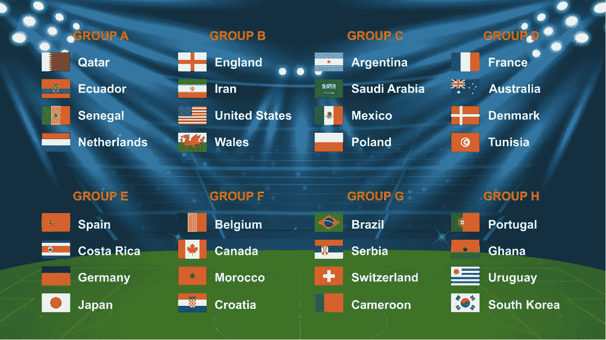

# 2022 年世界杯的创新&历年来

> 原文：<https://medium.com/geekculture/innovations-in-the-world-cup-2022-over-the-years-4fc5bd60fbe2?source=collection_archive---------11----------------------->

# 介绍

足球是一项充满活力的运动。一个主裁判，两个助理裁判和额外的技术裁判是不够的。从历史上看，他们歪曲了许多比赛的结果，他们做出了许多有争议的决定，开始了自己的生活。最著名的包括马拉多纳的“上帝之手进球”或格奥夫·赫斯特的“幻影进球”

多年来，随着广播质量的提高和技术的整体进步，世界各地的足球迷开始要求一些改变。所有关注比赛的人都越来越厌倦裁判频繁的失误。另一方面，比赛官员也感受到了压力；毕竟，他们只是人类。技术可以帮助他们，但在很长一段时间里，他们只能梦想使用它。

随着 2022 年世界杯的决定性阶段即将开始，我们准备了一篇文章，讨论创新如何在足球和其他领域得到应用。

# 足球创新的历史

# 早期创新

不是每个人都知道足球和过去大不相同了。

足球的历史是漫长而多样的，几个世纪以来有许多创新。这项运动最早的一些变化是在 19 世纪的英国出现的。最显著的变化之一是引入了一套正式的规则，这套规则由埃比尼泽·科布·莫利于 1863 年公布，他通常被称为“足球之父”。这套规则包括允许球员接球和投球，限制每一方的球员人数，以及建立一个对付对手的标记系统。

足球的其他早期创新包括引进守门员和任意球。守门员第一次被允许出现在球场上是在 1871 年，而任意球是在 1878 年首次出现的。任意球最初被判为犯规，比如绊倒或推搡对手，这很快成为足球策略的重要组成部分。这一时期的其他创新包括引入禁区和点球，以及创建越位规则，以防止进攻球员过于靠近对手的球门。

二十世纪见证了足球运动的无数创新，其中许多革新了足球运动的方式。替补队员和替补队员的引入使得比赛更有活力，并允许球队在比赛中途调整战术。1925 年，越位规则被改写。[每 Britannica.com，](https://www.britannica.com/sports/football-soccer/Play-of-the-game#ref29613)

> 以前，当球被“踢”给他时，如果少于三名对方球员在他和球门之间，进攻球员(即在对方半场的球员)就是越位。规则的改变，将干预球员的数量减少到两名，有效地促进了更多的进球。

# 最近的创新

最近，足球经历了很长一段时间以来最高数量的创新。

我们都记得以前的广播。我们惊叹…以前的视频质量有多差。比较一下 20 世纪 80 年代美国对威尔士，或者加拿大对克罗地亚的比赛录像。如果摄像技术没有进步，阿方索·戴维斯在对阵克罗地亚时的精彩进球看起来会更糟糕。

自从 2018 年世界杯以来，比赛官员使用高质量的镜头来指导主裁判。这项技术叫做**视频助理裁判(VAR)** 。VAR 是一种先进的裁判技术，用于足球比赛中，帮助比赛官员更准确地做出决定。VAR 利用视频回放、音频通信和其他技术的结合，为裁判提供一系列重要信息。重要的是，它已被世界各地的许多职业联赛和比赛广泛采用，包括国际足联世界杯，欧洲冠军联赛，欧洲联赛，英超联赛和美国职业足球大联盟。在 2018 年的足球比赛中，检查了 455 起事件，主要裁判使用了 20 次视频评论。2022 年，该系统也投入使用。

VAR 允许裁判在比赛中使用多个角度的视频片段来审查某些决定。这有助于确定事件是否越位，侵犯是否发生在禁区内或禁区外，或者球员之间是否在比赛中有任何接触。
‍

观看下面的视频，了解 VAR 在 MLS 和世界杯中的工作方式。

VAR 的引入对足球比赛产生了重大影响，因为它允许裁判做出更准确的决定，并确保所有参与者公平竞争。它被认为有助于减少决策中的错误，在决定性时刻为团队带来更公平的结果。我们再也不用担心如果主裁判看到我们在转播中看到的，比赛会如何结束。

另一项创新是新的比赛用球，以及今年世界杯使用的新追踪系统。2022 年的锦标赛将首次使用球跟踪机制。该球包括超宽带(UWB)传感器和惯性测量单元(IMU)传感器，以便实时收集数据。

此外，12 个鹰眼摄像机安装在体育场周围，以每秒 50 次的速度跟踪球和每个球员。玩家可以追踪身体的 29 个独立点，包括四肢。这些数据随后被发送到中央计算机，并由人工智能软件进行分析，以生成自动越位警报，然后由视频比赛官员确认。

你可能会认为这项尖端技术的引入会对球感产生巨大影响。你大错特错了。比赛用球内部的系统仅重 14 克(不到 0.5 盎司)。此外，欧洲各地的俱乐部都进行了测试，看球员是否能区分传统球和尖端球。结果是，运动员分不清哪个装有传感器，哪个没有。

从系统中收集的所有数据都由人工智能进行实时分析，以生成报告。然后由比赛官员进行分析和验证，看是否有越位。不再有可疑的进球，助理裁判无法判断进球是否正确。

# 摘要

我们强调了足球是如何随着新技术的引入而改变的，以使比赛更公平、更准确和更具娱乐性。从 VAR 到鹰眼摄像系统，再到内置传感器的新型比赛用球——足球将不再一样。

创新改变的不仅仅是足球。多年来，新技术不断涌现，有可能让我们的生活变得更好:

*   3D 打印:这一突破性的创新使得快速、廉价、高效地制造各种产品成为可能。它推动了修复术和医疗植入物的发展，革新了制造业，并引发了建筑和设计的新进步。
*   自动化:自动化使公司更容易以更快的速度和更少的错误生产产品，同时也降低了成本。它还提高了工作场所的安全性，让人们能够将注意力集中在更有意义的任务上。
*   人工智能(AI):人工智能正被用于许多领域，以提高准确性和决策能力，如医疗诊断、金融交易、机器人、交通优化等。它还被用于开发能够理解自然语言并快速满足人类要求的虚拟助手。
*   可穿戴技术:健身追踪器或智能手表等可穿戴技术让我们可以随时跟踪我们的健康指标，如心率或睡眠模式。这些数据可以帮助我们更好地了解我们的身体，并相应地改变生活方式。
*   物联网(IoT):物联网是通过互联网连接设备，以便它们可以在没有用户干预的情况下相互通信和交换数据。这项技术通过自动化日常任务，如从世界任何地方控制电器或监控安全系统，使我们的生活变得更加轻松。

如果你想谈谈在你公司的产品中应用创新，请不要犹豫给我们写信。

*最初发表于*[T5【https://www.itmagination.com】](https://www.itmagination.com/blog/innovations-in-world-cup-2022-football-soccer)*。*