# 使用正则表达式和纯 JavaScript 的多个部分进行输入验证

> 原文：<https://medium.com/geekculture/input-validation-with-regex-and-multiple-sections-with-pure-javascript-bc074b48ecab?source=collection_archive---------9----------------------->

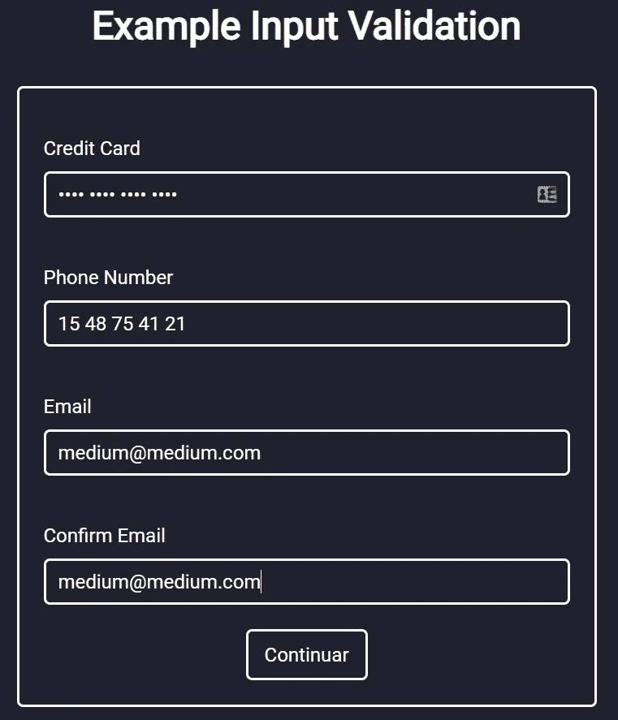

Example input validation with section and regex

我已经进行了验证，但没有使用 Regex 和多个部分，我想让它为我自己做，最后我做到了，我想分享它，我如何做到这一点，你会在我的 GitHub 上有完整的代码。

1 结构
2 HTML5 结构
3 CSS3
4 JSON-server
5 JavaScript

# 结构

这是我在本地 src 中的结构，包含 HTML5、CSS3 和 JavaScript 文件

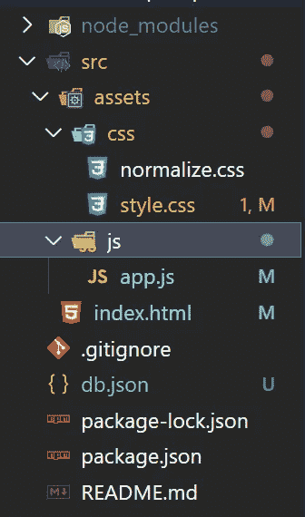

Example Proyect Structure

# HTML5 结构

主要的一点是，你需要在表单中添加字段集来划分像这样的带有“活动”类的部分，这将有助于我们在部分之间进行转换。

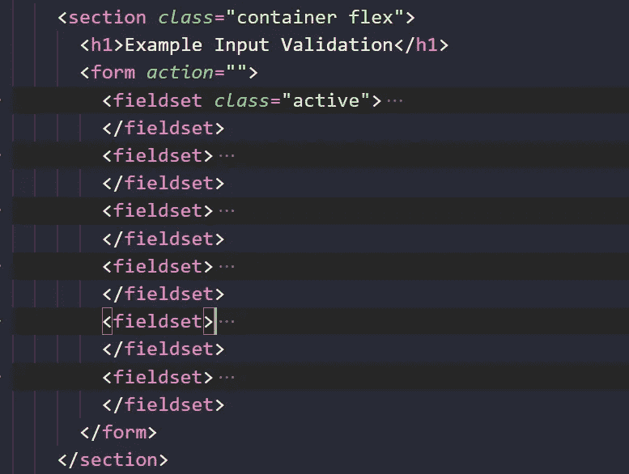

Example adding fieldset to the form

# 第一个字段集

第一个字段集将有我们的第一个输入，例如，我添加了信用卡号、电话号码、电子邮件、确认电子邮件和按钮。每个输入都有自己的 id 和名称，按钮有一个数据集，我们稍后将使用它，它有一个禁用的属性。

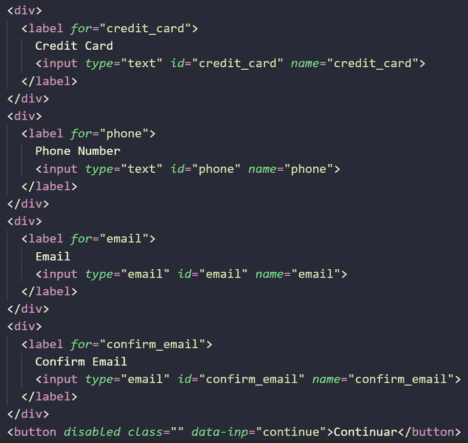

Example First fieldset

# 第二字段集

第二个字段集只有两个促销和他自己的继续按钮。

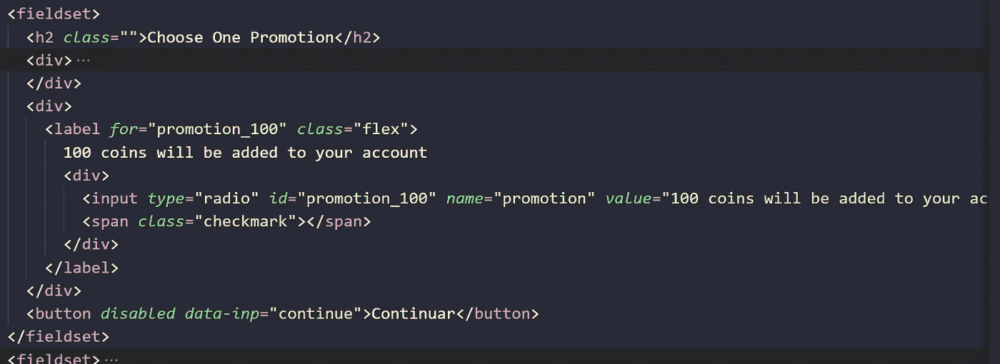

Example second fieldset

# 第三字段集

第三个字段集包含了第一个字段集的所有信息，如果用户想要修改某些内容，有一个按钮可以返回到第一个字段集，另一个按钮可以通过 fetch 发送信息，这两个按钮都有数据集。


Example third Fieldset

# 四、五和六个字段集

four 字段集有一个文本，告诉用户现在“发送信息”。五个字段集，如果发布的数据没有问题，它有最终的信息和用户的页码。这六个字段只有在出错时才发送最后一个字段。

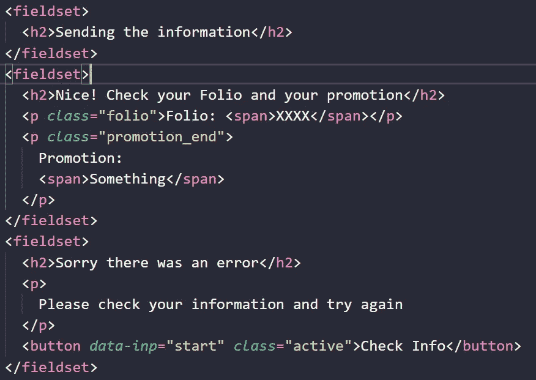

Example four, five and six fieldsets

# 半铸钢ˌ钢性铸铁(Cast Semi-Steel)

添加 Reset.css 和 Google 字体

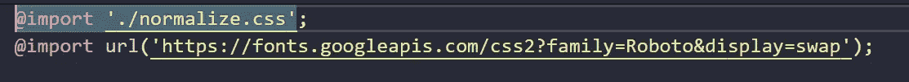

Example adding normalize and Google Fonts

# 字段集的样式

在这一步，我只向你展示主要的样式，而不是全部，字段集的样式是最重要的，因为这将帮助我们显示和隐藏，它只需要活动类

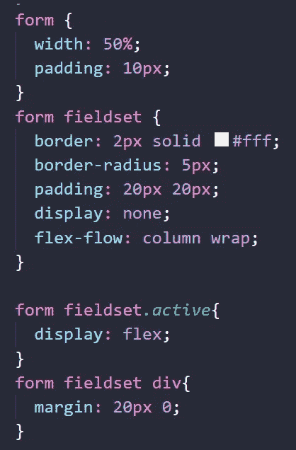

Example styles in css

在这一部分，如果输入没问题，我们将添加边框实线，如果输入没问题，我们将添加边框虚线

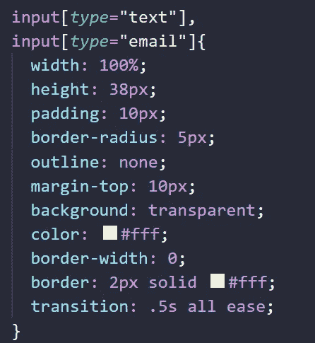

Example styles for inputs

示例输入无线电

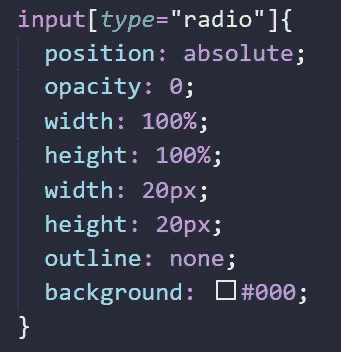

Example input radio

输入风格阶段示例

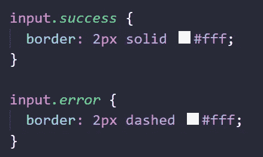

Example styles phases with css

示例按钮样式，我们添加一个活动类

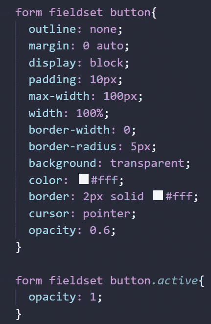

Example button styles

# JSON-server

对于这个例子，我使用了 [json-server](https://github.com/typicode/json-server) 来创建一个简单的 JSON API。现在，如果你想创建你自己的 npm 包，我们需要 npm

```
npm init --y
```

然后我们需要安装 json-server，然后我们需要这段代码

```
npm i --save-dev json-server 
```

之后，我们需要自定义 json-server，我们可以打开 package.json 文件，我们需要在脚本部分添加这一行:

```
“api”: “json-server db.json -p 3333 — delay 1500”,
```

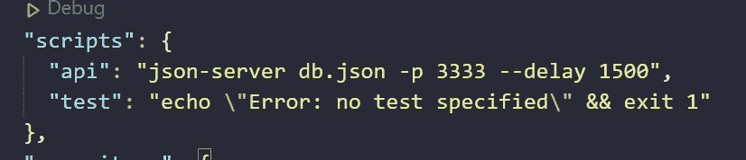

Example customizing json-server inside package.json

db.json 是我们将用来获取和发布数据的文件——p 3333 将在端口 3333 上运行，最后延迟 1500 毫秒创建一个类似的 API。

我们将该文件放在 package.json 旁边，如下所示:

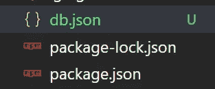

Example db.json

在这个文件中，它将是第一个字段集的信息:

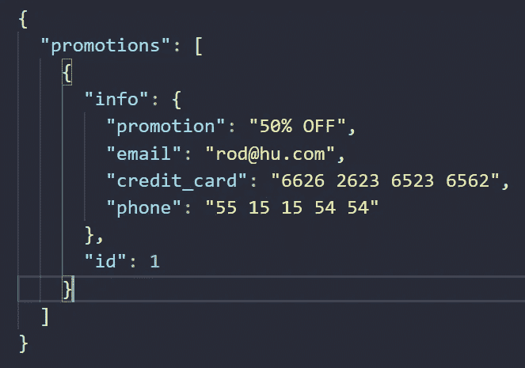

Example data inside JSON file

要运行 json-server，您只需运行以下命令

```
npm run api
```

目前，我们有这样的东西:


# Java Script 语言

这是粗略的部分，因为我们将执行所有操作，我们需要使用 load 事件来启动所有操作，我们需要创建一个名为 startForm 的函数，如下所示:

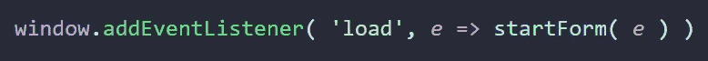

Example window load event

然后我们将从变量开始，我们需要将表单元素保存在变量表单中，然后我们将保存输入、按钮、范围和字段集，之后我们使用一个名为 regex 的对象，你知道我的意思，接下来我们需要另一个对象来保存输入的数据，这是 check 对象，最后是我们将使用 fetch 方法发布的 API 的 URL。

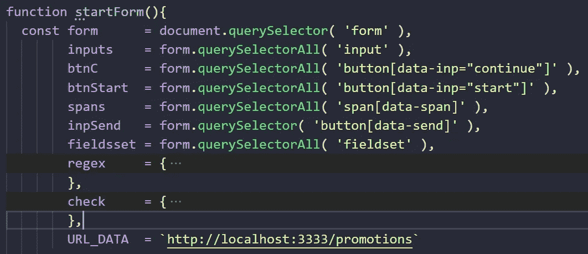

Example variables in JavaScript

Regex 对象将包含我们验证所需的所有 regex，check 对象将包含在第一行中，如果验证通过，将变为 true，在 body 部分将保存输入和单选按钮 transform_c_card 的信息，我们稍后将使用它，但要将其签出，因为 regex 和 check 属性是相同的，以便更有效。

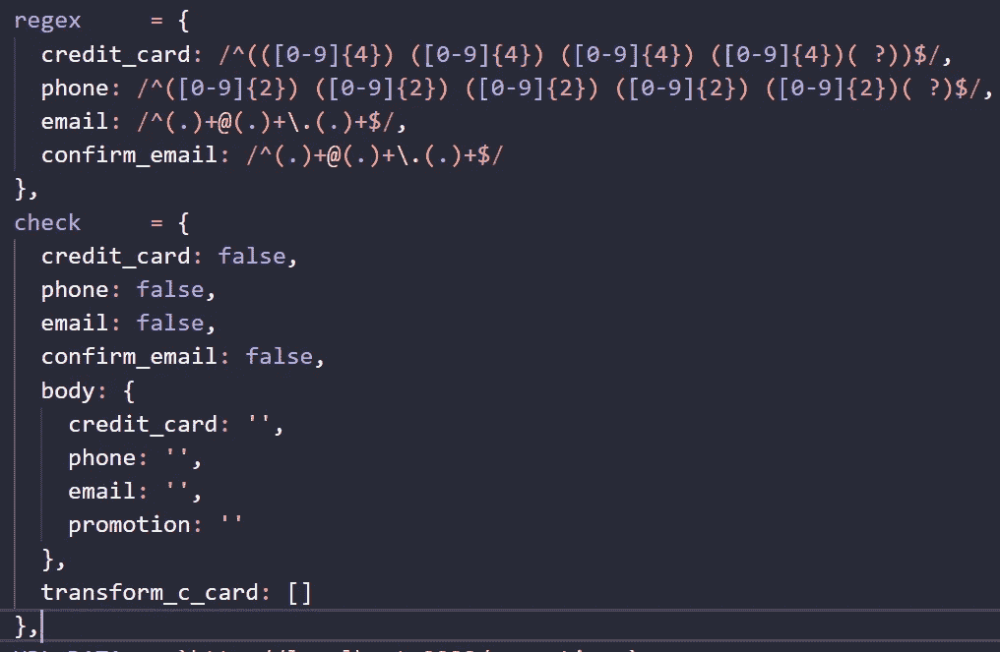

Example regex and check object

好的，我们需要我们的输入，然后我们使用 forEach 方法来添加这个方法 checkEachInput，因为它将帮助您检查每个输入，之后我们需要创建一个 if 语句来分隔输入文本和输入单选按钮。

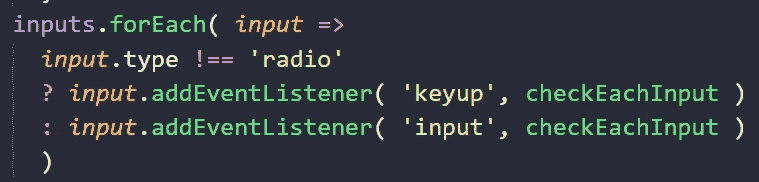

Example forEach

checkEachInput 只有一个开关，我们将传递目标名称，这将为我使用析构的每个输入用例点亮一个 regex 方法，以便于使用。

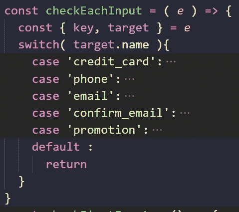

Example checkEachInput method

信用卡案例我们将需要一个数组变量，然后我们需要单独的新闻事件，因为我们需要模拟，当用户类型将改变为点，并保存数据，并检查数据是否正确，在这种情况下，如果键等于退格或删除将过滤输入的信息，并将检查数据长度是否等于或小于我们将保存的数据称为 transform_c_card，如果不是，transform _ c _ card 将剪切相同的 toArray 为什么？因为我第一次这样做时，数字将保存在 transform_c_card 中，并且它仍然在增加，然后使用 useRegexToCheck 方法，我们将在 check.bodycredit_card 中保存新数据，并在其中添加我们需要的信用卡空间。

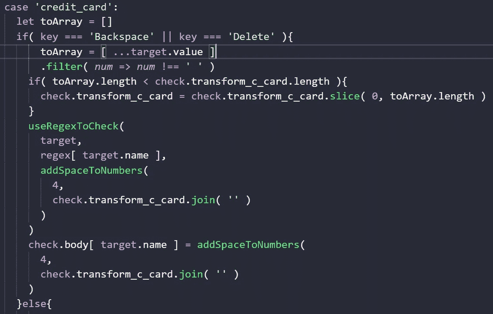

useRegexToCheck 是一个方法，它检查接收三个参数的每个输入，即输入的正则表达式和输入的值，然后触发正则表达式测试，如果一切都正确，将 check.input_name 更改为 true，并将删除我们添加到 CSS3 类中的错误类，否则将更改为 false 并将错误类添加到我们的输入中。

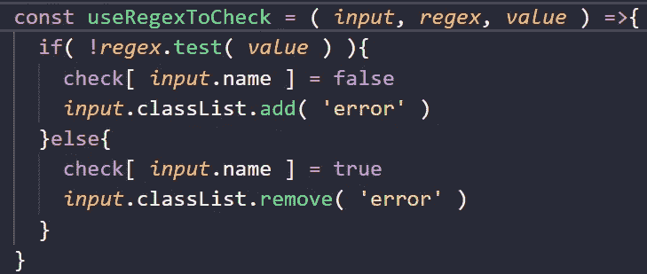

Example useRegexToCheck method in action

addSpaceToNumbers 方法会将数字转换为带空格的数字，就像真正的信用卡一样，它只需要两个参数，我们需要添加空格的数字和字符串，我们需要 RegExp 来创建一个新的 regex，其中包含我们要添加空格的数字，我们将用每四个数字中的一个空格来更改它，请注意，因为如果你看到 replace 方法，会有这些字符$&这些字符会帮助我们保持相同的值(数字)，然后我们返回它。

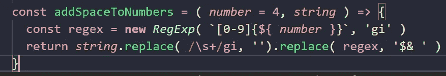

Example how this function works

Case 信用卡 Else 语句

我们需要再次使用我们的 toArray 来扩展输入的值并将其保存为一个数组，然后我们需要过滤我们的数组并映射它以将值交换为点，并将数字保存在 transform_c_card 上并连接它，然后我们用空格更改点并添加到目标值中，我们使用带有 addSpacesToNumbers 的 useRegexToCheck 方法检查值是否正确

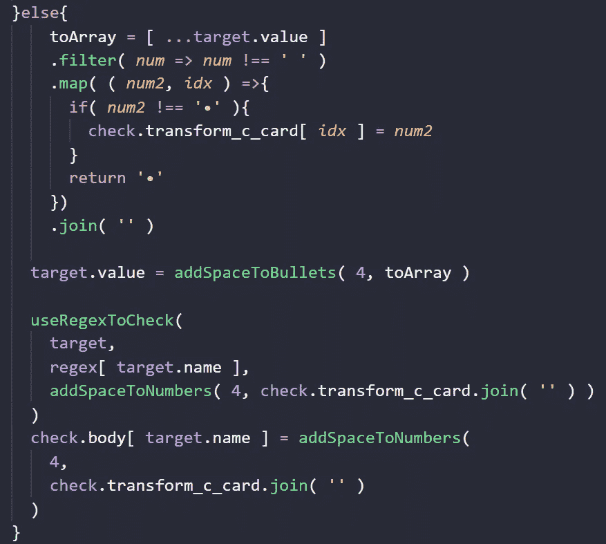

Example else statement credit_card

AddSpacesToBullets 这个函数将为点或项目符号添加空格


Example addSpaceToBullets method

手机壳

与 credit_card 相同，但稍有不同的是，我们不需要将输入的值换成点，我们只在空格中添加数字

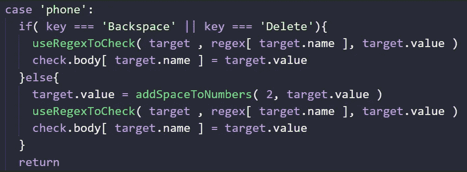

Example case Phone number

电子邮件案例和确认 _ 电子邮件

电子邮件和确认电子邮件是相同的，我们只检查它是否正确，然后将数据添加到他自己的 check.body 属性中

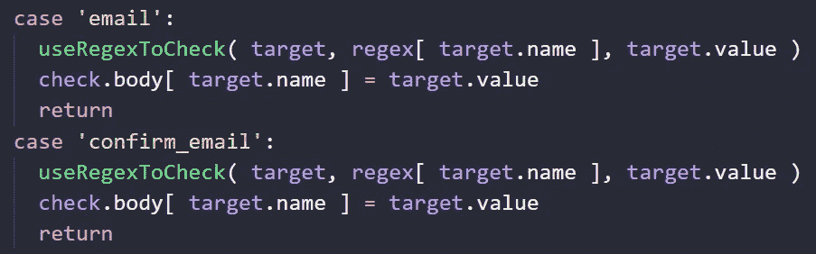

Example email, validation and confirm email validation

促销案例

推广的情况下，我们只需要另一个功能来处理，由于有单选按钮。

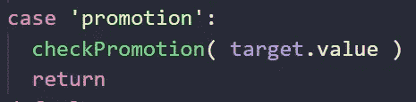

Example promotion case

检查提升方法

这个方法用 buttonActive 检查按钮是否是活动的，因为搜索具有活动类的字段集元素，并检查用户是否单击了任何单选按钮，然后它将激活按钮以继续

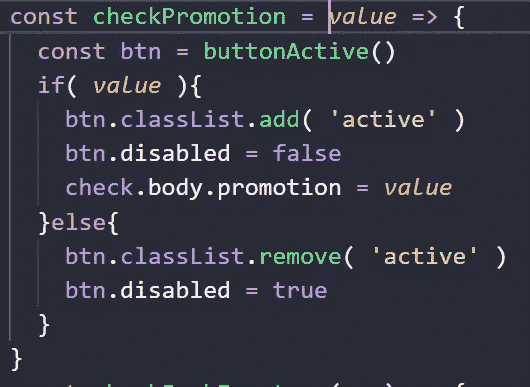

checkPromotion method

按钮活动

搜索活动字段集并返回按钮

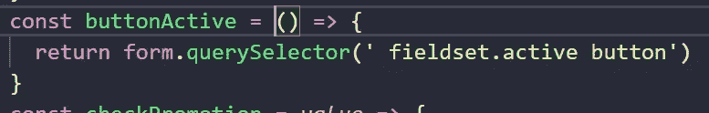

Example buttonActive method

我们将 checkFirstInputs 方法添加到事件 keyup 中，因为它将帮助我们将活动类添加到按钮中

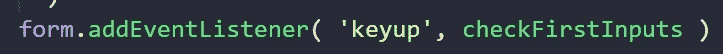

checkFirstInputs 方法

我们需要检查第一个检查属性不处于假状态，然后检查电子邮件是否相等，如果一切都正确，它将删除按钮的禁用状态，并将活动类添加到按钮

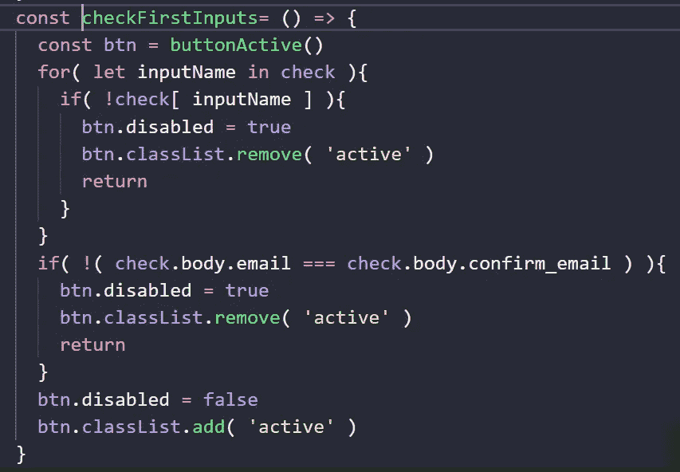

Example checkFirstInputs method

按钮点击

所有具有 data-inp="continue "的按钮都将具有 changeField 方法。

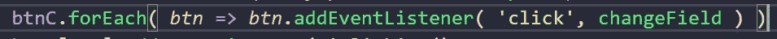

Example button continue

changeField 方法获取所有字段集，并检查字段集所在的位置，然后切换到下一个字段集

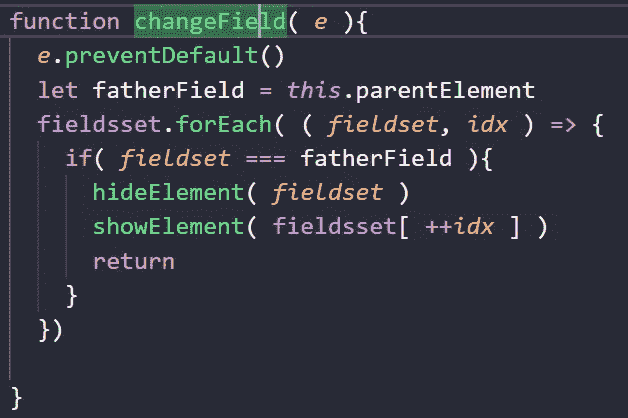

example changeField method

hideElement 和 showElement 只是添加和删除类

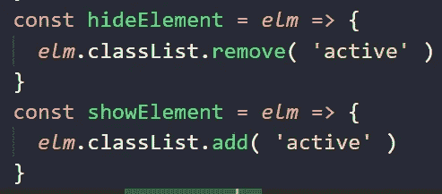

Examle hideElement method and showElement method

前面部分直到现在

但是我们已经准备好显示信息，让我们检查发生了什么

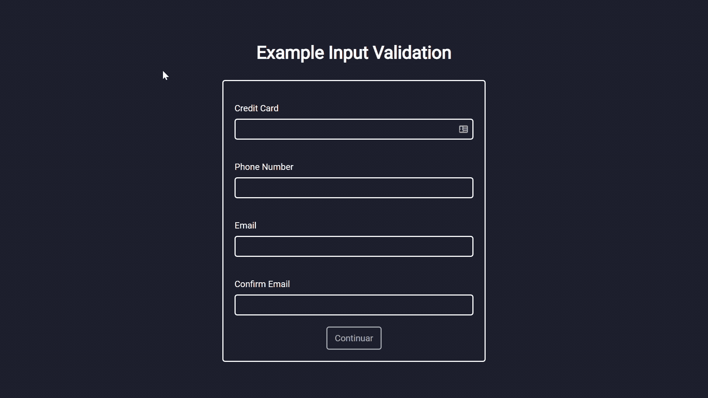

第二个按钮

有点神奇，因为它将 check.body 中的信息设置为下一个字段集，以向用户显示该信息是否正确，我们只创建了一个 if 语句来分隔 credit_card 信息，因为我们需要隐藏真实的信用卡号码，这就是为什么我取了前 10 个数字并将其更改为点，取了后 5 个数字并将其链接到字符串

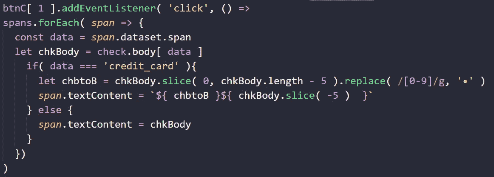

Example seconds button in action

重写并发送数据

rewrite 按钮将隐藏所有字段集，并将向第一个字段集添加 backToStart 方法工作的活动类

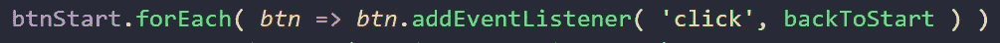

button back to square one

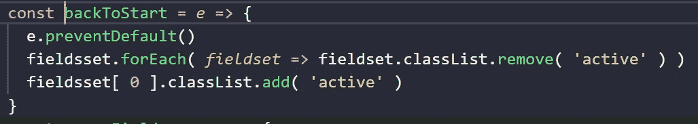

Example backToStart method

发送数据

这是最后一部分，因为这个按钮会将数据发送到我们的 json-server API

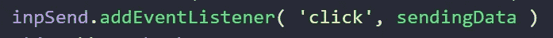

button send data

发送数据方法

这个方法的工作原理是这样的首先删除 confirm_email，因为它是在 useRegexToCheck 方法中添加的，然后我把所有的信息都转换成一个字符串，我把它赋给 body 变量，然后是 fetch POST 的配置，之后 fetch 方法添加 URL 和 conf，如果我们得到了数据，我们使用 json 方法把它转换成 JSON 格式，然后使用 destructuring，我把信息和 id， 如果一切都是正确的，更改下一个字段集的值，该字段集将拥有对开本和促销以及错误方法，该方法将向我们显示一个有错误的字段集。

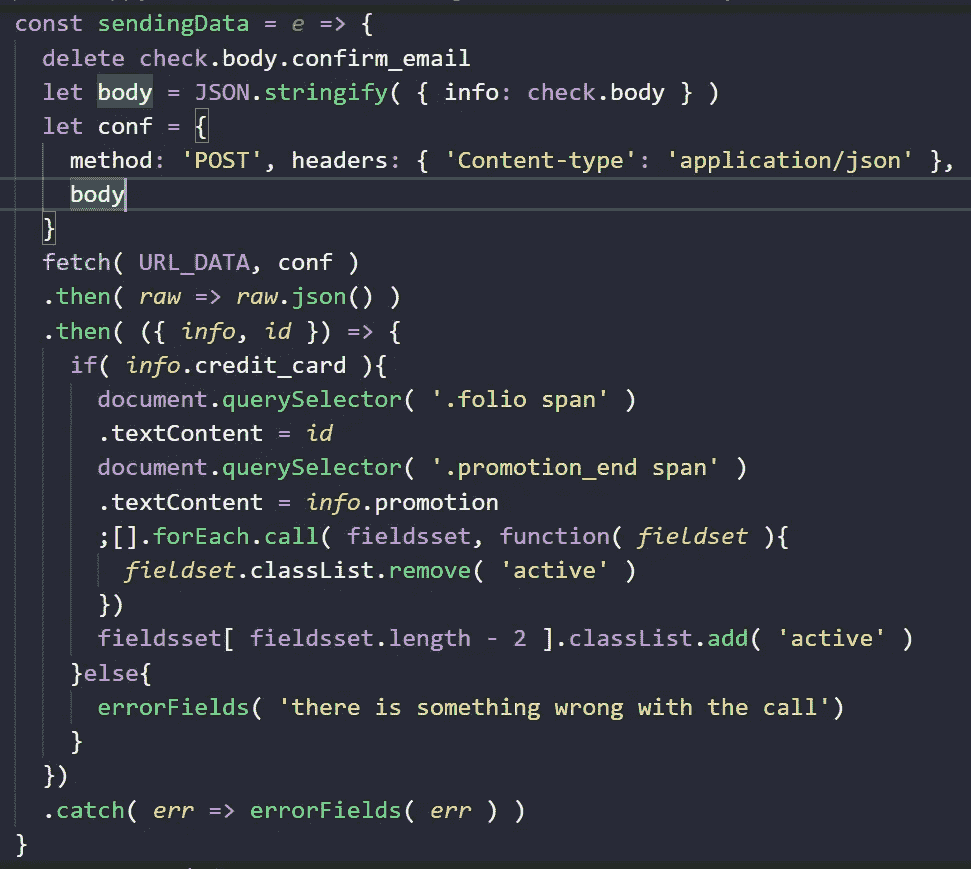

send data method

错误字段

这个方法将隐藏所有的字段集，并显示有错误的字段集

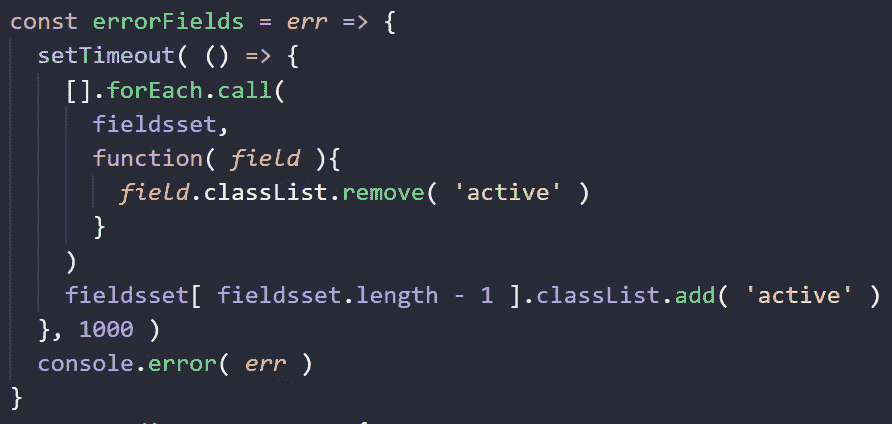

errorFields method

有错误的最终零件

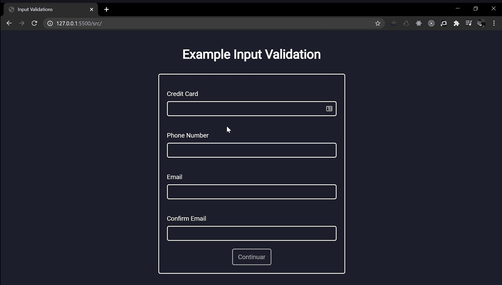

Example with errors

成功 API 连接的最终零件

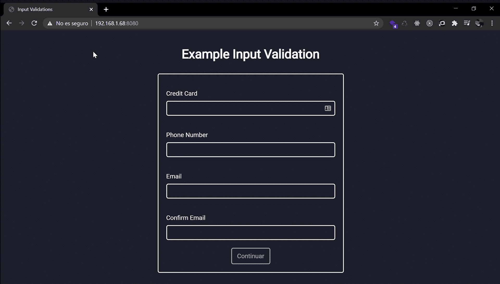

Example success validation

这些信息将保存在我们的 db.json 文件中

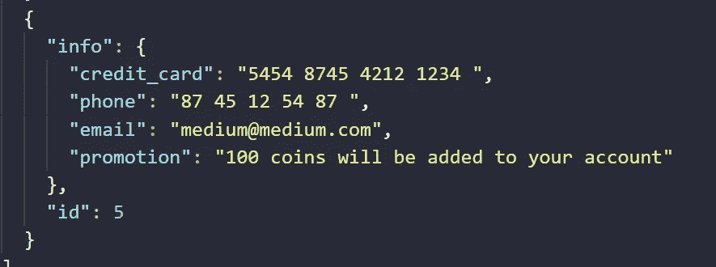

db.json file

# 结论

有一天我们将需要处理表单中的部分，这是您可以使用的一个选项，还有许多其他选项可以使用，但我真的希望它能为我所用，这非常令人满意，我希望有一天这能帮助您。

# 来源

[GitHub](https://github.com/rodrigofigueroa/formvalidations)