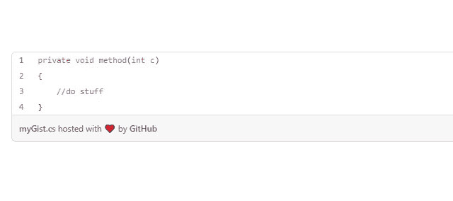

# 在中型文章中插入代码的 3 种方法

> 原文：<https://medium.com/geekculture/insert-code-in-medium-articles-ecb8963a8dfb?source=collection_archive---------7----------------------->

## 外加一个全新的！

目标:学习如何在一篇中型文章中放置代码片段

我发现自己在我的中型文章中大量使用了**代码片段**。嗯，这并不意外，因为我主要写游戏开发，更具体地说，我制作教程。