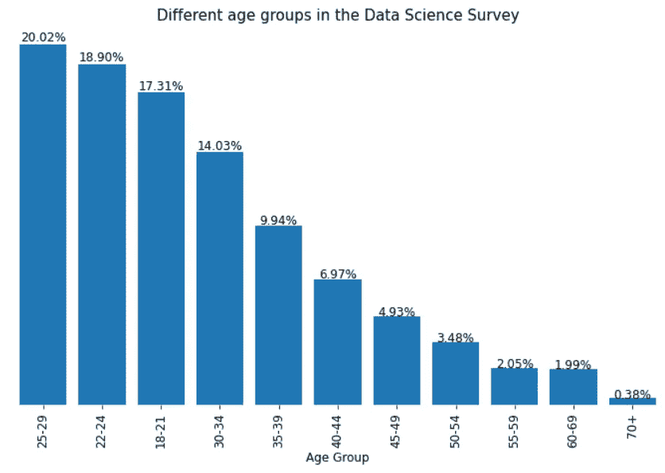
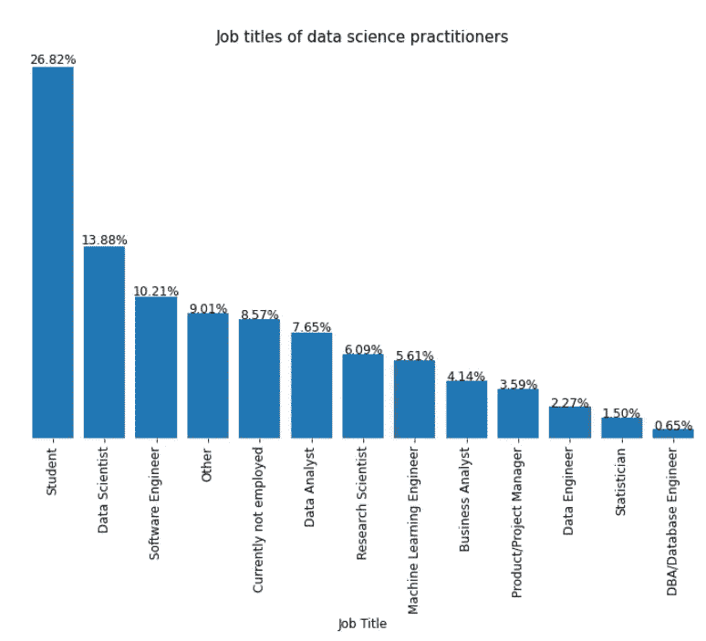
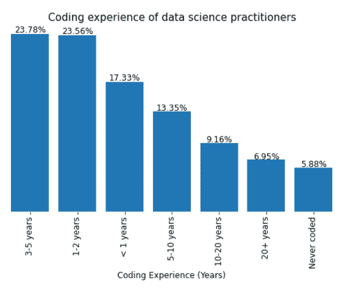
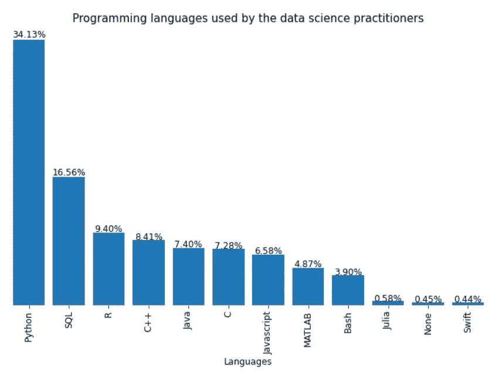
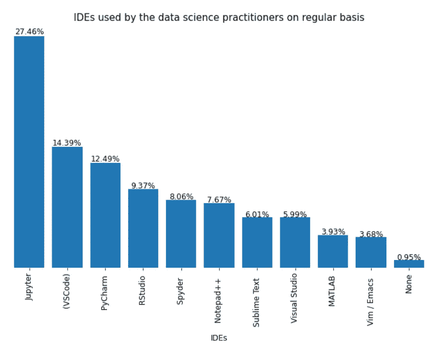
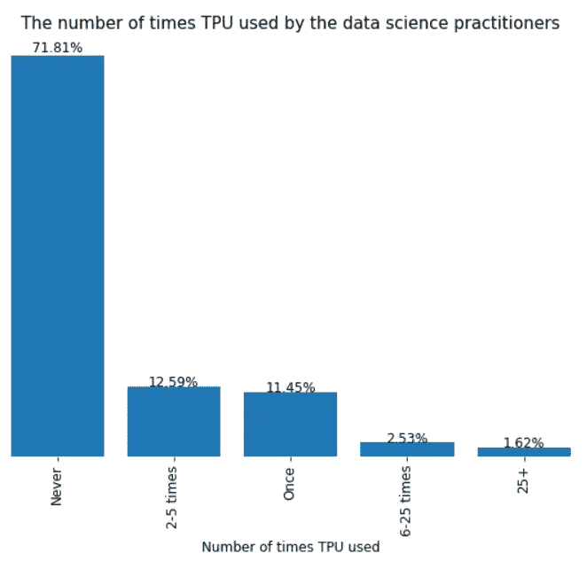
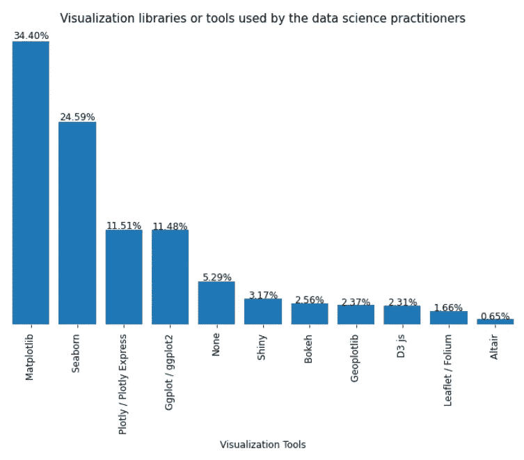
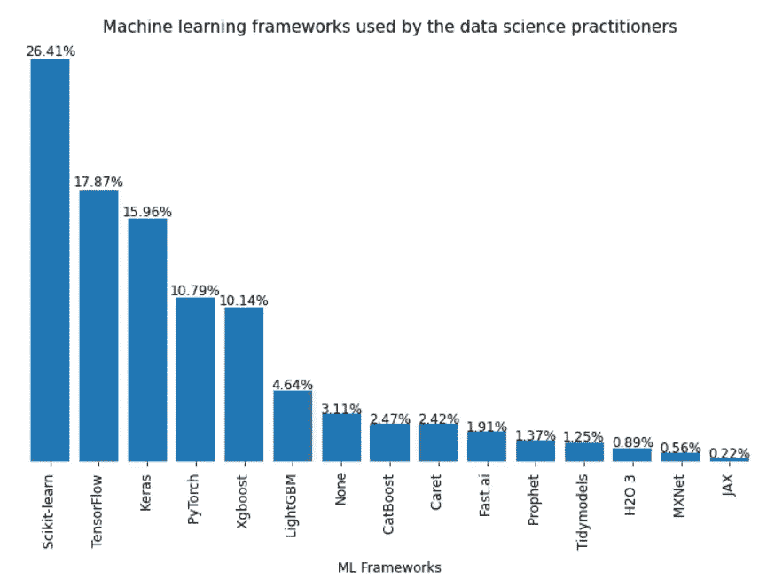

# 来自 2020 年机器学习和数据科学调查的见解

> 原文：<https://medium.com/geekculture/insights-from-machine-learning-and-data-science-survey-2020-1adb1b83f706?source=collection_archive---------1----------------------->

## 让我们通过数据来了解数据科学领域的现状

Source: [eduinpro.com](https://eduinpro.com/blog/what-is-data-science-and-its-life-cycle/)

# **简介**

从 2017 年开始， [**Kaggle**](https://www.kaggle.com/c/kaggle-survey-2020) **每年都会进行一次全行业调查，展示数据科学和机器学习的真实全面的状况。**该调查在 10 月份持续了 3.5 周，收到了来自超过 55 个国家和不同人口统计数据的 20，036 份回复，回答了从常用的 ML 算法、框架、云平台和产品到首选编程语言等广泛的问题。

# 数据科学从业者的年龄组

让我们从数据科学从业者所属的调查中的不同年龄组开始，深入研究从调查中获得的见解。

大多数数据科学从业者都不到 30 岁，占调查对象的 56%以上。调查中最大数量的回应来自调查中的**年龄组【25–29】(该年龄组中 20%的从业者)**。

70+岁的从业者**很少**(**不到 0.5%)** 。非常年轻的数据科学有志者正在进入这一领域。这一点可以从[18–21]年龄组的求职者的回答中看出，这一年龄组占了**超过 17%** 的回答。

# **数据科学从业人员的职称**

在调查中，大多数数据科学从业者是**学生(约 27%)，其次是数据科学家(约 14%)** 。从上图中可以观察到一个惊人的事实，即**大量求职者目前没有就业(8.57%)** 。这些人可能是在该领域经验很少的新生或有志之士。

极少数从业者拥有**统计师(1.5%)和**DBA/数据库工程师的职称，占回复的**不到 1%** 。

让我们从数据科学方法论的角度提出一些重要的问题，并用适当的可视化来回答它们。

## **1。数据科学从业者的编码体验是怎样的？**

相当多的候选人是**大一新生(约 17%)，拥有不到 1 年的编码经验**。

**超过 40%** 的数据科学从业者拥有**不到 3 年**的编码经验。大约 64%的从业者拥有不到 5 年的编码经验。

在编码经验谱的一边，有超过 20 年编码经验的**从业者(大约 7%)有**，而在另一边有**大约 6%的人从未编码过**。

## **2。数据科学从业者经常使用哪些编程语言？**

数据科学调查结果显示，从业者最常用的**语言是 **Python， **34.13%的受访者使用****其次是 **SQL，16.56%** 。**

**Python 和 SQL 在偏好等级中占主导地位，在被调查者中合计超过 50%** 。在从业者/受访者中， **R** 以 9.4% 排在**第三位，其次是 **C++以 8.41%** 。**

## **3。数据科学从业者经常使用哪些集成开发环境(IDE)？**

在所有的集成开发环境中**(ide)****JUPYTER(JupyterLab，JUPYTER 笔记本等。)**是数据科学从业者最喜欢的 IDE，有 27.46%的受访者**经常使用**，其次是 **VSCode，有 14.39%** 。

**12.49%**的从业者定期使用 PyCharm，其次是 **RStudio，有 9.37%** 。 **MATLAB 和 Vim/Emacs** 是最不常用的 ide，其**偏好度不到 4%**。

## **4。数据科学从业者使用 TPU(张量处理单元)大约有多少次？**

**大约 72%的数据科学从业者从未在他们的机器学习项目中使用过 TPU**。这可能是因为 TPU 最近进入了机器学习领域，而这种专门的硬件只用于深度学习。

约 11.45%的从业者只使用过一次 TPU。

**只有 1.62%的从业者使用过 TPUs 25 次以上。**

## **5。数据科学从业者经常使用哪些数据可视化库或工具？**

**Matplotlib** 是最受欢迎的可视化库**，有 34.04%的数据科学从业者使用**，其次是 **Seaborn，有 24.59%的受访者使用。Matplotlib 和 Seaborn 在偏好量表中占主导地位，在被调查者中合计约为 59%** 。

大约 11.5%的受访者几乎同样喜欢 Plotly 和 Ggplot 库**。大约有 5%的**从业者**没有使用任何可视化库。**

## ****6。数据科学从业者经常使用哪些机器学习框架？****

****

**在数据科学从业者使用的 Python 框架中， **Scikit-learn 是最受欢迎的框架**，26.41%的受访者**经常使用该框架**，其次是 **Tensorflow，7.87%的受访者** 1 **经常使用该框架**。受访者对这两个框架的综合偏好超过 44% 。**

# ****结论****

**随着**新工具不时进入数据科学领域**，数据科学作为一个领域正在不断发展。如果你正考虑进入数据科学领域，最好了解该领域的现状。**

**从上述分析中可以得出的主要见解是，非常年轻的有志之士正在进入这一领域，其中大多数是学生。Python 是最受欢迎的编程语言，Jupyter 是数据科学从业者最受欢迎的 IDE。此外，很少有从业者在他们的机器学习项目中使用专门的硬件，如 TPU。**

**数据科学从业者更喜欢基于不同需求的工具和框架。然而，每个工具或框架都是根据需求来选择的。**

**你可以在我的 [GitHub Repo](https://github.com/Ankit-Kumar-Saini/Data_Science) 中找到所有代码**

**链接到 [Kaggle 笔记本](https://www.kaggle.com/ankitkumarsaini/current-status-of-data-science)**

**LinkedIn 个人资料:[安基特-库马尔-塞尼](https://www.linkedin.com/in/ankit-kumar-saini/)**