# 来自英超联赛 21/22 的见解

> 原文：<https://medium.com/geekculture/insights-from-premiere-league-21-22-e018430a3225?source=collection_archive---------16----------------------->

Photo by [Myriam Jessier](https://unsplash.com/@mjessier?utm_source=unsplash&utm_medium=referral&utm_content=creditCopyText) on [Unsplash](https://unsplash.com/s/photos/sports-analytics?utm_source=unsplash&utm_medium=referral&utm_content=creditCopyText)

## 边做边学#2 (SQL 和 Tableau)

在我的**边做边学**系列中，我试图发布我个人项目的过程，通过这些项目我试图练习我的 Python 和 SQL 技能。

因此，在这个项目中，让我们探索并尝试找到关于 2021-2022 赛季英超联赛的统计数据，让我们看看我们可以获得什么样的见解。

数据集链接— [足球数据](https://www.football-data.co.uk/englandm.php)

数据显示几个属性:

*   Div =联赛部
*   日期=比赛日期(日/月/年)
*   主队=主队
*   客场队
*   FTHG =全职主队目标
*   FTAG =全职团队目标
*   FTR 和 Res =全职成绩(H =主场胜利，D =平局，A =客场胜利)
*   HTHG =半场主队进球
*   HTAG =半场休息时间团队目标
*   HTR =半场结果(H =主场胜，D =平局，A =客场胜)

匹配统计数据(如果可用)

*   HS =主队投篮
*   AS =客场球队投篮
*   HST =主队击中目标
*   AST =客队射门击中目标
*   HC =主队角球
*   AC =客场球队角球
*   HF =主队犯规
*   AF =客队犯规
*   HY =主队黄牌
*   AY =客队黄牌
*   HR =主队红牌
*   AR =客队红牌

表格:

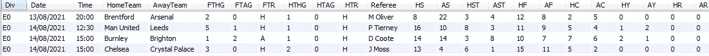

snippet of the table(only the relevant columns are shown)

> 返回每支球队的主场总胜率，按降序排列。

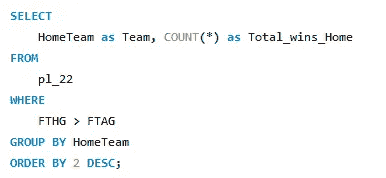

Snippet of the Query

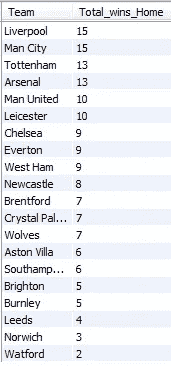

Result of the query above

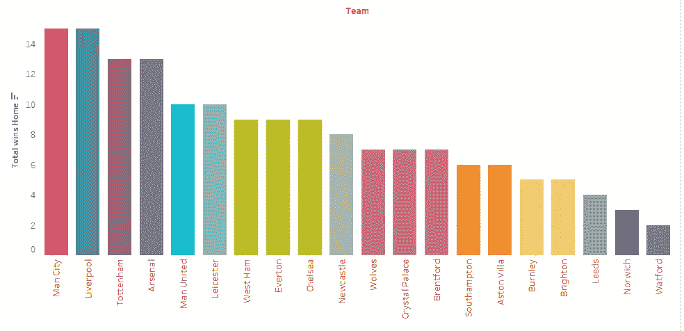

Snippet of the Tableau Sheet

> 返回按降序排列的每支球队的客场胜利总数。

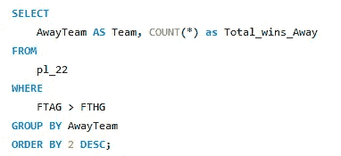

Snippet of the Query

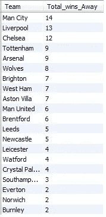

Result of the query above

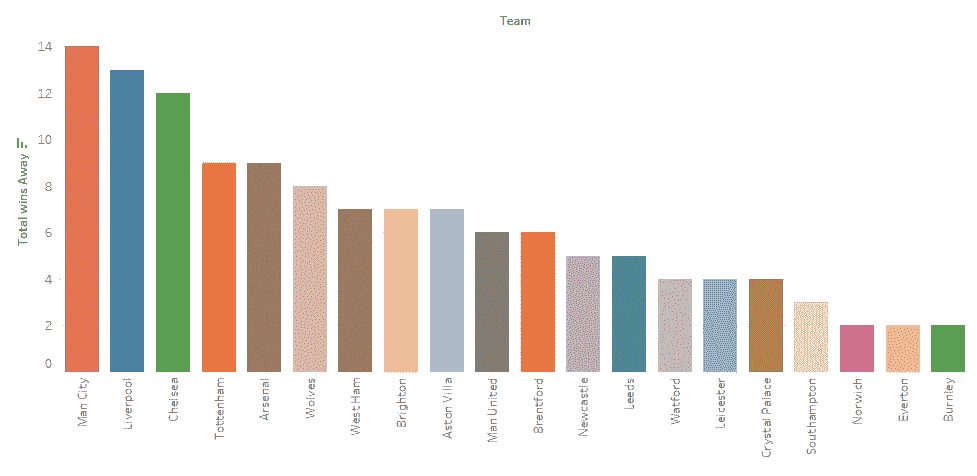

Snippet of the Tableau Sheet

> 整个锦标赛的总进球数按降序排列

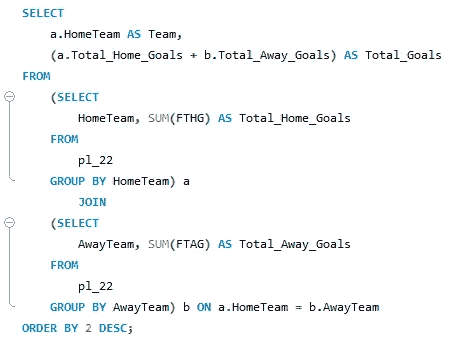

Snippet of the Query

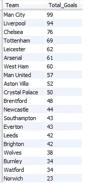

Result of the query above

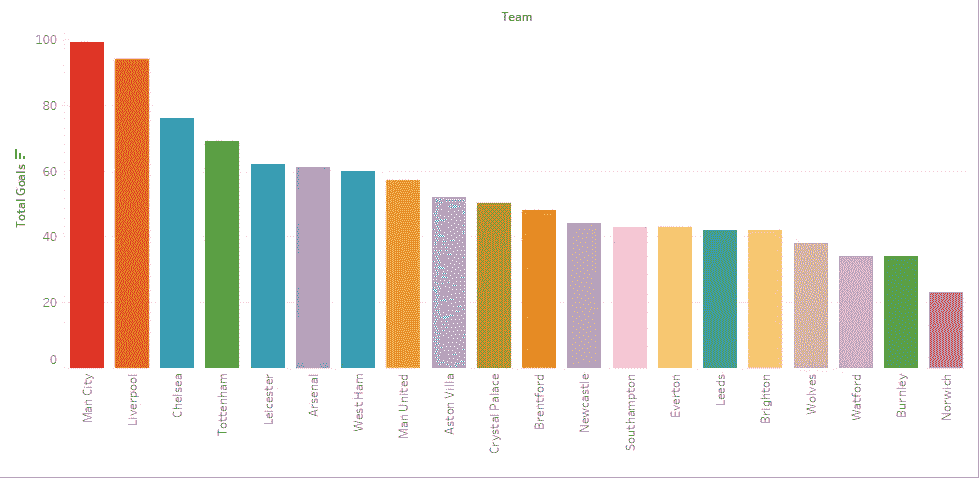

Snippet of the Tableau Sheet

> 裁判和每场比赛的总裁判数，按降序排列

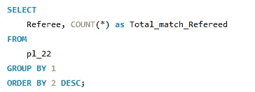

snippet of the query

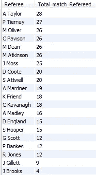

snippet of the result(some values are missed in the screenshot)

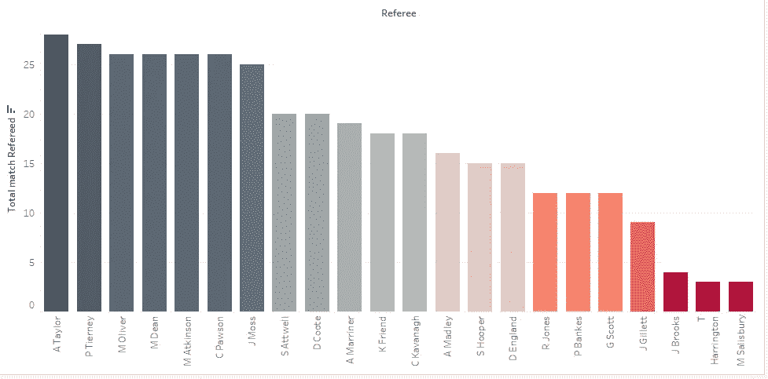

在主场输掉一场比赛本身就被视为对俱乐部地位的不尊重，有些比赛在半场结束前，比赛似乎控制了主队，但在下半场，客队迎头赶上，赢得或平了比赛，让我们看看哪些球队这样做得最多，

> 半场结束后让对手在主场迎头赶上的球队

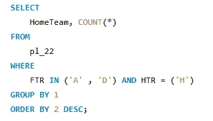

snippet from the query

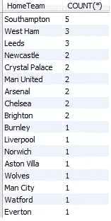

snippet of the result

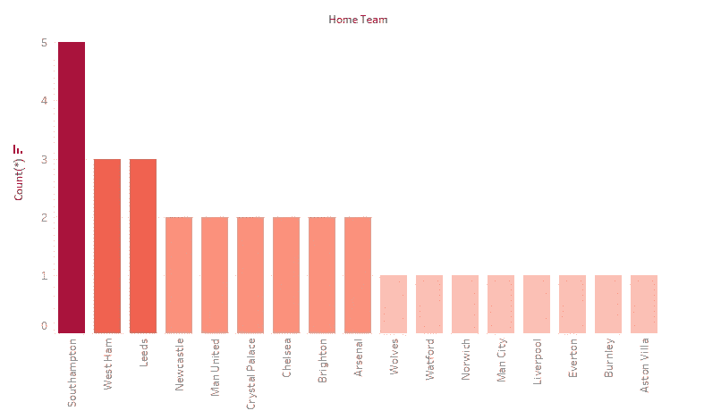

snippet from the tableau

> 整个比赛期间收到的球队和红牌总数

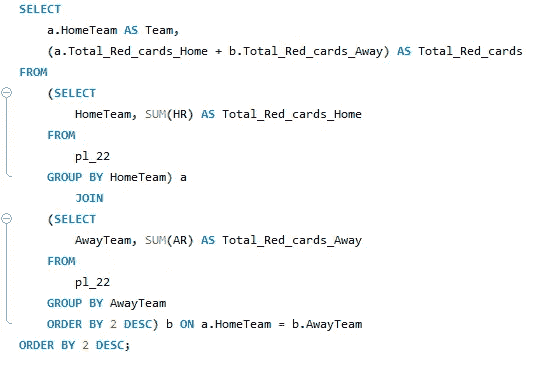

snippet of the query

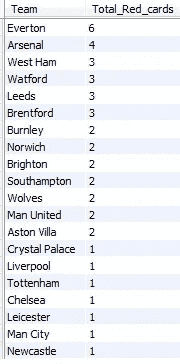

snippet of the result

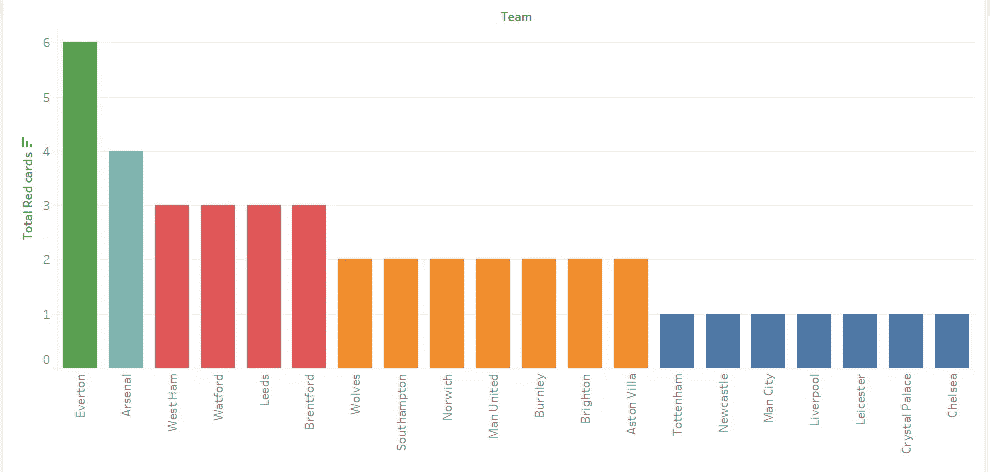

snippet from the tableau

> 按降序排列，每个日期中发生了多少次匹配

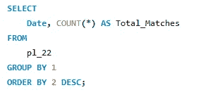

snippet of the query

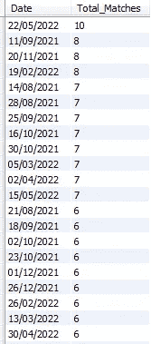

snippet of part of result

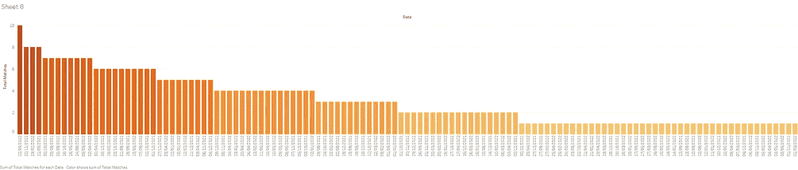

snippet from the tableau

让我们为联盟创建积分表

积分系统如下:

如果一个队赢了——3 分

如果一个队打平— 1 分

如果一个队输了——0 分

> 点数表

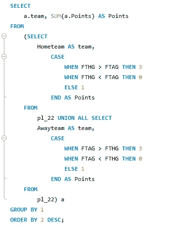

snippet from the query

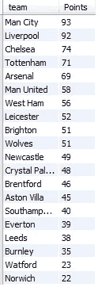

snippet of the result

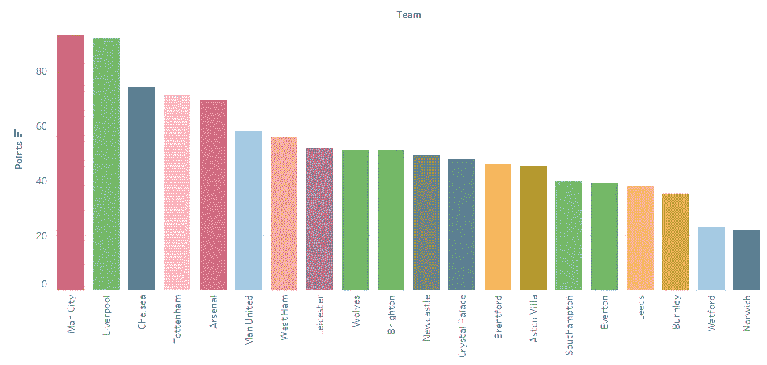

snippet from the tableau

所以，现在让我们转到具体的球队分析，让我们分析利物浦的统计数据，我们已经看到了总进球，主场胜利，客场胜利，现在，让我们分析裁判 wrt。

> 裁判和为利物浦执法的比赛总数

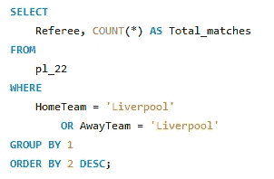

snippet of the query

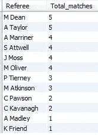

snippet of the result

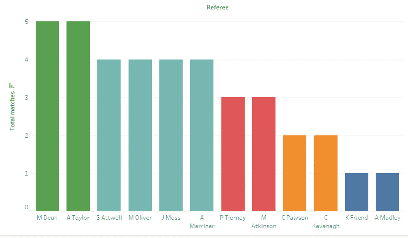

snippet from the tableau

让我们分析一下裁判和赢得比赛之间的关系

> 裁判 X 为利物浦获胜

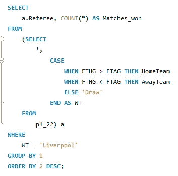

snippet of the query

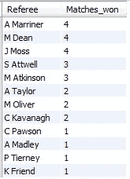

snippet of the result

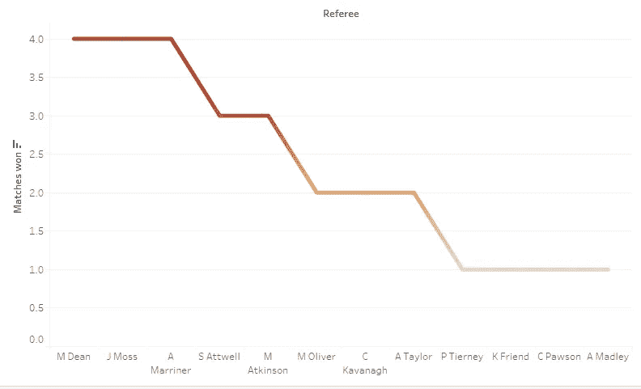

snippet from the tableau

相同分析 wrt 损失

> 裁判 X 利物浦输球

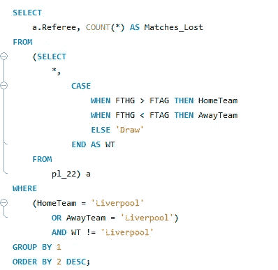

snippet of the query

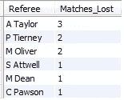

snippet of the result

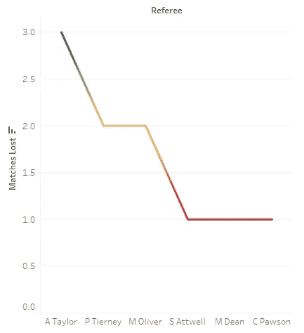

snippet from the tableau

总结:

这是一个关于 PL 21/22 赛季的简短分析，我们可以找到更多的统计数据，比如总投篮次数和胜率之间的相关性，或者总命中率和胜率之间的相关性。如果您对查询有任何建议或对 tableau 表有任何建议，欢迎您联系，并对本文提出建议或意见。

谢谢你……..