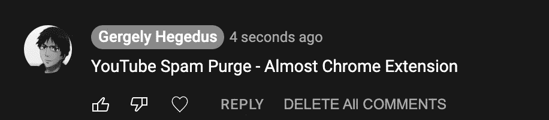
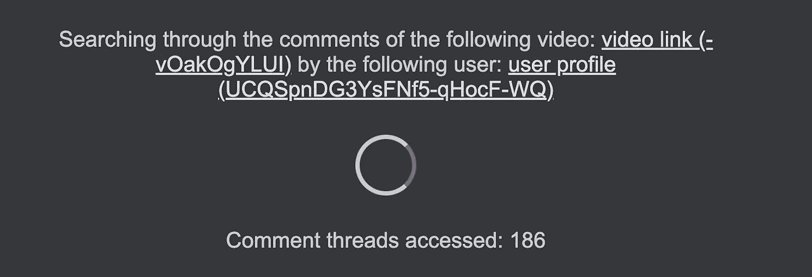
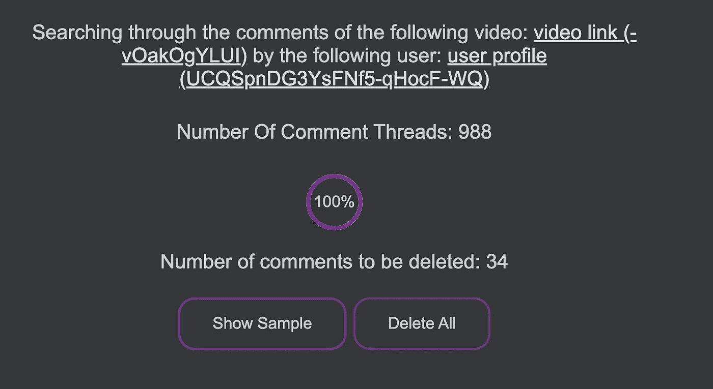
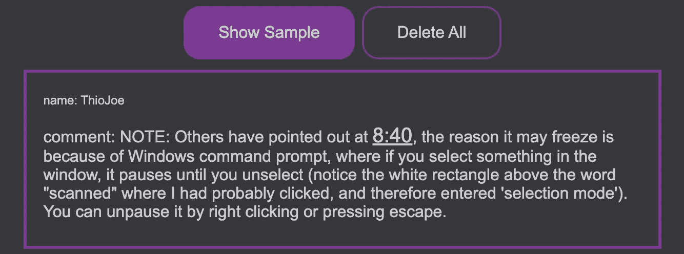
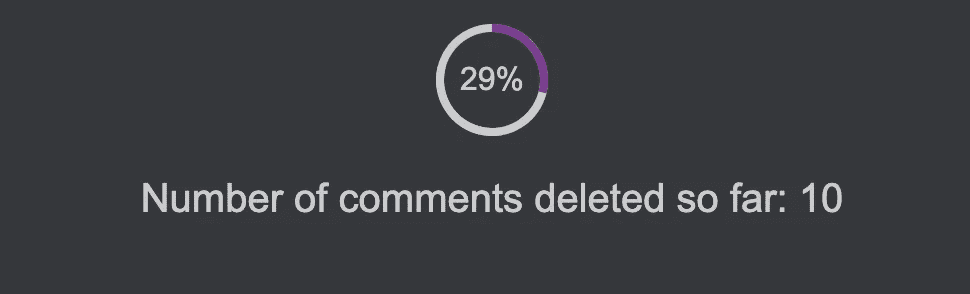

# 启发| Youtube 垃圾邮件清除几乎铬扩展

> 原文：<https://medium.com/geekculture/inspired-youtube-spam-purge-almost-chrome-extension-c1b760fa8415?source=collection_archive---------16----------------------->

我受到了这个[视频](https://www.youtube.com/watch?v=-vOakOgYLUI&t=776s&ab_channel=ThioJoe)的启发，度过了一个自由的周末，我想我会以自己的方式尝试一下。因此，考虑到这一点，我想我可以创建一个更容易使用的 Chrome 扩展。嗯，事情是这样的。

免责声明:我对 JavaScript 或 Web 开发或 Chrome 扩展开发一无所知。如果你正在寻找可以学习的好的 JS 代码，这不是它的首席。这只是对我自己的一个挑战，也可能是一个起点，让你实现得更好，可读性更强。

# 想法

所以思路和参考视频里的一样。YouTube 正遭受垃圾评论的困扰，看看任何财经视频，比如 Graham Stephan 的视频。你会发现很多冒名顶替者要求人们在 WhatsApp 上写下他们最有可能从中获得一些钱。显然，屏蔽用户并不会删除他们之前的评论，所以创作者很难摆脱他们。

如果 YouTube 不想要这个选项，我们可以自己添加吗？嗯，我们当然可以试试。我认为使用 Chrome 扩展可以直接在 YouTube 页面上添加一个按钮来删除用户的评论。我认为这种整合在概念上是有意义的。

# 将按钮添加到 YouTube

在设置了文档提供的 HelloWorld Chrome 扩展之后，是时候开始第一步了。我们甚至可以把按钮添加到 YouTube 上吗？如果不是，这个想法就没有意义，也没有继续下去的意义。

显然，随着下面几行被添加到我们的`manifest.json`中，我们有了一个运行在每一个 YouTube 视频页面上的 JavaScript。

这很有希望，现在我们只需要添加我们的 JavaScript。

首先，我试图从 DOM 中找到回复按钮，它在我的控制台上工作，但当我尝试使用我的扩展时就不行了。嗯，评论是事后加载的。通过谷歌搜索，我发现当节点被添加到页面时，我们可以做出反应:

现在，我可以在添加评论时做出反应，甚至更有希望。我寻找一个特定的元素`reply-dialog`，并在一个`toolbar` div 中找到了`REPLY`按钮的位置。所以现在我只需要在那里添加我的按钮。有了这个，我们在 YouTube 上有了一个按钮，我们可以对它做出反应，这很合适:

# “做点什么！”

我们有按钮，但它什么也不做。好吧，让我们改变一下:

单击按钮时调用该函数。

显然，我们可以向 Chrome 扩展的主要组件发送消息。所以我们发送用户的频道 URL 和视频的 URL。这可以保存到下一步。

这样，我们就可以在新页面中打开 Google 登录验证过程。谷歌登录需要一个重定向 URL，我们没有。我们没有重定向到的服务器或页面，所以我们只是重定向到 YouTube 的一个特定 URL，并对其做出反应，就像我们对 YouTube 视频标签的反应一样。这可以工作，不是最好的，但嘿\_(ツ)_/。我选择 URL `[https://](https://youtube.com/deleteallcomments)youtube.com/deleteallcomments`,因为它是一个不存在的页面，我们可以通过调整清单来轻松摆脱它。

JavaScript 也非常简单，只需向`background.js`发送一个信号，表明我们有令牌。

# 我们什么都有了，开始吧

我们向我们的`background.js`发送包含所需数据的消息。我们所能做的就是保存它，显然我们可以创建一个新的标签页来删除页面。这并不太复杂，所以接下来是 YouTube 集成。我们将所有这 3 个项目(videoId，userId，youtubeAccessToken)发送到一个新的选项卡，称之为`deleting.html`，`deleting.js`。

我对 web 开发一无所知。我不好意思说我花了多长时间才实现了一个进度指标，这个页面看起来仍然像是 90 年代的东西，也许这已经很慷慨了。但这是题外话，让我们来谈谈有趣的事情。

首先，我们需要获得实际的评论。我不能通过我们想要删除的人的评论来过滤他们，所以我需要从视频中获得所有的评论线索。为此，我展示了一个无限加载指示器，并展示了找到了多少个注释线程。

请求是分页的，所以我们一个接一个地调用，直到不再有下一页。我们有所有的评论线程，它们也包含回复。这样，我们可以通过选择的`userID`对它们进行过滤，并列出要删除的评论。

在这一点上，我向用户显示了一个进度指示器，因此他们知道注释正在被处理:

现在，用户可以通过采样来检查是否找到了正确的注释:

# 实际删除

这样，唯一需要做的事情就是实现删除所有操作。由于我们创建了一个需要删除的评论列表，我们可以一个接一个地检查它们，调用 YouTube 的 delete API，同时向用户显示进度。

以及它在代码中的样子:

基本上，我们以递归的方式一个接一个地调用请求，直到不再有注释需要删除。此时，我向用户显示一个确认文本并关闭选项卡。

# 改进和发布

这个小程序可能会有很多改进:

1.  我们可以将已经加载的评论保存在存储器中，这样，如果需要删除另一个用户的评论，我们就不需要重新加载所有的评论线程。
2.  我们可以在频道上搜索多个视频，通过上面提到的缓存，也可以真正缩短时间。
3.  我们还可以添加阻止功能，这样用户就会被阻止，他们所有的评论都会被删除，这样会更快。
4.  当然，代码和 UI 的设计都可以大大改进。

我会这么做吗？不。对我来说，重点是有一个小的周末项目来尝试一些新的和有趣的东西，它为我服务，所以我不会在这个小项目上花更多的时间。这就是为什么它也没有作为一个实际的 Chrome 扩展发布，我不想要通过谷歌 OAuth 验证和发布过程的麻烦。然而，如果你认为这个想法值得投资，请随意使用代码或想法。

# 源代码

如果你想试试它，或者看看它看起来怎么样，请随意参考我的 [GitHub](https://github.com/fknives/Youtube-Spam-Purge-Almost-Chrome-Extension) 。

现在去编码；)