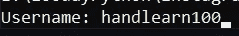
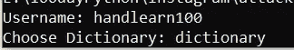
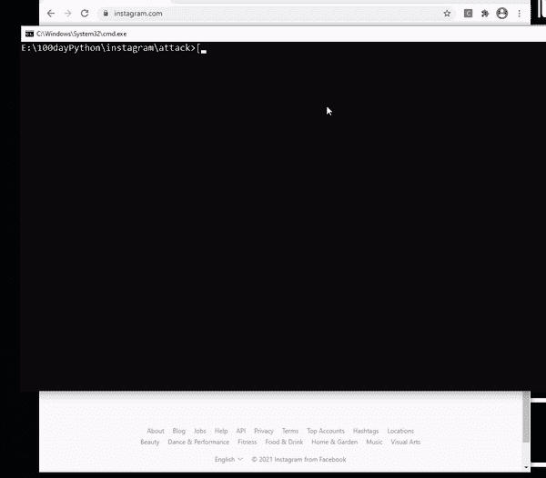

# 使用 Python 的 Instagram 暴力攻击

> 原文：<https://medium.com/geekculture/instagram-brute-force-attack-using-python-6911606377b8?source=collection_archive---------0----------------------->


Photo by [christanw](https://unsplash.com/photos/ZYLmudR28SA) on [unsplash](https://unsplash.com/s/photos/instagram-breach)

***“免责声明:这不是黑客教程，这只是为了好玩和教育而已。任何因此而产生的暴力，都超出了我的责任”***

我再告诉你一遍，这也许不是你要搜索的暴力破解教程。这个教程只是为了好玩和教育的目的。Instagram 是一个伟大的平台，为什么你仍然试图用暴力找到一个密码。与其使用它，为什么不尝试更现实的社会工程攻击。

这篇文章只是为了好玩，我不想利用 Instagram，我只是想帮助你逗你的朋友使用这个教程，不知何故会像一个 Instagram 蛮力攻击。

这就是我为什么能写这篇文章的原因？

> 如果密码长度小于 6，Instagram 将始终接受您输入的密码

如果你问我“它脆弱吗？”我说完全没有，我认为 Instagram 的开发者非常聪明，建立了这个登录功能。所以当输入超过六个字符时，登录页面会对其进行处理，检查密码是否真实。如果你错误地输入密码大约三五次，我们需要等几分钟再输入一次。

不，我们看到，如果我们可以输入六个字符以下的密码，我们可以做得越来越多，想做多少就做多少，而不用等几分钟。这就是这篇文章的主要原因——让你的朋友被你的节目逗乐。😏

首先，我们需要使用 pip 安装 webbot 和 pynput 模块。webbot 模块将触发一个 web 自动化程序。它用于激活网络浏览器环境。Pynput 模块用于使用 python 控制输入。

我必须做一个 GitHub 库，使它更容易安装。这是源代码

[](https://github.com/theDreamer911/brute-force-instagram) [## 梦想 911/暴力-Instagram

### 此时您不能执行该操作。您已使用另一个标签页或窗口登录。您已在另一个选项卡中注销，或者…

github.com](https://github.com/theDreamer911/brute-force-instagram) 

下载后，请按照以下步骤操作

## 1)通过编写以下命令从 requirements.txt 安装模块

```
pip install -r requirements.txt
```

或者

```
pip3 install -r requirements.txt
```

输出将是这样的


This output means, I already installed the module

## 2)发起攻击

```
python instagram-brute-force.py
```

## 3)输入用户名

放上你的用户名 Instagram，就像这样



This is the real username of Instagram

## 4)输入字典 txt

选择。txt 文件，可作为字典使用(强力方法之一)。例如，这是我的字典文件

如您所见，除了最后一个文本，所有文本的长度都不到六个字符。把你的真实密码写在最后一行。之后在命令行中填入`dictionary`。因为这个文件是 dictionary.txt。你可以随意命名它，但是我默认了这个文件是. txt。所以你只能使用。txt 文件。



Choose dictionary file

## 5)按回车键并等待几次，直到您成功登录

成功登录 Instagram



Login Success — Don’t forget to change the last line of dictionary.txt

正如您所看到的，Instagram 登录正在获取 dictionary.txt 中的所有字符。因为所有低于六个字符的输入对系统来说没有任何意义。它可以工作，虽然你把它 1000 行。

—

最后，我认为这是不对的，如果我不解释源代码。这是源代码

如您所见，在第 4 行和第 5 行，我们要求用户输入用户名和文件来进行字典攻击。该文件是逐行访问的，因此它可以用作 bruteforce 变量。之后，在第 14 行和第 15 行中，我们使用在第一步中安装的模块。至于其他的，我相信你很容易读懂。

—

我希望你成功地欺骗了你的朋友，不只是普通的自动化登录 Instagram，而是给自动化添加了暴力攻击功能。

有一个很好的代码。