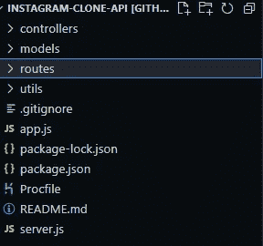
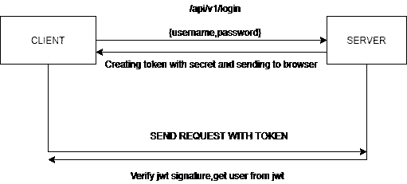
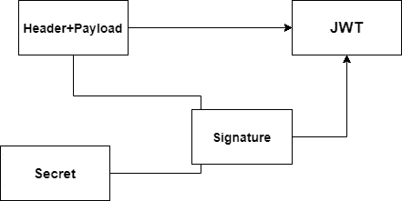
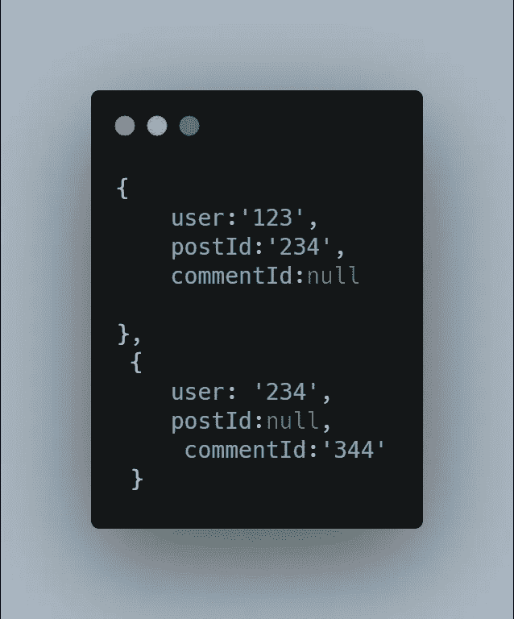

# insta gram-克隆后端第 1 部分

> 原文：<https://medium.com/geekculture/instagram-clone-backend-part-1-d2de321f1ddd?source=collection_archive---------6----------------------->


让我们使用 express、socket.io 和 MongoDB 构建一个 Instagram 克隆

***特征***

*   证明
*   邮政
*   喜欢帖子
*   私聊
*   实时通知

# ***快速链接***

[](https://github.com/charanpy/instagram-clone-API) [## GitHub-char anpy/insta gram-clone-API:insta gram 克隆后端 API

### Instagram 克隆后端 API。在 GitHub 上创建一个帐户，为 charanpy/instagram-clone-API 开发做贡献。

github.com](https://github.com/charanpy/instagram-clone-API) [](https://github.com/charanpy/Instagram-react) [## GitHub-char anpy/insta gram-React:insta gram-clone React

### insta gram-克隆反应。在 GitHub 上创建一个帐户，为 charanpy/Instagram-react 开发做出贡献。

github.com](https://github.com/charanpy/Instagram-react) [](https://github.com/charanpy/ReactNative-InstagramClone) [## GitHub-char anpy/React Native-InstagramClone:InstagramClone-React-Native(Expo)

### insta gram-clone-React-Native(Expo)。为 char anpy/reactinative-InstagramClone 的发展作出贡献，创造一个…

github.com](https://github.com/charanpy/ReactNative-InstagramClone) 

在这一部分，我们将

1.  创建项目
2.  使用 Node.js 和 express.js 设置服务器
3.  创建模式
4.  证明

# ***创建项目:***

```
mkdir instagram-clone
cd instagram-clonenpm init -y
npm install mongoose bcryptjs jsonwebtoken express cors dotenv socket.io validator express-validator
```

# **文件夹结构**

创建 app.js 和 server.js 文件*(文件)*

创建实用程序、控制器、模型和路线文件夹*(文件夹)*



在 app.js

在 server.js

在。使用 MongoDB atlas 复制并粘贴您的 MongoDB Uri

# ***定义模式***

对于此克隆，我们将为以下各项创建模式

*   用户
*   轮廓
*   邮政
*   组
*   信息

**User.js**

在模型文件夹内创建 User.js

这里，我们已经用必需的验证器定义了用户模式中的数据结构。

前置和后置是使用的中间件。

前置中间件在挂钩方法之前执行。在保存之前，我们使用 bcryptjs 加密普通密码

在挂钩方法之后*执行 post 中间件。创建用户后，我们将为新创建的用户创建一个配置文件。*

***Profile.js***

***Post.js***

在这里，我们从标题中提取 hashtags，并将它们存储为数组。

**group . js**

创建用于私人(一对一)和公共对话的群组。

每当通过填充概要文件中的用户字段从该模式中检索数据时，pre 中间件中的 Find hook 就会运行。

***Message.js***

# **认证**

为用户验证创建控制器和路由文件

***userRoute.js***

这里，我们为登录、注册(/signup)和显示当前已验证的用户(/me)创建了一个路由

express-validator 是一个中间件，用于净化和验证用户输入。

让我们定义一下我们的 ***控制器***

使用 JSON web token 实现身份验证。

让我们为 jwt 创建一些有用的函数

在这里，我们创建了用于生成和验证 jwt 的函数。

JWT 由三部分组成

*   标头—关于令牌的元数据(例如:签名算法)
*   有效负载—我们编码的数据(例如:用户 id、用户名、角色等)
*   签名—使用报头、有效负载和密码创建

***protect 是一个为每一个被保护的路由访问*** 运行的中间件

在 protect 中，我们检查标头中的标记，如果没有标记，我们将抛出一个错误。如果令牌存在，我们检查令牌是否有效。



signing algorithm

在 app.js 中包含用户路由器

app.use('/api/v1/users '，userRoute)

先来说说 ***DB 设计***

为什么我们需要在概要模式 中存储 ***附加用户信息？***

这取决于我们存储在数据库中的数据量。如果我们需要存储额外的 3 个字段，那么我们可以直接将它们存储在用户模式中。但是，如果我们需要存储更多的字段，为概要文件创建一个单独的模式是一个更好的主意。

通过为概要文件创建一个单独的模式，我们 ***将授权与用户信息*** 分开。个人资料经常需要更新，所以我们让用户知道，我们不会对任何用户的授权字段进行更改，如电子邮件和密码。这种方法的缺点是我们需要为每个用户创建一个额外的 ***文档*** ，并且我们需要维护用户和概要文件 之间的 ***关系***

***如同图式对于帖子***

在上面的 Post 模式中，我们将 likes 存储为数组。但这不是实现类似系统的好方法。假设，如果我们需要像 DB 一样添加或删除需要处理数组中的所有项。

一个可能的解决方案是创建一个新的 like 模式，用两个关系将 like 连接到用户 id，并将 Like 连接到帖子 id

为评论/消息扩展 like 模式

在这种情况下，我们可以为注释创建一个单独的模式，或者我们可以扩展 like 模式以支持如下注释:



因此，我们建立了模式和认证。让我们继续下一部分