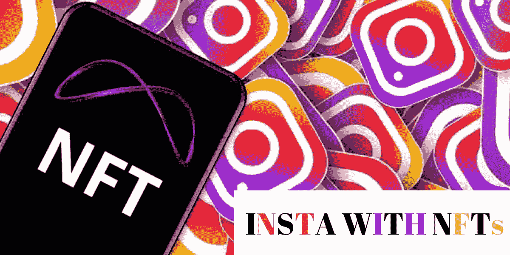
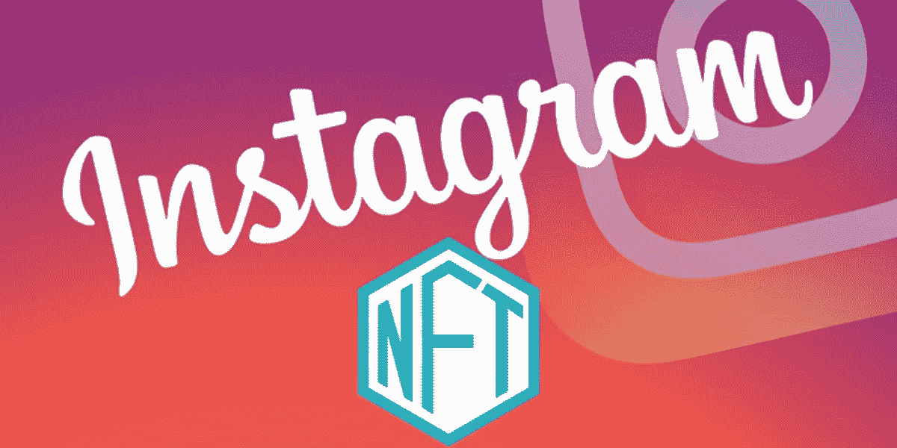
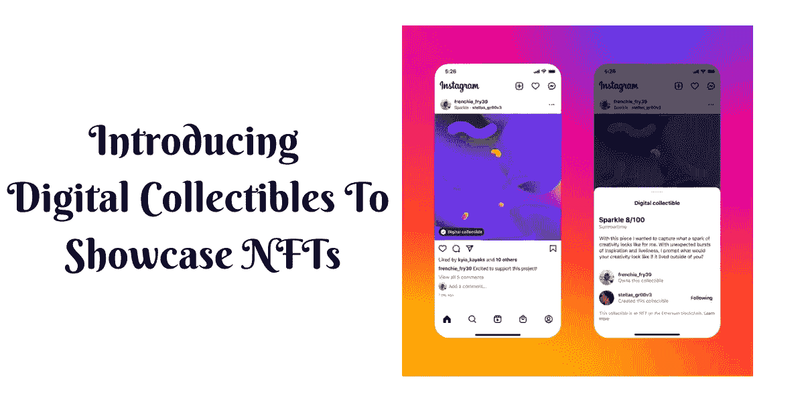

# Instagram 正凭借 NFT 的资产涉足去中心化世界

> 原文：<https://medium.com/geekculture/instagram-is-setting-its-foot-in-decentralized-world-with-nft-assets-5f87bd650330?source=collection_archive---------16----------------------->

**Instagram Jumps On The NFT Bandwagon**

Instagram 是一个巨大的平台，有许多活跃的参与者，如名人、影响者、普通公众等。所有人都在这个平台上从事他们的内容，如图片，gif，视频等。Instagram 因其独特的基于图片的平台方式而变得流行。NFT 是数字世界的最新介绍，它在公众中获得了大量的追随者。这导致了市场上资产数量的增加。通过被引入到各种商业和工业中，NFT 已经扩大了它们的领域。来自 Instagram 的团队宣布，他们正在步入 NFTs 的世界。这将彻底改变社交媒体平台。非功能性交易有能力改变业务结构的场景，并可在 Instagram 平台到达社交媒体网站后，通过**[**【NFT 市场】**](https://www.infiniteblocktech.com/nft-marketplace-development?utm_source=medium&utm_medium=guestblog&utm_campaign=vigneshraju) 跟进。**

# **Instagram 上的 NFTs 介绍**

****

****Instagram With NFTs****

**⁍ Instagram 首席执行官 Adam Mosseri 透露，该网站将开始与一些精选的创作者测试 NFTs。根据 Mosseri 的说法，将不会有与在 Instagram 上上传或分享数字收藏品相关的支付。以太坊和多边形是目前唯一支持在 Instagram 上显示 NFT 的区块链，不久将支持 Flow 和 Solana。Rainbow、MetaMask 和 Trust Wallet 是第三方钱包，将在推出后兼容，比特币基地、Dapper 和 Phantom 将很快推出。**

**⁍·insta gram 发布了一篇博客，详细介绍了即将到来的 NFTs 项目。该博客写道，“我们开始与少数美国创作者和收藏家测试数字收藏品，他们将能够在 Instagram 上分享他们创作或购买的 NFT。一旦创作者或收藏者发布了一个数字收藏品，它将具有闪光效果，并可以显示公共信息，如对 NFT 的描述”。**

**根据 Mosseri 的说法，⁍在 Instagram 上对 NFTs 的支持可能有助于向更广泛的受众推广该技术。Instagram 并不是第一个这样做的网站；Twitter 在一月份发布了六边形的 NFT 图片。一个六边形作为一个符号出现在 NFTs 的 Instagram 帖子的角落。根据华尔街日报上周发表的一份报告，尽管公司和名人很快就加入了 NFT，并且最近的某些交易导致了短暂的活动高峰，但销售额自去年 9 月的高峰以来一直持平。**

**⁍ Instagram 进入 NFT 世界无法避免**[**NFT arts**](https://www.infiniteblocktech.com/nft-art?utm_source=medium&utm_medium=guestblog&utm_campaign=vigneshraju)**，**[**NFT music**](https://www.infiniteblocktech.com/nft-music?utm_source=medium&utm_medium=guestblog&utm_campaign=vigneshraju)**，**[**NFT memes**](https://www.infiniteblocktech.com/nft-marketplace-for-memes?utm_source=medium&utm_medium=guestblog&utm_campaign=vigneshraju)因为 Insta 以这些类型的内容而闻名。所有这些都会随着 NFTs 和社交媒体的结合而改变。****

# ****介绍数字收藏品****

****Instagram 团队已经开始与一些可以在 Instagram 上分享 NFT 的美国创作者和收藏家一起测试数字收藏品。****

********

******Digital Collectibles NFTs — Instagram******

## ****‣数字钱包连接****

****一旦连接上，创作者和收藏者可以从他们的钱包中选择他们想在 Instagram 上分享的 NFT。****

## ****‣共享资产****

****创作者或收藏者发布的数字收藏品将具有闪光效果，并且可以显示公共信息，例如 NFT 的描述。他们的帖子也可以在他们的个人资料上看到。****

## ****‣连接创造者和收藏家****

****对于收藏品和 NFT 资产，可以将资金或加密资产自动记入创建者和收集者的钱包中。****

# ****可以期待什么****

****Instagram 是全球平台，NFT 是全球资产。将两者纳入一个平台将会给 Instagram 的工作方式带来巨大的变化。Instagram 参与者完全使用该平台来创建、分享和查看与图像、视频、gif 等相关的内容。，但目前平台的大背景是内容的所有权缺失。通过将 NFTs 引入 Instagram，用户可以创建包含可靠因素(如所有权)的内容。这将使远离社交媒体平台的交易者和投资者加入 Instagram 的新世界，并通过引入这样一个巨大的想法，使 NFT 市场和社交媒体世界都受益。****