# 在 Linux 虚拟机上安装和配置 OBIEE 12c

> 原文：<https://medium.com/geekculture/install-and-configure-obiee-12c-on-linux-vm-2f31f49ea07c?source=collection_archive---------3----------------------->


今天，我们将在 Linux 虚拟机上安装 Oracle BI 12c。如果你还没有创建一个 Oracle Linux VM，我在这里写了一篇关于如何做这件事的博客。如果你还没有在你的 Linux 虚拟机上安装 Oracle Database 19c，我在这里写了一篇关于如何安装的博客。本博客还假设您可以访问 Oracle Database 19c 预装的样本 HR 数据集。我在上面提到的 Oracle 19c 安装博客中介绍了如何访问它。

在我们开始之前，我只想说祝*和*好运…


# 启动和打开数据库

如果您还没有这样做，请登录到您的 Linux 实例的 GUI。你的屏幕应该是这样的。

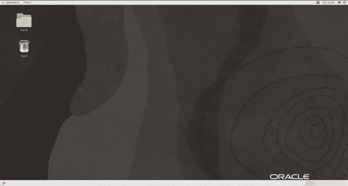

首先，让我们启动监听器并打开数据库。打开一个新的终端窗口，并执行以下命令来启动您的监听器(如果尚未启动的话)。如果已经启动，终端会让你知道。

```
lsnrctl start
```

现在让我们打开我们的容器数据库。在您的终端中，使用以下命令以 SYSDBA 的身份登录到 SQL Plus。

```
sqlplus "/ AS SYSDBA"
```

在 SQL Plus 中，运行以下命令启动数据库。

```
STARTUP FORCE;
```

如果容器数据库尚未打开，请运行以下命令打开它。

```
ALTER PLUGGABLE DATABASE ALL OPEN;
```

如果您尚未连接到 PDB1，请运行以下命令连接到 PD B1。

```
ALTER SESSION SET container=PDB1;
```

# 先决条件安装

太棒了——我们现在可以通过在终端的 SQL Plus shell 中输入 *exit* 来注销 SQL Plus。您的终端屏幕现在应该看起来像这样。

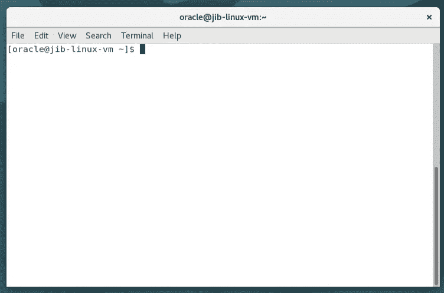

现在让我们安装先决条件。将下面的命令粘贴到您的终端上。

```
sudo yum install oracle-rdbms-server-12cR1-preinstall
```


现在，我们需要按顺序下载并安装以下文件。

1.  Java 开发人员工具包(8) JDK 8
2.  Web 逻辑服务器
3.  Oracle 商业智能 12c (12.21.0.0)

# Java 开发人员工具包(8) JDK 8


如果你成功地完成了我的关于如何在 Linux 上安装 Oracle Database 19c 的教程[，并且在该教程中完成了 SQL Developer 的安装，那么你*应该已经安装了 JDK 8。您可以在终端中使用此命令检查是否运行了 JDK 及其版本。*](https://jaredbach.io/oracle-database-19c-installation-on-linux-e184dde4ce03)

```
java -version
```

如果您已经安装了 JDK8，请跳到第 2 部分。

## **第 1 部分:安装 JDK8**

如果您需要安装 JDK8，请导航到[此页面](https://www.oracle.com/java/technologies/javase/javase-jdk8-downloads.html)为您的机器下载 JDK 8。如果您和我使用同一台机器，在页面上，向下滚动到 Linux x64 RPM 包并下载它。

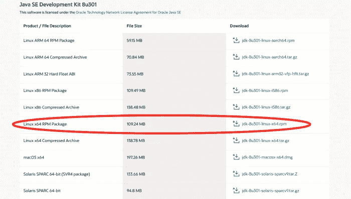

在下载开始之前，系统会提示您登录 Oracle SSO 帐户。成功登录后，系统会询问您是否要使用存档管理器(默认)打开下载文件，或者是否要保存文件。选择“保存文件”，然后点击“确定”记住这个 zip 文件保存的位置。默认情况下，它应该保存在您的下载文件夹中。下载完成后，导航回您的终端，并确保您以 root 用户身份登录。同样，您可以使用以下命令以 root 用户身份登录。

```
sudo su -
```

您的终端屏幕应该是这样的。

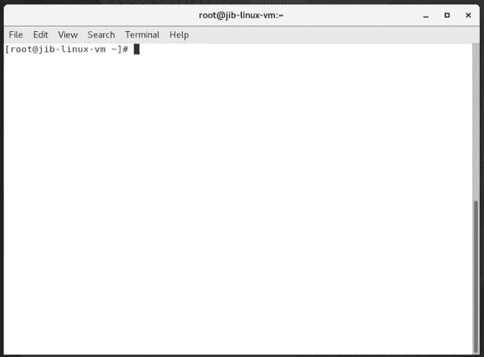

导航到您下载 RPM 的位置。默认情况下，它应该保存在下载文件夹中。使用以下命令导航到下载文件夹。

```
cd /home/oracle/Downloads
```

您的终端现在应该看起来像这样。

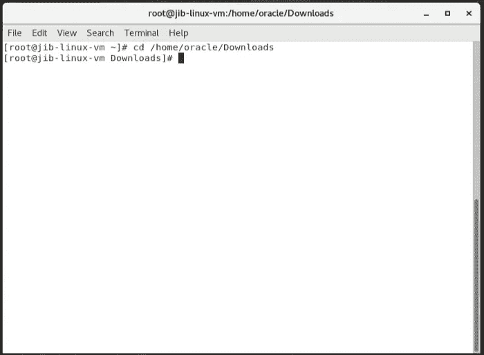

要安装 RPM 包，请运行以下命令。

```
rpm -ivh jdk-8u301-linux-x64.rpm
```

## **第 2 部分:设置 JAVA_HOME 变量**

在您成功安装 JDK8 之后，我们需要设置 JAVA_HOME 变量并将其导出到我们的 path 中。我们可以用这个命令来完成。

```
export JAVA_HOME=/usr/java/jdk1.8.0_301-amd64
export PATH=$JAVA_HOME/bin:$PATH
```

您可以通过在终端中运行以下命令来检查路径设置是否正确

```
echo $JAVA_HOME
```

这将返回我们设置的路径。让我们现在也改变我们的默认 Java 位置。以 root 用户身份将以下命令粘贴到您的终端中。

```
update-alternatives --config java
```

您的终端屏幕应该是这样的。

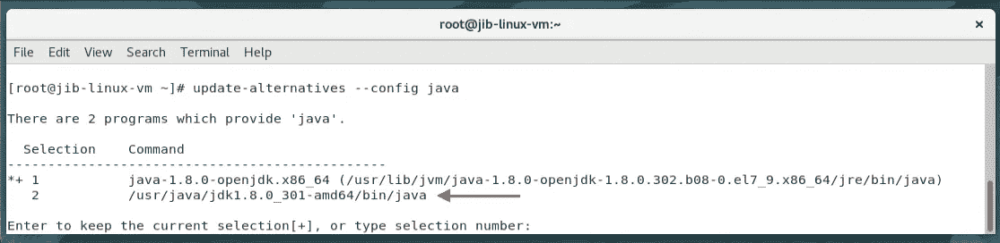

如你所见，我们有两个提供 Java 的程序——默认位置不同于我们刚刚*安装的 Java。我们刚刚安装的是“选择 2”——让我们通过在终端中输入数字 2 来更改选择。当我们启动 Web 逻辑服务器和 OBIEE 时，我们的 Java 现在应该指向正确的位置。*

# Web 逻辑服务器


我们现在需要安装 web 逻辑服务器。这个可以在这里[下载。向下滚动到显示“2。Web 逻辑服务器”，并将通用文件下载到您的虚拟机](https://www.oracle.com/middleware/technologies/business-intelligence-12c-downloads.html)

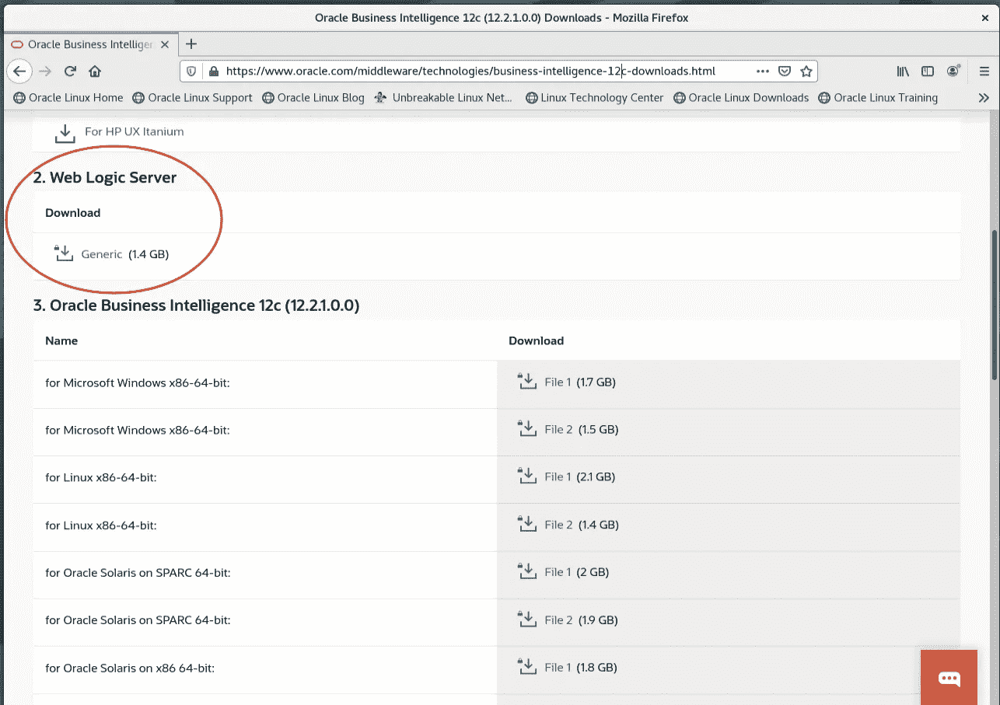

在下载开始之前，系统会提示您登录 Oracle SSO 帐户。成功登录后，系统会询问您是否要使用存档管理器(默认)打开下载文件，或者是否要保存文件。选择“保存文件”，然后点击“确定”记住这个 zip 文件保存的位置。默认情况下，它应该保存在您的下载文件夹中。下载完成后，导航回您的终端。导航到您下载 zip 文件的位置。默认情况下，它应该保存在下载文件夹中。使用以下命令导航到下载文件夹。

```
cd /home/oracle/Downloads
```

您的终端现在应该看起来像这样。

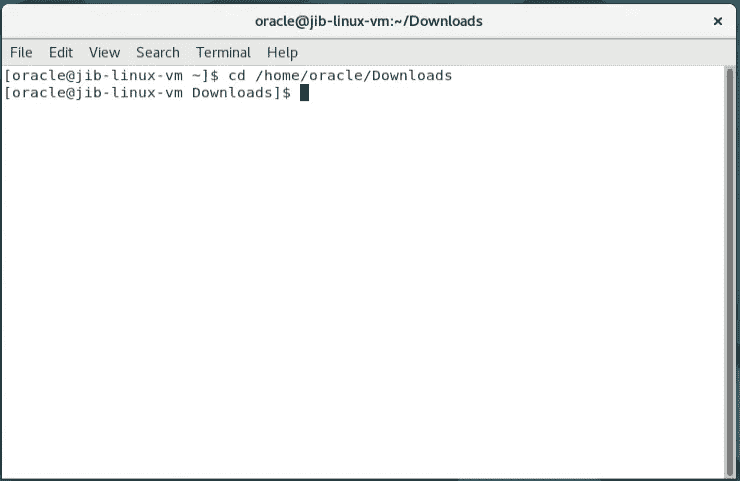

我们现在需要解压缩刚刚下载的 zip 文件。

```
unzip -q fmw_12.2.1.0.0_infrastructure_Disk1_1of1.zip
```

现在让我们运行。我们刚刚解压的 jar 文件。

```
$JAVA_HOME/bin/java -d64 -jar fmw_12.2.1.0.0_infrastructure.jar
```

哦，我弄错了。

```
The OpenJDK JVM is not supported on this platform.
```

让我们试着再运行一次，但是不要使用 JAVA_HOME 变量，让我们写出路径。

```
/usr/java/jdk1.8.0_301-amd64/bin/java -d64 -jar fmw_12.2.1.0.0_infrastructure.jar
```

屏幕上应该会弹出一个针对 Oracle 融合中间件 12c 基础架构的 GUI 向导。让我们浏览一遍。

**更新(2021 年 10 月):**

因此，当然，您仍然可以写出完整的 Java 路径来使其工作——但是，$JAVA_HOME 不能正常工作的原因是因为它不在 bash_profile 中。要解决这个问题，首先用下面的命令打开 bash 概要文件。确保您以 sudo 用户身份登录。

```
vi .bash_profile
```

按 Shift+G 导航到文档的底部。按下键盘上的字母“I”开始编辑文档。在文档的底部，粘贴这些代码行。

```
export JAVA_HOME=/usr/java/jdk1.8.0_301-amd64
export PATH=$JAVA_HOME/bin:$PATH
export PATH
```

bash_profile 现在应该是这样的。

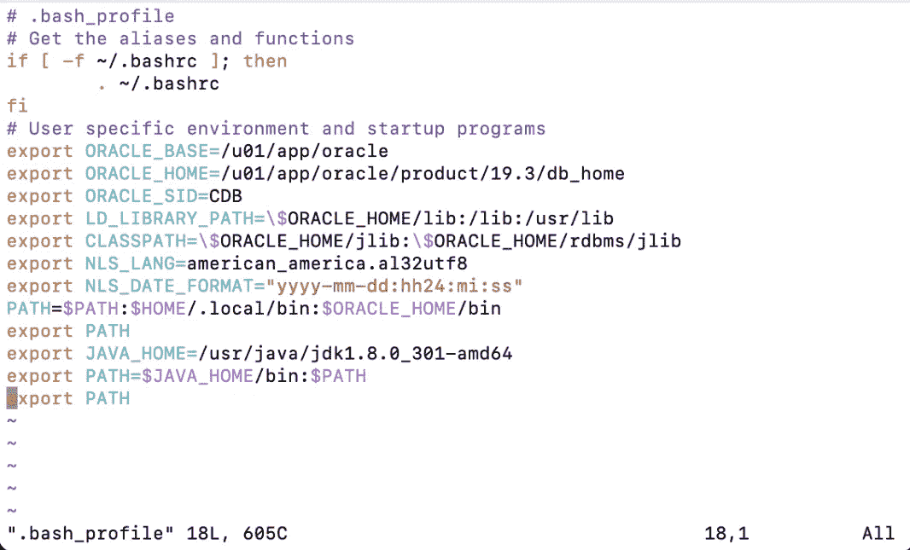

完成后，按 ESC 键，向下滚动到文档的底部，键入以下文本。然后，按回车键。

```
:wq
```

这个序列将保存文件并退出编辑器。我们现在需要导出 bash 概要文件。我们可以用下面的命令做到这一点。

```
. .bash_profile
```

$JAVA_HOME 变量应该能够被正确调用。

**第一步:欢迎**

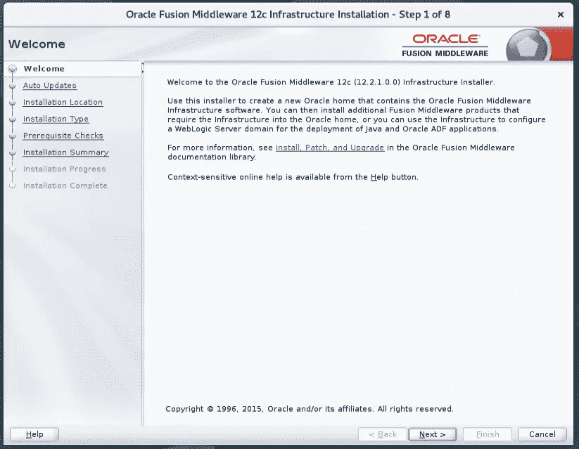

Click “Next”

## **第二步:自动更新**

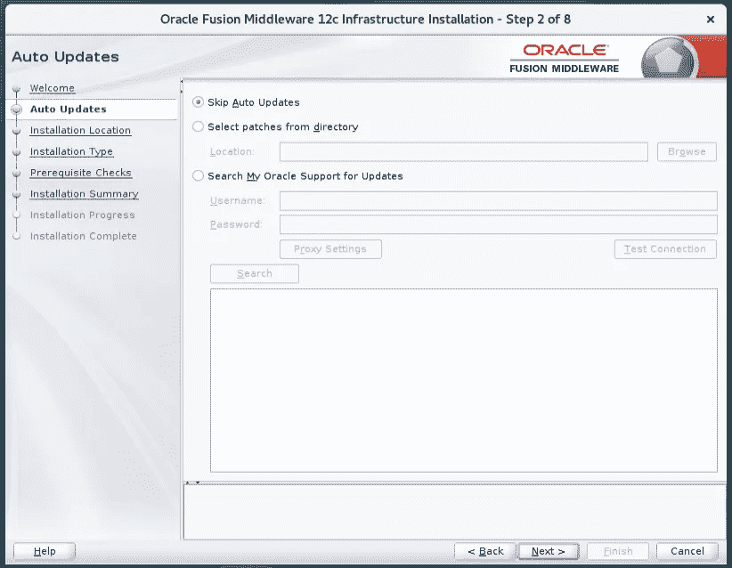

Click “Next” to skip auto updates

## **第三步:安装位置**

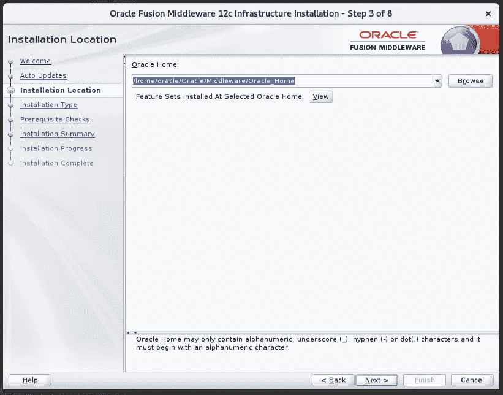

Click “Next”

记下 Oracle 主目录，如下所示。

```
/home/oracle/Oracle/Middleware/Oracle_Home
```

## **步骤 4:安装类型**

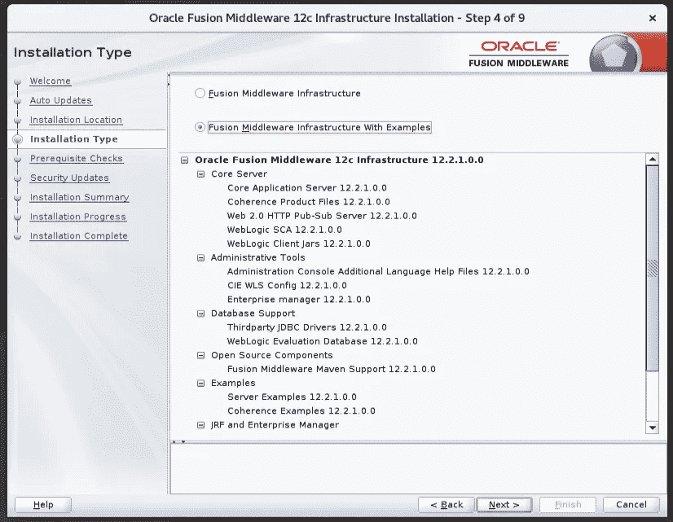

Select “Fusion Middleware infrastructure With Examples” if you are keen on playing with them. Then, click “Next”

## **步骤 5:先决条件检查**

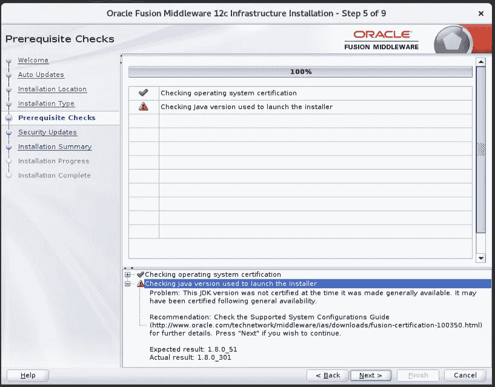

Uh oh — I got a warning. I am going to ignore it. Click “Next”

## **第 6 步:安全更新**

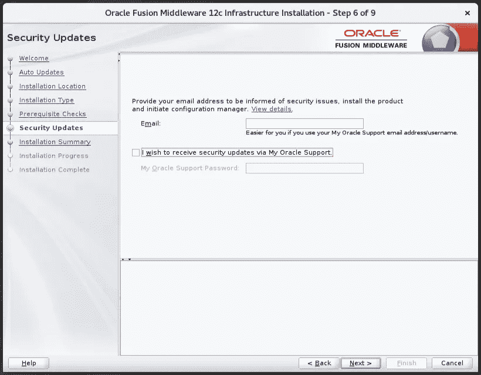

Uncheck the highlighted box and click “Next”

如果您看到下面的弹出窗口，只需单击“是”继续安装过程。

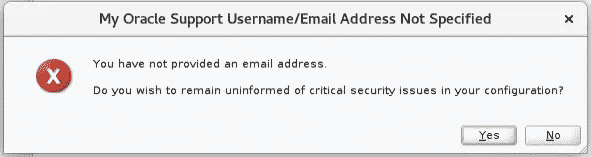

## **步骤 7:安装总结**

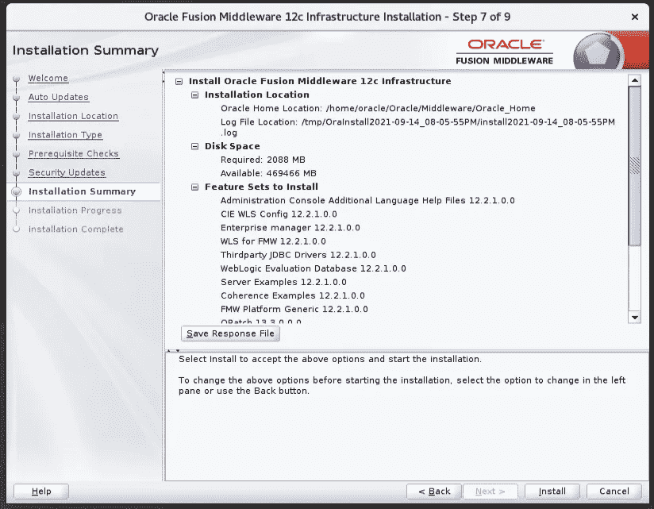

Click “Install” to proceed with the installation process

## **步骤 8:安装进度**

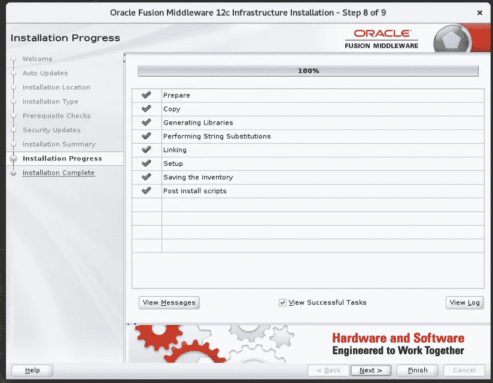

Once the installation reached 100%, click “Next”

## 步骤 9:安装完成

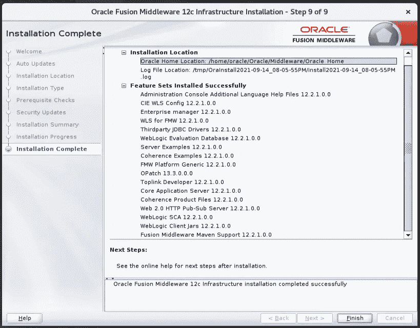

Click “Finish”

Oracle 融合中间件基础设施 12c 现已安装。现在让我们来看看 OBIEE 装置。

# Oracle 商业智能 12c (12.21.0.0)


我们现在需要下载并安装 OBIEE。这个可以在这里[下载。向下滚动到显示“3。Oracle Business Intelligence 12c(12 . 21 . 0 . 0)”并下载“用于 Linux-x86–64 位”文件 1 *和*文件 2。](https://www.oracle.com/middleware/technologies/business-intelligence-12c-downloads.html)

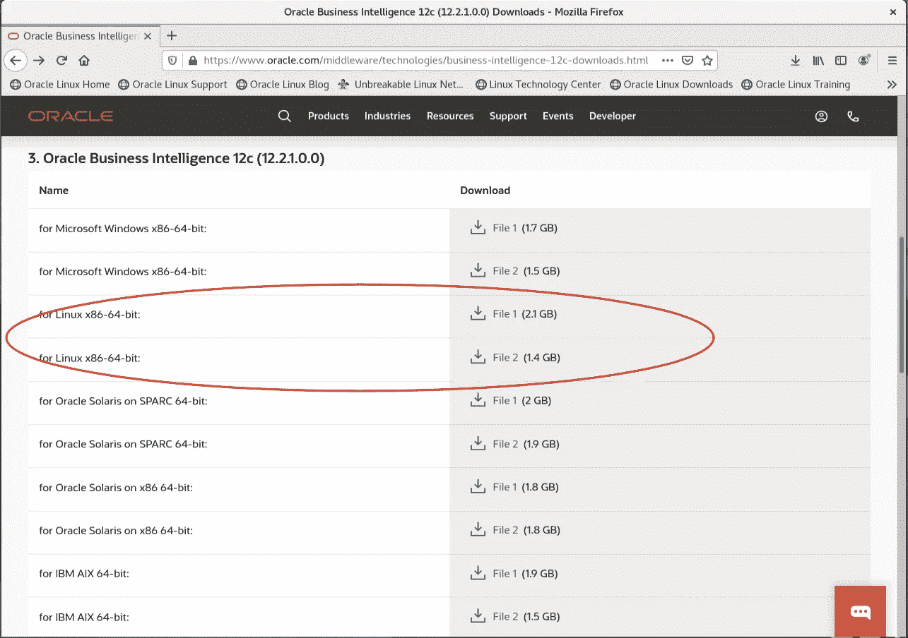

在下载开始之前，系统会提示您登录 Oracle SSO 帐户。成功登录后，系统会询问您是否要使用存档管理器(默认)打开下载文件，或者是否要保存文件。选择“保存文件”，然后点击“确定”记住这个 zip 文件保存的位置。默认情况下，它应该保存在您的下载文件夹中。下载完成后，导航回您的终端。导航到您下载 zip 文件的位置。默认情况下，它应该保存在下载文件夹中。使用以下命令导航到下载文件夹。

```
cd /home/oracle/Downloads
```

您的终端现在应该看起来像这样。


让我们用 *ls* 命令来查看下载文件夹的内容。

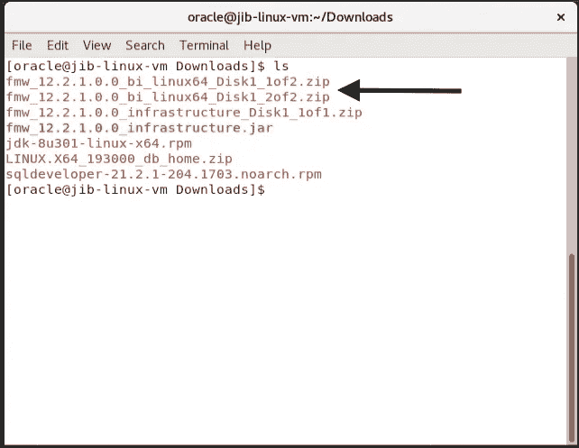

我们需要将*fmw _ 12 . 2 . 1 . 0 . 0 _ bi _ Linux 64 _ disk 1 _ 1of 2 . zip*和*fmw _ 12 . 2 . 1 . 0 . 0 _ bi _ Linux 64 _ disk 1 _ 2of 2 . zip*移动到我们安装 web 逻辑服务器的 Oracle_Home 目录中。这是我们系统上的 Oracle_Home 目录。

```
/home/oracle/Oracle/Middleware/Oracle_Home
```

我们可以用这两个命令将这两个 zip 文件移动到 Oracle_Home 目录。

```
mv fmw_12.2.1.0.0_bi_linux64_Disk1_1of2.zip /home/oracle/Oracle/Middleware/Oracle_Homemv fmw_12.2.1.0.0_bi_linux64_Disk1_2of2.zip /home/oracle/Oracle/Middleware/Oracle_Home
```

现在让我们切换到刚才移动这些文件的目录。

```
cd /home/oracle/Oracle/Middleware/Oracle_Home
```

让我们用 *ls* 命令查看这个目录的内容。您的终端应该是这样的。

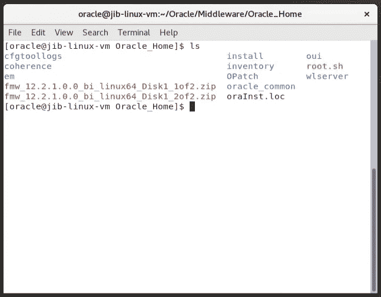

太酷了——看起来它起作用了。我们现在需要解压缩刚刚下载的 zip 文件。我们可以用下面的两个命令来实现。

```
unzip -q fmw_12.2.1.0.0_bi_linux64_Disk1_1of2.zip
unzip -q fmw_12.2.1.0.0_bi_linux64_Disk1_2of2.zip
```

让我们用 *ls* 命令再次查看这个目录的内容，这样我们就可以解压缩文件了。您的终端应该是这样的。

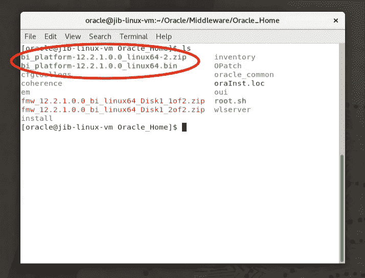

我看到两个新文件。我在下面列出了它们，并在终端的上面用红色圈出了它们。

```
bi_platform-12.2.1.0.0_linux64–2.zip
bi_platform-12.2.1.0.0_linux64.bin
```

要启动 OBIEE 安装，请在终端的当前目录下运行以下命令。

```
./bi_platform-12.2.1.0.0_linux64.bin
```

屏幕上将弹出一个 Oracle Business Intelligence 12c 的 GUI 向导。让我们浏览一遍。

## **第一步:欢迎**

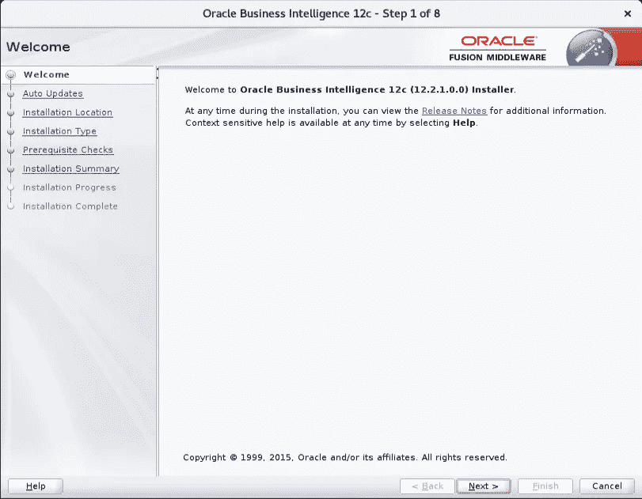

Click “Next”

## **第二步:自动更新**


Click “Next” to skip auto updates

## **第三步:安装位置**

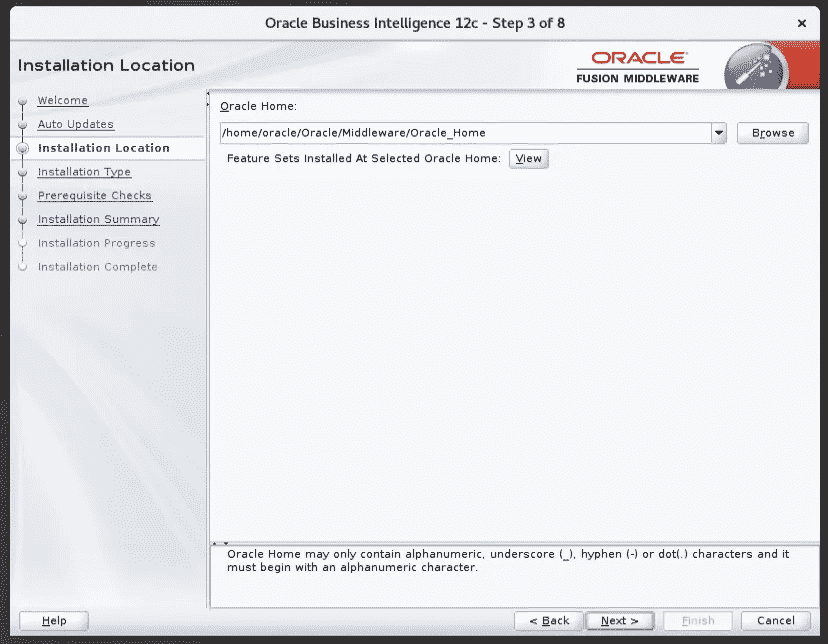

将我们在 Web Logic Server 安装的步骤 3 中使用的 Oracle_Home 目录放在这里。再次参考一下，Oracle_Home 目录如下。

```
/home/oracle/Oracle/Middleware/Oracle_Home
```

输入 Oracle_Home 目录后，单击“下一步”

## **第四步:安装类型**

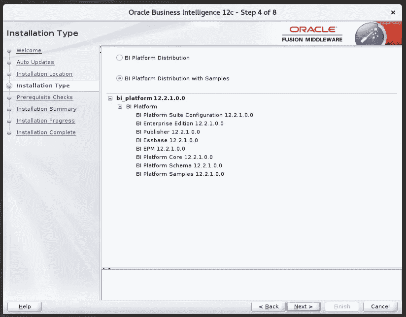

Select “BI Platform Distribution with Samples” and then click “Next”

## **步骤 5:** 先决条件检查


Click “Next”

## **第六步:安装总结**

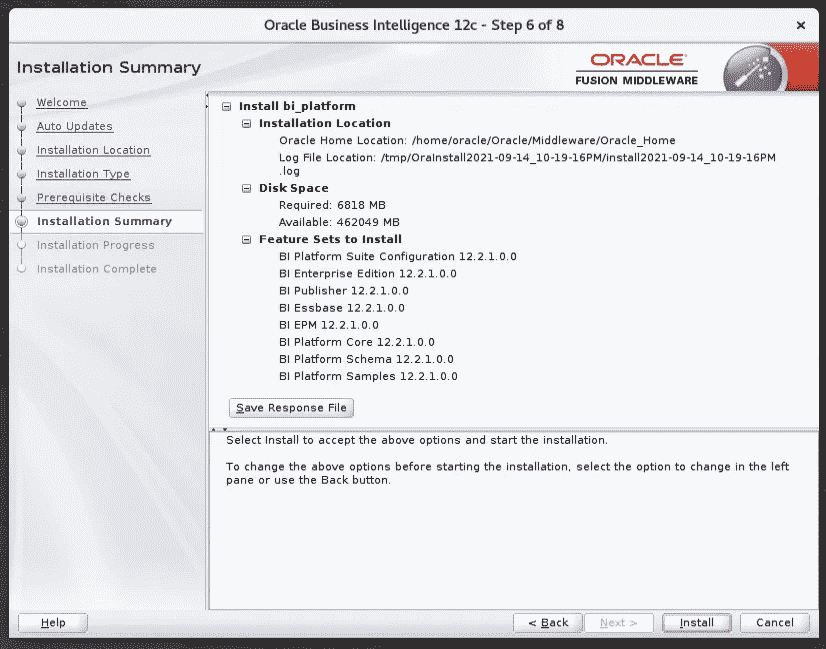

Click “Install”

## **第七步:安装进度**

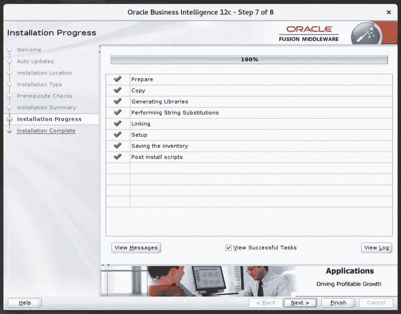

Click “Next”

## **步骤 8:安装完成**


Click “Finish”

我们已经成功安装了软件，但是我们还没有完成。我们需要创建一个可以访问容器数据库的存储库，在我之前的博客中，我们一直在用[进行工作。然而，要做到这一点，我们需要一个拥有 *SYS* 权限和创建会话权限的用户。如果您已经有一个拥有这些权限的用户，那太好了。如果没有，我们一起来创造一个。](https://jaredbach.io/oracle-database-19c-installation-on-linux-e184dde4ce03)

# 创建具有 sys 和 create session 权限的用户


在您的终端中运行以下命令，以一个 *SYS* 用户的身份登录到 SQL Plus。

```
sqlplus "/ AS SYSDBA"
```

运行下面的命令打开我们的容器数据库，如果它还没有打开的话。

```
ALTER PLUGGABLE DATABASE ALL OPEN;
```

如果您尚未连接，请运行以下命令连接到 PDB1。

```
ALTER SESSION SET container=PDB1;
```

我们现在要用 SQL Plus 编写一个查询，为我们的容器数据库创建一个新用户。语法将如下所示

```
CREATE USER user_name IDENTIFIED BY some_password;
```

我将把我的用户命名为 *jib* ，然后输入一个密码。完成此操作后，您的终端应该如下所示。我覆盖了我的密码。把你的密码放在安全的地方。

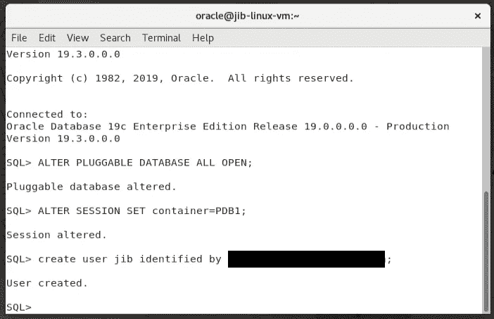

我们现在将授予 *jib* SYSDBA 权限。我们可以用下面的语法做到这一点。当然，在我的例子中，我会用 *jib* 替换 user_name。

```
GRANT SYSDBA TO user_name;
```

我们现在还将授予 *jib* 创建会话的权限。我们可以用下面的语法做到这一点。同样，当然，在我的例子中，我将用 *jib* 替换 user_name。

```
GRANT CREATE SESSION TO user_name;
```

一旦您成功地完成了这一步，您就可以开始创建存储库了。使用 *exit* 命令退出 SQL Plus，返回终端。

# 知识库创建


在您的终端中，将您的目录更改为以下内容。这是存储库创建实用程序(RCU)的地方。

```
cd /home/oracle/Oracle/Middleware/Oracle_Home/oracle_common/bin
```

让我们用 *ls* 命令查看这个目录的内容。您的终端应该是这样的。

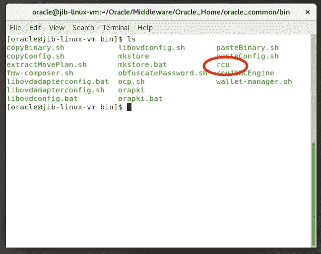

我们需要启动上面用红色圈出的 RCU，以启动 RCU 向导，这将允许我们创建一个存储库。在终端中运行以下命令启动 RCU。

```
./rcu
```

屏幕上会弹出一个 RCU 的 GUI 向导。让我们浏览一遍。

## **第一步:欢迎**

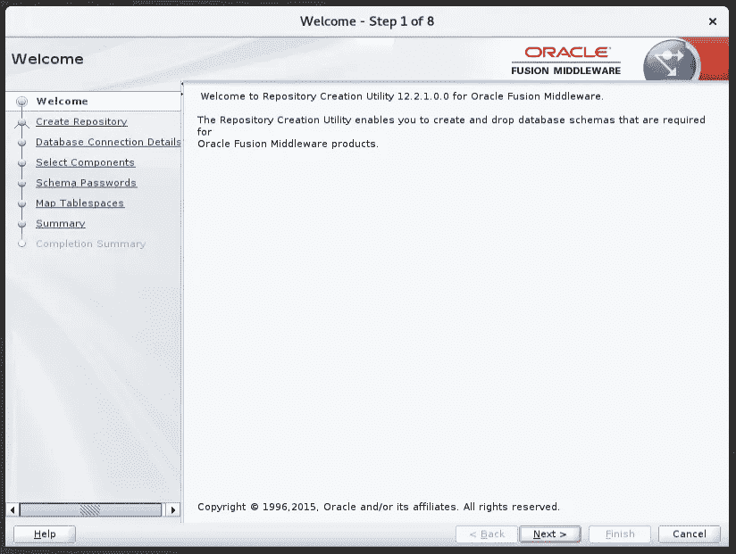

Click “Next”

## **步骤 2:创建存储库**

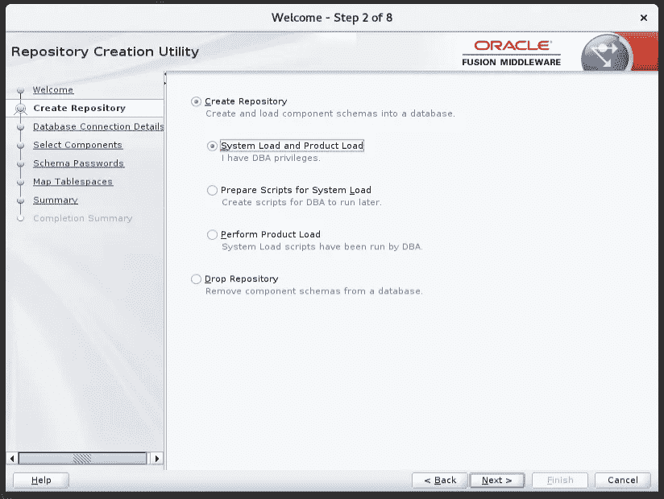

Click “Next”

## **第三步:数据库连接详情**

下一个窗口将是这样的。

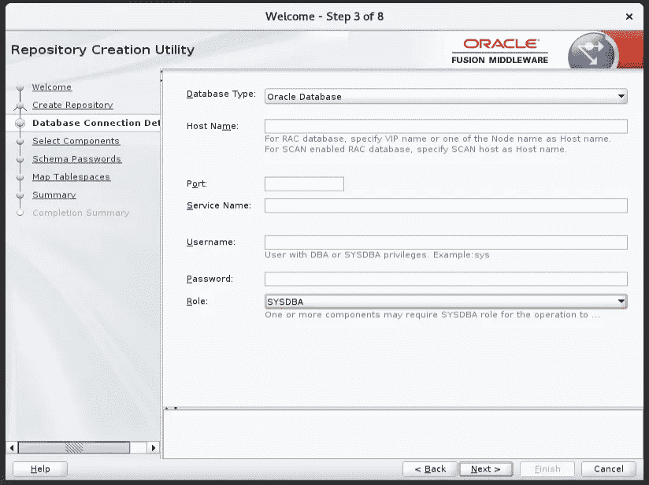

我们将连接到我在[上一篇博文](https://jaredbach.io/oracle-database-19c-installation-on-linux-e184dde4ce03)中在 SQL Developer 和 SQL Plus 中解锁并接入的容器数据库。使用以下标准填写向导中的框:

*   **主机名:** *本地主机*
*   **端口:**1521
*   **服务名称:** *PDB1*
*   **用户名:** *你的 _ 用户名*
*   **密码:** *你的 _ 密码*
*   **角色:**SYSDBA

请记住，对于用户名和密码，您将使用我们刚刚在上一步中创建的用户名和密码。对我来说，我将使用用户 *jib。窗口现在应该看起来像这样。*

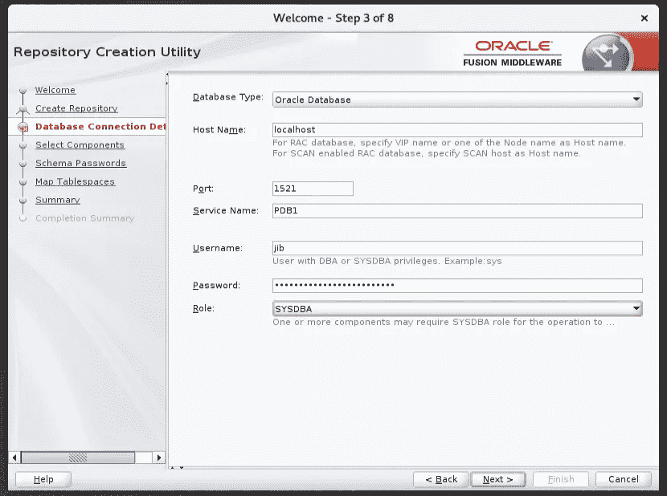

Click “Next”

如果您在单击“下一步”后收到以下错误，只需单击“忽略”

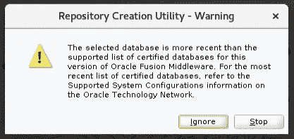

当您看到下面的“操作完成”窗口时，单击“确定”。

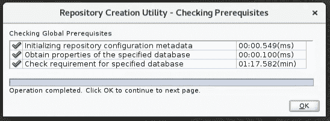

如果您在连接数据库时遇到问题，不要惊慌。


遵循下面的故障排除步骤。

## **1。启动监听器**

停止监听器，然后在新的终端选项卡中使用此命令重新启动它。

```
lsnrctl stop
lsnrctl start
```

## **2。打开并连接到 PDB1**

打开一个新的终端选项卡，并使用以下命令启动一个新的 SQL Plus 会话。

```
sqlplus "/ AS SYSDBA"
```

登录到 SQL Plus 后，运行此命令关闭并重新启动数据库。

```
SHUTDOWN;
STARTUP FORCE;
```

然后，运行下面的命令打开容器数据库。

```
ALTER PLUGGABLE DATABASE ALL OPEN;
```

运行以下命令连接到 PDB1。

```
ALTER SESSION SET container=PDB1;
```

完成这些步骤后，单击向导中的“下一步”并尝试再次连接到容器数据库。

## **第四步:选择组件**

选中“Oracle 作为存储库组件”旁边的框这将为您选择它下面的所有其他框。然后点击“下一步”

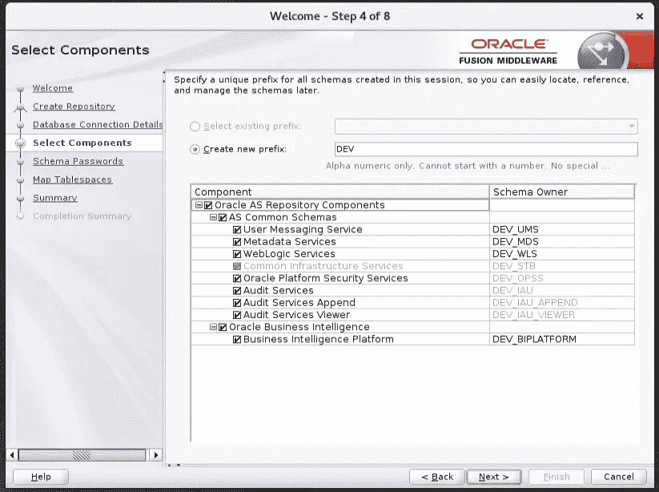

Click “Next”

当您看到下面的“操作完成”窗口时，单击“确定”。

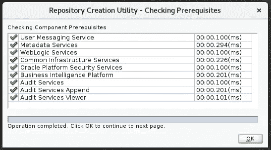

## **第五步:模式密码**

输入用于访问模式的密码。把你的密码放在安全的地方。单击“下一步”继续。

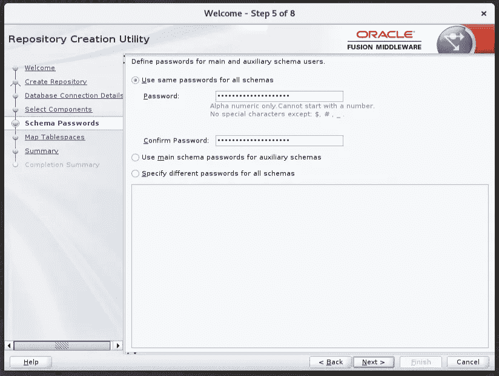

Click “Next”

## **步骤 6:映射表空间**

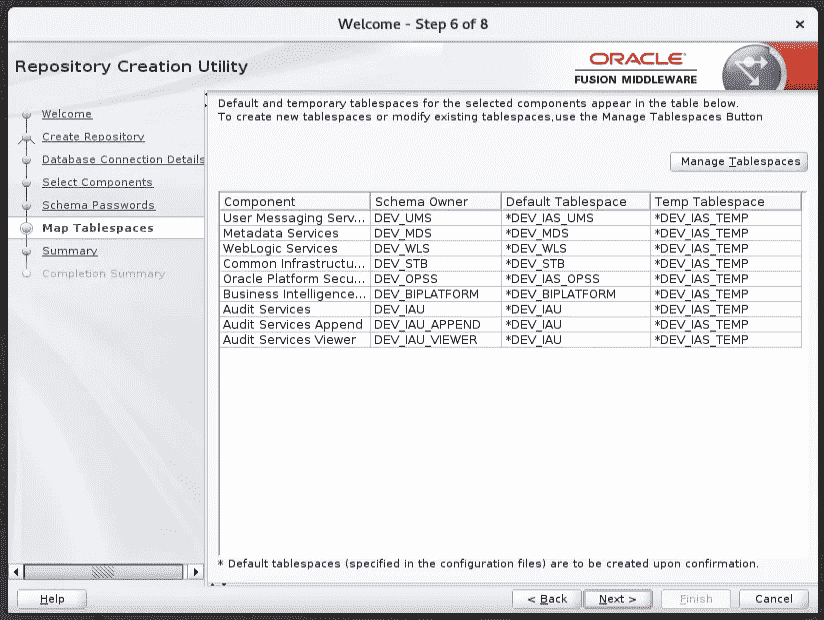

Click “Next”

如果您看到如下所示的弹出窗口，请单击“确定”

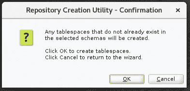

当您看到下面的“操作完成”窗口时，单击“确定”。

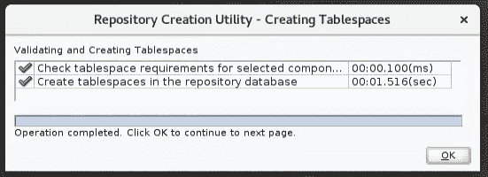

## **第七步:总结**

耐心点——这个需要很长时间才能完成。

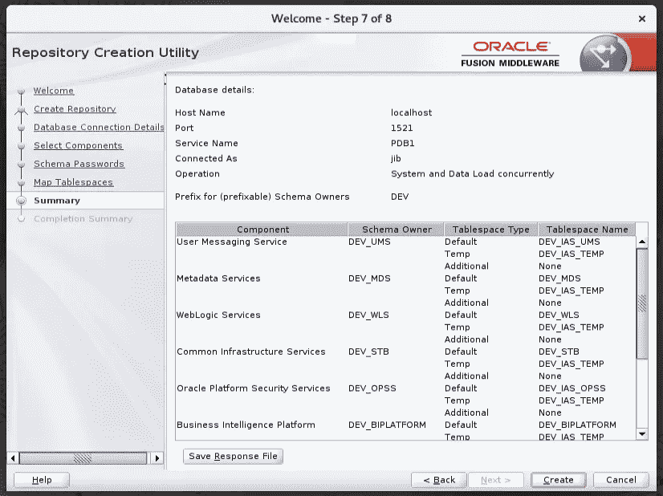

Click “Create”

## **第 8 步:完成总结**


Click “Close”

我们现在已经成功创建了一个存储库。现在是时候配置 OBIEE 12c 了。

# 配置 OBIEE 12c


导航到下面的目录。这是我们在本教程的大部分时间里一直在使用的目录。

```
cd /home/oracle/Oracle/Middleware/Oracle_Home
```

然后，我们希望导航到 bi/bin。我们可以用下面的命令做到这一点。

```
cd bi/bin
```

让我们用 *ls* 命令查看这个目录的内容。您的终端应该是这样的。

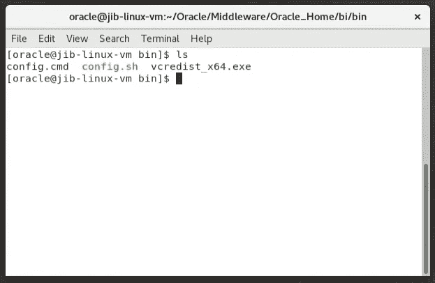

要配置 OBIEE 12c，我们需要运行 config.sh。

```
./config.sh
```

OBIEE 的 GUI 向导应该会在您的屏幕上弹出。让我们浏览一遍。

## **第一步:欢迎**

选择“商业智能企业版”您可以取消选择“Essbase”和“商业智能发布者”

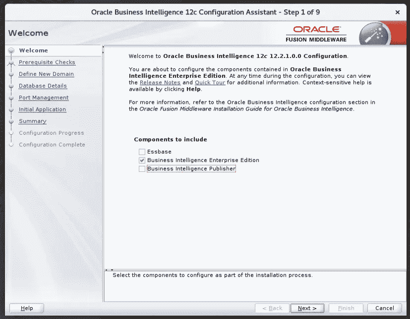

Click “Next”

## **步骤 2:先决条件检查**

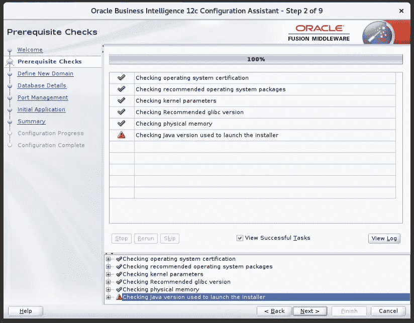

Uh oh — I got a warning. I am going to ignore it. Click “Next”

## **第三步:定义域**

输入您将用于访问 BI 域的密码。把你的密码放在安全的地方。单击“下一步”继续。

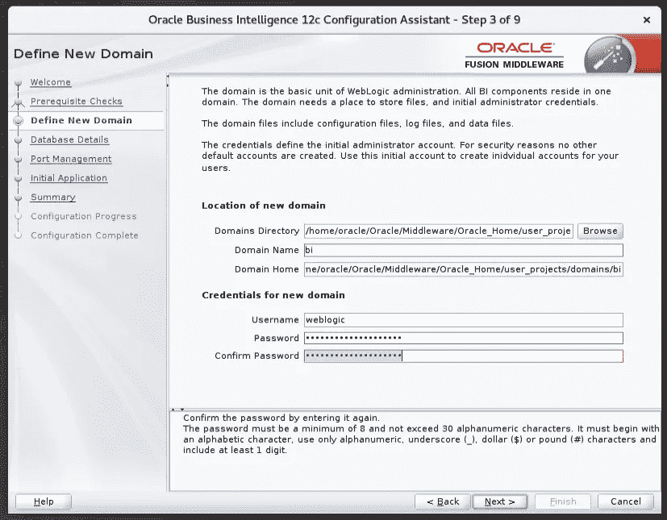

Click “Next”

作为将来的参考，这是域主目录。

```
/home/oracle/Oracle/Middleware/Oracle_Home/user_projects/domains/bi
```

## **第四步:数据库详情**

下一个窗口将是这样的。

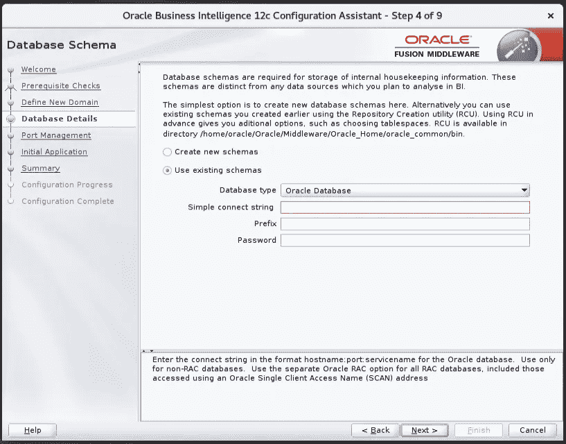

存储库模式是使用 RCU 创建的，因此单击“使用现有模式”。使用以下标准填写此窗口:

*   **简单字符串连接:** *主机名:端口:服务名即* *本地主机:1521:PDB1*
*   **前缀:**DEV
*   **密码:** *这是我们在上一步*中为模式创建的密码

窗口现在应该看起来像这样。

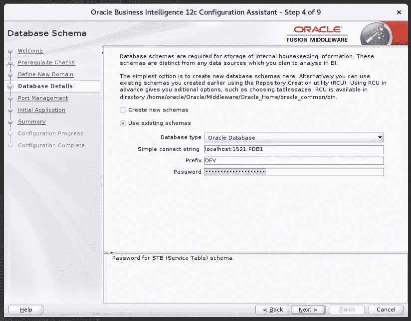

Click “Next”

哦，我弄错了。让我们试着解决这个问题。

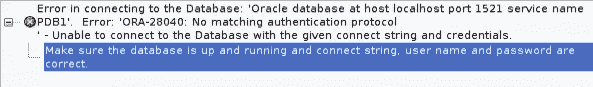

Error ORA-28040

经过一些研究，我了解到我们需要设置连接 Oracle 数据库实例时允许的最低身份验证协议。通过创建和编辑 sqlnet.ora 文件，我们可以很容易地解决这个问题。在我们执行此操作之前，如果您尚未设置密码，请为 *SYS* 用户设置一个密码。如果您已经这样做了，请转到步骤 2。

## **第一步:为*系统*用户**创建一个密码

使用以下命令启动一个新的 SQL Plus 会话。

```
sqlplus "/ AS SYSDBA"
```

使用以下命令更改 *SYS* 用户的密码。

```
ALTER USER SYS IDENTIFIED BY some_password;
```

您的终端应该是这样的。我覆盖了我的密码。把你的密码放在安全的地方。

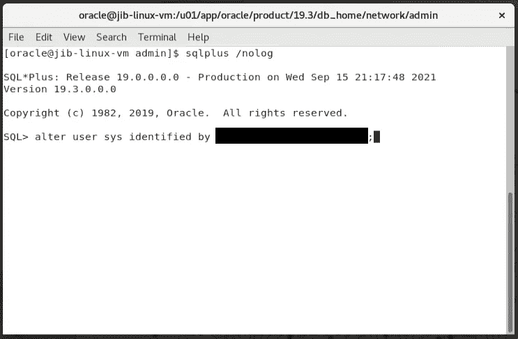

我们现在可以用 *exit* 命令退出 SQL Plus。

## **步骤 2:创建并配置 sqlnet.ora 文件**

让我们回到我们的终端，并导航到以下路径。

```
cd $ORACLE_HOME/network/admin
```

让我们用 *ls* 命令查看这个目录的内容。您的终端应该是这样的。

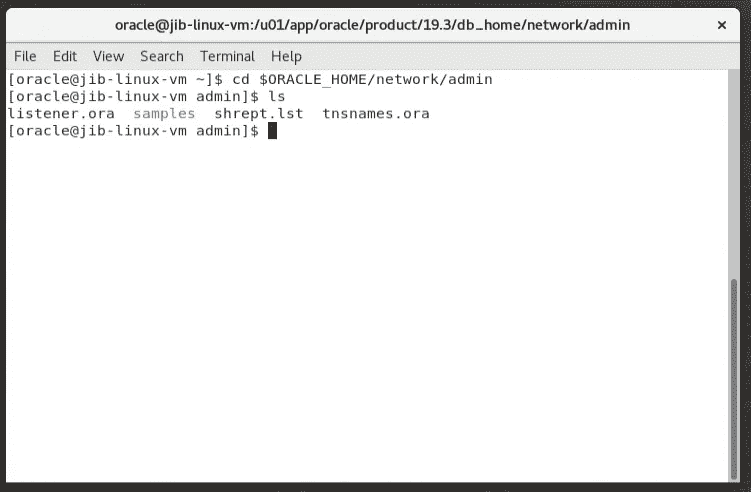

我没有看到 sqlnet.ora 文件—不要担心，我们将创建一个。在我们这样做之前，让我们停止监听器。

```
lsnrctl stop
```

现在，让我们使用以下命令创建并配置一个新的 sqlnet.ora 文件。

```
vi sqlnet.ora
```

按下键盘上的字母“I”开始编辑文档。将以下文本添加到文档中。

```
SQLNET.AUTHENTICATION_SERVICES= (NTS)
SQLNET.ALLOWED_LOGON_VERSION_CLIENT=8
SQLNET.ALLOWED_LOGON_VERSION_SERVER=8
SQLNET.ALLOWED_LOGON_VERSION=8
NAMES.DIRECTORY_PATH= (TNSNAMES, EZCONNECT)
```

完成此任务后，点击 ESC 按钮，向下滚动到文档底部，键入以下文本。然后，按回车键。

```
:wq
```

这个序列将保存文件并退出编辑器。现在让我们用下面的命令重新启动监听器。

```
lsnrctl start
```

我们现在需要重新登录到 SQL Plus。使用下面的命令重新登录到 SQL Plus。您可以使用/nolog 参数来启动无连接会话。

```
sqlplus /nolog
```

SQL Plus 启动后，我们可以使用 connect 命令连接到数据库。在 SQL Plus 中运行下面的命令，并将变量 *your_password* 替换为您为 SYS 用户设置的密码。

```
CONN SYS/your_password AS SYSDBA;
```

运行此命令关闭并重新启动数据库。

```
SHUTDOWN;
STARTUP FORCE;
```

如果容器数据库尚未打开，请运行以下命令打开它。

```
ALTER PLUGGABLE DATABASE ALL OPEN;
```

如果您尚未连接到 PDB1，请运行以下命令连接到 PD B1。

```
ALTER SESSION SET container=PDB1;
```

让我们尝试在向导中再次连接到我们的数据库……该死——我仍然得到一个错误。如果要我猜的话，我不喜欢我之前为我们现在尝试连接的模式创建的 *jib* 用户。

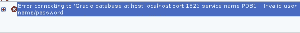

*Sigh* — another error

让我们尝试通过单击“创建新模式”来创建一个新模式不使用 *jib* 用户来创建这个新模式，让我们使用 *SYS* 用户，我们刚刚*给它分配了一个密码。窗口现在应该看起来像这样。*

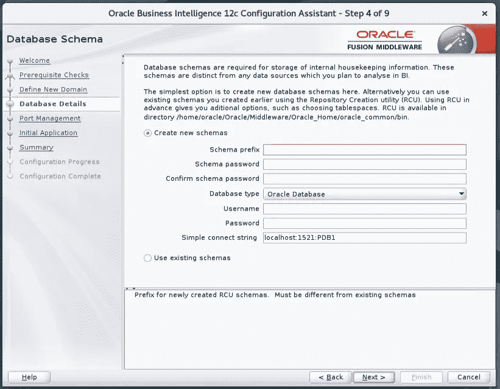

使用以下标准填写此窗口:

*   **前缀:** *DEV1(这需要不同于我们已经创建的模式中的前缀)*
*   **模式密码:** *您可以使用我们之前创建的模式中的相同密码，也可以创建一个新密码—将其存储在安全的地方*
*   **确认模式密码:** *输入您在上面*中输入的相同密码
*   **数据库类型:**Oracle 数据库
*   **简单字符串连接:** *主机名:端口:服务名即* *本地主机:1521:PDB1*
*   **用户名:** *系统*
*   **密码:**your _ sys _ Password

记得使用与我们刚刚*设置的 *SYS* 账户相关的密码。窗口现在应该看起来像这样。*

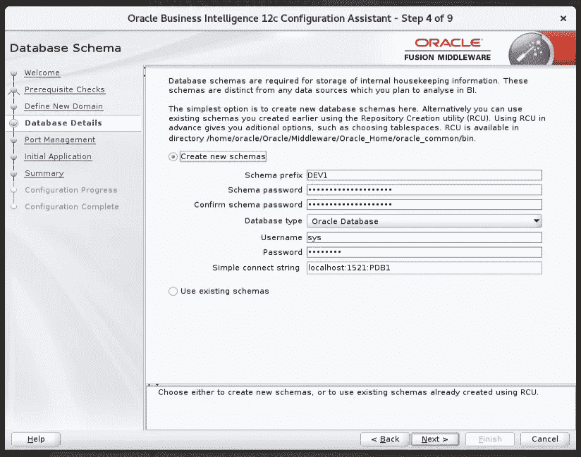

唉——我让它工作了。如果你得到了我在尝试连接时得到的“无效用户名/密码”错误，回到 SQL Plus 并再次更改你的 *SYS* 密码——也许，你还应该创建一个密码，你将能够容易地输入到密码框中，而不会出现输入错误。然后，关闭数据库并重新启动它。我不确定到底是什么原因导致了这个问题，但这肯定是一个比许多人都会遇到的更常见的问题。让我们在向导中继续。

## **第五步:端口管理**

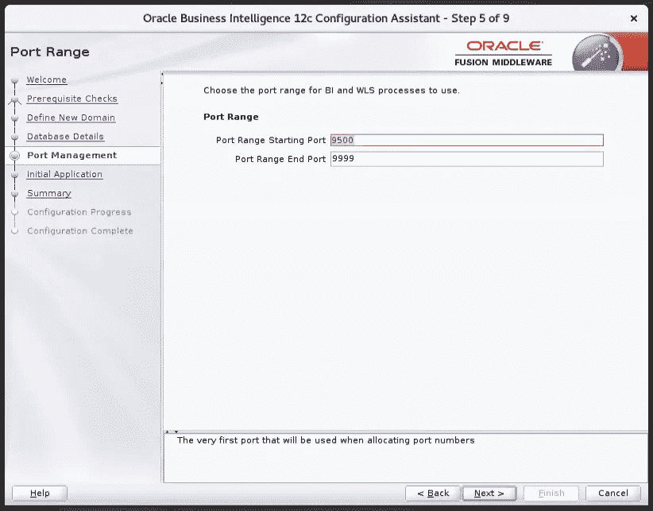

Click “Next”

## **第六步:初始申请**

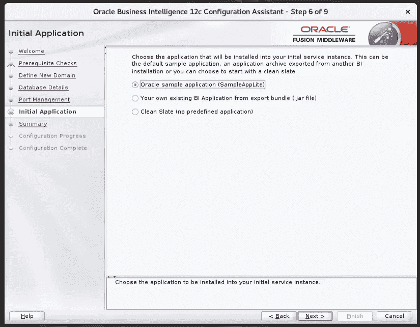

Click “Next”

## **第七步:总结**

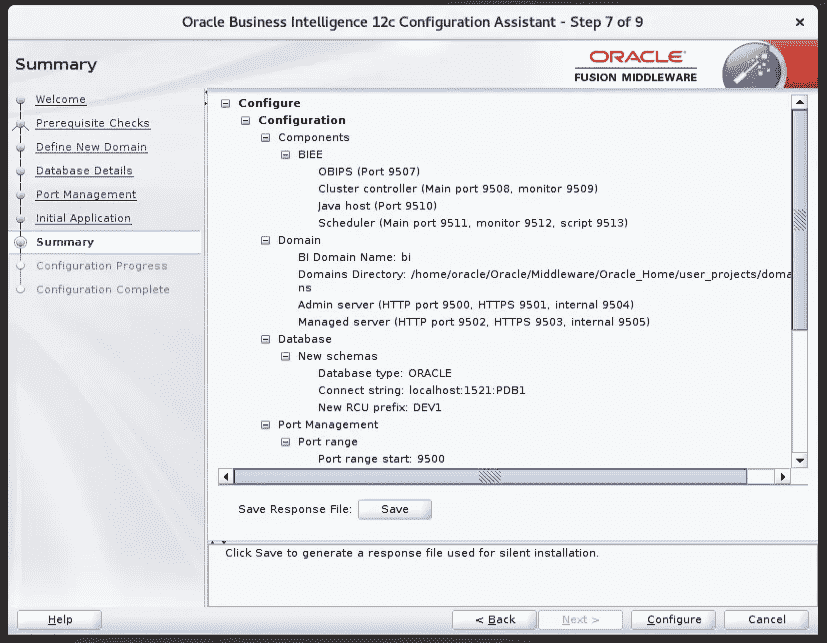

Click “Configure”

## **步骤 8:配置进度**

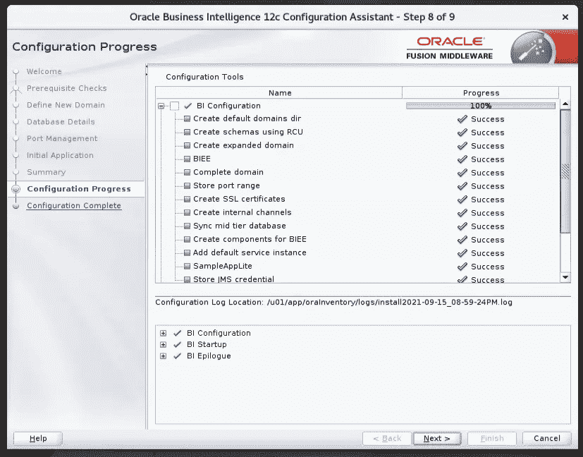

Click “Next”

## **第九步:配置完成**

在下面显示“保存此页面”的地方，点击*保存*。以后有这个做参考就好了。准备好后，点击“完成”

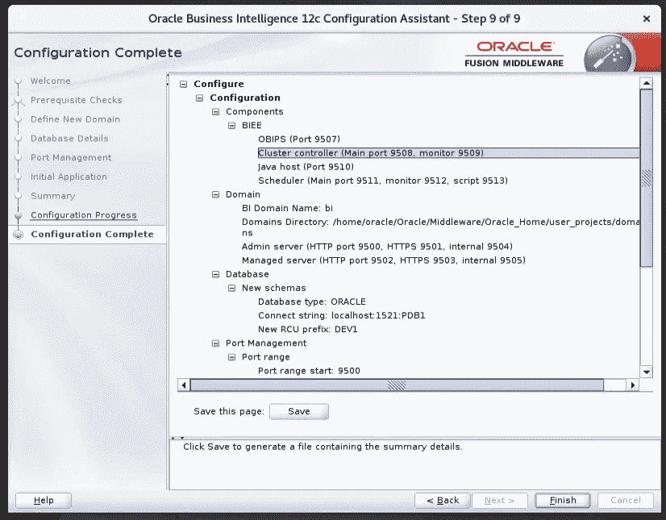

Click “Finish”

据称，在你点击“完成”后，浏览器窗口应该会打开 OBIEE 登录页面——但这并没有发生在我身上。让我们手动启动 OBIEE。打开您的浏览器并打开此 URL。

```
http://localhost:9502/analytics/saw.dll?bieehome&startPage=1
```

您应该会看到类似这样的网页—使用您的 weblogic 用户名和密码登录。

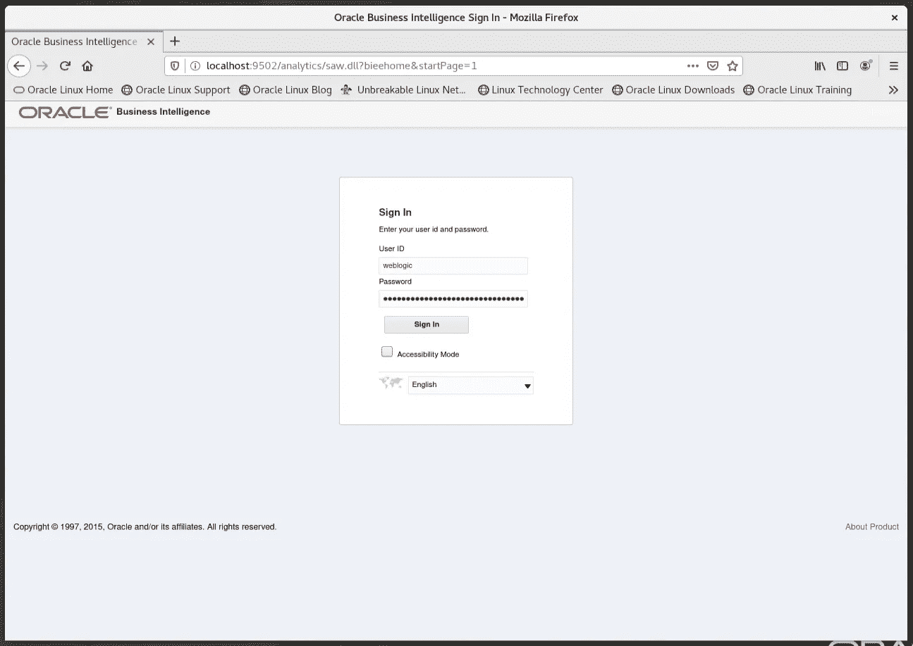

哦，天哪——成功了。

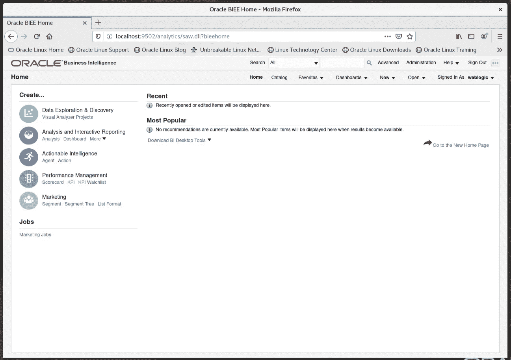

我太高兴了。在我结束之前的最后一件事——让我们来谈谈在计算机重新启动之前和之后应该做些什么。


首先，导航到以下目录。

```
cd /home/oracle/Oracle/Middleware/Oracle_Home/user_projects/domains/bi/bitools/bin
```

接下来，运行这个脚本来启动 OBIEE。

```
./start.sh
```

要关闭 OBIEE，请在同一个目录中运行这个脚本。

```
./stop.sh
```

要检查 OBIEE 的状态，请在同一个目录中运行这个脚本。

```
./status.sh
```