# 在 Windows 虚拟机上安装和配置 OBIEE 12c

> 原文：<https://medium.com/geekculture/install-and-configure-obiee-12c-on-windows-vm-1c5487ddbaeb?source=collection_archive---------3----------------------->

如果您已经在 Windows 虚拟机上安装了 Oracle Database 19c，那么恭喜您。对许多人来说，这是一项艰巨而乏味的任务。这是一项值得庆祝的成就。然而，我们还没有完成。我们仍然需要在 Windows 虚拟机上安装 Oracle BI 12c。

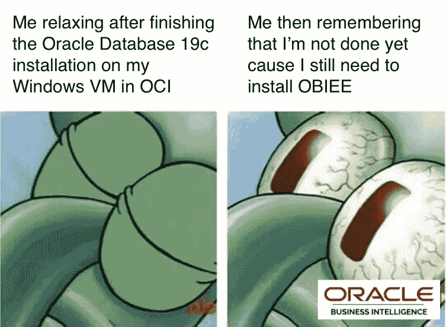

今天，我们将在 Windows 虚拟机上安装 Oracle BI 12c。如果您还没有创建 Oracle Windows VM，我在这里写了一篇关于如何做这件事的博客[。如果你还没有在你的 Windows 虚拟机上安装 Oracle Database 19c，我在这里写了一篇博客](https://jaredbach.io/creating-a-windows-vm-in-oci-and-remotely-accessing-its-gui-in-microsoft-remote-desktop-a20d555b9a0)[介绍如何安装。本博客还假设您可以访问 Oracle Database 19c 预装的样本 HR 数据集。我在上面提到的 Oracle 19c 安装博客中介绍了如何访问它。](/geekculture/oracle-database-19c-installation-on-windows-5a0561843fbc)

让我们开始吧。

# 启动和打开数据库

如果您尚未登录，请登录到您的 Windows 虚拟机。你的屏幕应该是这样的。

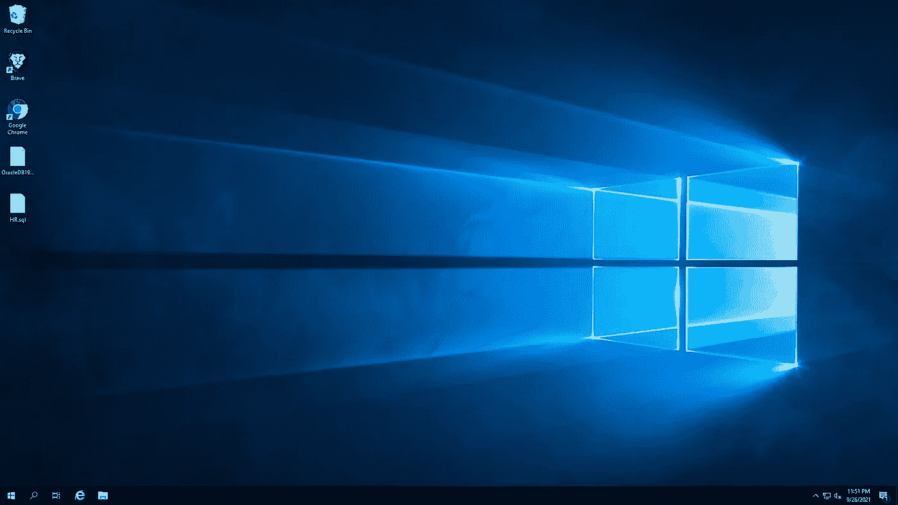

首先，让我们启动监听器并打开数据库。打开一个新的 PowerShell 窗口，并执行以下命令来启动您的侦听器(如果它尚未启动)。如果已经启动，终端会让你知道。

```
lsnrctl start
```

现在让我们打开我们的容器数据库。在您的终端中，使用以下命令以 SYSDBA 的身份*登录到 SQL Plus。*

```
sqlplus "/ AS SYSDBA"
```

在 SQL Plus 中，运行以下命令启动数据库。

```
STARTUP;
```

如果容器数据库尚未打开，请运行以下命令打开它。

```
ALTER PLUGGABLE DATABASE ALL OPEN;
```

如果您尚未连接到 ORCLPDB，请运行下面的命令连接到它。

```
ALTER SESSION SET container=ORCLPDB;
```

太棒了——我们现在可以通过在 PowerShell 中的 SQL Plus shell 中输入 *exit* 来注销 SQL Plus。

现在，我们需要按顺序下载并安装以下文件。

1.  Java 开发人员工具包(8) JDK 8
2.  Web 逻辑服务器
3.  Oracle 商业智能 12c (12.21.0.0)

# Java 开发人员工具包(8) JDK 8


如果你成功地完成了我的关于如何在 Windows 上安装 Oracle Database 19c 的教程[并且完成了 SQL Developer 的安装，那么你*应该已经安装了 JDK 8。您可以在 PowerShell 中使用此命令检查是否运行了 JDK 及其版本。*](/geekculture/oracle-database-19c-installation-on-windows-5a0561843fbc)

```
java -version
```

如果您已经安装了 JDK8，但是还没有设置 JAVA_HOME 变量，没有将它添加到您的路径中，请跳到第 2 部分。如果您已经完成了这两个步骤，请跳到下一部分。

## 第 1 部分:安装 JDK8

如果需要安装 JDK8，导航到[这个页面](https://downloads.ensemblevideo.com/Temp/Java/)下载 JDK 8。下载 jdk1.8.0_77.zip。

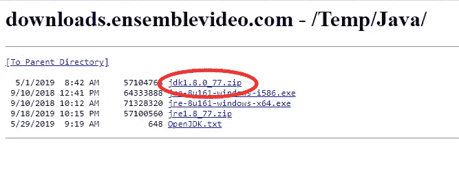

记住这个 zip 文件保存的位置。默认情况下，它应该保存在您的下载文件夹中。如果您打开文件浏览器并导航到 Downloads 文件夹，您应该会在那里看到 zip 文件。你的文件浏览器应该是这样的。


我们可以通过右键单击 zip 文件，然后在右键菜单中选择“Extract All…”选项来提取 zip 文件。应该会弹出一个新窗口，如下所示。


在显示“文件将被提取到此文件夹:”的地方，我们将把提取位置更改为。

```
C:\Program Files\Java
```

将上述目录路径复制并粘贴到地址栏中。窗口现在应该看起来像这样。


准备好后，点击“提取”如果弹出如下所示的窗口，请点按“继续”


## 第 2 部分:设置 JAVA_HOME 变量

最终完成后，我们现在将使用文件资源管理器导航到 Java 在我们计算机上的安装位置。双击地址栏，在文件浏览器中显示 *>快速访问>* 。我有你需要双击的地方，在下面用红色圈出。

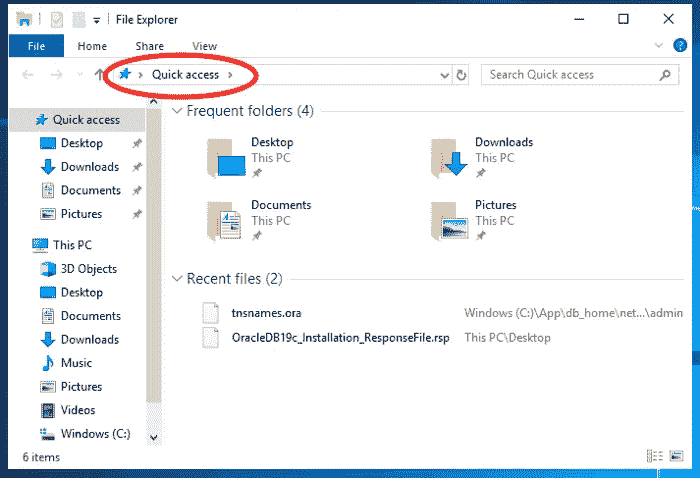

然后，将该命令复制并粘贴到地址栏中。

```
C:\Program Files\Java
```

您的文件资源管理器现在应该看起来像这样。

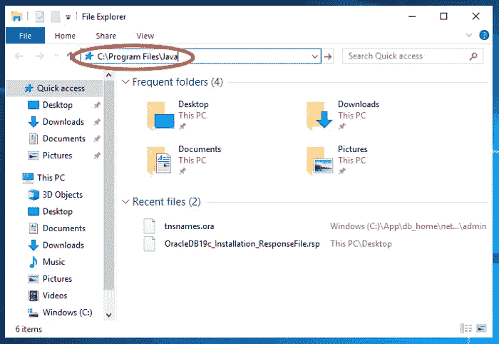

然后，按回车键。这将把您带到 Java 安装位置。您的文件资源管理器现在应该看起来像这样。请注意，如果您自己安装 Java，您的 Java 位置可能与我的不同。

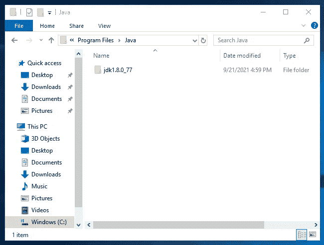

双击 jdk1.8.0_77 文件夹。你的文件浏览器应该是这样的。用红色圈出的是 bin 文件夹。双击这个。

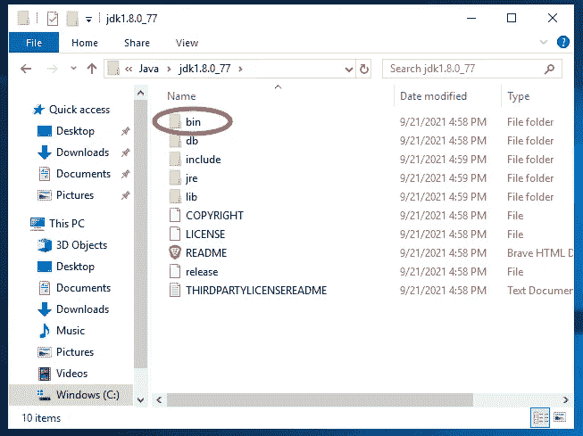

您的文件资源管理器现在应该看起来像这样。

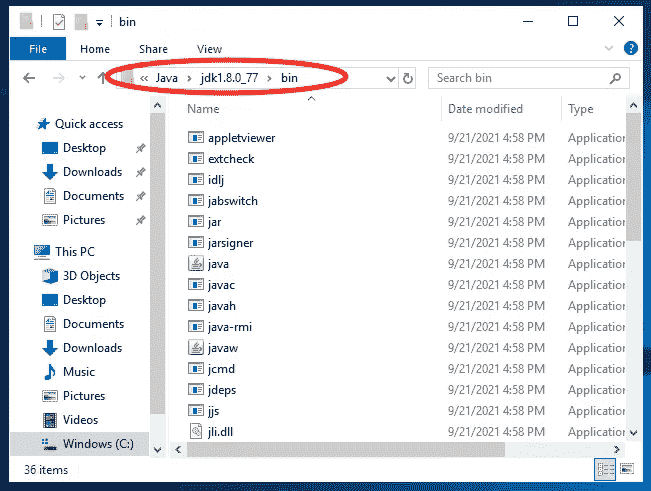

这是所有重要的 Java 相关可执行文件的存储位置。我们现在想将这个 bin 文件夹设置为我们的环境变量，这样我们就可以在命令提示符和 Windows PowerShell 中运行所有相关的 Java 命令。双击上面用红色圈出的地址栏。记下路径。路径应该如下所示。

```
C:\Program Files\Java\jdk1.8.0_77\bin
```

我们将把这个目录添加到我们的路径中。同样，如果您自己安装了 Java，您的路径可能会有所不同。确保您的机器使用了正确的路径。要将目录添加到我们的路径中，首先，单击屏幕左下角的开始菜单。然后，点击用红色圈出的齿轮图标，打开你的设置应用程序。

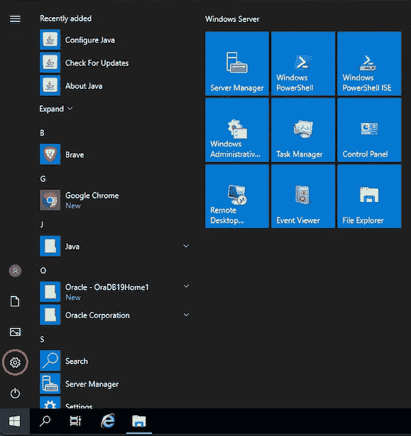

您的屏幕现在应该看起来像这样。点击“系统”


您的屏幕现在应该看起来像这样。


在“查找设置”搜索栏中，搜索以下内容。

```
Edit the system environment variables
```

选择下面的【仅 选项。

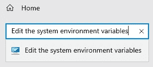

应该会弹出一个新窗口，看起来像这样。点击“环境变量”，我在下面用红笔圈了出来。


应该会弹出一个新窗口，看起来像这样。点击“系统变量”下的“路径”然后，点击“编辑”

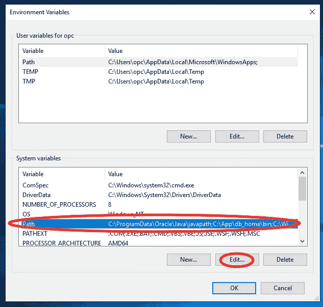

应该会弹出一个新窗口，看起来像这样。单击“新建”按钮，将 Java/bin 路径粘贴到此处。

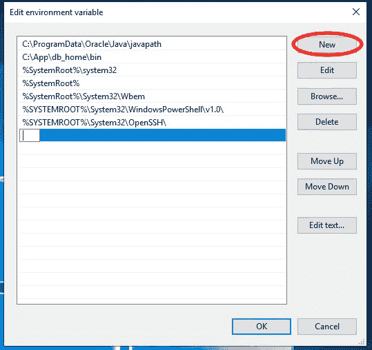

您的屏幕现在应该看起来像这样。单击“确定”

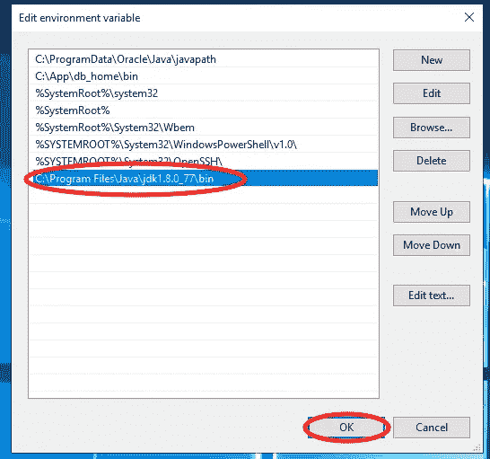

我们现在要设置 JAVA_HOME 环境变量。在您的环境变量屏幕中，单击下面用红色圈出的“新建”按钮。


应该会弹出一个新窗口，如下所示。


如下设置“变量名”。

```
JAVA_HOME
```

如下设置“变量值”。

```
C:\Program Files\Java\jdk1.8.0_77
```

请注意，我们在这里没有将 bin 包含在 out 路径中。窗口现在应该看起来像这样。单击“确定”

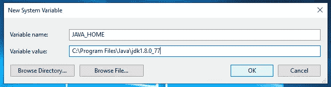

现在让我们安装我们的 WebLogic 服务器。

# Web 逻辑服务器


我们现在需要安装 web 逻辑服务器。这个可以在这里[下载。向下滚动到显示“2。Web 逻辑服务器”并将通用文件下载到您的虚拟机。](https://www.oracle.com/middleware/technologies/business-intelligence-12c-downloads.html)

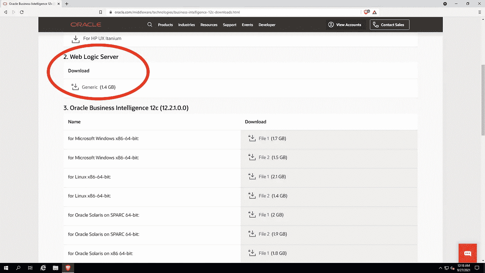

在下载开始之前，系统会提示您登录 Oracle SSO 帐户。成功登录后，系统会询问您要将 zip 文件保存在哪里。记住这个 zip 文件保存的位置。默认情况下，它应该保存在您的下载文件夹中。如果您打开文件浏览器并导航到 Downloads 文件夹，您应该会在那里看到 zip 文件。你的文件浏览器应该如下图所示。我用红色圈出了我们刚刚下载的存档文件夹。

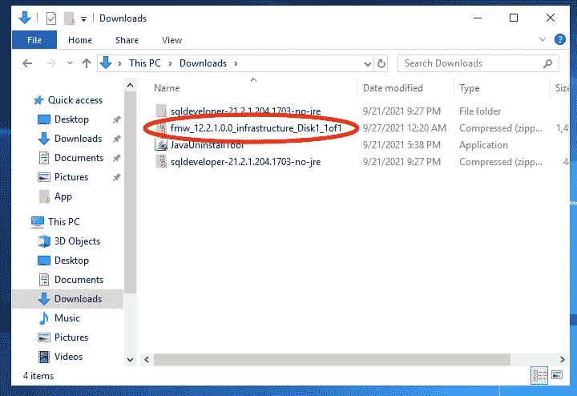

我们现在将解压 zip 文件。我们可以通过右键单击 zip 文件，然后在右键菜单中选择“Extract All…”选项来提取 zip 文件。应该会弹出一个新窗口，如下所示。

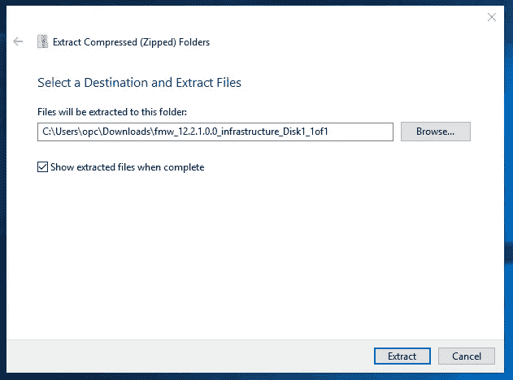

准备好后，点击“提取”最终完成后，您应该会在下载文件夹中看到一个名为 fmw _ 12 . 2 . 1 . 0 . 0 _ infra structure _ disk 1 _ 1 of1 的新文件夹。您的下载文件夹应该是这样的。


双击 fmw _ 12 . 2 . 1 . 0 . 0 _ infra structure _ disk 1 _ 1of 1。您的文件资源管理器现在应该看起来像这样。

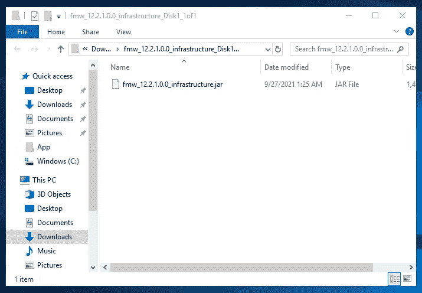

我们现在想运行这个。jar 文件。记下该文件所在的目录。内容如下。

```
C:\Users\opc\Downloads\fmw_12.2.1.0.0_infrastructure_Disk1_1of1
```

还要记下文件的名称。内容如下。

```
fmw_12.2.1.0.0_infrastructure.jar
```

首先，以管理员身份打开 PowerShell 窗口。在终端内部，输入以下命令导航到我们之前设置的 Java 目录。

```
chdir C:\"Program Files"\Java\jdk1.8.0_77\bin
```

现在让我们运行。jar 文件，我们用下面的命令将它解压到 Java bin 中。

```
java -jar C:\Users\opc\Downloads\fmw_12.2.1.0.0_infrastructure_Disk1_1of1/fmw_12.2.1.0.0_infrastructure.jar
```

屏幕上应该会弹出一个针对 Oracle 融合中间件 12c 基础架构的 GUI 向导。让我们浏览一遍。

## 欢迎

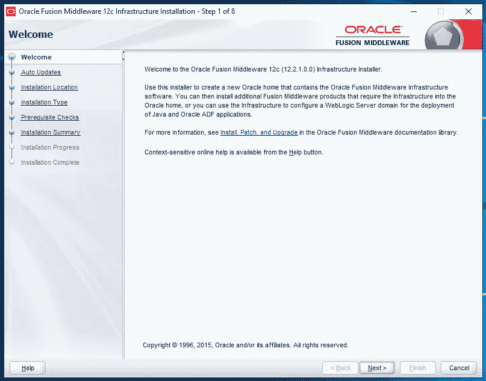

Click “Next”

## 步骤 2:自动更新

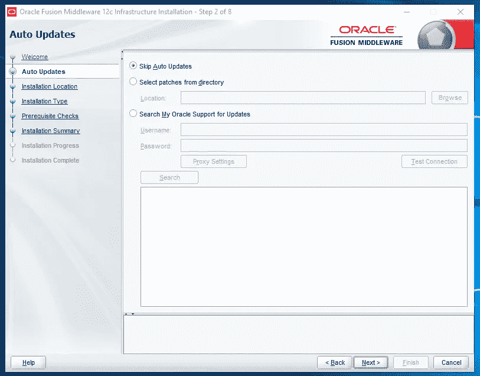

Click “Next” to skip auto updates

## 步骤 3:安装位置

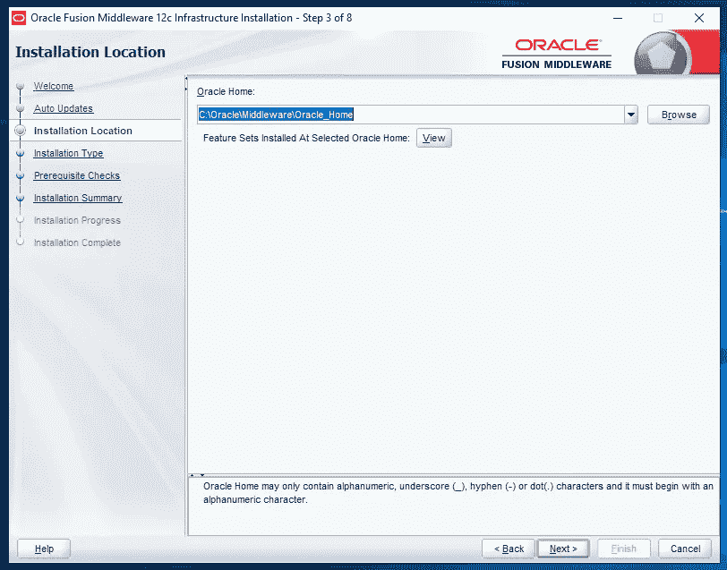

记下 Oracle-Home 目录，如下所示。

```
C:\Oracle\Middleware\Oracle_Home
```

在下一步安装 OBIEE 时，我们需要引用这个路径。

## 步骤 4:安装类型

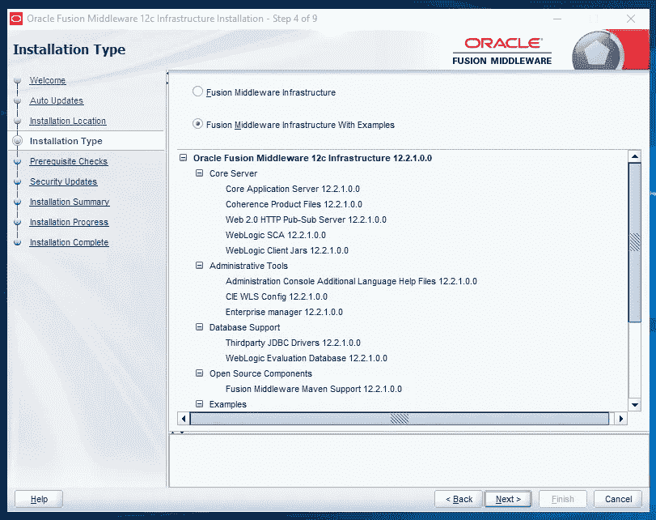

Select “Fusion Middleware infrastructure With Examples” if you are keen on playing with them. Then, click “Next”

## 步骤 5:先决条件检查

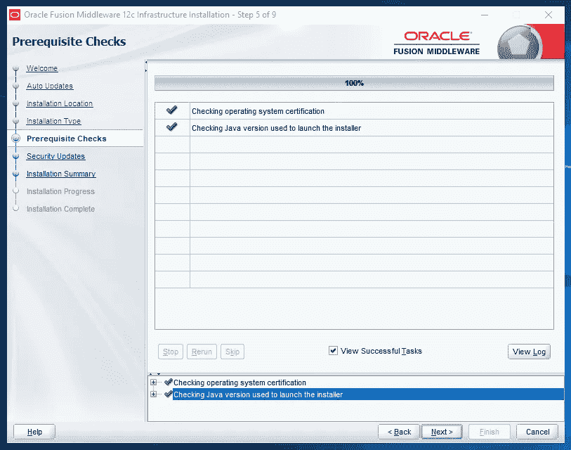

Click “Next”

## 步骤 6:安全更新

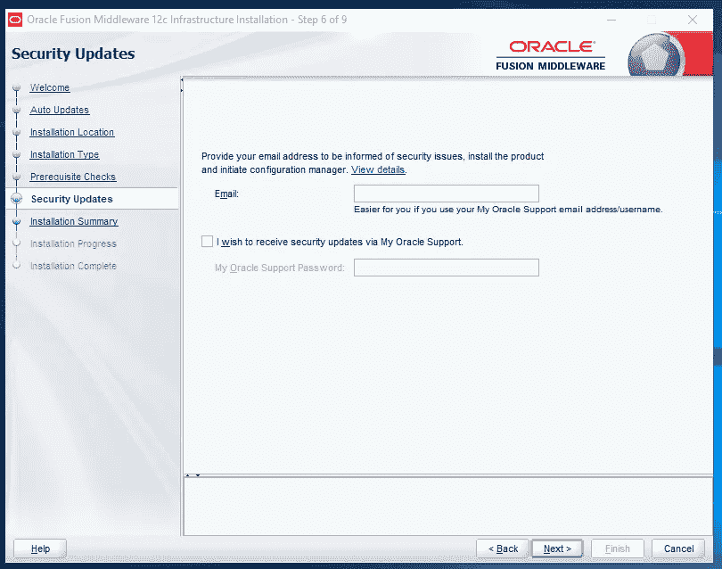

Uncheck the highlighted box and click “Next”

如果您看到下面的弹出窗口，只需单击“是”继续安装过程。

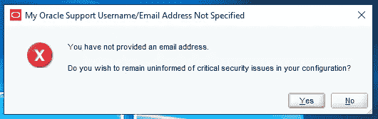

## 步骤 7:安装总结

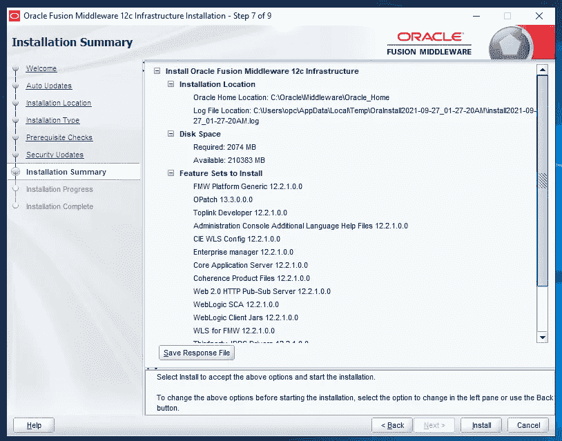

Click “Install” to proceed with the installation process

## 步骤 8:安装进度

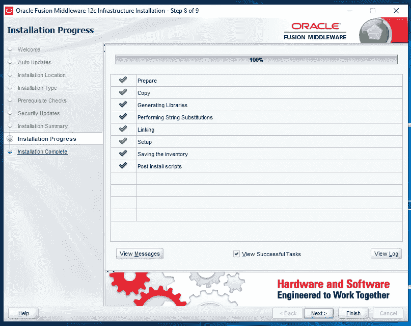

Once the installation reached 100%, click “Next”

## 步骤 9:安装完成

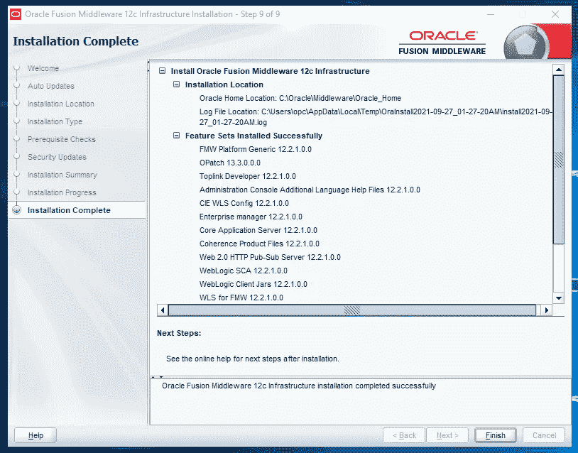

Click “Finish”

Oracle 融合中间件基础设施 12c 现已安装。现在让我们来看看 OBIEE 装置。

# Oracle 商业智能 12c (12.21.0.0)


我们现在需要下载并安装 OBIEE。这个可以在这里[下载。向下滚动到显示“3。Oracle Business Intelligence 12c(12 . 21 . 0 . 0)”并下载“用于 Microsoft Windows x86–64 位”文件 1 *和*文件 2。](https://www.oracle.com/middleware/technologies/business-intelligence-12c-downloads.html)

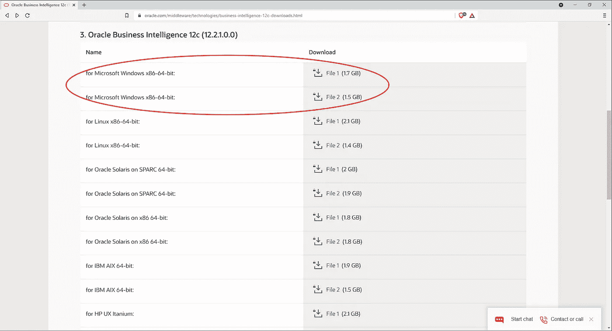

在下载开始之前，系统会提示您登录 Oracle SSO 帐户。成功登录后，系统会询问您要将 zip 文件保存在哪里。记住这个 zip 文件保存的位置。默认情况下，它应该保存在您的下载文件夹中。如果您打开文件浏览器并导航到 Downloads 文件夹，您应该会在那里看到 zip 文件。你的文件浏览器应该如下图所示。我用红色圈出了我们刚刚下载的存档文件夹。

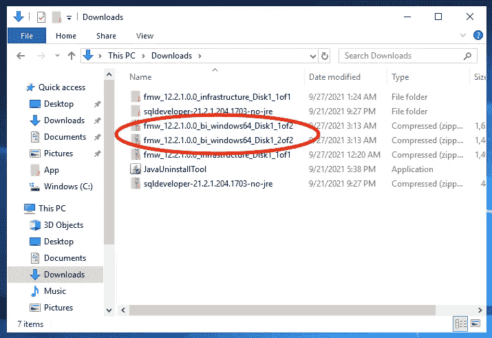

我们现在要解压第一个名为 fmw _ 12 . 2 . 1 . 0 . 0 _ bi _ windows 64 _ disk 1 _ 1of 2 的 zip 文件。我们可以通过右键单击 zip 文件，然后在右键菜单中选择“Extract All…”选项来提取 zip 文件。应该会弹出一个新窗口，如下所示。

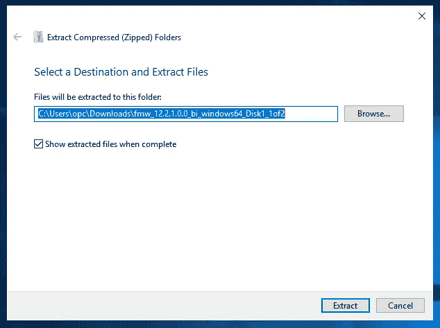

准备好后，点击“提取”最终完成后，您应该会在下载文件夹中看到一个名为 fmw _ 12 . 2 . 1 . 0 . 0 _ bi _ windows 64 _ disk 1 _ 1of 2 的新文件夹。您的下载文件夹应该是这样的。

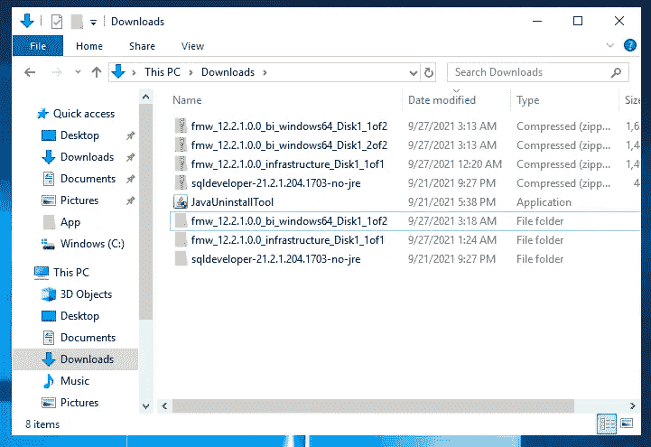

双击新创建的名为 fmw _ 12 . 2 . 1 . 0 . 0 _ bi _ windows 64 _ disk 1 _ 1of 2 的文件夹。您的文件资源管理器现在应该看起来像这样。

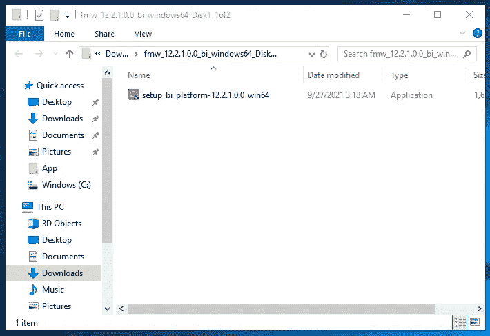

将 setup _ bi _ platform-12 . 2 . 1 . 0 . 0 _ win 64 文件移出 fmw _ 12 . 2 . 1 . 0 . 0 _ bi _ windows 64 _ disk 1 _ 1of 2 文件夹，并移入 Downloads 文件夹。您的下载文件夹现在应该看起来像这样。

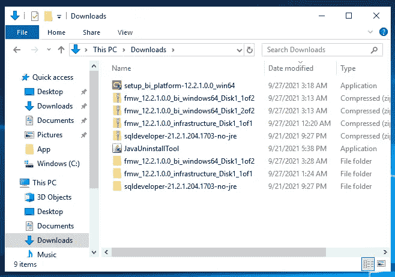

我们现在要解压缩名为 fmw _ 12 . 2 . 1 . 0 . 0 _ bi _ windows 64 _ disk 1 _ 2of 2 的第二个 zip 文件的内容。我们可以通过右键单击 zip 文件，然后在右键菜单中选择“Extract All…”选项来提取 zip 文件。应该会弹出一个新窗口，如下所示。

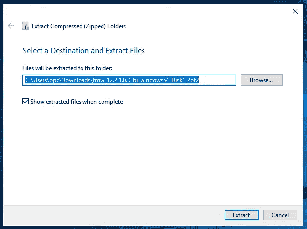

准备好后，点击“提取”最终完成后，您应该会在下载文件夹中看到一个名为 fmw _ 12 . 2 . 1 . 0 . 0 _ bi _ windows 64 _ disk 1 _ 1of 2 的新文件夹。您的下载文件夹应该是这样的。

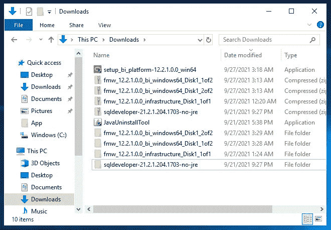

双击新创建的名为 fmw _ 12 . 2 . 1 . 0 . 0 _ bi _ windows 64 _ disk 1 _ 2of 2 的文件夹。您的文件资源管理器现在应该看起来像这样。


将 setup _ bi _ platform-12 . 2 . 1 . 0 . 0 _ win 64–2 zip 文件从 fmw _ 12 . 2 . 1 . 0 . 0 _ bi _ windows 64 _ disk 1 _ 2of 2 文件夹中移到 Downloads 文件夹中。您的下载文件夹现在应该看起来像这样。

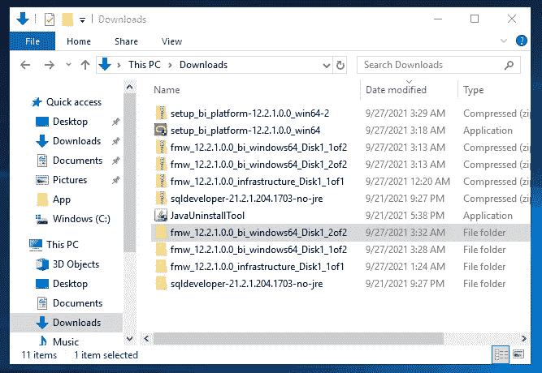

为了省心，我将删除下面突出显示和选择的文件夹和文件。我们不再需要这些了。


你的下载文件夹现在应该看起来像这样——更干净，更容易看。

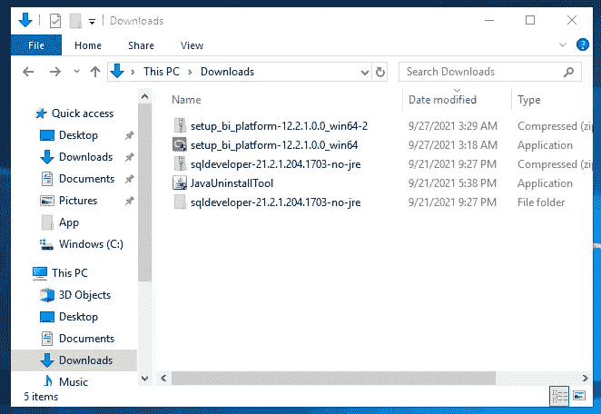

右键单击 setup _ bi _ platform-12 . 2 . 1 . 0 . 0 _ win 64 应用程序文件—带有红色“O”图标的文件。将弹出一个菜单，如下所示。

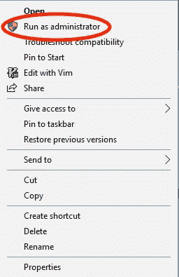

选择“以管理员身份运行”按钮。给你的电脑一些时间来加载。最终，您会看到一个弹出窗口，如下所示。

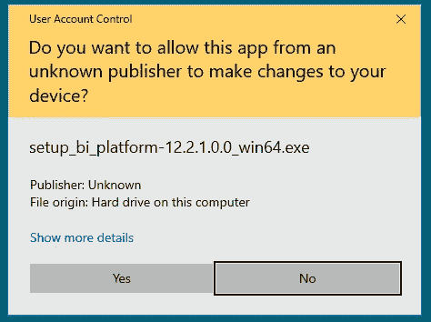

单击“是”，安装向导将在几分钟后出现。

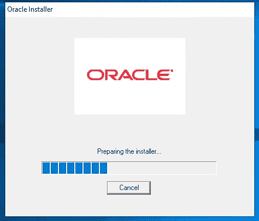

屏幕上将弹出一个 Oracle Business Intelligence 12c 的 GUI 向导。让我们浏览一遍。

## **第一步:欢迎**

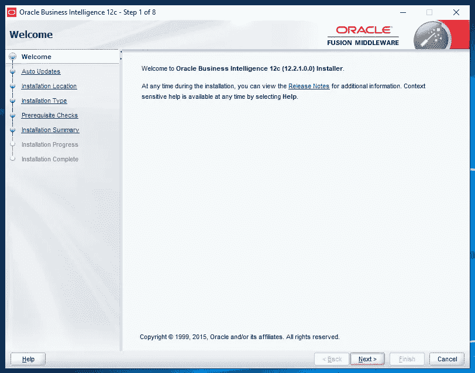

Click “Next”

## **第二步:自动更新**

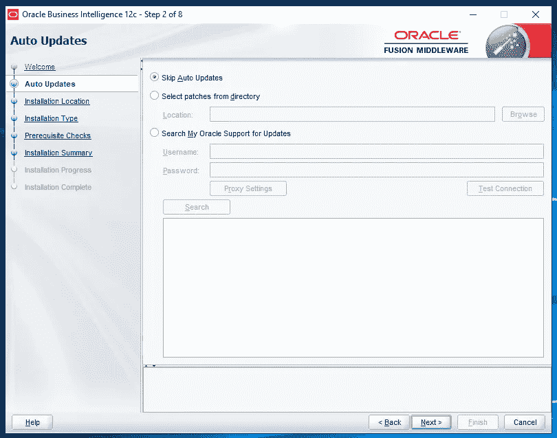

Click “Next” to skip auto updates

## 步骤 3:安装位置

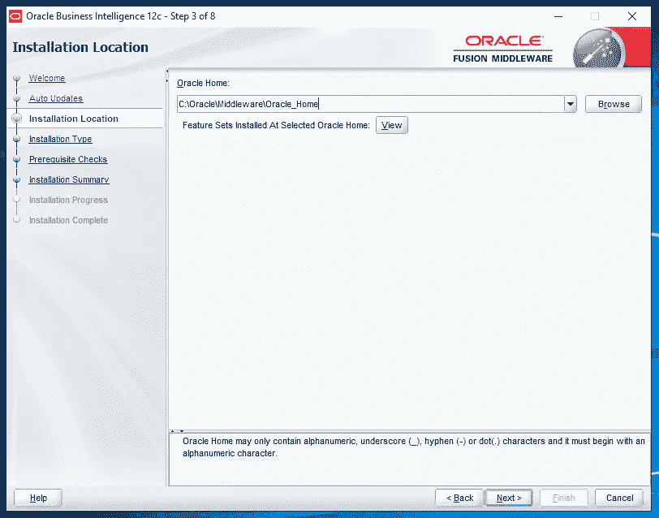

将我们在 Web Logic Server 安装的步骤 3 中使用的 Oracle_Home 目录放在这里。再次参考一下，Oracle_Home 目录如下。请注意，这个“Oracle_Home”目录不同于与我们的数据库相关联的 ORACLE_HOME 目录——我知道，这令人困惑。

```
C:\Oracle\Middleware\Oracle_Home
```

输入 Oracle_Home 目录后，单击“下一步”

## 步骤 4:安装类型

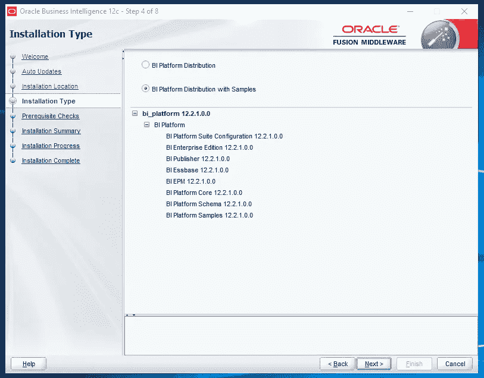

Select “BI Platform Distribution with Samples” and then click “Next”

## 步骤 5:先决条件检查

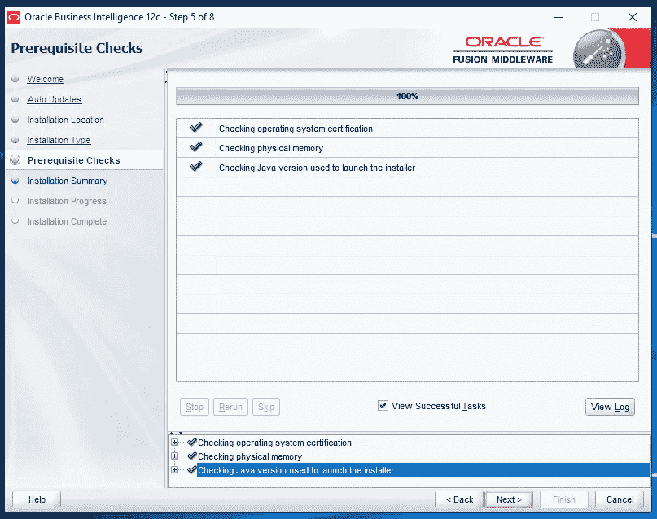

Click “Next”

## 步骤 6:安装总结

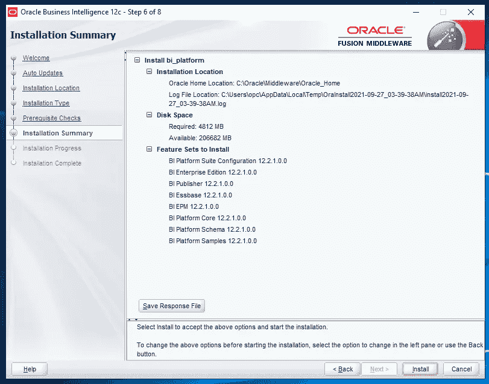

Click “Install”

## 步骤 7:安装进度

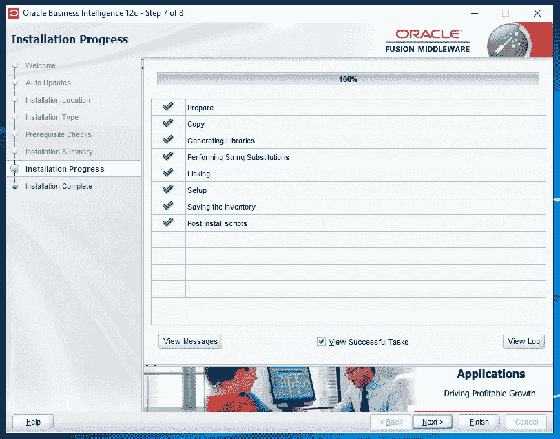

注意:在安装过程中，您将会看到一个类似这样的弹出窗口，不要忽略这个窗口。

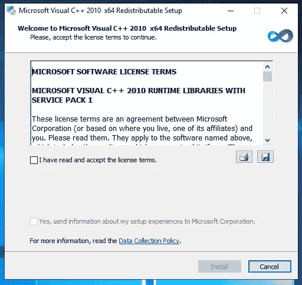

选中“我已经阅读并接受许可条款”框，然后单击“安装”安装完成后，您可以单击“完成”

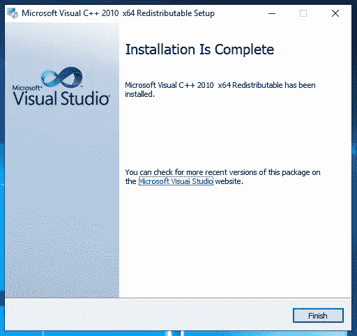

导航回 OBIEE 安装向导，并在安装完成 100%后单击“下一步”。

## 步骤 8:安装完成

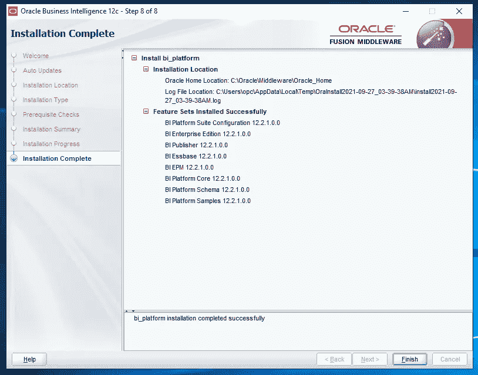

Click “Finish”

安装完成。现在让我们将 BI_ORACLE_HOME 添加到我们的系统环境变量中。

# 将 BI_PRODUCT_HOME 添加到环境变量中


我们将把 BI_PRODUCT_HOME 目录添加到环境变量中。首先，点击屏幕左下角的开始菜单。然后，点击用红色圈出的齿轮图标，打开你的设置应用程序。


您的屏幕现在应该看起来像这样。点击“系统”


您的屏幕现在应该看起来像这样。


在“查找设置”搜索栏中，搜索以下内容。

```
Edit the system environment variables
```

选择下面的【仅 选项。


应该会弹出一个新窗口，看起来像这样。点击“环境变量”，我在下面用红笔圈了出来。

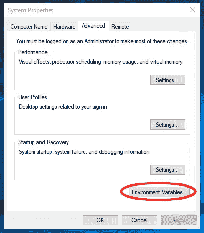

既然我们在这里，让我们也添加变量 BI_PRODUCT_HOME。在您的环境变量屏幕中，单击下面用红色圈出的“新建”按钮。

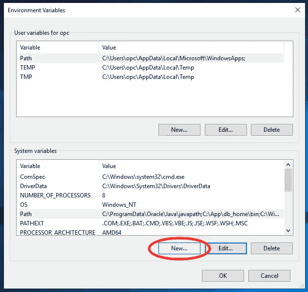

应该会弹出一个新窗口，如下所示。


如下设置“变量名”。

```
BI_PRODUCT_HOME
```

如下设置“变量值”。

```
C:\Oracle\Middleware\Oracle_Home\bi
```

窗口现在应该看起来像这样。单击“确定”

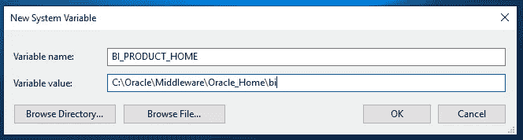

我们已经成功地安装了 OBIEE 软件，并且成功地设置了 ORACLE_BI_HOME 环境变量——但是我们还没有完成。我们需要创建一个可以访问容器数据库的存储库，在我之前的博客中，我们一直在用[进行工作。然而，要做到这一点，我们需要一个拥有 *SYS* 权限和创建会话权限的用户。如果您已经有一个拥有这些权限的用户，那太好了。如果没有，我们一起来创造一个。](/geekculture/oracle-database-19c-installation-on-windows-5a0561843fbc)

# 创建具有 sys 和 create session 权限的用户


在 PowerShell 中运行以下命令，以 *SYS* 用户的身份登录到 SQL Plus。

```
sqlplus "/ AS SYSDBA"
```

运行下面的命令打开我们的容器数据库，如果它还没有打开的话。

```
ALTER PLUGGABLE DATABASE ALL OPEN;
```

如果尚未连接，请运行下面的命令连接到 ORCLPDB。

```
ALTER SESSION SET container=ORCLPDB;
```

我们现在要用 SQL Plus 编写一个查询，为我们的容器数据库创建一个新用户。语法将如下所示

```
CREATE USER user_name IDENTIFIED BY some_password;
```

我将把我的用户命名为 *jib* ，然后输入一个密码。完成此操作后，您的终端应该如下所示。我覆盖了我的密码。把你的密码放在安全的地方。

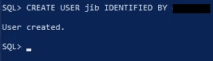

我们现在将授予 *jib* SYSDBA 权限。我们可以用下面的语法做到这一点。当然，在我的例子中，我会用 *jib* 替换 user_name。

```
GRANT SYSDBA TO user_name;
```

我们现在还将授予 *jib* 创建会话的权限。我们可以用下面的语法做到这一点。同样，当然，在我的例子中，我将用 *jib* 替换 user_name。

```
GRANT CREATE SESSION TO user_name;
```

一旦您成功地完成了这一步，您就可以开始创建存储库了。使用*退出*命令退出 SQL Plus。

# 知识库创建

在 PowerShell 中，将目录更改为以下内容。这是存储库创建实用程序(RCU)的地方。

```
chdir C:\Oracle\Middleware\Oracle_Home\oracle_common\bin
```

让我们用 *ls* 命令查看这个目录的内容。您的终端应该是这样的。

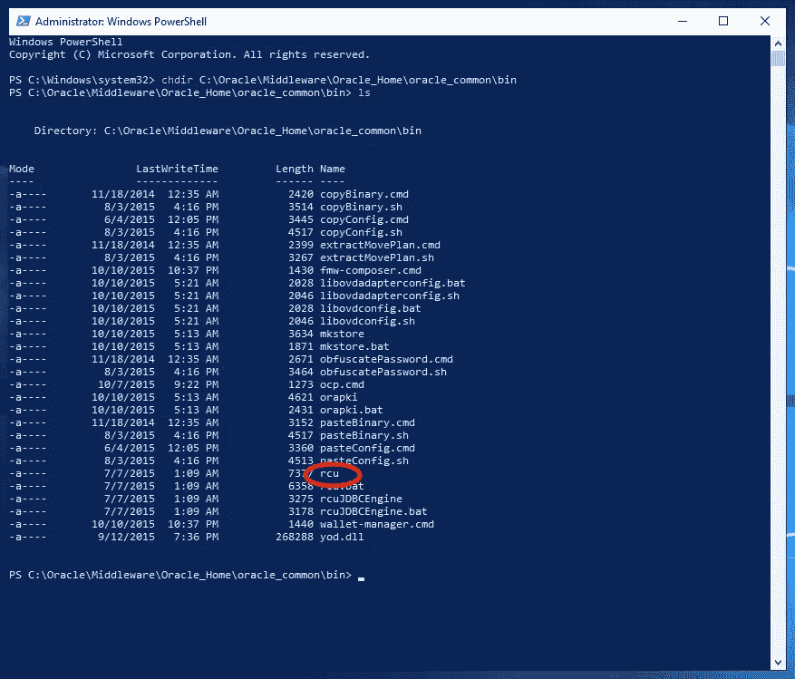

我们需要启动上面用红色圈出的 RCU，以启动 RCU 向导，这将允许我们创建一个存储库。在 PowerShell 中运行以下命令来启动 RCU。

```
./rcu
```

屏幕上会弹出一个 RCU 的 GUI 向导。让我们浏览一遍。

## 欢迎

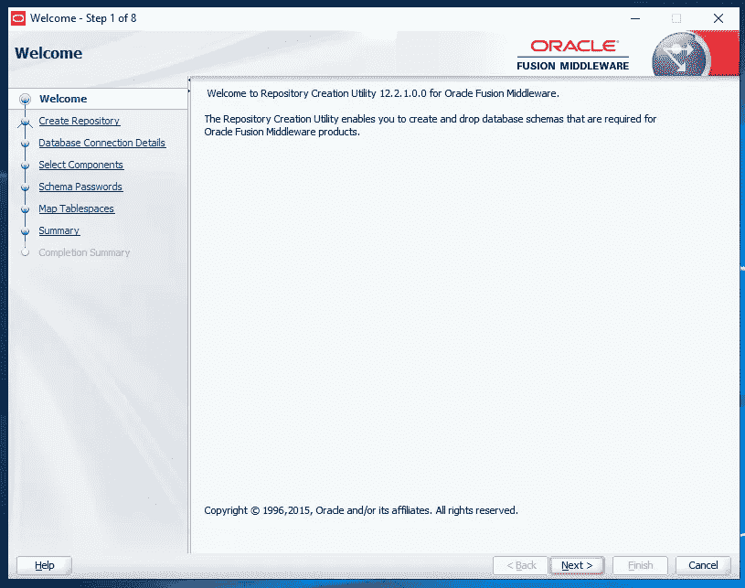

Click “Next”

## 步骤 2:创建存储库

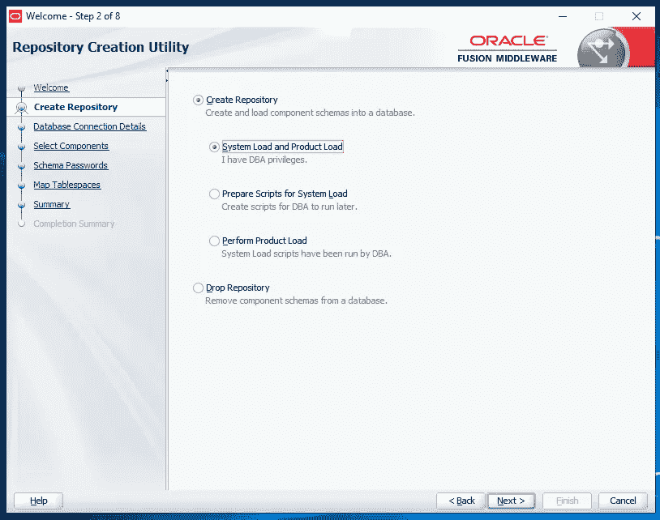

Click “Next”

## 步骤 3:数据库连接详细信息

我们将连接到我在[之前的博客文章](/geekculture/oracle-database-19c-installation-on-windows-5a0561843fbc)中在 SQL Developer 和 SQL Plus 中解锁并接入的容器数据库。使用以下标准填写向导中的框:

*   **主机名:**本地主机
*   **端口:**1521
*   **服务名:** ORCLPDB
*   **用户名:**你的用户名
*   **密码:** *你的 _ 密码*
*   **角色:** *SYSDBA*

请记住，对于用户名和密码，您将使用我们刚刚在上一步中创建的用户名和密码。对我来说，我将使用用户 *jib。窗口现在应该看起来像这样。*

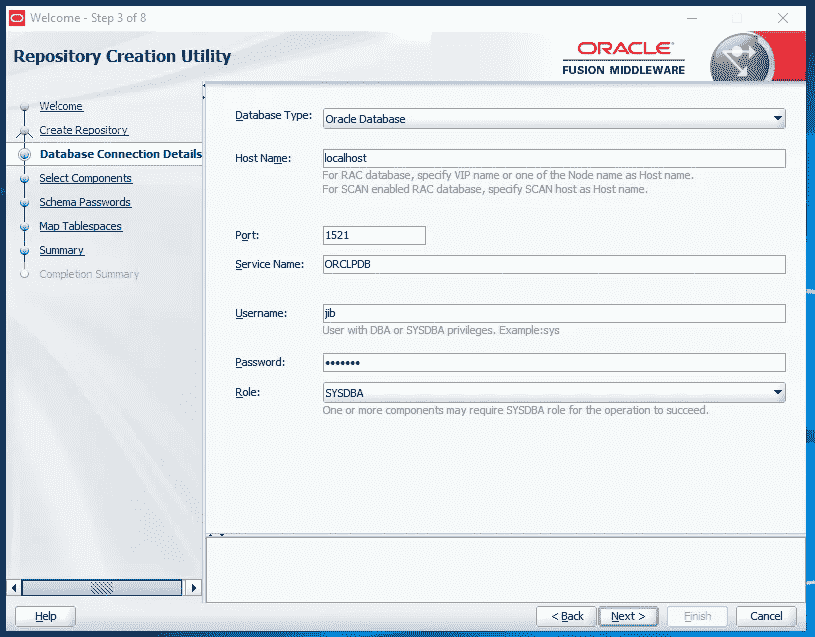

Click “Next”

如果您在单击“下一步”后收到以下错误，只需单击“忽略”

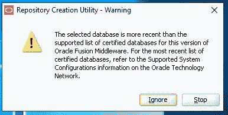

当您看到下面的“操作完成”窗口时，单击“确定”。


如果您在连接数据库时遇到问题，不要惊慌。

遵循下面的故障排除步骤。

## 1.启动监听器

停止监听器，然后在新的终端选项卡中使用此命令重新启动它。

```
lsnrctl stop
lsnrctl start
```

## 2.打开并连接到 ORCLPDB

打开一个新的终端选项卡，并使用以下命令启动一个新的 SQL Plus 会话。

```
sqlplus "/ AS SYSDBA"
```

登录到 SQL Plus 后，运行此命令关闭并重新启动数据库。

```
SHUTDOWN;
STARTUP;
```

然后，运行下面的命令打开容器数据库。

```
ALTER PLUGGABLE DATABASE ALL OPEN;
```

运行以下命令连接到 PDB1。

```
ALTER SESSION SET container=ORCLPDB;
```

完成这些步骤后，单击向导中的“下一步”并尝试再次连接到容器数据库。

## 步骤 4:选择组件

选中“Oracle 作为存储库组件”旁边的框这将为您选择它下面的所有其他框。然后点击“下一步”

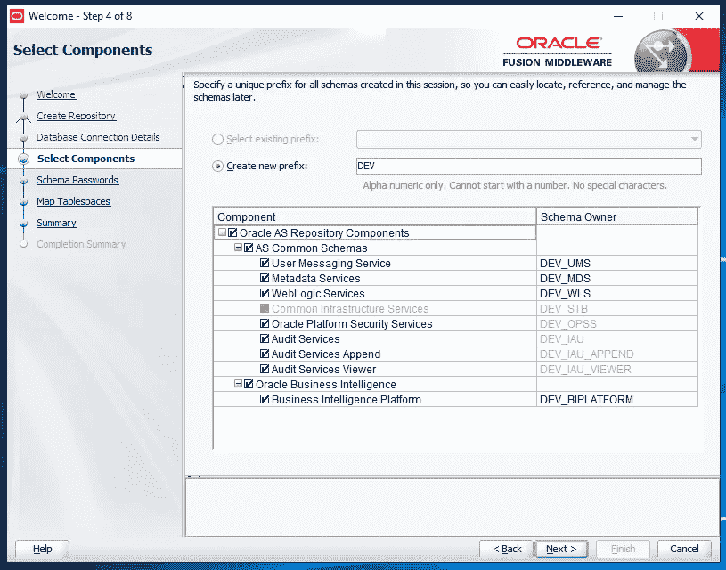

Click “Next”

当您看到下面的“操作完成”窗口时，单击“确定”。

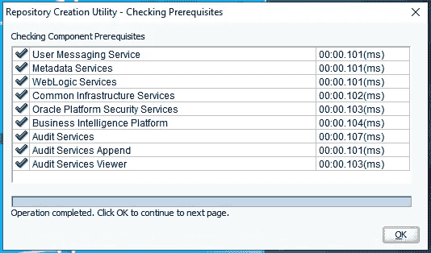

## 步骤 5:模式密码

输入用于访问模式的密码。把你的密码放在安全的地方。单击“下一步”继续。

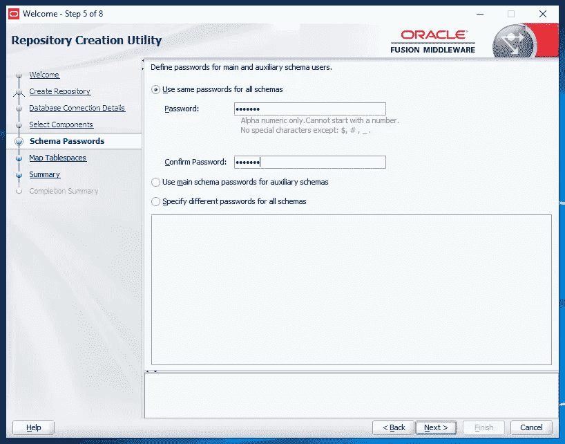

Click “Next”

## 步骤 6:映射表空间


Click “Next”

如果您看到如下所示的弹出窗口，请单击“确定”

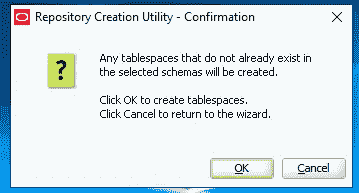

当您看到下面的“操作完成”窗口时，单击“确定”。

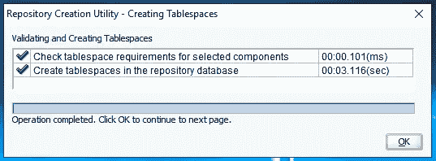

## 第七步:总结

耐心点——这需要一秒钟才能完成。

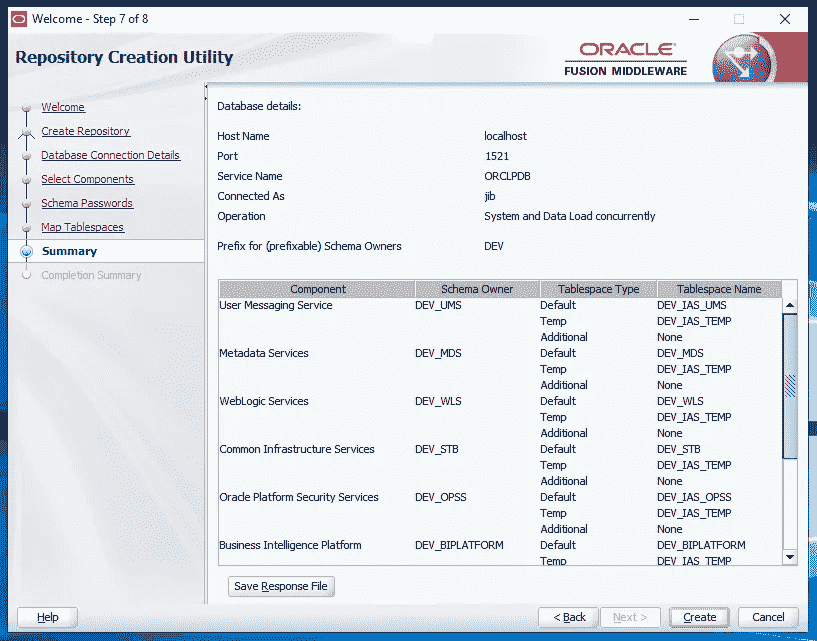

## 步骤 8:完成总结

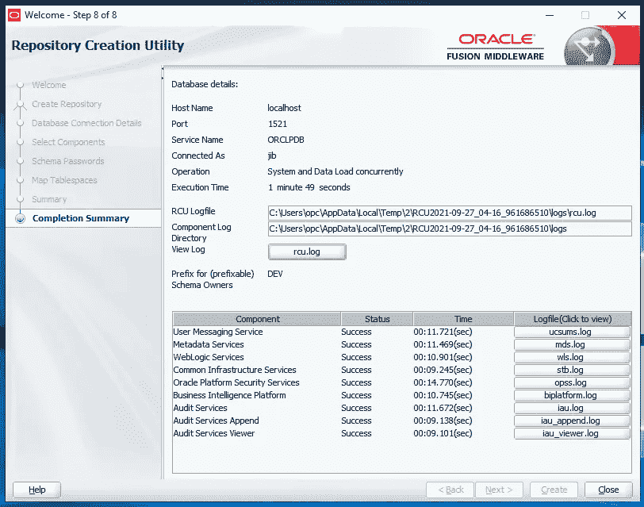

Click “Close”

我们现在已经成功创建了一个存储库。现在是时候配置 OBIEE 12c 了。

# 配置 OBIEE 12c


导航到 PowerShell 中的以下目录。这是我们在本教程的大部分时间里一直在使用的目录。

```
chdir C:\Oracle\Middleware\Oracle_Home
```

然后，我们希望导航到 bi/bin。我们可以用下面的命令做到这一点。

```
chdir bi\bin
```

让我们用 *ls* 命令查看这个目录的内容。您的终端应该是这样的。

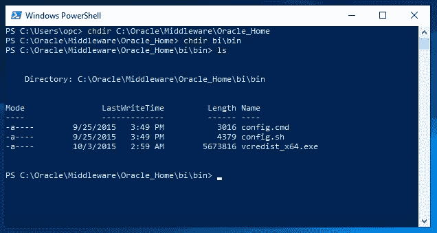

要配置 OBIEE 12c，我们需要运行 config.cmd。

```
./config.cmd
```

如果弹出如下所示的窗口，请单击“是”

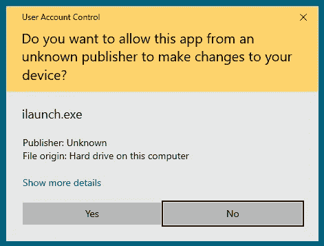

OBIEE 的 GUI 向导应该会在您的屏幕上弹出。让我们浏览一遍。

## 欢迎

选择“商业智能企业版”您可以取消选择“Essbase”和“商业智能发布者”

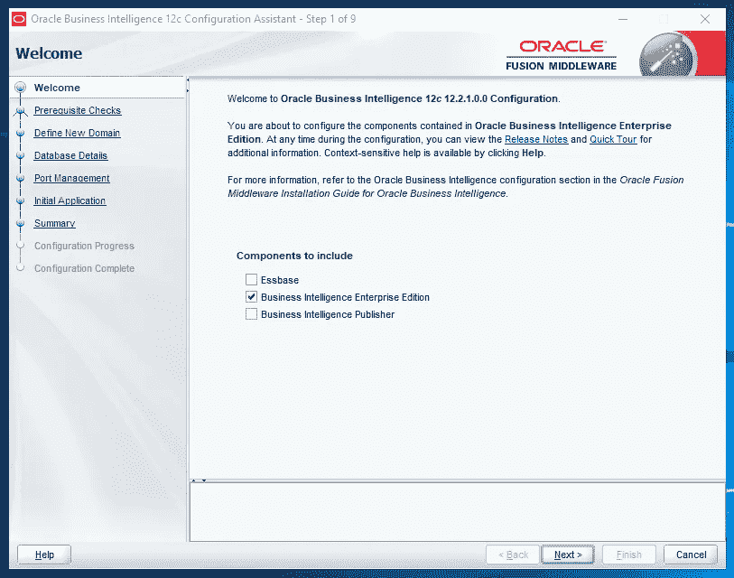

Click “Next”

## 步骤 2:先决条件检查

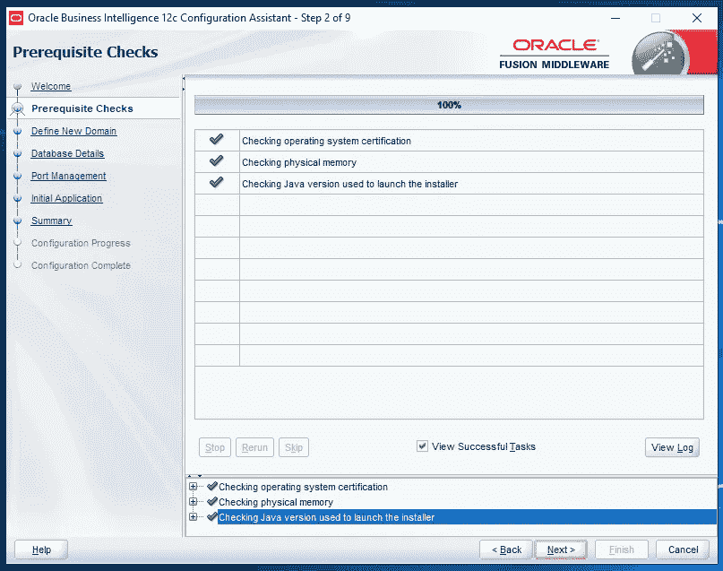

Click “Next”

## 步骤 3:定义域

输入您将用于访问 BI 域的密码。把你的密码放在安全的地方。单击“下一步”继续。

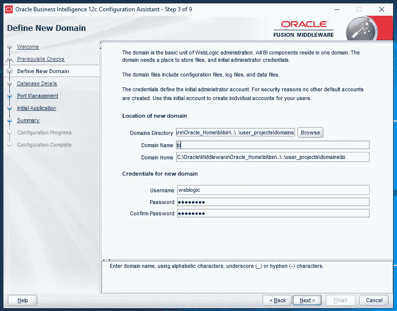

Click “Next”

作为将来的参考，这是域主目录。

```
C:\Oracle\Middleware\Oracle_Home\bi\bin\..\..\user_projects\domains
```

## 步骤 4:数据库详细信息

下一个窗口将是这样的。

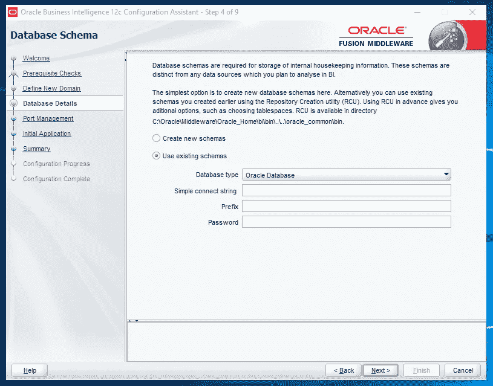

存储库模式是使用 RCU 创建的，因此单击“使用现有模式”。使用以下标准填写此窗口:

*   **简单字符串连接:** *主机名:端口:服务名即* *本地主机:1521:ORCLPDB*
*   **前缀:** *DEV*
*   **密码:** *这是我们在上一步*中为模式创建的密码

窗口现在应该看起来像这样。

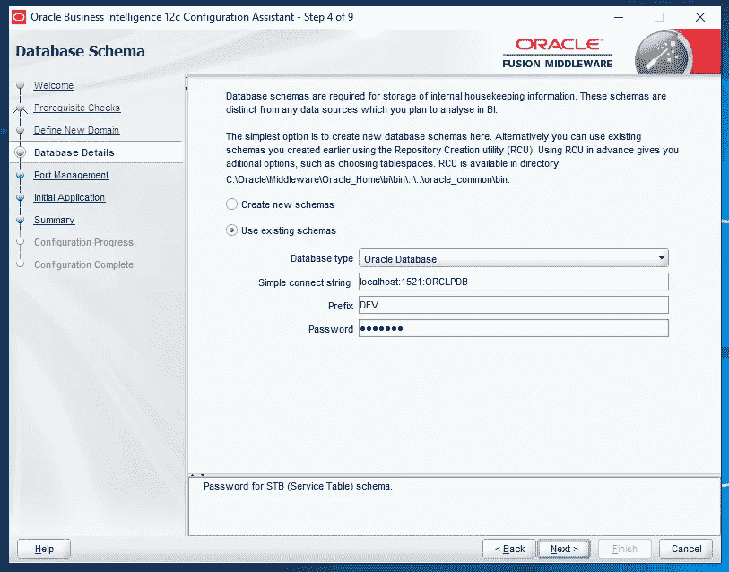

Click “Next”

哦，我弄错了。让我们试着解决这个问题。

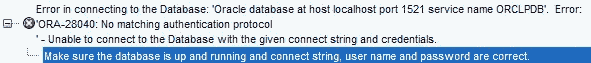

Error ORA-28040

经过一些研究，我了解到我们需要设置连接 Oracle 数据库实例时允许的最低身份验证协议。通过创建和编辑 sqlnet.ora 文件，我们可以很容易地解决这个问题。在我们执行此操作之前，如果您尚未设置密码，请为 *SYS* 用户设置一个密码。如果您已经这样做了，请转到步骤 2。

## 步骤 1:为 SYS 用户创建密码

使用以下命令启动一个新的 SQL Plus 会话。

```
sqlplus "/ AS SYSDBA"
```

使用以下命令更改 *SYS* 用户的密码。

```
ALTER USER SYS IDENTIFIED BY some_password;
```

您的 PowerShell 应该是这样的。我覆盖了我的密码。把你的密码放在安全的地方。

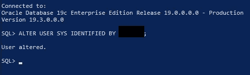

我们现在可以用 *exit* 命令退出 SQL Plus。

## 步骤 2:创建并配置 sqlnet.ora 文件

让我们回到我们的终端，并导航到以下路径。确保您以管理员身份登录到 PowerShell。

```
chdir C:\App\db_home\network\admin
```

让我们用 *ls* 命令查看这个目录的内容。您的终端应该是这样的。

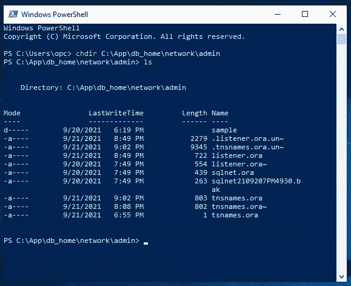

让我们编辑 sqlnet.ora 文件。首先，让我们停止监听。

```
lsnrctl stop
```

现在让我们使用以下命令编辑 sqlnet.ora 文件。

```
vim sqlnet.ora
```

您的 PowerShell 现在应该看起来像这样。


按 Shift+G 导航到文档的底部。按下键盘上的字母“I”开始编辑文档。把下面的文字放在文件的底部。我在粘贴文本时遇到了问题，所以你可能需要手动写出来。

```
SQLNET.ALLOWED_LOGON_VERSION_CLIENT=8
SQLNET.ALLOWED_LOGON_VERSION_SERVER=8
SQLNET.ALLOWED_LOGON_VERSION=8
```

您的 PowerShell 现在应该看起来像这样。

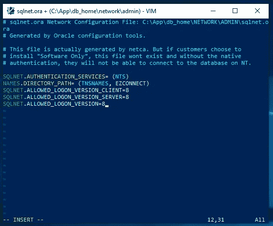

完成此任务后，点击 ESC 按钮，向下滚动到文档底部，键入以下文本。然后，按回车键。

```
:wq
```

这个序列将保存文件并退出编辑器。现在让我们用下面的命令重新启动监听器。

```
lsnrctl start
```

我们现在需要重新登录到 SQL Plus。

```
sqlplus "/ AS SYSDBA"
```

运行此命令关闭并重新启动数据库。

```
SHUTDOWN;
STARTUP;
```

如果容器数据库尚未打开，请运行以下命令打开它。

```
ALTER PLUGGABLE DATABASE ALL OPEN;
```

如果您尚未连接到 ORCLPDB，请运行下面的命令连接到它。

```
ALTER SESSION SET container=ORCLPDB;
```

让我们尝试在向导中再次连接到我们的数据库……该死——我仍然得到一个错误。如果要我猜的话，我不喜欢我之前为我们现在尝试连接的模式创建的 *jib* 用户。


*Sigh* — another error

让我们尝试通过单击“创建新模式”来创建一个新模式不要使用 *jib* 用户来创建这个新模式，让我们使用 *SYS* 用户，我们刚刚*给它分配了一个密码。窗口现在应该看起来像这样。*


使用以下标准填写此窗口:

*   **前缀:** *DEV1(这需要不同于我们已经创建的模式中的前缀)*
*   **模式密码:** *您可以使用我们之前创建的模式中的相同密码，也可以创建一个新密码——将其存储在安全的地方*
*   **确认模式密码:** *输入您在上面*中输入的相同密码
*   **数据库类型:** *Oracle 数据库*
*   **简单字符串连接:** *主机名:端口:服务名即* *本地主机:1521:ORCLPDB*
*   **用户名:** *系统*
*   **密码:**your _ sys _ Password

记得使用与 *SYS* 账户相关的密码，我们*刚刚*设置好的。窗口现在应该看起来像这样。

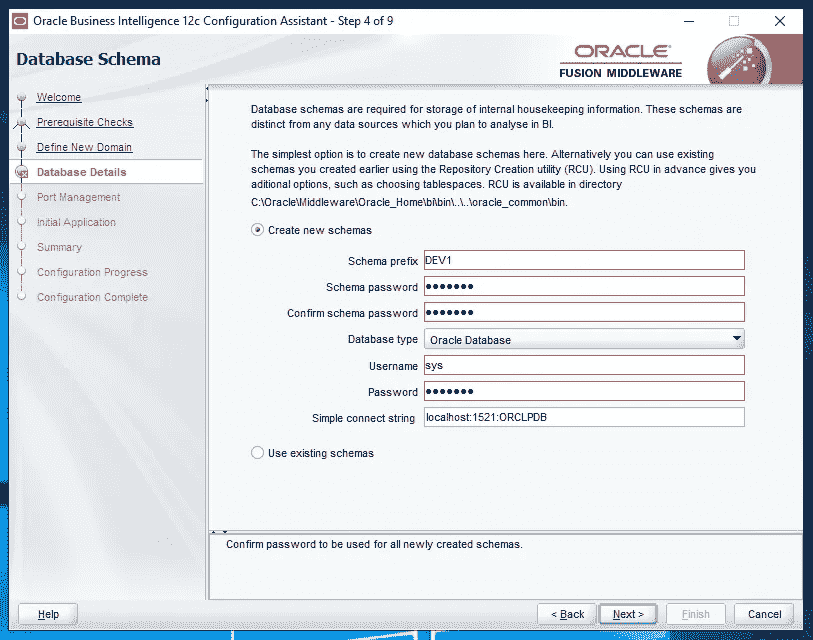

唉——我让它工作了。如果您收到我在尝试连接时收到的“无效用户名/密码”错误，请返回 SQL Plus 并再次更改您的 *SYS* 密码——或许，您还应该创建一个密码，以便能够轻松地输入到密码框中，而不会出现输入错误。然后，关闭数据库并重新启动它。我不确定到底是什么原因导致了这个问题，但这肯定是一个比许多人都会遇到的更常见的问题。让我们在向导中继续。

## 步骤 5:端口管理

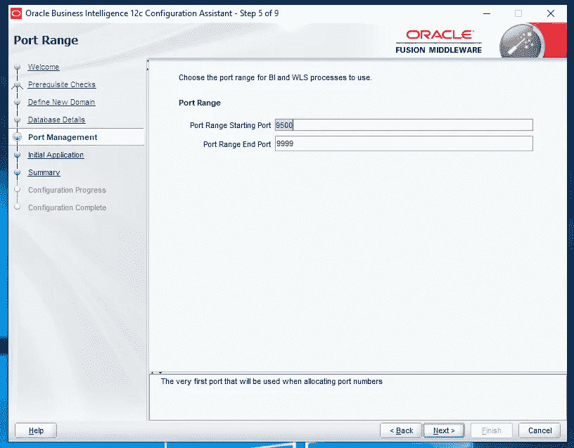

Click “Next”

## 第六步:初次申请

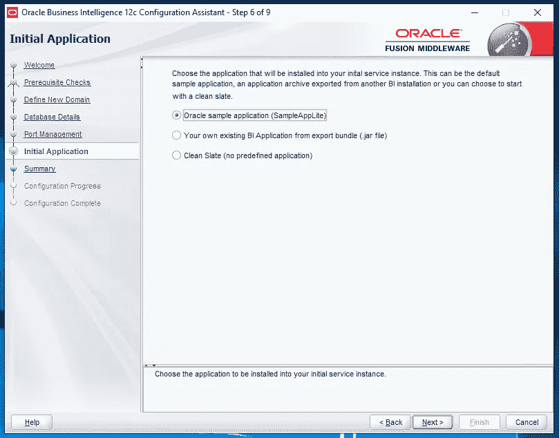

Click “Next”

## 第七步:总结

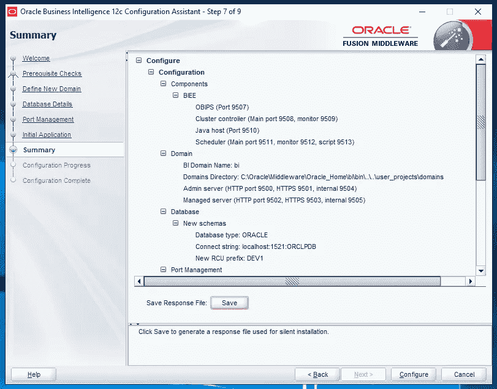

Click “Configure”

注意:当我第一次尝试配置时，我得到了一个大约 35%的错误，我很难过。然而，修复非常简单。

```
Config Action BI Configuration failedConfigure BI failed with Cannot load EndPoint Manager: java.lang.RunTimeException: BI Product Home must be specified in sys property: oracle.bi.home or env var: BI_PRODUCT_HOME
```

实际上，我忘记了最初在我的环境中添加 BI_PRODUCT_HOME 变量。然而，如果你一步一步地关注这个博客，你应该*而不是*遇到这个错误。在博客的前面，我们将这个变量添加到系统中。

## 步骤 8:配置过程

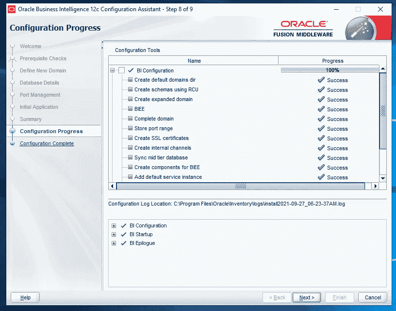

Click “Next”

## 步骤 9:配置完成

在下面显示“保存此页面”的地方，点击*保存*。以后有这个做参考就好了。准备好后，点击“完成”

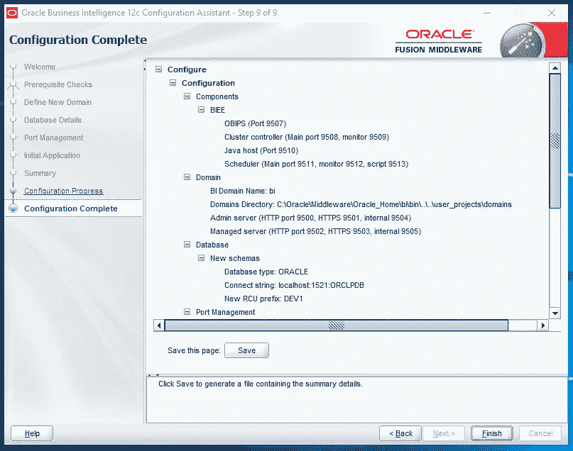

Click “Finish”

据称，在你点击“完成”后，浏览器窗口会打开 OBIEE 登录页面。如果您没有这样做，我们可以手动访问 OBIEE。打开您的浏览器并打开此 URL。

```
http://localhost:9502/analytics/saw.dll?bieehome&startPage=1
```

您应该会看到类似这样的网页—使用您的 weblogic 用户名和密码登录。

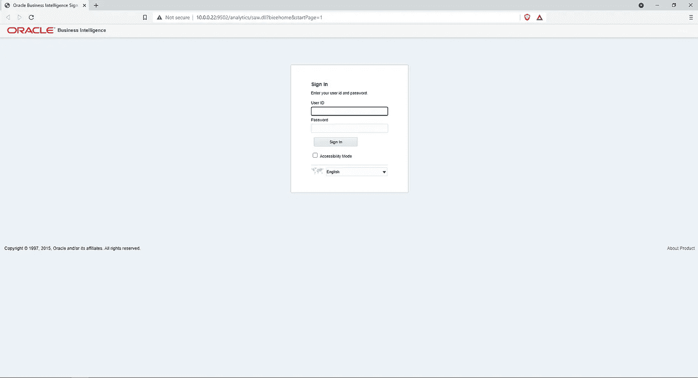

哦，天哪——成功了。

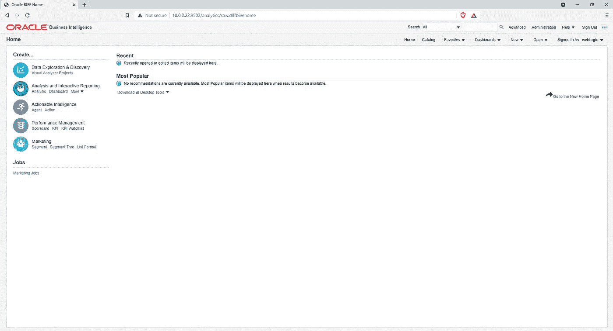

我太高兴了。在我结束之前的最后一件事——让我们来谈谈在计算机重新启动之前和之后应该做些什么。


首先，导航到以下目录。

```
chdir C:\Oracle\Middleware\Oracle_Home\user_projects\domains\bi\bitools\bin
```

接下来，运行这个脚本来启动 OBIEE。

```
./start.cmd
```

要关闭 OBIEE，请在同一个目录中运行这个脚本。

```
./stop.cmd
```

要检查 OBIEE 的状态，请在同一个目录中运行这个脚本。

```
./status.cmd
```