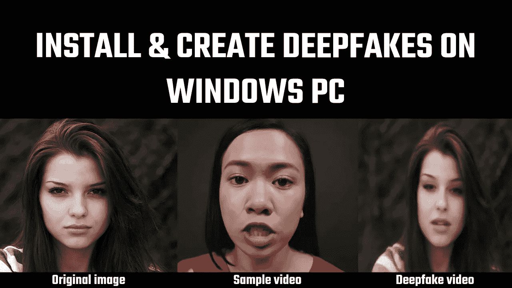

# 在 Windows 上安装并创建 deepfake(一阶模型)

> 原文：<https://medium.com/geekculture/install-and-create-deepfake-first-order-model-on-windows-57bb99e5c54b?source=collection_archive---------4----------------------->

用任何视频为您的图像制作动画

使用这个 python 应用程序，您可以使用参考视频制作任何图像的动画，这意味着图像将根据视频上的运动制作动画。本文总结了如何在您的 Windows 计算机上安装这个应用程序，以及如何使用它来制作图像动画。各种模块的安装需要一些时间…