# 在 Windows 和 Linux 上安装 CUDA 和 CUDNN

> 原文：<https://medium.com/geekculture/install-cuda-and-cudnn-on-windows-linux-52d1501a8805?source=collection_archive---------0----------------------->

**内容**

*   [CUDA&cud nn FOR WINDOWS](#3e72)
*   [**CUDA&cud nn FOR LINUX**](#68ce)

(但首先✅Subscribe 到我的 YouTube 频道👉🏻[https://bit.ly/3Ap3sdi](https://bit.ly/3Ap3sdi)😁😜)

# 用于 WINDOWS 的 CUDA 和 CUDNN

## 步骤 1)下载并安装 CUDA 工具包

## 去 https://developer.nvidia.com/cuda-downloads[下载最新的 CUDA 工具包。](https://developer.nvidia.com/cuda-downloads)

您也可以从上面给出的同一页面上的参考资料部分的[以前的 CUDA 版本档案](https://developer.nvidia.com/cuda-toolkit-archive)中下载以前的版本。

(本教程我会下载安装 CUDA 11.0。可以最新的 CUDA 工具包及其对应的 cuDNN 文件。这只是为了演示)

转到[以前 CUDA 版本的档案](https://developer.nvidia.com/cuda-toolkit-archive)并点击 **CUDA Toolkit 11.0 更新 1** 。

*   在下一页，首先，选择您的操作系统为 Windows。
*   接下来，选择您的架构和版本。对于我的系统，架构是 x86_64，因为我有一个 64 位系统，windows 的版本是 10。(要了解您系统的架构，在 Windows 中，进入控制面板->系统和安全->系统。它将被称为系统类型)
*   接下来，选择要下载的任何安装程序类型。我已经下载了 exe(本地)类型的安装程序。
*   然后，您将看到使用大小为 2.7 GB 的基本安装程序的安装说明。下载完成后，点击 exe 文件并按照屏幕上的提示进行操作。

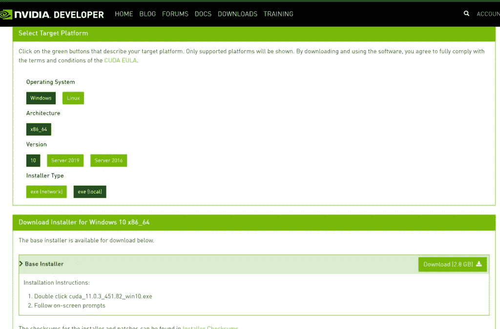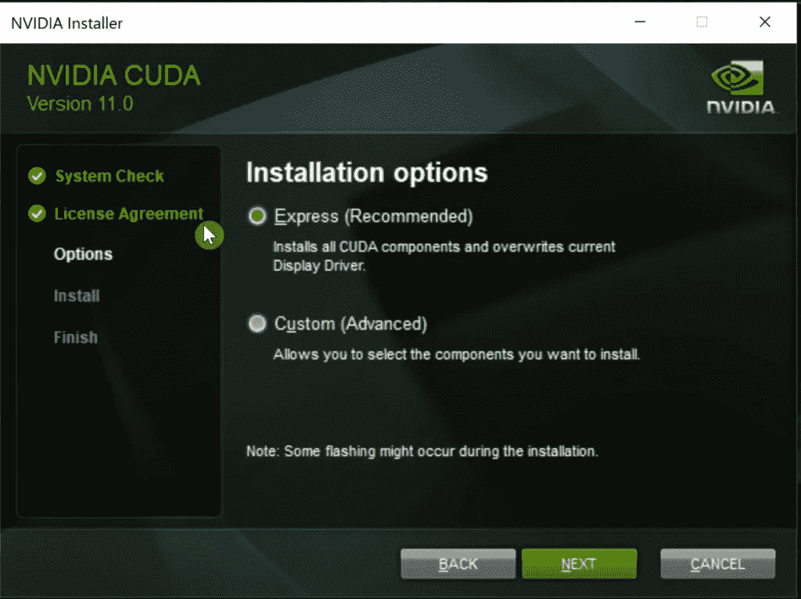

安装程序启动时，选择一个位置来解压缩安装程序。一旦完成，CUDA 安装程序将启动。在那里，选择**快速**安装并点击下一步。这将在您的系统上的 C:\ Program Files \ NVIDIA GPU Computing Toolkit 位置安装 CUDA Toolkit。

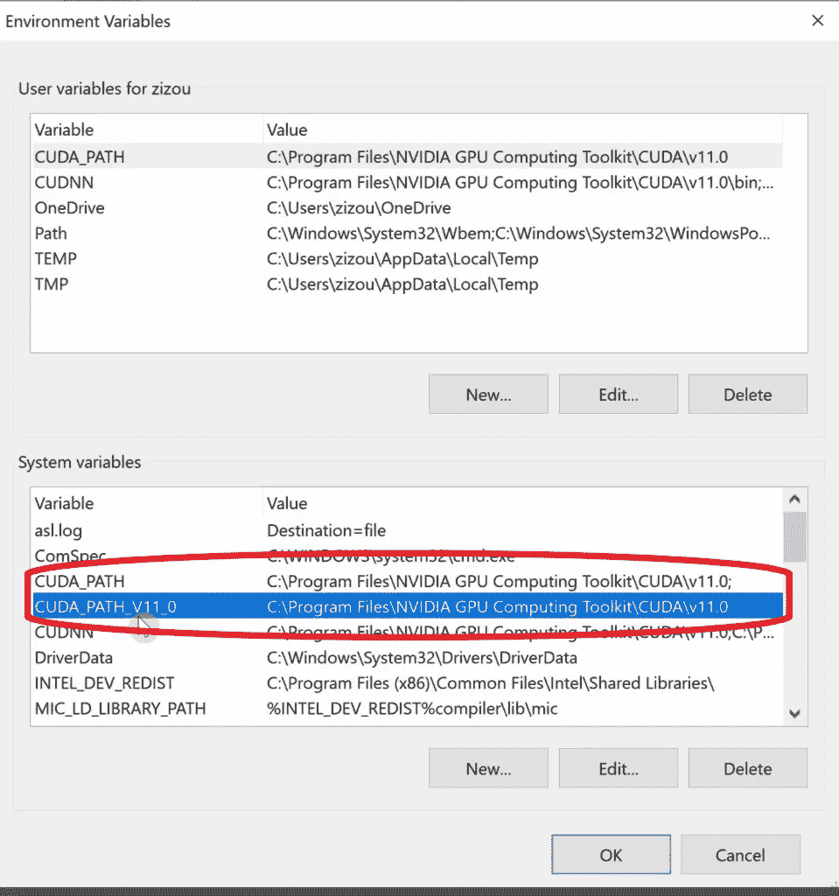

接下来，确保检查您的环境变量是否有如图所示的 CUDA 路径。(应该会自动添加第二个路径)如果没有，那么手动将它们添加到系统变量中。

*   CUDA _ PATH—-> C:\ Program Files \ NVIDIA GPU 计算工具包\CUDA\v11.0
*   CUDA _ PATH _ V11 _ 0—→C:\ Program Files \ NVIDIA GPU 计算工具包\CUDA\v11.0

## 步骤 2)下载并安装 CUDNN

前往[https://developer.nvidia.com/cudnn](https://developer.nvidia.com/cudnn)下载 CUDNN 的最新版本以获取最新的 CUDA 工具包版本，或前往[https://developer.nvidia.com/rdp/cudnn-archive](https://developer.nvidia.com/rdp/cudnn-archive)下载与您的 CUDA 工具包兼容的 CUDNN 的先前版本。

**注意**:你必须使用你的 Nvidia 账户登录才能下载 CUDNN。如果您没有帐户，请创建一个。

因为我有 CUDA 11.0.1，所以我会为 CUDA 11.0 下载 cuDNN 8.0.5

点击 **cuDNN 8.0.5** ，选择**cud nn Library for Windows(x86)**。

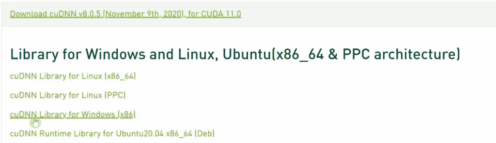

接下来，它会要求您登录。创建一个 Nvidia 帐户或使用谷歌或脸书登录。登录后，您可以下载 cuDNN。下载并解压。

将 cuDNN 文件夹内的 ***cuda*** 文件夹的内容复制到上面步骤 1 中我们安装 cuda 的路径。(我们需要 cuDNN 的 **bin** 、**include**&**lib**文件夹的内容在 CUDA 目录的 **bin** 、 **include** 和 **lib** 文件夹内)

**从该文件夹**中复制内容

**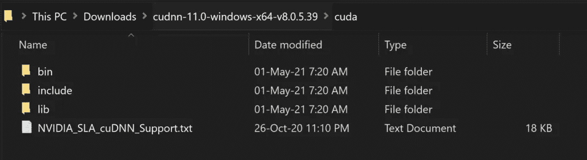**

****到这个文件夹****

**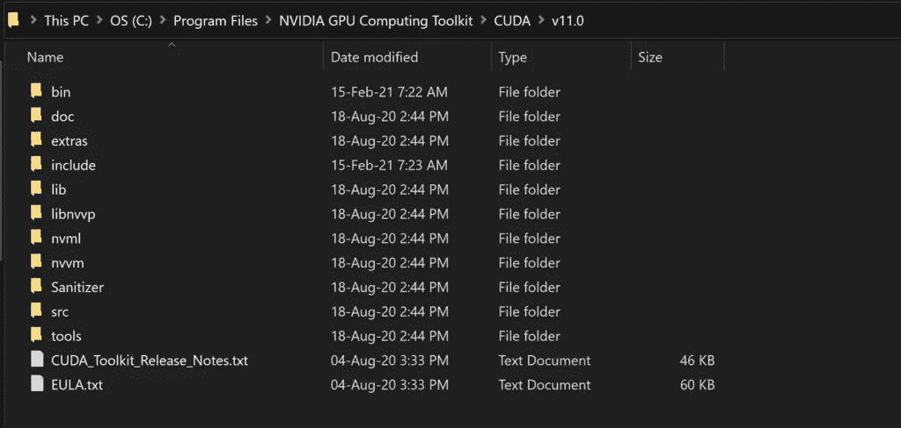**

**最后，就像我们为 CUDA 所做的一样，我们也必须为 cuDNN 设置环境变量。见下图。**

**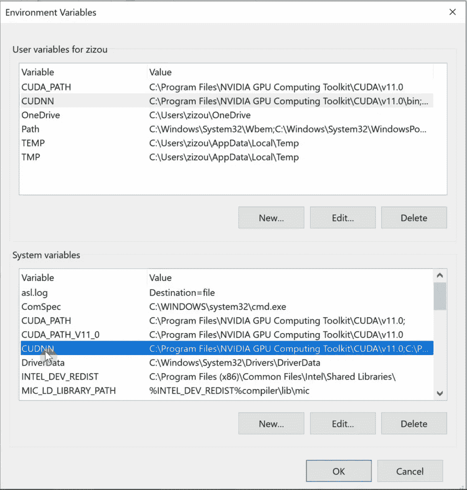**

**将名为 **CUDNN** 的系统变量设置为指向我们复制到 CUDA 目录中的 bin、include 和 lib 文件夹。此外，将这些相同的路径添加到系统变量 **Path** 中。**

**要添加的路径如下所述:**

**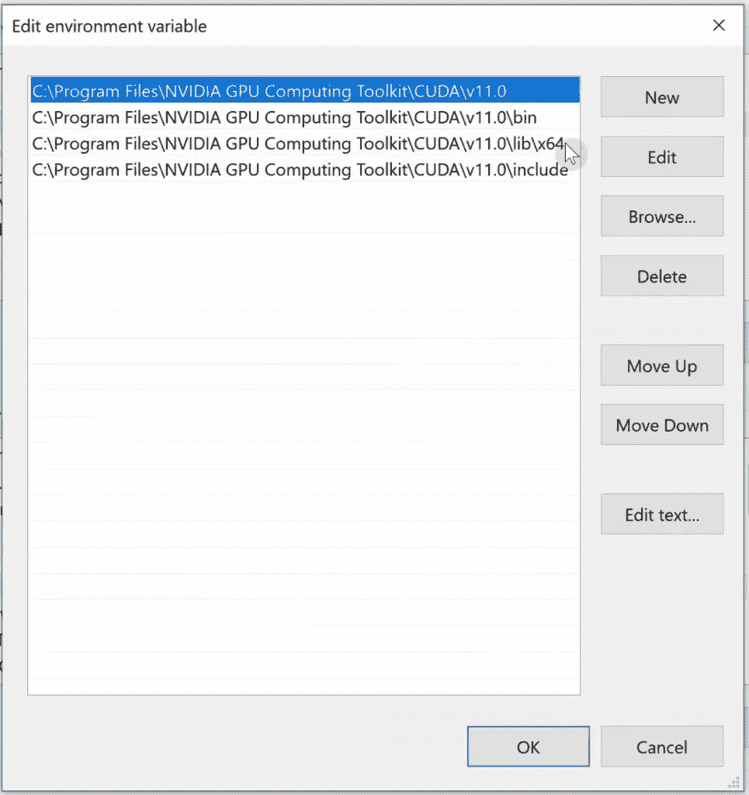**

*   **C:\Program Files\NVIDIA GPU 计算工具包\ CUDA \ v11.0**
*   **C:\Program Files\NVIDIA GPU 计算工具包\ CUDA \ v11.0 \ bin**
*   **C:\Program Files\NVIDIA GPU 计算工具包\ CUDA \ v11.0 \ include**
*   **C:\Program Files\NVIDIA GPU 计算工具包\ CUDA \ v11.0 \ lib**

****注意:**确保将这些路径添加到系统变量 **CUDNN** 和 **Path** 中。**

**就是这样。我们已经成功地在我们的 Windows 系统上设置了 CUDA 和 cuDNN。**

# **用于 LINUX 的 CUDA 和 CUDNN**

# **我们开始吧**

## **步骤 1)下载并安装 CUDA 工具包**

## **去 https://developer.nvidia.com/cuda-downloads[下载最新的 CUDA 工具包。](https://developer.nvidia.com/cuda-downloads)**

**您也可以从上面给出的同一页面上的参考资料部分的[以前的 CUDA 版本档案](https://developer.nvidia.com/cuda-toolkit-archive)中下载以前的版本。**

**(本教程我会下载安装 CUDA 11.0。可以最新的 CUDA 工具包及其对应的 cuDNN 文件。这只是为了演示。)**

**进入[以前 CUDA 版本的档案](https://developer.nvidia.com/cuda-toolkit-archive)，点击 **CUDA Toolkit 11.0 Update1** 。**

*   **在下一页，首先，选择您的操作系统为 Linux。**
*   **接下来，选择您的架构、发行版和版本。对于我的系统，架构是 x86_64，因为我有一个 64 位的 Ubuntu 系统，Ubuntu 的版本是 18.04。**
*   **接下来，选择要下载的任何安装程序类型。我已经下载了 runfile(本地)类型的安装程序。**
*   **然后，您将在基本安装程序的安装说明中看到一些命令。**

****

*   ****接下来，打开一个终端。****
*   **首先，运行以下命令来更新和升级你的 Ubuntu 上的所有软件包。**

```
**sudo apt-get update
sudo apt-get upgrade**
```

*   ****接下来，安装所有必要的依赖项****

```
**sudo apt-get install build-essential cmake unzip pkg-config
sudo apt-get install gcc-6 g++-6 
sudo apt-get install libxmu-dev libxi-dev libglu1-mesa libglu1-mesa-dev
sudo apt-get install libjpeg-dev libpng-dev libtiff-dev
sudo apt-get install libavcodec-dev libavformat-dev libswscale-dev libv4l-dev
sudo apt-get install libxvidcore-dev libx264-dev
sudo apt-get install libopenblas-dev libatlas-base-dev liblapack-dev gfortran
sudo apt-get install libhdf5-serial-dev
sudo apt-get install python3-dev python3-tk python-imaging-tk
sudo apt-get install libgtk-3-dev**
```

*   ****接下来，将** `**ppa:graphics-drivers/ppa**` **存储库添加到您的系统中。****

```
**sudo add-apt-repository ppa:graphics-drivers/ppa
sudo apt update**
```

*   ****接下来，安装与您的 CUDA 版本兼容的 NVidia 驱动程序。对于 CUDA 11.0，Linux 的最低驱动程序版本是> = 450.36.06。****

**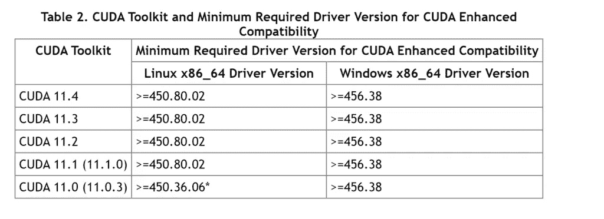**

```
**sudo apt-get install nvidia-driver-450**
```

**(您可以通过下面的链接了解所需的最低驱动程序版本。)**

**[https://docs . NVIDIA . com/deploy/cuda-compatibility/index . html](https://docs.nvidia.com/deploy/cuda-compatibility/index.html)**

**[https://docs . NVIDIA . com/cuda/cuda-toolkit-release-notes/index . html](https://docs.nvidia.com/cuda/cuda-toolkit-release-notes/index.html)**

*   ****接下来，创建一个文件夹，并运行基本安装程序的安装说明中的命令。****

```
**cd ~
mkdir installers
cd installers/****wget https://developer.download.nvidia.com/compute/cuda/11.0.3/local_installers/cuda_11.0.3_450.51.06_linux.run
sudo sh cuda_11.0.3_450.51.06_linux.run**
```

**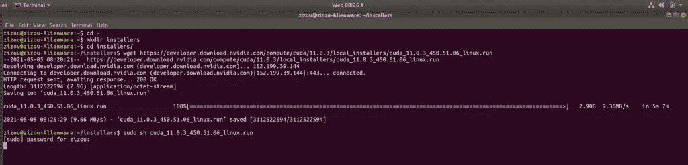**

*   ****当安装程序开始接受 EULA 协议时，在下一个屏幕上取消选中 NVidia 驱动程序选项，因为我们之前已经手动安装了它，最后按 Enter 安装 CUDA。****

**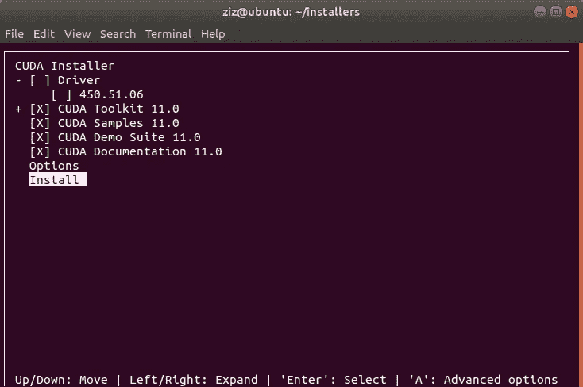**

**在 CUDA 安装结束时，您会看到一个总结，如下所示。**

**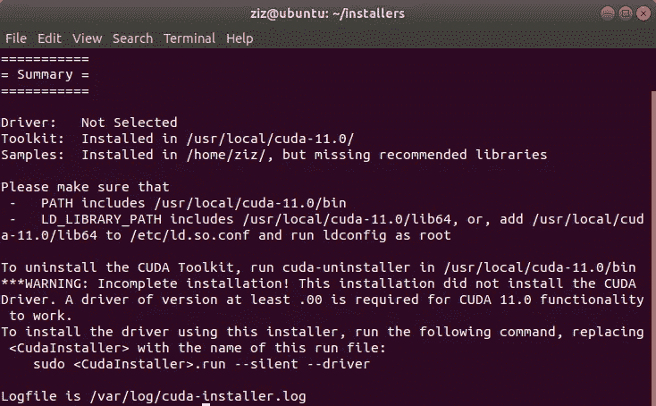**

*   ****接下来，使用以下命令打开 bashrc 脚本文件。****

```
**nano ~/.bashrc**
```

*   **在 bashrc 文件的末尾添加以下几行。**

```
**# NVIDIA CUDA TOOLKIT
export PATH=/usr/local/cuda-11.0/bin${PATH:+:${PATH}}
export LD_LIBRARY_PATH=/usr/local/cuda-11.0/lib64${LD_LIBRARY_PATH:+:${LD_LIBRARY_PATH}}**
```

**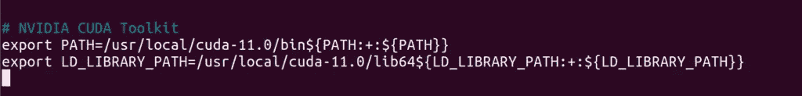**

**bashrc 文件如下所示:**

**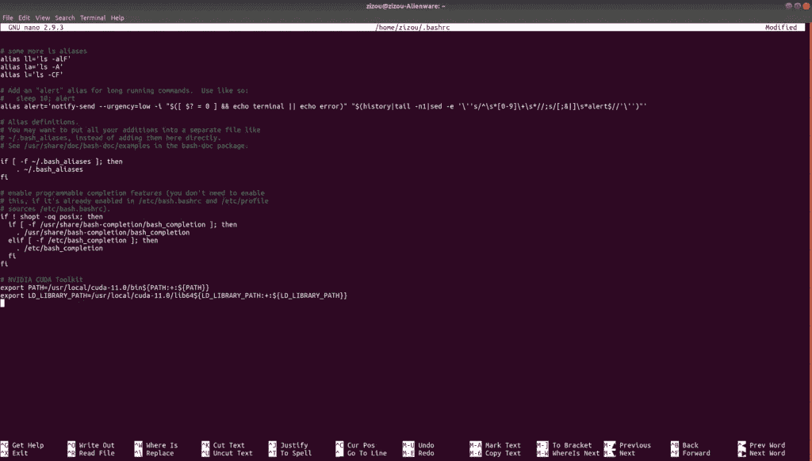**

****按 Ctrl + x，y，回车保存更改。****

*   ****接下来，运行 source 命令来更新当前的 shell 环境。****

```
**source ~/.bashrc**
```

**就是这样！我们已经成功地在我们的系统上安装了 CUDA。运行 **sudo reboot** 重新启动系统，使新的更改生效。ubuntu 重启后，你可以通过运行 **nvcc -V** 和 **nvidia-smi** 命令来确认你的 CUDA 安装。**

**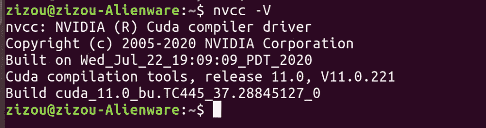**

## **步骤 2)下载并安装 CUDNN**

**前往[https://developer.nvidia.com/cudnn](https://developer.nvidia.com/cudnn)下载 CUDNN 的最新版本以获取最新的 CUDA 工具包版本，或前往[https://developer.nvidia.com/rdp/cudnn-archive](https://developer.nvidia.com/rdp/cudnn-archive)下载与您的 CUDA 工具包兼容的 CUDNN 的先前版本。**

****注意**:您必须使用您的 Nvidia 帐户登录才能下载 CUDNN。如果您没有帐户，请创建一个。**

**因为我有 CUDA 11.0.1，所以我会为 CUDA 11.0 下载 cuDNN 8.0.5**

*   **点击 **cuDNN 8.0.5** ，选择**cud nn Library for Linux(x86 _ 64)**。**

**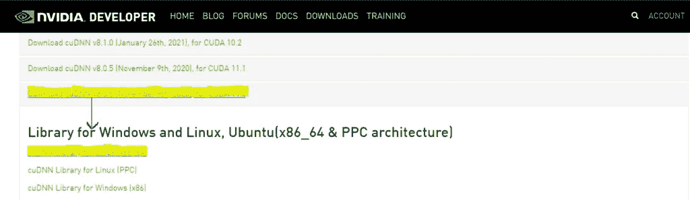****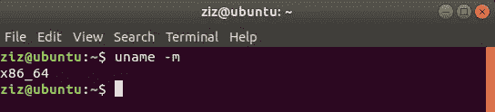**

> ****注意**:您可以在终端中使用命令 **uname -m** 来检查您的架构。**

*   **接下来，它会要求您登录。创建一个 Nvidia 帐户或使用谷歌或脸书登录。登录后，您可以下载 cuDNN 文件。**
*   **将下载的 cuDNN zip 文件复制到 ***安装程序*** 文件夹中。**

**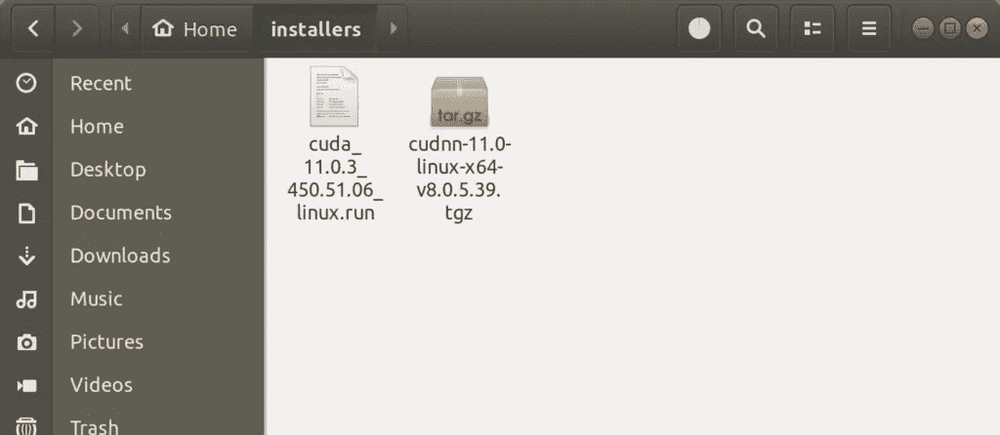**

*   **使用以下命令解压缩 cuDNN zip 文件。解压后你会看到一个名为 ***cuda*** 的文件夹，里面有 ***包括*** 和 ***lib64*** 子文件夹。**

```
tar -zxf cudnn-11.0-linux-x64-v8.0.5.39.tgz
```

**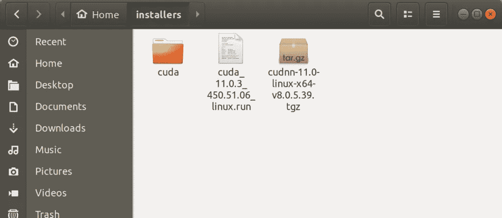**

*   **接下来，我们必须将这些子文件夹的内容复制到上面步骤 1 中安装 CUDA 的路径。**

****将 CUDNN** 和**解压后的 CUDA 文件夹中的内容复制到 CUDA 主目录****

**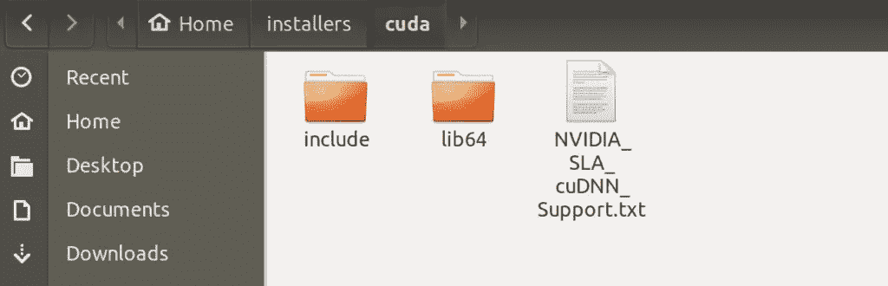**

*   **我们需要 cuDNN 中的**include**&**lib 64**文件夹的内容在 CUDA 目录的 **include** 和 **lib64** 文件夹中(我们在上面的步骤 1 中安装了 CUDA)。运行以下命令:**

```
**cd cuda
sudo cp -P lib64/* /usr/local/cuda/lib64/
sudo cp -P include/* /usr/local/cuda/include/**
```

**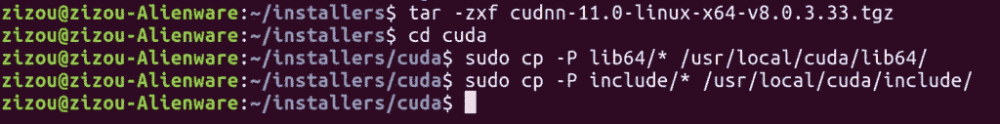**

**就是这样。我们已经成功地在我们的 Linux Ubuntu 18.04 系统上设置了 CUDA 和 cuDNN。**

# **参考**

**[https://developer.nvidia.com/](https://developer.nvidia.com/)**