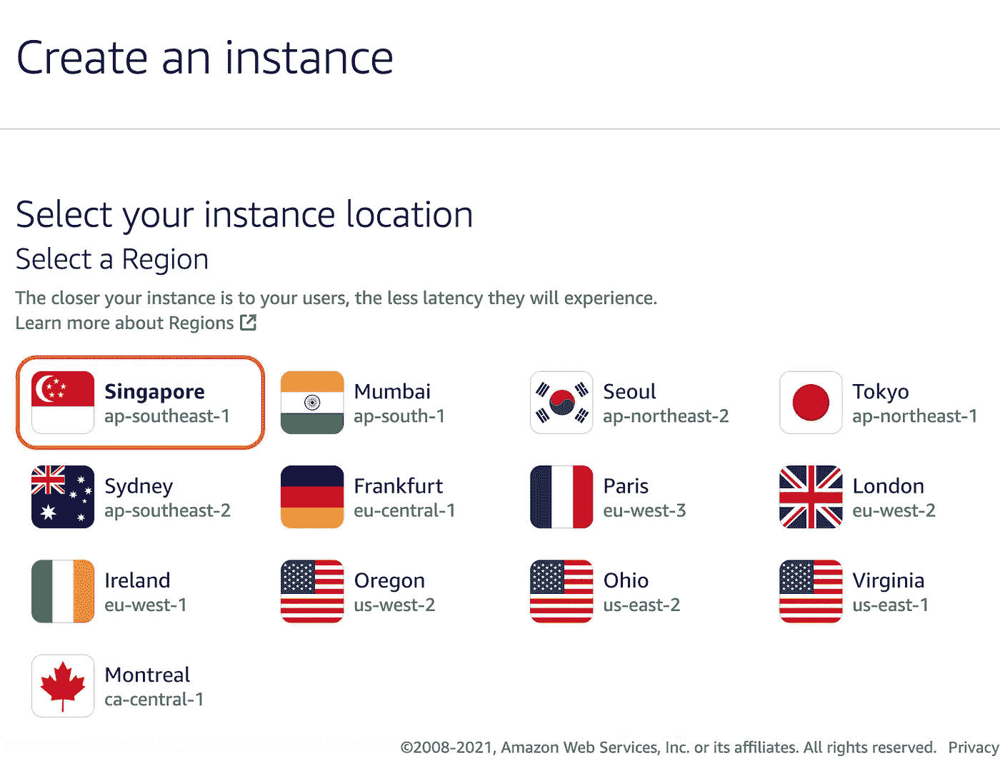
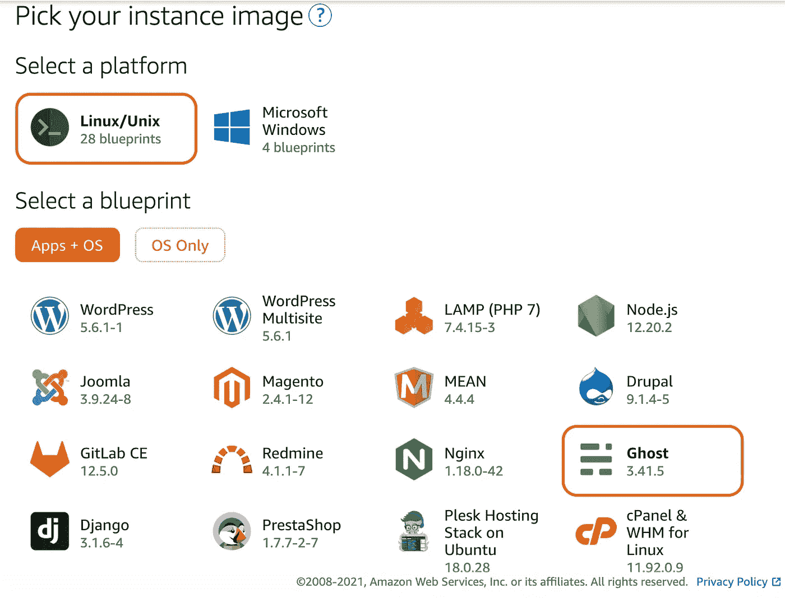
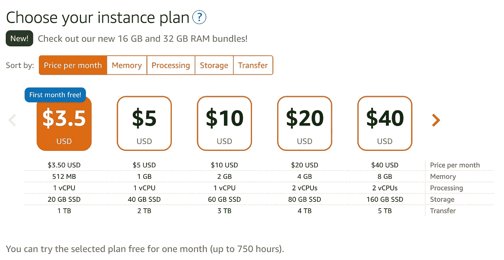
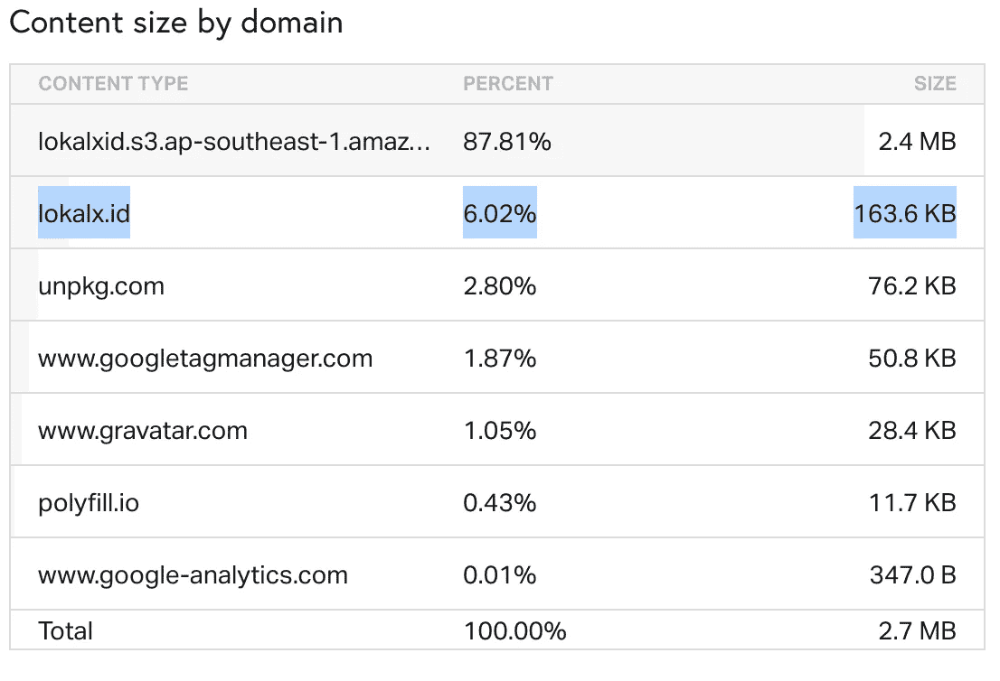
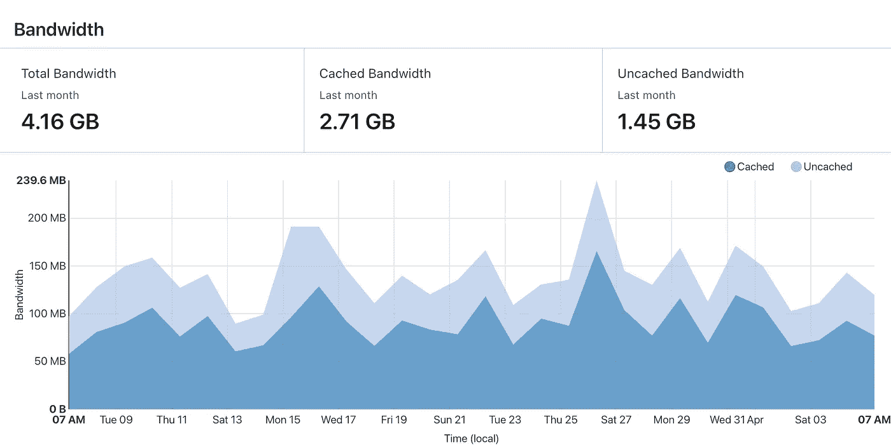
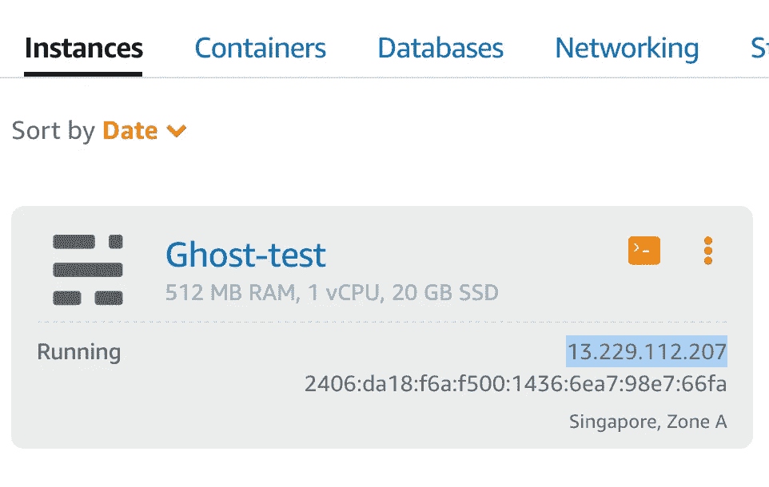
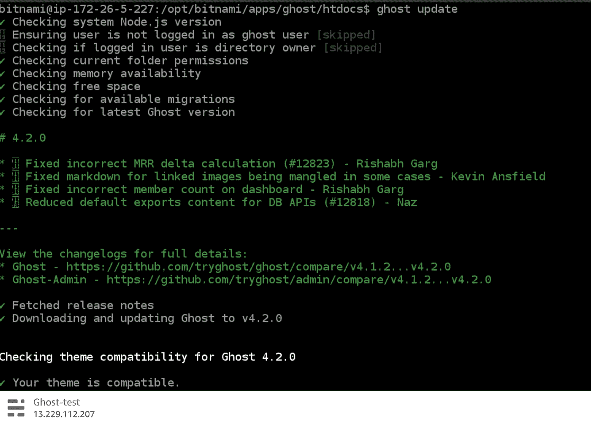
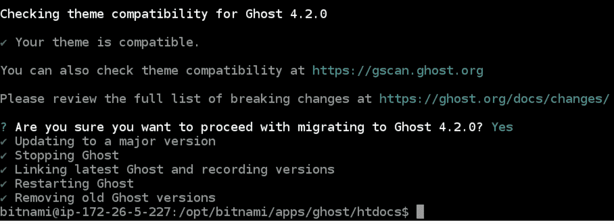
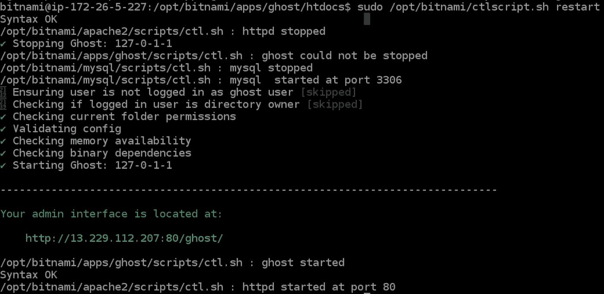
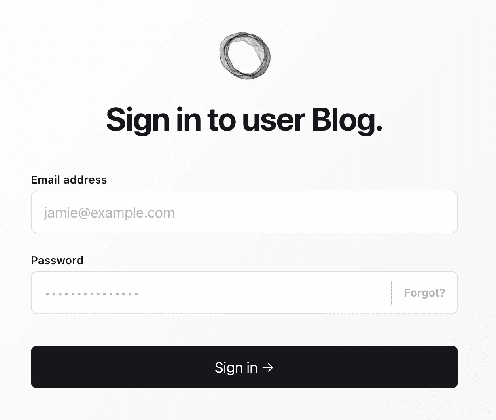

# 使用 Bitnami 和 S3 集成和 Mailgun 在亚马逊 Lightsail 上安装 Ghost 4.0

> 原文：<https://medium.com/geekculture/install-ghost-4-0-on-amazon-lightsail-using-bitnami-with-s3-integration-and-mailgun-f667d9f5e32b?source=collection_archive---------6----------------------->

我太激动了，Ghost 4.0 终于推出了！我一直在使用安装在 AWS EC2 上的 Ghost CMS 2 . x-3x 版本，映像托管在 S3 上。

Ghost CMS 已经成为我自己的新闻平台 https://lokalx.id 最喜欢的 CMS，我为之激动不已！我还收到了一些以前客户的请求，要求在他们自己的服务器上安装 Ghost CMS。

几年前我也听说过亚马逊 Lightsail，对此我也印象深刻。因为比有 EC2 更简单，而且花费更少！但我今年才有机会尝试一下。

> 我们可以在这里看到对比[https://www . VPS benchmarks . com/compare/features/ec2 _ vs _ light sail](https://www.vpsbenchmarks.com/compare/features/ec2_vs_lightsail)

# 在 LightSail 上创建实例

与 EC2 相比，在 Amazon LightSail 上创建实例要简单得多。你可以登录你的控制台，进入 https://lightsail.aws.amazon.com/ls/webapp/home/instances 的，点击**“创建实例按钮”**

让我用最简单的方式给你解释一下。

## 1.选择您的实例位置



Create an instance on Amazon LightSail

从那里，你可以选择你自己的地区。这里的区域是指离您的目标客户最近的服务器。例如，如果我的客户在印度尼西亚，我将选择新加坡作为地区，因为印度尼西亚离新加坡很近。如果我的客户是德国人，那么我将选择法兰克福作为地区。

为什么是地区？因为位置越近，我们的客户访问它的速度就越快。他们不需要远行！

## **2。选择你的实例图片**



感谢上帝！因为**亚马逊** **LightSail** 也支持**基于容器的**所以我们不需要从零开始设置一切。它节省了我们的时间和精力！我们也不需要设置 docker！😆😆😆

因为我们想安装 **Ghost** ，所以在 **Apps + OS 部分**选择 Ghost。这个来自亚马逊市场的幽灵是由 **Bitnami** 认证的。那是什么？

> 由 Bitnami 认证的 Ghost 是一个开源发布平台，旨在创建博客、杂志和新闻网站。它包括一个简单的 markdown 编辑器，内置了预览、主题和 SEO 来简化编辑。Bitnami 证明该映像是安全的、最新的，并且使用行业最佳实践进行打包。

## 3.创建 SSH 密钥对或使用默认密钥对


*   如果您希望有一些自动化过程，您可以稍后添加一个启动脚本。
*   如果您想要创建新的密钥对，请单击**创建新的+** 。对于我，我保留默认的密钥对，并将其保存到本地，以便我可以通过我的终端登录。

**4。选择你的实例计划**



*   Amazon Lightsail 按小时向我们收费，如果我们的实例一个月 24 小时处于活动状态，他们还会显示每月的价格。
*   根据自己的需求选择。我选择 **$3.5** ，因为我不需要大存储和大内存，因为我使用 **S3** 来存储它们。我的网站并没有消耗太多的内存/资源，因为我也使用 **Cloudflare** 作为防火墙和缓存请求，以及来自 **Cloudflare** 的一些有益于网站的好功能。如下图所示，我的网站内容大小只有 **163.6kb** 。所以大概一个月 3.5 美元就绰绰有余了！



## **4。**确定并创建您的实例


选择唯一的名称，并使用标记选项对实例类型进行分类。这让您可以很容易地看到这个实例在账单中向您收取了多少费用。然后，点击**【创建实例】**按钮！并等待实例进程完成。

# 登录系统，将 Ghost 更新到 4.0

不幸的是，亚马逊市场上的 Bitnami 没有提供新的 Ghost 版本，只有 3.x 版本。但我很确定，到时候他们会更新的。要试用 Ghost 4.0 的新版本，我们需要手动更新。



成功创建实例后，您可以复制 IP 并在图像【http://13.229.112.207[上打开您的浏览器示例](http://13.229.112.207)。您也可以点击控制台图标(> _)登录到浏览器的终端。

## **1。安装库并更新 CLI**

```
cd /opt/bitnami/apps/ghost/lib/
```

*   我们需要转到 ghost 的节点库的安装路径。每次你想添加一个插件，你可以去这个路径，并做 npm 安装。

```
echo ‘{}’ | sudo tee package.json
sudo npm i ghost-cli@latest
```

*   首先，我们将 package.json 设置为空，以防止错误安装。之后，更新 Ghost CLI，如果您想安装另一个库，就不需要再这样做了。

```
sudo npm i ghost-storage-adapter-s3@latest
```

*   我们还需要为 Amazon s3 安装一个存储适配器。因此，我们可以连接我们的存储，并将所有图像资产存储到亚马逊 S3 中。我用的是[ghost-storage-adapter-S3](https://github.com/colinmeinke/ghost-storage-adapter-s3)

## 2.更新幽灵

```
cd /opt/bitnami/apps/ghost/htdocs/
```

*   我们走这条路，因为这是我们的幽灵 CMS 的主要路径。

```
ghost update v3
```

*   我们需要将其更新到 Ghost CMS 的最新版本 3，因为我们不能完全跳到 v4。

```
ghost update
```



抓住你了。我们终于成功地将我们的 Ghost 更新到了 4.2.0！

# 设置 S3 适配器和喷枪

```
cp -rf config.production.json backup.json
nano config.production.json
```

*   首先备份你的配置，以防出错。然后之后就可以编辑 **config.production.json** 关注下面我的配置。

*   你只需要编辑 3 件事:**网址，邮件，和存储。**
*   **网址:**替换你的域名网址，并确保设置添加记录，并指向你的域名主机。
*   更多关于**邮件**的信息，你可以阅读这篇[https://ghost.org/docs/config/#mail](https://ghost.org/docs/config/#mail)
*   有关**存储**的更多信息，您可以阅读此[https://ghost.org/docs/config/#storage-adapters](https://ghost.org/docs/config/#storage-adapters)

```
cp -rf /opt/bitnami/apps/ghost/lib/node_modules/ghost-storage-adapter-s3 /opt/bitnami/apps/ghost/htdocs/versions/4.2.0/core/server/adapters/storage/s3
```

*   我们需要将模块复制到我们的存储适配器中。用 Ghost CMS 版本替换 4.2.0。

```
sudo /opt/bitnami/ctlscript.sh restart
```

[重启服务器](https://docs.bitnami.com/ibm/apps/ghost/administration/control-services/)，恭喜你，我们终于完成了亚马逊 S3 和电子邮件的设置！🍻🎉🎉🎉



那么我如何登录呢？？😂 😂😂

```
sudo cat /home/bitnami/bitnami_credentials
```

*   在终端上运行，你会看到你的用户名和密码登录！

# **附加**

*   如果你不想看到 Bitnami 的标志。只需运行这个命令。

```
sudo /opt/bitnami/apps/ghost/bnconfig --disable_banner 1
```

*   如果由于未知错误导致导入内容失败。别忘了先上传你的模板，[卡斯珀](https://github.com/TryGhost/Casper)或[利布林](https://ghost.org/themes/liebling/)，然后重新启动。

```
sudo /opt/bitnami/ctlscript.sh restart
```

*   您可以在此路径中编辑模板。只要选择你的主题！

```
/opt/bitnami/apps/ghost/htdocs/content/themes
```

# 奖金

这里是所有命令的列表，以防您需要它们来验证您的命令。

# 2021 年 7 月 22 日更新

我在安装新版 Ghost CMS 时遇到了一些问题。因此，我将尝试在这里重述它。

## 消息:Ghost v4.10.0 与当前节点版本不兼容。

您可能需要将 NodeJS 版本更新到最新版本。

```
sudo npm install -g n
sudo n stable
```

之后，你需要更新你的**。bashrc**

```
nano ~/.bashrcFind and replace **/opt/bitnami/nodejs/bin/node** with **/usr/local/bin/node**
```

然后通过以下方式更新您的 ghost

```
ghost update
```

## 消息:无效的邮件服务
配置密钥:mail.options.service

这很奇怪，因为你可以 ghost stop 和 ghost start，而你只需要使用 **ghost restart。**

## 在 Bitnami 上启用 apache2 HTTP/2 支持

打开 httpd.conf

```
nano /opt/bitnami/apache2/conf/httpd.conf
```

注释掉下面一行

```
LoadModule mpm_event_module modules/mod_mpm_event.so
# LoadModule mpm_prefork_module modules/mod_mpm_prefork.so
LoadModule http2_module modules/mod_http2.so
```

打开 bitnami.conf

```
sudo nano /opt/bitnami/apache2/conf/bitnami/bitnami.conf
```

添加以下一行

```
<VirtualHost _default_:80>
....
 Protocols h2 h2c http/1.1
 H2Direct on
</VirtualHost><VirtualHost _default_:443>
....
Protocols h2 h2c http/1.1
H2Direct on
</VirtualHost>
```

然后重启

```
sudo /opt/bitnami/ctlscript.sh restart apache
```

你忘记 ghost 管理员密码了吗？
你大概想看这篇文章[https://www.geekinsta.com/how-to-reset-ghost-password/](https://www.geekinsta.com/how-to-reset-ghost-password/)

希望这有帮助！请[给我](mailto:hi@rahmatramadhan.com)一些反馈！