# 在 Raspberry Pi 上安装 Git 和 Visual Studio 代码

> 原文：<https://medium.com/geekculture/install-git-and-visual-studio-code-on-raspberry-pi-48d054fdee07?source=collection_archive---------15----------------------->

## 树莓上的 Git 和 Visual Studio

作者:[爱德华多·帕德隆](https://fullmakeralchemist.medium.com)

# 1.吃树莓

## 1.1 在覆盆子上安装 Git

在本指南中，您将学习如何安装和使用 Git 版本控制软件，在 Raspberry 中处理您自己的项目。

您将要学习的内容:

*   在树莓上安装 Git
*   创建一个存储库并上传到 Github

我们将在本指南中使用 SSH Raspberry 的知识，使用 Putty 中的 Raspberry Shell，并输入以下命令。

```
sudo apt install git
```


Screenshot by [Eduardo Padron](https://fullmakeralchemist.medium.com/)

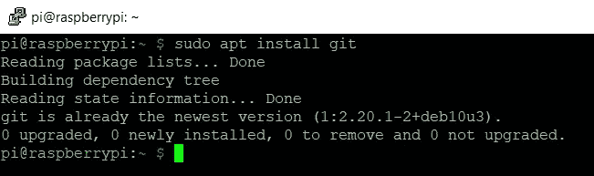

Screenshot by [Eduardo Padron](https://fullmakeralchemist.medium.com/)

## 1.2 设置 Git

我们必须做的第一件事是将我们的信息输入 Git。这很重要，因为许多人可以协作使用 Git，所以您需要知道谁对哪些文件进行了更改。您可以使用自己的用户名和电子邮件地址。

因此我们将输入以下命令:

```
git config --global user.name "usuariogit"git config --global user.email "emailusuariogit@mail.com"
```

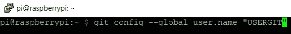

Screenshot by [Eduardo Padron](https://fullmakeralchemist.medium.com/)

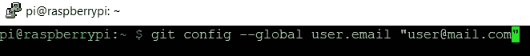

Screenshot by [Eduardo Padron](https://fullmakeralchemist.medium.com/)

接下来，您需要告诉 Git 您想要使用哪个文本编辑器。如果您没有最喜欢的编辑器，您可以简单地键入:

```
git config --global core.editor nano
```

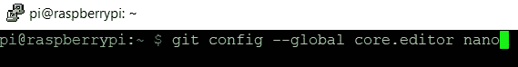

Screenshot by [Eduardo Padron](https://fullmakeralchemist.medium.com/)

## 1.3 创建我们的第一个项目

你想开始一个新项目吗？也许是像贾维斯这样的机器人时刻守护着你。你需要在你的电脑上有一个目录来存放你所有的文件，所以首先要做的就是创建这个目录。
在终端中，你可以使用 ls 命令(列出当前目录的内容)来检查文件夹和文件。
在终端中，你可以使用 cd(改变目录)命令来改变一个新的目录。
在终端中，你可以使用命令 mkdir(创建目录)来创建一个新的目录。

```
lscd Desktopmkdir snitch-sniffercd snitch-sniffer
```

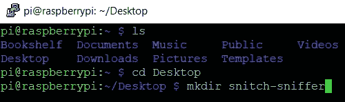

Screenshot by [Eduardo Padron](https://fullmakeralchemist.medium.com/)

然后你可以创建一个文件，告诉人们这个项目是关于什么的。您可以使用任何文本编辑器来完成此操作，如记事本或稍后当我们有 Visual Studio 代码时，您可以制作第二个文件来练习。创建名为 README.md 的文件。md extension 代表 Markdown，是一种标记语言。你可以在这里了解更多关于降价[的信息。要从 Raspberry Shell 创建文件，我们将使用以下命令:](https://daringfireball.net/projects/markdown/)

```
nano README.md
```

现在我们可以在文件中输入文本，保存文件“Ctrl + O”，最后退出编辑器“Ctrl + X”。
第二种选择是利用之前对[无线设置](https://fullmakeralchemist.medium.com/configuraci%C3%B3n-inicial-de-raspberry-pi-4-sin-monitor-mouse-y-teclado-e9678a005e6)的了解，通过 VNC 进入并创建文件。正如在任何计算机中，我们将使用右键单击，新的选项，并给文件一个名称和扩展名。

我将以下文本放在 README.md 文件中

Code by [Eduardo Padron](https://github.com/fullmakeralchemist)

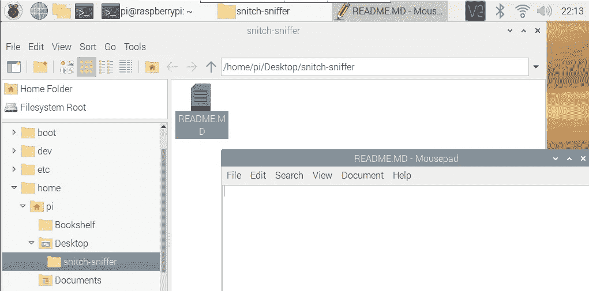

Screenshot by [Eduardo Padron](https://fullmakeralchemist.medium.com/)

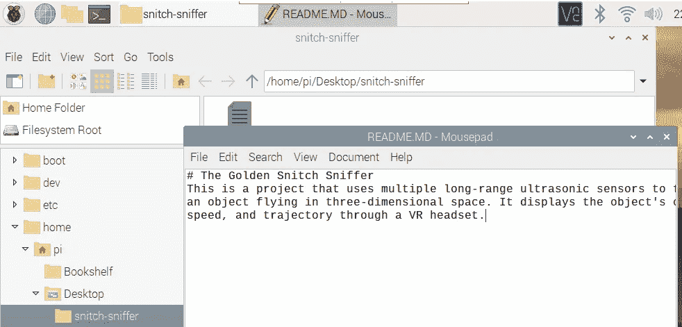

Screenshot by [Eduardo Padron](https://fullmakeralchemist.medium.com/)

您的文件应该已经创建好了，现在位于您的目录中。您可以在终端中键入以下命令来查看文件列表。

```
ls
```

目前，该目录与系统中的其他目录一样。现在你需要做版本控制部分。这被称为 Git 存储库，它采用隐藏目录的形式，跟踪工作目录中的所有更改。输入以下内容以创建存储库，从现在开始，该存储库将仅称为存储库:

```
git init
```

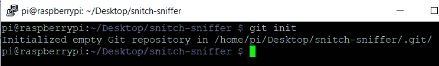

Screenshot by [Eduardo Padron](https://fullmakeralchemist.medium.com/)

如果您重新键入 ls，看起来没有任何变化。但是，您可以使用以下命令查看所有隐藏的文件和目录。

```
ls -a
```

现在，您应该会在终端窗口中看到类似这样的内容:

```
. .. .git README.md
```

那个。git 目录是存储库的骨架。您可以通过键入以下命令来查看内部情况:

```
ls -a .git
```

所以现在你有了魔法背包部分，但是你还没有给它添加任何东西。那个 README.md 文件还没有放到包里。您必须告诉 Git 您想要将 README.md 文件添加到存储库中。为此，只需键入:

```
git add README.md
```

然而，有时将所有内容添加到存储库中比添加单个文件更容易。为此，您可以编写:

```
git add — all
```

现在 Git 知道它需要跟踪 README.md 文件发生的所有变化。您可以通过键入以下命令随时查看存储库的状态:

```
git status
```

上面的回答告诉你 README.md 文件还没有提交。这意味着尽管 Git 知道这个文件，但是它还没有存储它的任何内容。最简单的提交方式是键入:

```
git commit -am “add README.md”
```

这将提交您对 Git 存储库中的目录所做的所有更改，并添加一条消息来说明您所做的事情。信息可以是任何东西，但最好是相当简短，但描述了发生了什么变化。

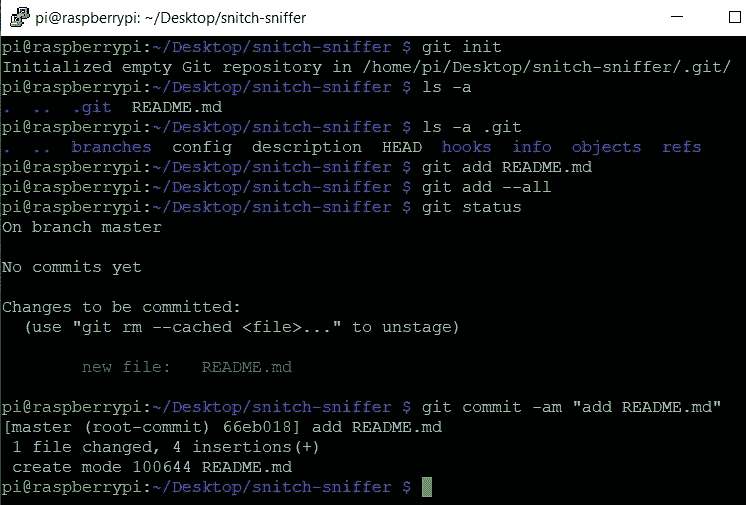

Screenshot by [Eduardo Padron](https://fullmakeralchemist.medium.com/)

## 1.4 使用 Github

既然您已经知道了如何在 Git 中完成基础工作，那么是时候学习如何充分发挥它的潜力，使用它来分享您的工作并与其他人协作了。

有许多服务将免费托管您的 Git 存储库。GitLab 是其中之一，BitBucket 是另一个。在这个资源中，您将使用 GitHub，这是最流行的服务之一。

你需要做的第一件事是注册一个 GitHub 账户，然后选择免费计划。

现在您有了一个帐户，您可以在 GitHub 上创建一个告密者嗅探器库。找到“新建存储库”按钮并单击它。

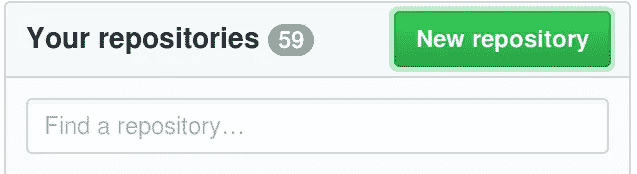

Image by [Raspberry Pi](https://projects-static.raspberrypi.org/projects/getting-started-with-git/27d3fc96df2b0e8d0447bf7b8881d701ac100d62/en/images/new-repo.png) from [Raspberry Pi](https://www.raspberrypi.org/)

为存储库提供名称和描述，然后单击“创建存储库”按钮。

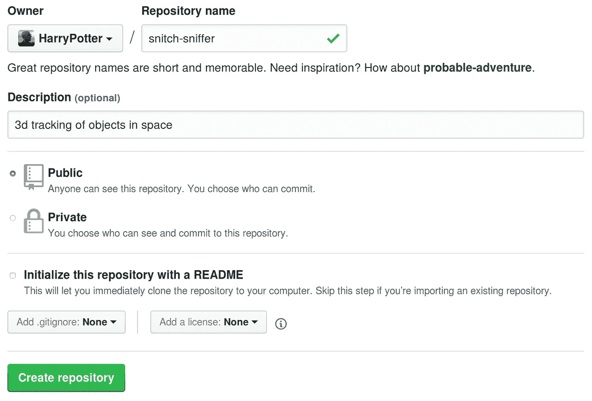

Image by [Raspberry Pi](https://projects-static.raspberrypi.org/projects/getting-started-with-git/27d3fc96df2b0e8d0447bf7b8881d701ac100d62/en/images/new-repo2.png) from [Raspberry Pi](https://www.raspberrypi.org/)

接下来，应该会出现一个说明页面。

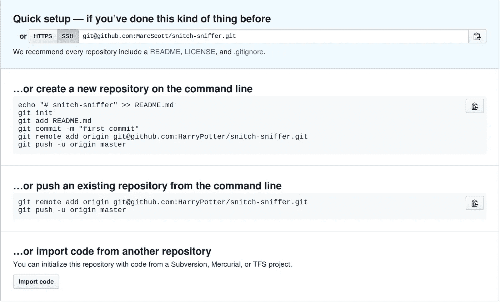

Image by [Raspberry Pi](https://projects-static.raspberrypi.org/projects/getting-started-with-git/27d3fc96df2b0e8d0447bf7b8881d701ac100d62/en/images/instructions.png) from [Raspberry Pi](https://www.raspberrypi.org/)

既然您已经有了一个准备推送到 GitHub 的存储库，那么您需要做的就是确保您在您的项目目录中并键入:

```
git remote add origin git@github.com:HarryPotter/snitch-sniffer.git
```

然后:

```
git push -u origin master
```

如果您搜索 GitHub，您现在应该能够看到您的存储库，以及显示的您编写的 README.md 文件。


Image by [Raspberry Pi](https://projects-static.raspberrypi.org/projects/getting-started-with-git/27d3fc96df2b0e8d0447bf7b8881d701ac100d62/en/images/gh-repo.png) from [Raspberry Pi](https://www.raspberrypi.org/)

每当您对项目进行更改并希望将它们推送到 GitHub 时，您可以编写:

```
git push origin master
```

如果你在一个不同的分支工作，你应该写:

```
git push origin <branch-name>
```

要了解更多关于 Git in Raspberry 的信息，我推荐你去 [Getting started with Git](https://projects.raspberrypi.org/en/projects/getting-started-with-git) 。

# 2.在树莓上安装 Visual Studio 代码。

## 2.1 安装

Thonny IDE(集成开发环境)捆绑了最新版本的 Raspberry Pi OS。Thonny 内置了 Python 3.7，所以不需要安装任何东西。

作为个人偏好，我最喜欢的 IDE 是 VS CODE，对于 Flask、Bots 和 Tensorflow 中的一些应用程序，我觉得在 VS 界面中工作更舒服。

好消息是 VS 代码现在可以作为 Raspberry Pi OS apt 包的一部分使用了。启动 Raspberry Pi 终端并运行以下命令:

```
sudo apt updatesudo apt full-upgradesudo apt install code -y
```

安装将需要一段时间，完成后，你可以通过 VNC 访问，并检查安装是否成功。

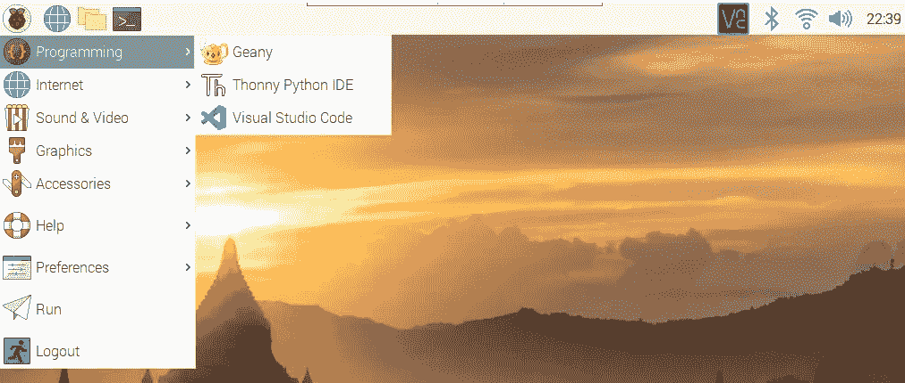

Screenshot by [Eduardo Padron](https://fullmakeralchemist.medium.com/)

准备好这些，我们可以开始使用 VS 代码和 Git，尝试使用你在本指南中学到的知识，用 VS 创建第二个存储库。

你也可以在我的 [Github 中查看这篇文章的资源库。](https://github.com/fullmakeralchemist/raspberrysetupes.git)