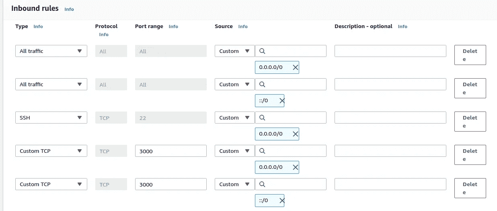
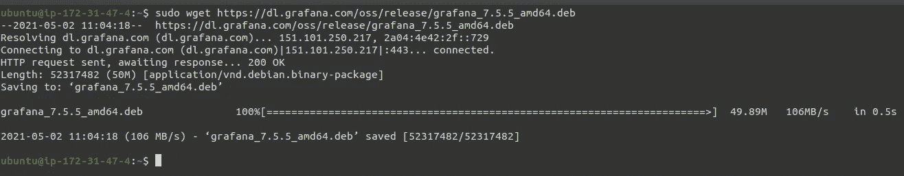
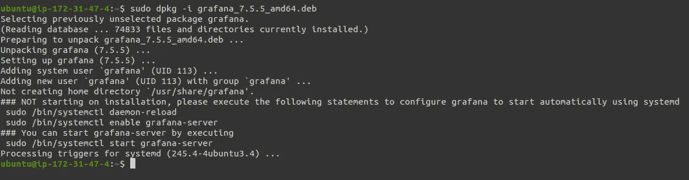
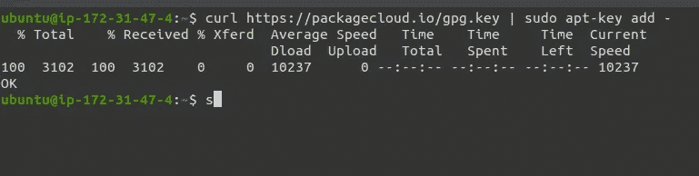
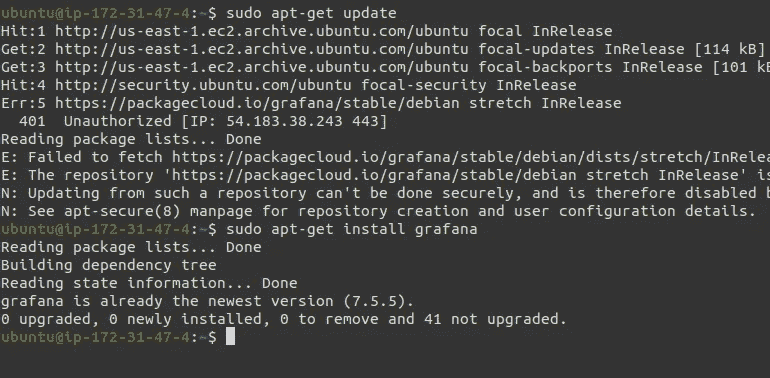
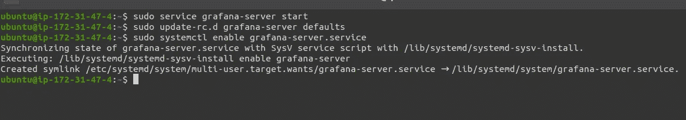
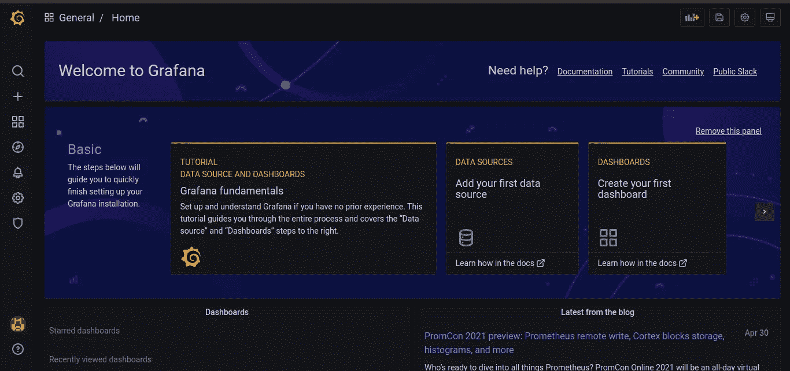

# 在任何云虚拟机中安装 Grafana 进行监控

> 原文：<https://medium.com/geekculture/install-grafana-in-any-cloud-vm-for-monitoring-868f6436162d?source=collection_archive---------6----------------------->

## 在 EC2 上安装 Grafana，并以自动启动方式启动


**Credit: Some Random dude on Google Images**

## Grafana 是什么？

Grafana 是一个很棒的工具，可以帮助你查询、可视化和创建可视化警报。终端用户可以使用交互式查询构建器创建复杂的监控仪表板。在这篇博客中，我们将把它安装在 AWS EC2 实例中。但是在不同的云虚拟机中安装它的方法是相似的，只有名称不同，如下所示


**cloud_comparison**

## **Grafana 功能:**

这是一个开源工具，所以它有一个很棒的社区，因为我们可以张贴任何类型的问题，互联网上的随机家伙肯定会尽快回答这些问题。

此外，它支持同一个仪表板中的所有主要数据库。

根据我的个人经验，这对于时间序列数据库来说工作得很好。我发现它非常有帮助。

## **在 EC2 实例中安装 Grafana 的步骤:**

*   使用基于 Ubuntu / Linux 的操作系统创建 EC2 实例
*   配置安全组
*   安装 Grafana
*   将 Grafana 添加到 APT 存储库
*   启动并向 Grafana 添加自动启动
*   登录 Grafana 仪表板

## **步骤 1:创建一个 EC2 实例**

你可以用 Ubuntu 创建一个 EC2 实例，并获取任何免费的东西，就像我刚才做的那样。

## **步骤 2:配置安全组**

使用开放 22 和 3000 端口创建一个安全组。

**22 端口→** ssh 访问

**3000 端口→** 通过网络浏览器访问 Grafana 仪表盘



**Security_rules**

## **第三步:安装 Grafana**

始终确保获得最新版本。您可以通过下面给出的链接进行验证，

[](https://grafana.com/grafana/download?platform=linux) [## 下载 Grafana

### 阅读 Ubuntu / Debian，我们还提供了安装指南以获取更多信息。APT 包存储库。OpenSUSE…

grafana.com](https://grafana.com/grafana/download?platform=linux) 

**代码:**

```
**sudo apt-get install -y adduser libfontconfig1****sudo wget** [**https://dl.grafana.com/oss/release/grafana_7.5.5_amd64.deb**](https://dl.grafana.com/oss/release/grafana_7.5.5_amd64.deb)
```



**wget_command**

**代码:**

```
**sudo dpkg -i grafana_7.5.5_amd64.deb**
```



**dpkg_code**

## **步骤 4:将 Grafana 源代码添加到我们的 APT 资源库中**

> 注意:APT Repository →它是一个 deb 包的集合，带有 apt-*系列工具(即 apt-get)可读的元数据。有了 APT 库，你就可以执行包的安装、删除、升级等等(思考能力的终结)…！

我们需要修改我们的 **/etc/apt/sources.list** 文件，在它的底部添加一行。

```
**sudo nano /etc/apt/sources.list**
```

使用向下箭头键一直向下滚动到底部，直到无法向下滚动，然后在底部添加以下行:

```
**deb** [**https://packagecloud.io/grafana/stable/debian/**](https://packagecloud.io/grafana/stable/debian/) **stretch main**
```


**adding_grafana_source_repo**

现在我们需要添加包云密钥。这允许我们安装签名包。

```
**curl** [**https://packagecloud.io/gpg.key**](https://packagecloud.io/gpg.key) **| sudo apt-key add -**
```



**adding_grafana_source_repo**

一旦你完成了这个，我们必须再次更新和验证它，以确保我们所做的一切进展顺利。

```
**sudo apt-get update**
```



**install_grafana**

## **步骤 5:启动 Grafana 服务器并将其添加到自动启动**

启动 Grafana 很简单，只需启动如下所示的服务

```
**sudo service grafana-server start**
```

现在我们将它添加到自动启动，运行:

```
**sudo update-rc.d grafana-server defaults****sudo systemctl enable grafana-server.service**
```



**adding_autostart**

好了，现在是可视化输出的时候了…！！！

**登录 Grafana**

打开 Web 浏览器，输入服务器的 IP 地址，然后输入端口 3000，如下所示

> http:// <you ip="" address="">:3000</you>

然后，Grafana 登录窗口会向您问候。


**finally_grafana_board**

> **注:**
> 
> **用户名:管理员**
> 
> **密码:admin**

输入详细信息后，系统会提示您更改用户名和密码，请根据您的意愿进行更改


**new_password_prompt**

在此之后，您将最终看到 Grafana 仪表板。



**atlast_grafana**

我在这个博客中使用的 Grafana 版本是 7.5.5

如果您想实现 Grafana 来获得 EC2 实例中的云观察指标，那么请查看下面的博客，

[](https://narenltk.medium.com/grafana-to-visualize-the-aws-cloud-watch-metrics-6b55533fde36) [## Grafana 可视化 AWS 云观察指标

### 使用凭证文件方法可视化云观察指标

narenltk.medium.com](https://narenltk.medium.com/grafana-to-visualize-the-aws-cloud-watch-metrics-6b55533fde36) 

> **如果您希望保持连接，**

[](https://www.linkedin.com/in/narenltk/) [## Narendiran Krishnan —印度泰米尔纳德邦哥印拜陀|职业简介| LinkedIn

### 查看世界上最大的职业社区 LinkedIn 上 Narendiran Krishnan 的个人资料。纳伦德兰有 6 份工作…

www.linkedin.com](https://www.linkedin.com/in/narenltk/) [](https://github.com/narenltk) [## narenltk —概述

### 骗人的把戏。需要咖啡来聚焦…！！！narenltk 有 10 个可用的存储库。在 GitHub 上关注他们的代码。

github.com](https://github.com/narenltk) 

> 你可以谷歌一下“narenltk / narendiran krishnan ”,或者发邮件到→narenltk@gmail.com→乐意帮忙..！！！