# 在 APU2 上安装 OPNSense

> 原文：<https://medium.com/geekculture/install-opnsense-on-apu2-5e67303d08b?source=collection_archive---------1----------------------->

## PCEngines APU2 单板 OPNSense 安装演练

## 如何在 APU2 板上安装 OPNSense？


Photo by [Misha Feshchak](https://unsplash.com/@extaf_ms?utm_source=medium&utm_medium=referral) on [Unsplash](https://unsplash.com?utm_source=medium&utm_medium=referral)

# 介绍

在我之前的文章《规划我的家庭实验室》中，我们讨论了对你的实验室有一个计划或愿景的重要性。它让你朝着你的目标前进。

在本文中，我们开始实现我的家庭实验室。我们将安装和配置我的新家用路由器。这将是下一步的基础。在这台路由器上，我至少需要配置 DNS 和 DHCP。我还会用电视、游戏机等休闲设备将我的网络分成两部分。在另一部分，我将有我的实验室。

# 开始之前

## 什么是 OPNSense？

> **OPNsense** 是一款开源、易用且易于构建的基于 HardenedBSD 的防火墙和路由平台。OPNsense 包括昂贵的商业防火墙的大部分功能，在许多情况下还有更多的功能。它带来了商业产品的丰富特性集，以及开放和可验证来源的好处。— [OPNSense 网站](https://opnsense.org/about/about-opnsense/)

在这样的设备上安装是一个很棒的开源软件。它可以取代您的互联网提供商的调制解调器路由器。

## APU2 单板是什么？

> PC Engines 为您的网络安全、无线网络或嵌入式应用提供小型、低功耗的服务器。— [PCEngines 网站](https://www.pcengines.ch/)

PCEngines 网站上的解释是独立的，足够清楚😄。这是一个非常适合的硬件，可以像你的互联网提供商调制解调器路由器。

# APU2 板组件

在我们开始安装之前，我们需要先准备好所有的材料。我们必须组装路由器硬件。你可以买一个已经造好的设备，但是它没那么好玩。


Photo by [Michael Dziedzic](https://unsplash.com/@lazycreekimages?utm_source=medium&utm_medium=referral) on [Unsplash](https://unsplash.com?utm_source=medium&utm_medium=referral)

首先，这里是要组装的所有零件:

*   [APU2 — apu4d4](https://www.pcengines.ch/apu4d4.htm) (我去了四个 eth 口)
*   [机柜 4 LAN USB 黑色](https://www.pcengines.ch/case1d4blku.htm)(红色和蓝色是另外两个选项)
*   [带欧式插头的交流适配器](https://www.pcengines.ch/ac12veur3.htm)(其他型号也存在于 PCEngines 上)
*   [120GB mSATA SSD 模块](https://www.pcengines.ch/msata120b.htm)(当然是大材小用)
*   [散热器放置夹具](https://www.pcengines.ch/apufix1a0.htm)(放置热板的可选附件)

此外，我需要将我的 Mac Book Pro 与 APU2 连接起来。我的笔记本电脑只有 USB-C 端口。APU2 提供一个 [DB9](https://en.wikipedia.org/wiki/Null_modem) 端口。PCEngines 出售 USB-A 转 DB9 线。所以，我需要一个 USB-C 转 USB-A 的适配器。

*   [USB 转 DB9F 串行适配器](https://www.pcengines.ch/usbcom1a.htm)
*   [LC-Power USB 适配器 C 转 A](https://www.digitec.ch/en/s1/product/lc-power-usb-adapter-c-to-a-usb-cables-7042038)

对于所有的零件，我必须按照文档来组装它们。由于我有一个 APU2 板，我只有一个导热片粘贴在 CPU 上。第二个环节完成了说明，重点是铝板的放置。

[](https://www.pcengines.ch/apucool.htm) [## PC 发动机 apu 冷却组件

### apucool apu 冷却组件注意散热套件包括在 apu 板上，不需要单独订购，除非…

www.pcengines.ch](https://www.pcengines.ch/apucool.htm) [](https://www.pcengines.ch/apufix1a.htm) [## PC 引擎 apufix1a 产品文件

### PC 发动机 apufix1a 散热器放置夹具

www.pcengines.ch](https://www.pcengines.ch/apufix1a.htm) 

综上，以下是我做的操作:

1.  拆下 DB9 六角螺母
2.  在 CPU 上粘贴一个散热条。
3.  使用散热器放置指南将铝板粘贴到外壳上
4.  将 APU2 板放入装有 CPU 散热条的机箱中。该条将与铝板接触。
5.  将 mSATA SSD 模块放在主板的左侧。记下文档中的备注，不要忘记拧入您的 mSATA SSD 模块。
6.  最后，关闭并拧入外壳顶部。

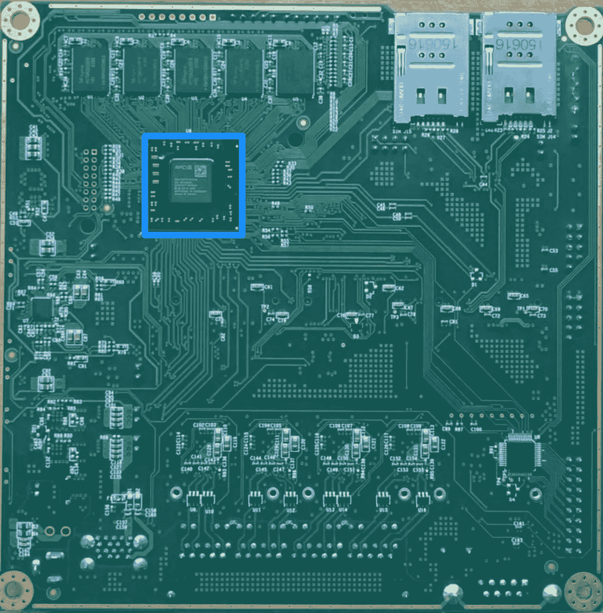

APU2 CPU (Screenshot from [PCEngines](https://www.pcengines.ch/pic/apu4b4_2.jpg))

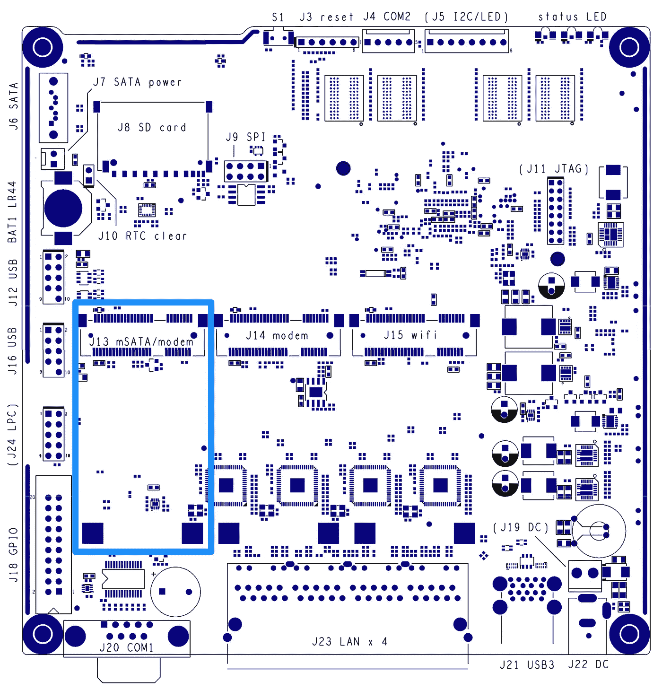

Left mSATA connector for the SSD module — [APU2 Documentation](https://www.pcengines.ch/pdf/apu4.pdf)

物理组装结束。是时候第一次开机，试着用这块板做点什么了。

# 准备

安装需要一些准备工作。我们需要下载并安装一些工具。

*   [OPNSense](https://opnsense.org/) 串行安装
*   [蚀刻机](https://www.balena.io/etcher/)转 u 盘

Etcher 将允许我们用 OPNSense 安装程序刷新 u 盘。我们稍后将从 u 盘启动进行安装。

要安装 Etcher，运行以下命令。它假设你运行在 Mac OS X 下，并且你已经在使用[家酿](https://brew.sh/)。

```
❯ brew cask install balenaetcher
```

我不是那种经常验证我下载的东西的人。下载损坏/包含的文件时，我承担风险。在这里，我想遵循最佳实践。OPNSense [安装文档](https://docs.opnsense.org/manual/install.html#download-and-verification)解释了如何检查下载。

# 下载并验证 OPNSense

下载 [OPNSense for Serial](https://opnsense.org/download/) 安装程序。我为我的[下载](https://mirror-opnsense.serverbase.ch/releases/mirror/OPNsense-20.7-OpenSSL-serial-amd64.img.bz2)选了一面[瑞士镜](https://mirror-opnsense.serverbase.ch/releases/mirror/)。

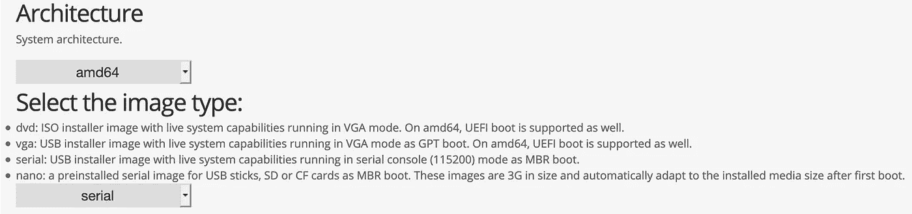

OPNSense [download](https://opnsense.org/download/) page

我检索了[公钥](https://forum.opnsense.org/index.php?topic=18314.msg83193#msg83193)(您有各种来源可以找到公钥)。避免从镜像下载公钥。文件提到了这一点。镜像上的所有文件都可能遭到破坏。

还得到了[签名](https://mirror-opnsense.serverbase.ch/releases/mirror/OPNsense-20.7-OpenSSL-serial-amd64.img.bz2.sig)和[校验和](https://mirror-opnsense.serverbase.ch/releases/mirror/OPNsense-20.7-OpenSSL-checksums-amd64.sha256)(还是那句话，看你挑的镜子)。然后，我运行以下命令来处理签名:

```
❯ openssl base64 -d -i <signature_file>.sig -out /tmp/image.sig
```

为了验证图像，我运行了以下命令:

```
❯ openssl dgst -sha256 -verify <key>.pub \
  -signature /tmp/image.sig <image>.img.bz2
```

这是你可以期待的真实例子:

```
❯ openssl base64 -d \
  -in OPNsense-20.7-OpenSSL-serial-amd64.img.bz2.sig \
  -out /tmp/image.sig
❯ openssl dgst -sha256 -verify opnsense.pub -signature \
  /tmp/image.sig OPNsense-20.7-OpenSSL-serial-amd64.img.bz2

  Verified OK
```

# 准备 USB 启动映像包

对于安装，我们需要准备一个带有 OPNSense 映像的 USB 驱动器。我们需要一个至少 2Gb 的驱动器。在操作过程中，驱动器上的所有数据都将丢失。使用最新的 u 盘进行此操作。我在安装 OPNSense 的过程中遇到了几个问题。我的 u 盘的年龄没有帮助。

我们需要解压缩图像文件。使用下面的命令来完成。

```
❯ bzip2 -d OPNsense-20.7-OpenSSL-serial-amd64.img.bz2
```

下面是你如何刷新你的 u 盘。连接它，并打开蚀刻机应用程序。点击“从文件刷新”按钮。选择你解压的图像文件。

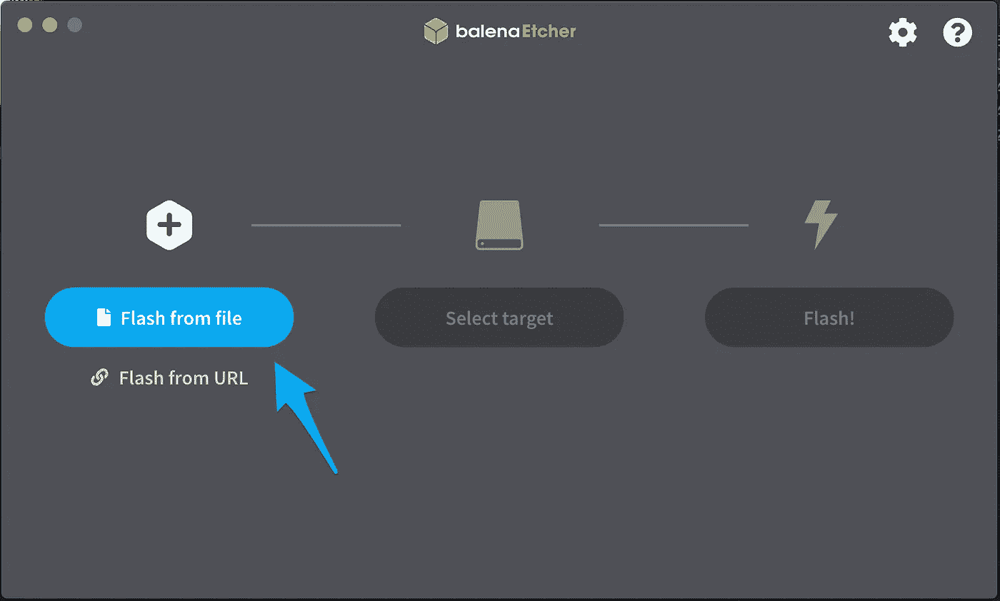

Etcher screenshot

然后，您可以使用 OPNSense 选择要用作启动驱动器的 USB 驱动器。最后，点击“闪光”按钮。

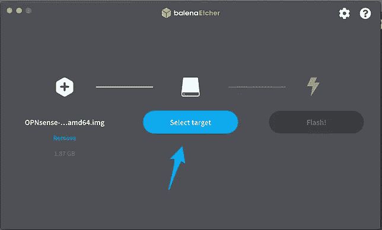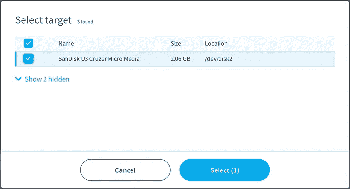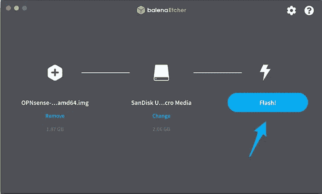

Etcher screenshots

等待，直到完成刷新过程。

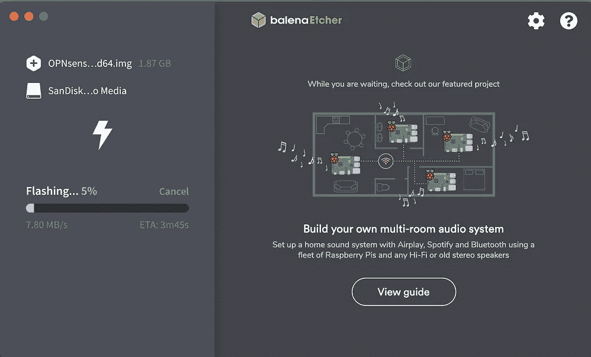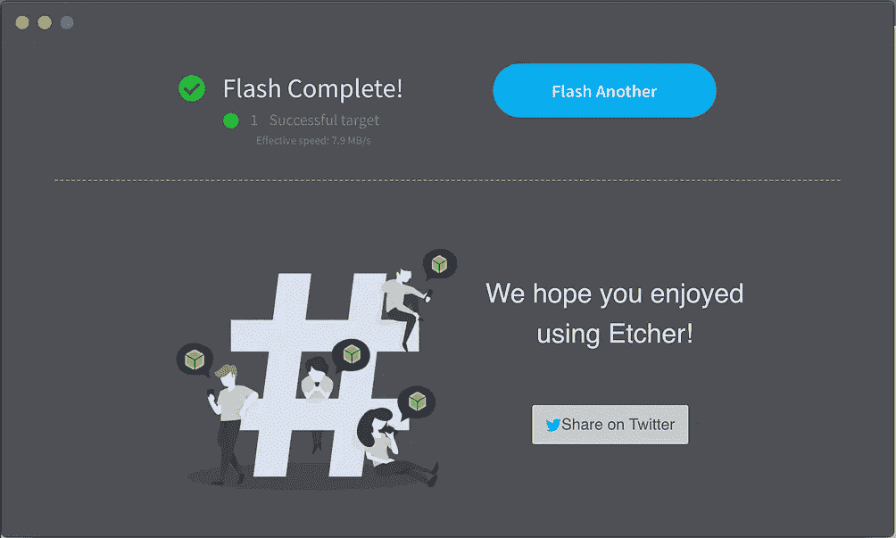

Etcher screenshots

你的 USB 启动驱动器准备好了。您可以将其断开，然后继续下一步。

# 安装 OPNSense

对于第一次启动，准备与板的物理连接。将 USB-C 转 USB-A 适配器连接到 USB-A 转 DB9 电缆和适配器。然后将 USB-C 连接到您的计算机，以及(显然)您的主板。现在，您可以通过插入电源连接器来启动主板。

打开一个终端窗口来查找您可以连接的设备。为此，运行以下命令:

```
❯ ls -laht /dev/*usbserial* 
  crw-rw-rw- ... /dev/cu.usbserial-01E7357C 
  crw-rw-rw- ... /dev/tty.usbserial-01E7357C
```

如果什么也没找到，可能需要安装串口控制台芯片驱动。您可以在 [Silicon Labs 网站](https://www.silabs.com/products/development-tools/software/usb-to-uart-bridge-vcp-drivers)上找到 CP2104 芯片组的驱动程序。Teklager 网站上的一些补充信息。驱动程序的安装很简单。

找到设备后，您可以执行以下命令来连接 APU2:

```
❯ screen /dev/cu.usbserial-01E7357C 115200,8n1
```

结果会是这样的:


OPNSense — Screen connection ([https://asciinema.org/a/ohlTGY9unrIzCknMfMAzDDwN5](https://asciinema.org/a/ohlTGY9unrIzCknMfMAzDDwN5))

按`F10`从 u 盘启动。

我第一次尝试从 u 盘启动时，遇到了一个问题。就像我的 u 盘不可读。APU2 板不能读取它。请看下面两张截图中的错误。

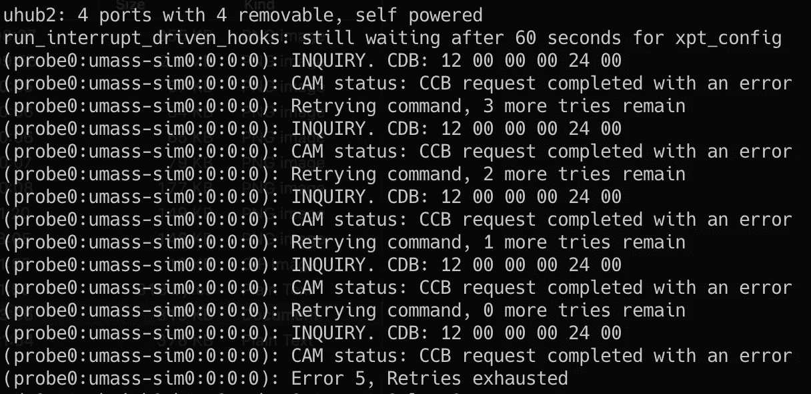

CCB request retries

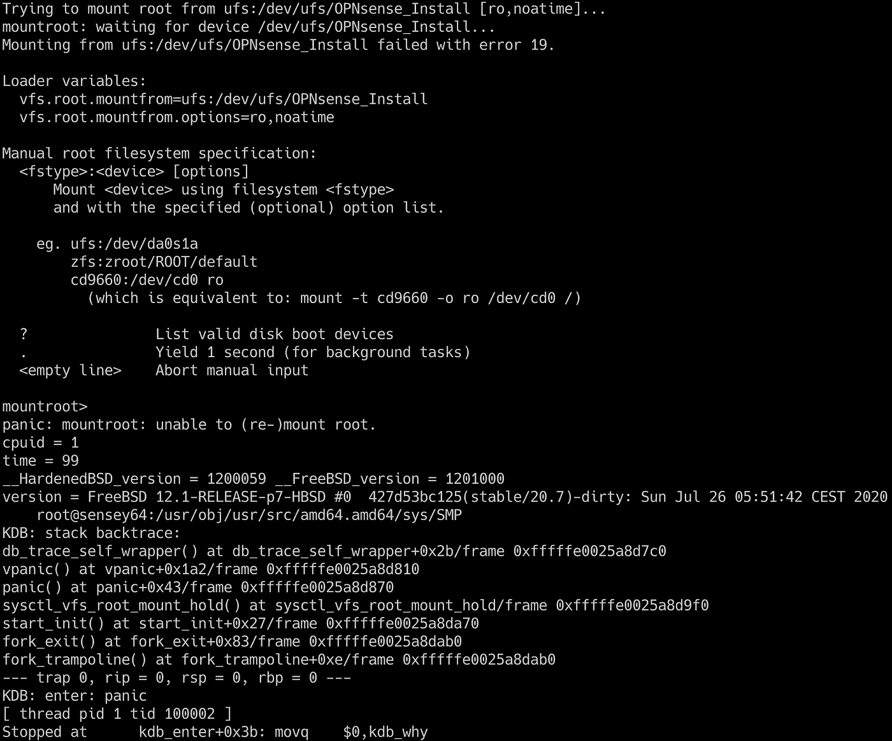

Boot failure

在这里，这意味着你的 u 盘不被 APU2 支持。对我来说，可能是因为我的 u 盘旧了。因此，您有两种解决方案:

1.  使用最新的 u 盘
2.  尽可能频繁地重试引导。我花了 2-3 次才正确启动。我会尽快选择第一个选项，但同时，第二个选项也可以😝。

对于第二个选项，当提示符可用时，您可以键入`reboot`。

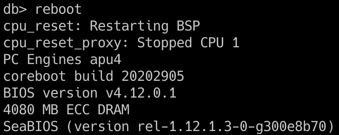

APU2 reboot command

一旦您完成了从 u 盘启动 OPNSense，您就可以安装它了。在启动过程中，我保留了所有选项的默认值。您可以在这个 cast 中观察到完整的引导序列:

[](https://asciinema.org/a/SaGnAeDg3Gdrhop1cC1PzQM5q) [## OPNSense 安装—安装前启动— 1 分 31 秒

### 由 Prevole 记录

asciinema.org](https://asciinema.org/a/SaGnAeDg3Gdrhop1cC1PzQM5q) 

然后我使用了用户`installer`和密码`opnsense`。OPNSense 文档中提供了凭据。

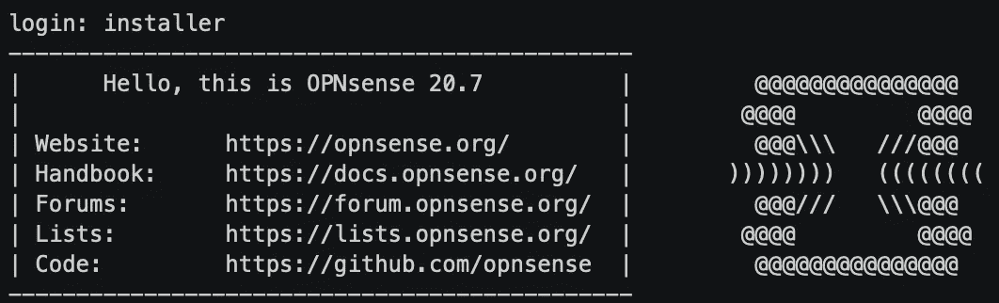

Login to the OPNSense installer

之后，按下文本`< Ok, let’s go >`上的`enter`开始安装。

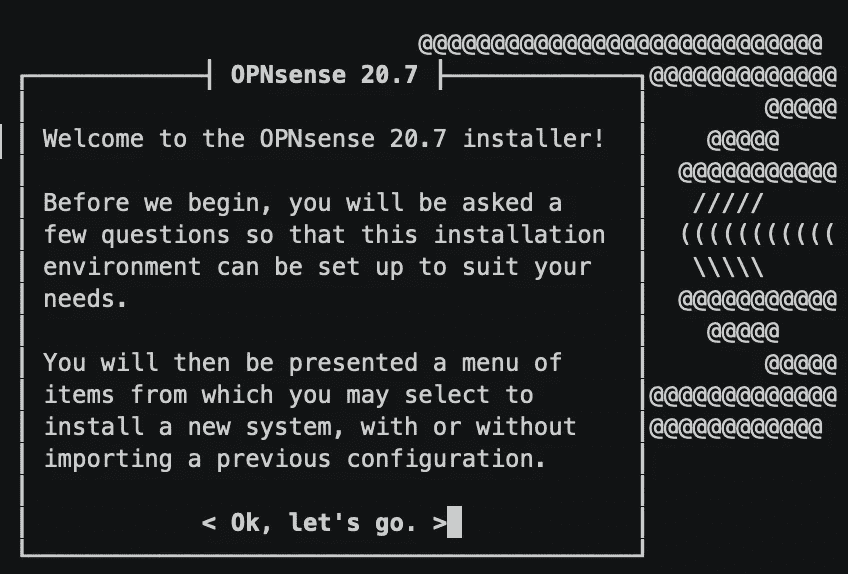

Install start

您可以配置按键映射和视频设置。我保留了默认值。我按下了`< Accept these Settings >`上的`enter`。

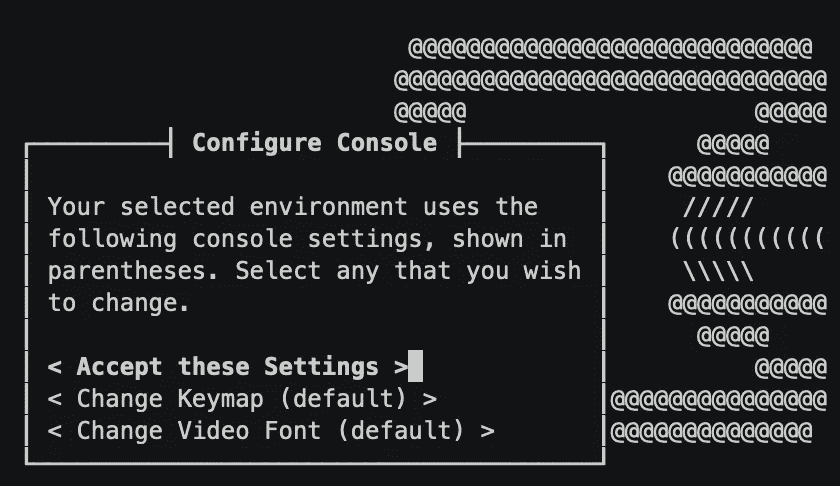

Keymap and Video Settings

之后，我回答了如何安装 OPNSense 的不同选项。我按下了`< Guided installation >`上的`enter`。

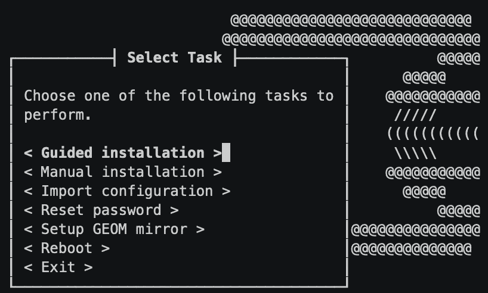

Guided Installation

严肃的事情开始了。选择安装的目的地。我在`< ada0: 114473MB (234441648 512 byte sectors) >`上按了`enter`，这是我的 SSD 存储。

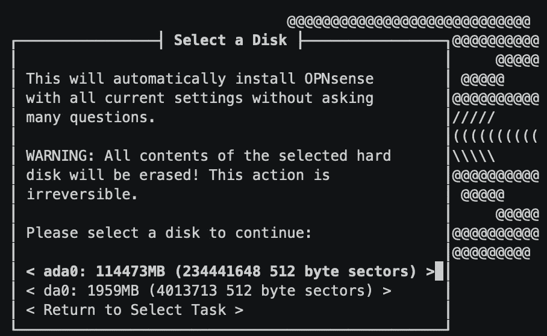

Installation Target

然后，您可以选择安装模式。我按下了默认模式`< GPT/UEFI mode >`上的`enter`键。

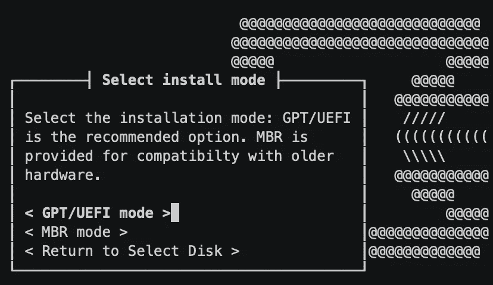

Installation Mode

最后，安装开始。定义交换大小。我通过按下`< yes >`上的`enter`离开了默认配置。

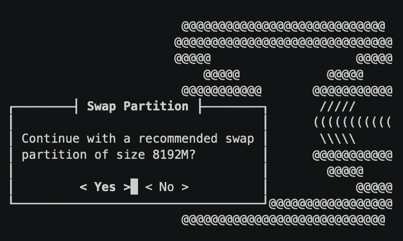

Swap Partition Size

之后，它会复制文件。安装需要几分钟时间。然后，您将看到设置 root 密码的提示。填写密码字段并按下`enter`。按下`< Accept and Set Password >`上的`enter`。

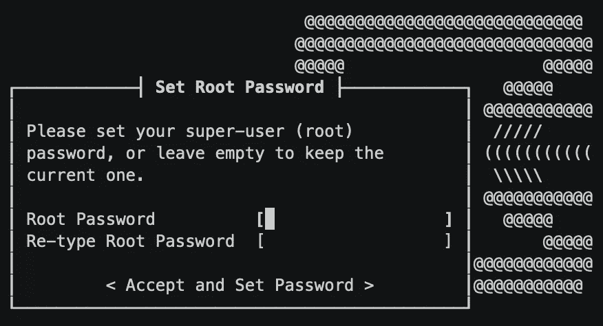

Root Password Setup

最后，在所有这些步骤之后，重新启动或选择另一个任务。我通过按下`< Reboot >`上的`enter`来重启。

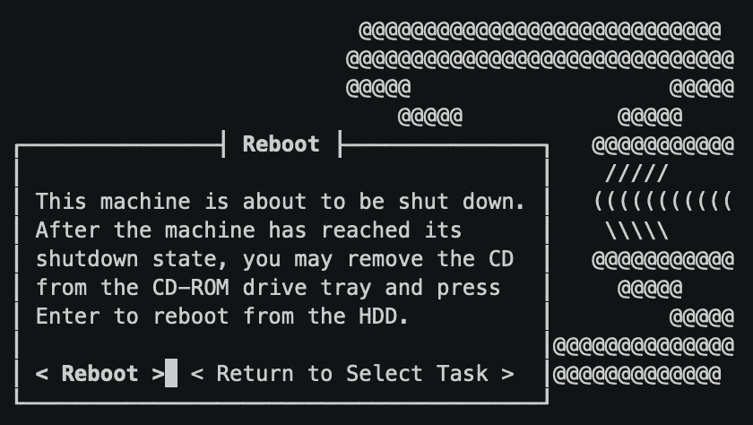

Reboot after Installation

在重启过程中，您会得到如何连接到设备的信息。

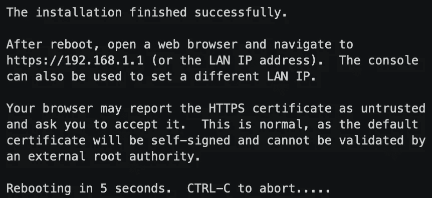

Post Install Instructions

如果您想查看整个安装过程，您可以进入屏幕录制(5 分钟录制)。上面显示的所有截图都来自这个屏幕记录。

[](https://asciinema.org/a/iJU90iAlXbq1qGdfH6sWhhTIf) [## OPNSense 安装— 5 分钟

### 由 Prevole 记录

asciinema.org](https://asciinema.org/a/iJU90iAlXbq1qGdfH6sWhhTIf) 

我的 APU2 板现在安装了 OPNSense。老实说，这并不那么微不足道。通过屏幕连接的串行控制台对我来说是第一次。我第一次尝试通过串行连接在设备上安装 OPNSense。我允许你为此嘲笑我。我意识到我的错误，以 115200 bit/s 的速度传输 2Gb 需要时间。2Gb 是 2e+9 位。在这个速度下，需要 17361 秒→大约。4 小时😅。

我不清楚 OPNSense 安装的文档。我不明白我必须准备一个带有 OPNSense 图像的 u 盘。这是我第一次安装这种软件。在文档中，他们有一些 dd 命令。这是准备 u 盘的命令行方法。我更喜欢用蚀刻机代替。

# 结论

从头开始安装总是比迁移容易。我以前没有安装过 OPNSense。因此，我没有旧的配置文件可以使用。与从现有设置开始相比，从头开始总是更容易。

现在我已经安装了它，我需要用不同的服务(DNS，DHCP，…)配置我的路由器。我将在以后的文章中讨论所有这些内容。但是在开始配置之前，我想更新一下固件。与这次安装相比，这将更具挑战性。

# 参考

我用 asciinema 记录了我的终端会话。它可以捕捉我正在做的事情，并在稍后截图。延期工作是一种便捷的方式。

[](https://asciinema.org/) [## asci NEMA—以正确的方式记录和分享您的终端会话

### 就在你工作的地方录音——在终端里。要开始，只需运行 asciinema rec，要完成，请按 Ctrl-D 或键入 exit。获得…

asciinema.org](https://asciinema.org/) 

不幸的是，在介质上没有内嵌的 asciinema。所以，我找到的最简单的解决办法就是把我的一些屏幕录像转换成 gif。为此，我使用了工具 asciicast2gif。它得到了 asciinema 的支持。

[](https://github.com/asciinema/asciicast2gif) [## asciinema/asciicast2gif

### asciicast2gif 是一个从 asciinema 记录的 asciicast 文件生成 gif 动画的工具。以下是如何…

github.com](https://github.com/asciinema/asciicast2gif) 

我还使用命令行工具来编辑我的屏幕记录。例如，我可以减少两个输出之间的延迟，我可以删减部分录音。我的 OPNSense 安装记录持续了大约 25 分钟。我压缩到 5 分钟。

[](https://github.com/cirocosta/asciinema-edit) [## Ciro Costa/asci inema-编辑

### 编辑是一个工具，它的目的是对字符串进行后处理…

github.com](https://github.com/cirocosta/asciinema-edit) 

这篇中型文章帮助我在文章中嵌入了终端会话。

[](/dac-technology-blog/how-to-embed-recorded-terminal-sessions-asciicasts-in-your-posts-c25ac30019c3) [## 如何在你的文章中嵌入记录的终端会话

### 通过三个简单的步骤学习如何用录制的终端会话来补充你的媒体文章。

medium.com](/dac-technology-blog/how-to-embed-recorded-terminal-sessions-asciicasts-in-your-posts-c25ac30019c3) 

家酿是 Mac OS X 上使用最多的包管理器，以前我都是用 Mac 端口。现在，我只使用自制软件，因为它还能安装丰富的应用程序。

[](https://brew.sh/) [## 公司自产自用

### macOS(或 Linux)缺失的软件包管理器。

brew.sh](https://brew.sh/) 

我用来注释截图的另一个工具是 Evernote 的 Skitch。它免费且易于使用。它做了我需要的工作，没有太多的选择。从 app 拖放到 finder 中的文件夹，就足以从截图生成 PNG 文件。

[](https://evernote.com/products/skitch) [## Skitch | Evernote

### Evernote 使用 cookies 来启用 Evernote 服务，并改善您的体验。要了解更多信息，请查看…

evernote.com](https://evernote.com/products/skitch) 

为了刷新我的 u 盘，我用了 Balena 的 Etcher。这是一个容易使用的工具。它可以一次闪现很多根棍子。

[](https://www.balena.io/etcher/) [## balenaEtcher —将操作系统映像闪存到 SD 卡和 USB 驱动器

### Electron 基于 Gtk2，无法在 Wayland 上原生运行。幸运的是，XWayland 服务器提供了向后…

www.balena.io](https://www.balena.io/etcher/) 

TekLager 商业网站致力于 APU/ALIX 板或类似的产品。它提供了一个很好的知识库。我找到一篇关于串行控制台的文章作为例子。它还包含关于 PFSense 和 OPNSense 的文章。

[](https://teklager.se/en/knowledge-base/) [## TekLager —知识库

### 在 APU 板上安装 pfSense，IPFire，OPNSense。APU VPN 性能。pfSense 与 OPNSense

teklager.se](https://teklager.se/en/knowledge-base/) 

最后是 OPNSense 和 PCEngines 的官网。

 [## OPNsense 是一个真正的开源安全平台，等等— OPNsense 是一个真正的开源防火墙…

### “与我们开发的任何其他商用防火墙产品相比，OPNsense 提供了更多的功能、更高的可靠性和更好的性能……

opnsense.org](https://opnsense.org/) [](https://pcengines.ch/) [## 电脑引擎主页

### 电脑引擎主页

PC 引擎 homepcengines.ch](https://pcengines.ch/)