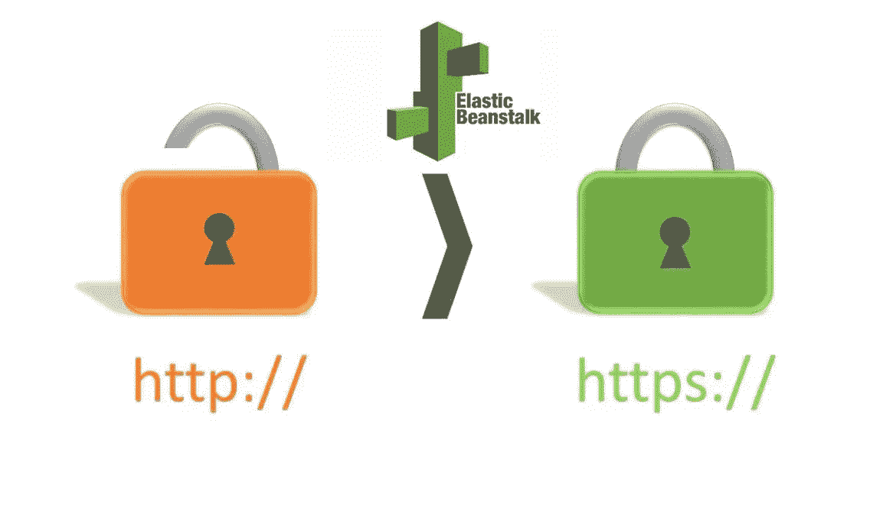
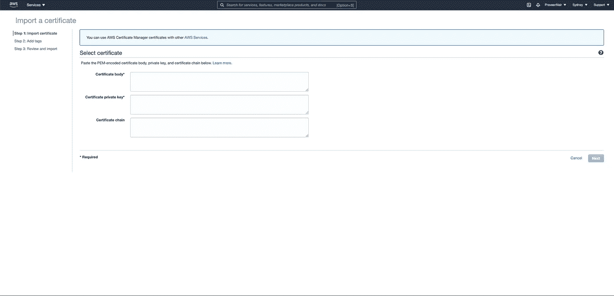
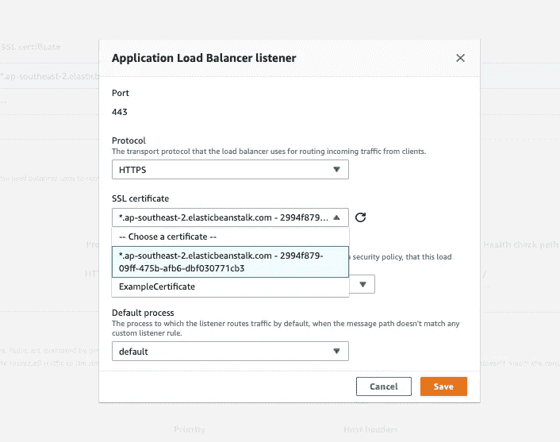
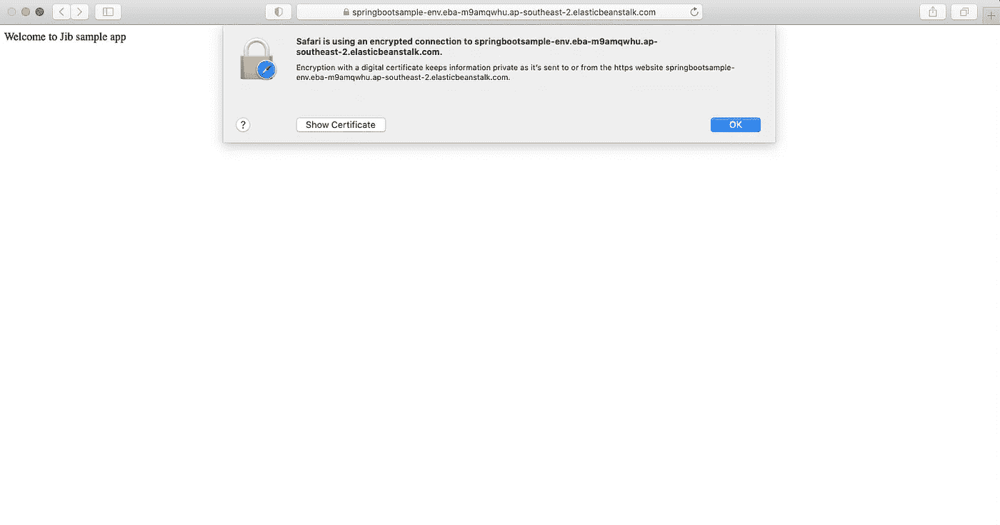

# 在 AWS Elastic Beanstalk 上安装自签名 SSL 证书

> 原文：<https://medium.com/geekculture/installing-a-self-signed-ssl-certificate-on-aws-elastic-beanstalk-1d4acd2c0cd?source=collection_archive---------11----------------------->



Self Signed SSL Certificates on AWS Elastic Beanstalk

## 概观

在我之前的[帖子](https://praveeng-nair.medium.com/deploy-docker-apps-on-aws-elastic-beanstalk-82a0c6871297)中，我们已经看到了如何在 Elastic Beanstalk 上部署我们的 docker 应用。这篇文章记录了你如何在 Elastic Beanstalk 上安装一个自签名证书，这将为我们的应用程序启用 **HTTPS** url。

很多时候，业务需求要求所有对 API 的请求和响应都应该通过 HTTPS，这是我们在生产中肯定会考虑的。因此，出于开发和测试的目的，我们可以使用自签名证书并让事情正常运行。

HTTPS 是一种安全协议，允许浏览器向服务器发送加密信息，反之亦然。为了让 HTTPS 工作，网站需要有一个 SSL 证书。该证书验证浏览器正在与实际的域所有者而不是一个假冒的域进行对话。

通常，如果你想要一个 SSL 证书，你可以从 Godaddy，Verisign 等公司购买。这些组织为您生成证书并对其进行数字签名。当您的浏览器看到网站上的 SSL 证书已由这些证书颁发机构之一签名时，它会立即信任该网站，并在您访问该网站时显示绿色锁图标。

所以在我们的例子中，我们只需要一个临时证书来测试我们在之前的 [post](https://praveeng-nair.medium.com/deploy-docker-apps-on-aws-elastic-beanstalk-82a0c6871297) 中创建的 API。要制作自己的 SSL 证书，可以使用 [OpenSSL](https://www.openssl.org/) 。安装 OpenSSL 后，生成证书有三个步骤:

1.  生成私钥。
2.  使用私钥创建 CSR(证书签名请求)
3.  自己签署证书。

## 生成私钥

```
$ openssl genrsa 2048 > privatekey.pem
```

这将生成一个 2048 位的 RSA 私钥，具有很强的加密能力。并将它保存在一个名为`privatekey.pem`的文件中。这包含加密信息，将用于加密和解密在您的服务器和用户之间发送的信息。

## 创建 CSR

```
$ openssl req -new -key privatekey.pem -out csr.pem
```

在您的终端中运行上面的命令。这会生成一个签名请求文件。在此步骤中，您需要输入有关网站和您公司的信息。您在上一步中创建的私钥将用于识别和验证您在此处指定的域。因为我们是为 amazon 这样做的，所以当提示为您的域输入一个通用名称(CN)时，请输入您的 Elastic Beanstalk 实例的域。应该是这样的格式:<**你的——环境>。如果仅用于测试目的，您也可以使用通配符，如 ***。<地区> .elasticbeanstalk.com****

## 签署证书

如果您正在为一个生产站点创建一个真实的证书，那么此时您会希望您的 SSL 证书由一个证书颁发机构(CA)进行签名。由于这是出于开发/测试目的，您可以通过运行以下命令自己签署证书:

```
$ openssl x509 -req -days 365 -in csr.pem -signkey privatekey.pem -out server.crt
```

X509 是公钥证书的标准格式。公钥证书是将加密数据与网站相关联的数字文档。您在创建证书签名请求时采取的步骤创建了此加密信息。

在上面的命令中，您指定了证书的有效期、包含证书签名请求的文件名、将用于签名证书的密钥以及最终签名证书的文件名。现在您已经有了证书，您可以将它上传到 [AWS 证书管理器](https://aws.amazon.com/certificate-manager/?nc=sn&loc=1) (ACM)以便与 Elastic Beanstalk 一起使用。

## 将证书上传到 AWS 证书管理器的步骤

1.  在 AWS 管理控制台中选择 ACM，然后单击 Import Certificate。将 **server.crt** 的内容复制到*证书体*中，将 **privatekey.pem** 的内容复制到*证书私钥*部分中。



AWS Certificate Manager Importing certs.

2.单击“下一步”,回顾您到目前为止所做的一切。完成后，您将看到您的证书被导入到证书管理器中。

3.导航到您的 Elastic Beanstalk 环境，并选择左侧的*配置*菜单。单击*负载平衡器*旁边的编辑，添加一个新的监听器，并在端口字段中输入 443。将协议设置为 HTTPS，并为您的环境选择默认进程。从下拉列表中选择您在上述步骤中上传的 SSL 证书，并完成设置。



New HTTPS listener on 443

您的环境可能会在此时重新启动，但您的证书应该已安装。由于这是一个自签名证书，当您现在使用 HTTPS 导航到该网站时，您的浏览器将发出一个**警告**，您可以安全地选择忽略并继续。



HTTPS response

```
$ curl -k https://springbootsample-env.eba-m9amqwhu.ap-southeast-2.elasticbeanstalk.com/Welcome to Jib sample app
```

## 摘要

我们已经看到了如何在 AWS 弹性豆杆上安装自签名证书。这适用于运行和测试开发和测试工作负载。对于生产，我们必须购买证书，不应包括自签名证书。当部署在 Elastic beanstalk 上时，有许多其他方法可以使您的 rest api 成为 HTTPs，例如部署一个 AWS api 网关来代理我们对 Elastic beanstalk 的请求，但是这将导致部署 API 网关的一些成本。

希望你觉得这篇文章有用。分享你的反馈和你想知道的话题。我会试着写一些关于他们的东西。编码快乐！！

**参考文献**:

[https://docs . AWS . Amazon . com/elastic beanstalk/latest/DG/configuring-https . html](https://docs.aws.amazon.com/elasticbeanstalk/latest/dg/configuring-https.html)