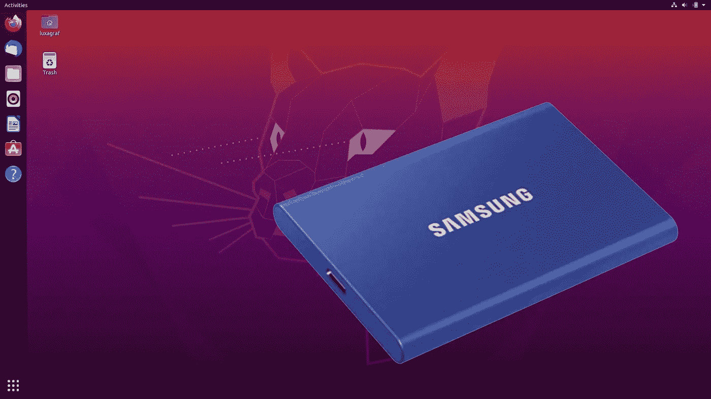
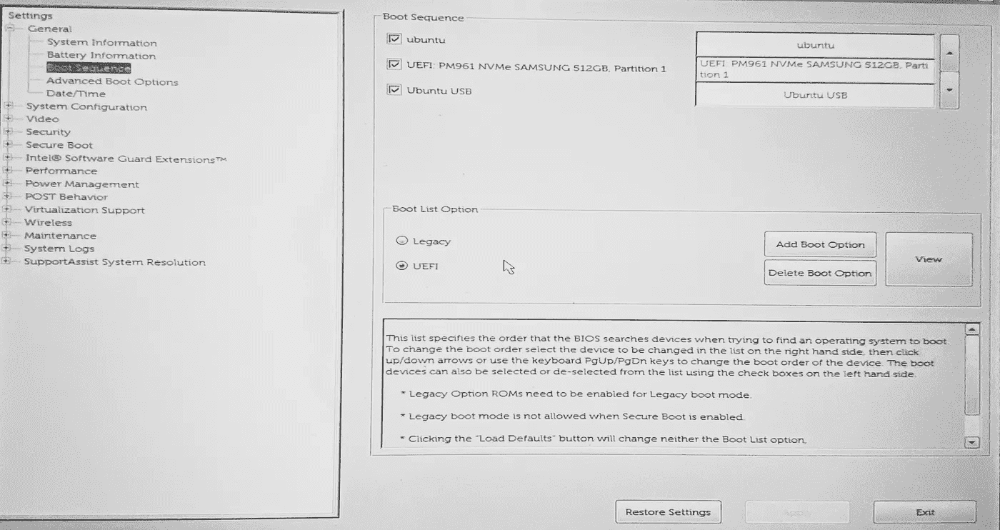
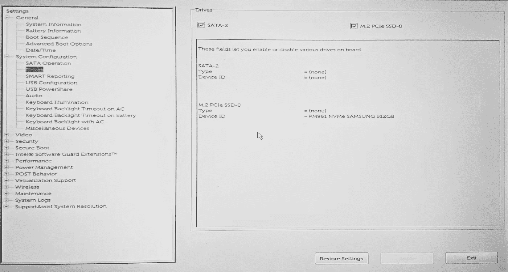
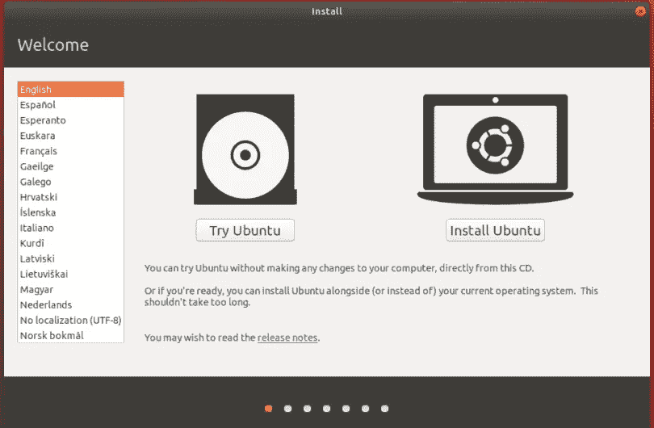
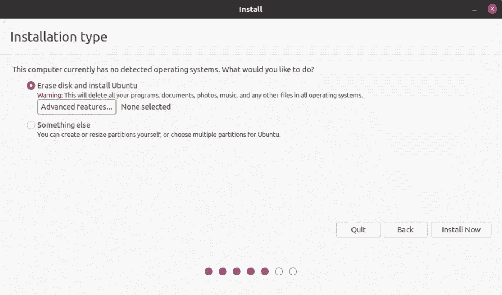

# 在外部便携式固态硬盘上安装 Linux (Ubuntu 20.04)以及需要注意的缺陷

> 原文：<https://medium.com/geekculture/installing-linux-ubuntu-20-04-on-an-external-portable-ssd-and-pitfalls-to-be-aware-of-388294e701b5?source=collection_archive---------0----------------------->

## 携带您的 Ubuntu 操作系统到任何地方，不受硬件限制



Screenshot of Ubuntu with Samsung SSD

## TL；DR 跳到“安装过程”

# 选择你的操作系统是困难的

如果你是一名软件开发人员，你可能遇到过选择操作系统的困境。这是一个很大的决定，因为每个操作系统都有自己的优点和缺点，你会在相当长的一段时间内被它们所困扰。对于刚刚开始编程的人来说，下面是我个人对每个操作系统优缺点的看法。

程序员之所以倾向于 Linux，是因为很多开源代码(尤其是在研究阶段)都是在上面开发的。这并不意味着它一定比 Windows 或 Mac 更好，但它肯定更容易获得，因为它是免费和开源的，所以许多研究实验室、公司和云计算提供商在其远程集群上运行 Linux。因此，他们开发的软件通常在 Linux 发行版(如 Ubuntu)上进行测试，但可能不会在 Windows 或 Mac OS 上进行测试，您可能需要花一段时间才能找到解决方法。

另一方面，使用 Linux 也有自己的弊端；商业、游戏和工业软件等许多专有产品不支持 Linux，因为 Windows 和 Mac OS 占据了更大的市场份额。例如，微软 Office 和 Adobe 产品只在 Windows 和 Mac OS 上可用，为了在 Linux 上安装它，你必须做一些工作，比如安装在 PlayOnLinux 上。如果你想开发移动应用程序，你需要一台 Mac，因为 iOS 应用程序开发只能在 Mac 上进行。如果你是游戏玩家，Windows 可能是最适合的。就像我们在本文中所做的那样扩展笔记本电脑而言，PC 比 Mac 更合适，因为有更多的端口，而且在苹果产品中配置 BIOS 也很困难。

我发现的另一个问题是，与 Windows 或 Mac OS 相比，Ubuntu 不太稳定，尤其是在硬件兼容性和驱动程序方面。如果您对 Linux 有所了解，有些问题是可以解决的，但这可能需要一段时间。此外，由于 Linux 的主要优势在于它的命令行功能，它的图形用户界面往往不太发达，所以 Windows / Mac 在这个意义上肯定更加用户友好。

# 适合我的解决方案:Windows 笔记本电脑+ Ubuntu 外置固态硬盘

我感谢我的同窗给了我这个主意。在此之前，我有一台双启动的 Windows + Ubuntu 笔记本电脑，但我不建议这样做，因为我的 500GB 硬盘很快就被两个操作系统填满了，每个操作系统都有自己的软件。尽管我把几乎所有的个人文件都转移到了外部驱动器上，但我几乎没有剩余空间，因为一些软件很容易就占用了几十 GB 的现金。我正在认真考虑购买一台新的笔记本电脑，但这个外置 SSD 的想法为我节省了数千英镑。

在外置固态硬盘上安装 Ubuntu 操作系统的好处在于，你可以轻松地在 Windows 和 Ubuntu 之间切换，而不会牺牲任何存储空间。更重要的是，你现在可以把这个固态硬盘带到任何你想去的地方，并把它插到任何一台电脑上。只要您知道如何配置 BIOS/UEFL 以便启动，您就可以继续使用您熟悉的操作系统和软件。另一个好处是，万一你搞砸了安装，你可以随时擦除磁盘，再试一次。如果你试图将 Ubuntu 安装到本地存储的一个分区上，这可能会更可怕。

# 适合我的安装过程

这并不意味着是一个全面的安装指南，但我会尝试概述什么对我有用，以及您应该知道的陷阱，因为有时知道什么不起作用与知道什么有用一样重要，并且可以节省大量时间。我建议首先尝试这种方法，如果这不起作用，请阅读“有用资源”部分。

## 步骤 0。开始之前

你需要什么:

*   8G+内存的 u 盘。
*   笔记本电脑(我试过戴尔 XPS)
*   SSD drive*(例如我买了一个 1TB 存储的三星 T7 SSD)
    *注意:确保你有很高的读/写速度，因为你的操作系统性能可能会受到它的瓶颈。T7 最高 1050MB/s，HDD、USB 内存、SD 更慢。

**你应该小心的:**

*   确保您备份了您的计算机(尤其是个人文件，但也包括您的操作系统),以防发生不好的事情，这种情况可能会发生，因为我们将进行大量的格式化、分区和更改 BIOS/UEFL 设置。
*   预先擦除和格式化固态硬盘和 u 盘(它们无论如何都会被重新格式化，但只是为了确保安全)

## 第一步。创建一个可启动的 Ubuntu 20.04 LTS USB 驱动器

首先，你要去[官网](https://ubuntu.com/download/desktop)下载 Ubuntu 桌面 ISO 镜像。请务必下载 LTS 版本。我的情况是下载了 Ubuntu 20.04.4。

接下来，如果你在 Windows 上，你可以使用 [Rufus](https://rufus.akeo.ie/) 将 ISO 写入你的 u 盘。你可以阅读[如何创建一个可启动的 Linux USB 闪存驱动器，这是一个简单的方法](https://www.howtogeek.com/howto/linux/create-a-bootable-ubuntu-usb-flash-drive-the-easy-way/)来找到如何做到这一点。

如果你已经在使用 Ubuntu，你可以试着用“启动盘创建器”创建一个可启动的 u 盘。但是它似乎对我不起作用，所以我直接从终端上这样做。阅读[如何从 Ubuntu 终端创建可引导的 USB 驱动器？](https://codepre.com/en/como-crear-un-disco-usb-de-arranque-desde-la-terminal-de-ubuntu.html)

**你要小心的是:**

*   仔细检查您是否正在将 ISO 映像写入正确的驱动器。不要覆盖您的本地存储。
*   仔细检查你下载的 ISO 文件没有损坏。这可以通过跟随[如何验证你的 Ubuntu 下载](https://ubuntu.com/tutorials/how-to-verify-ubuntu#2-necessary-software)来实现。

实际上，我花了一天时间来完成这一步，因为两个因素

1.  我最初尝试使用一个在职业活动中得到的廉价 u 盘。不要用这些。当你试着启动 Ubuntu 并失败时，你将会浪费很多时间挠头。使用合适可靠的 u 盘。
2.  当我使用 Ubuntu 中的“启动盘创建器”时，我得到了一个“/casper/vmlinuz not found”错误。结果是我的可引导 u 盘损坏了，所以我必须从命令行创建它。当我试图用另一台装有非英语 Windows 操作系统的笔记本电脑创建 u 盘时，也发生了同样的情况。如果发生这种情况，请确保您的操作系统语言设置为英语。

## 第二步。更改启动设置

现在，插入您新的可启动 USB 后，我们必须改变您的笔记本电脑在启动时的行为。在大多数机器上，当计算机启动时，如果按下某个键，就可以进入启动菜单。这取决于笔记本电脑，但它们通常是 Esc，F2，F10 或 F12。在我的 Dell XPS 15 上，同时按下 Fn 和 F2 会将我带到启动设置页面。一定要练习这样做，这样你就可以轻松地进入启动菜单。



Screen of boot sequence menu

现在你进入了启动菜单，你必须做两件事。首先，你必须改变通用>引导顺序，这样你的 Ubuntu USB 就会在最上面。其次，你应该去系统配置>驱动程序，取消选中你看到的每一个驱动器。这将在启动时断开您的内部存储，这样当您将 Ubuntu 安装到您的外部 SSD 时，您就不会意外地覆盖这些内容。这将避免我的文章([如何在外部 USB 硬盘或 SSD](https://www.58bits.com/blog/2020/02/28/how-create-truly-portable-ubuntu-installation-external-usb-hdd-or-ssd) 上创建真正可移植的 Ubuntu 安装，顺便说一下，这是一篇非常棒的文章)所解决的大部分问题，即 EFI 分区可能会被覆盖，您必须自己安装 Grub。



Screen of driver menu

完成安装后，您可以通过进入启动菜单并再次勾选复选框，轻松地重新连接内部存储器。

## 第三步。从可引导 USB 启动 Ubuntu

现在，插入可启动 USB，重新启动笔记本电脑。在出现的第一个菜单中，不要选择普通的 Ubuntu，而是尝试“Ubuntu(安全图形)”。这将为您省去等待安装停止的痛苦。过一会儿，一个带有“试用 Ubuntu”和“安装 Ubuntu”选项的加载程序就会出现。你可以选择任何一个。如果选择试用 Ubuntu，Ubuntu 会暂时从你的 USB 加载，桌面上有一个“安装 Ubuntu”的快捷方式。我个人更喜欢这种方式，因为字体看起来要大得多，而且你可以在安装过程中在临时 Ubuntu 上做其他事情。



Screenshot of Try Ubuntu / Install Ubuntu menu

## 第四步。将 Ubuntu 安装到外部固态硬盘上

进入安装屏幕后，连接外部 SSD 并按照说明进行操作。在某一点上，他们会询问安装类型。现在，在我跟随的另一篇教程[中，作者建议你自己对你的磁盘进行分区。然而，如果你选择“擦除磁盘并安装 Ubuntu”，我想利用“高级功能”选项中的 LVM 加密功能。这只有在您按照**步骤 2** 所述断开了启动设置中所有内部存储的情况下才有效——否则，您的本地 EPI 分区将有被覆盖的风险，正如上述文章所警告的那样。如果您看到的不止是这两个选项，您可能仍有一些内部存储未断开连接，或者您可能事先没有擦除外部 SSD。](https://medium.com/r?url=https%3A%2F%2Fwww.58bits.com%2Fblog%2F2020%2F02%2F28%2Fhow-create-truly-portable-ubuntu-installation-external-usb-hdd-or-ssd)

选择默认设置而不是选择自定义的“其他”选项的唯一缺点是，您无法决定硬件将如何分区。这对于交换分区来说尤其恼人，默认设置中只给了大约 800MB。我们可以稍后通过添加自定义交换文件来解决这个问题。



Screenshot of installation wizard: installation type

安装过程的其余部分应该很简单。当您选择用户名时，请确保您没有任何空格。这可以帮助你避免很多令人头疼的事情。一旦所有东西都安装好了，你就可以重启你的笔记本电脑了。在重新启动之前，屏幕会要求您移除可启动的 USB。

## 第五步。更新软件和驱动程序

一旦系统重启，万岁，你在你的外部固态硬盘上有一个工作的 Ubuntu 操作系统！不过，不要庆祝得太早。请等待您完成软件和驱动程序的更新。

**通用软件更新**

您可以使用软件和更新 GUI 界面来更新软件包，也可以执行

```
sudo apt updatesudo apt upgrade
```

**Nvidia 驱动程序更新**

默认情况下，Ubuntu 使用第三方驱动程序，而不是 Nvidia 专有驱动程序。要将此更改为官方驱动程序，您可以遵循以下任一方法。

*   [Ubuntu Linux 安装 Nvidia 驱动(最新专有驱动)](https://www.cyberciti.biz/faq/ubuntu-linux-install-nvidia-driver-latest-proprietary-driver/)
*   [如何在 Ubuntu 20.04 Focal Fossa Linux 上安装 NVIDIA 驱动](https://linuxconfig.org/how-to-install-the-nvidia-drivers-on-ubuntu-20-04-focal-fossa-linux)

**更改 GRUB 设置**

有一件事我会马上做(即使你没有任何问题)，那就是更新 GRUB 设置，以便 Ubuntu 在启动时将日志打印到屏幕上。在你第一次启动时，用你最喜欢的文本编辑器打开`/etc/default/grub`(例如，通过运行`sudo gedit /etc/default/grub`，它会说

```
GRUB_CMDLINE_LINUX_DEFAULT="quiet splash"
```

把这个改成

```
GRUB_CMDLINE_LINUX_DEFAULT="" 
```

此外，将 GRUB timeout 设置为大于 0 的值，这样，如果您想在引导时打开 GRUB 菜单，可以通过按 shift 键来实现。

```
GRUB_TIMEOUT=10
```

保存并关闭文本编辑器后，反映更新后的 GRUB 设置。

```
sudo update-grub
```

**需要注意的事项:**

这是我最纠结的地方。在我提到的文章之后的[中，我已经尝试了至少 20 次安装，但是每一次，我的 Ubuntu 都在重启时挂着一个闪烁的下划线光标，没有任何错误信息。如上所述更新 GRUB 设置为我提供了日志，但它们仍然是一种误导，是一种转移注意力的方法，因为当我多次尝试重启时，Ubuntu 一直挂在不同的日志上。](https://www.58bits.com/blog/2020/02/28/how-create-truly-portable-ubuntu-installation-external-usb-hdd-or-ssd)

最终我意识到 Ubuntu 只是不能及时加载 GUI 登录屏幕，这通常是由 GDM3 处理的。这一点得到了证实，因为如果我用`Ctrl + Alt + F3`打开终端，并手动输入`sudo service gdm start` ，我就能够启动 GUI 登录屏幕。阅读[这个 StackOverflow 线程](https://askubuntu.com/questions/1050672/gdm3-does-not-start-in-ubuntu-18-04)很有帮助。

最后，对我起作用的是不遵循上面的文章，而是遵循默认的 Ubuntu 安装程序，并启用加密。我没有尝试比较加密版本和非加密版本，但我怀疑我输入密码解锁硬盘所花的时间是否足够 X 服务器开始运行，以便 GUI 可以正常启动(我得出这个结论是因为 Ubuntu 是否停止似乎是随机的，当我尝试多次重新启动而没有对系统进行任何更改时)。但是我可能错了。

对我有效的另一个选择(本文后面有自定义分区)是通过执行以下操作切换到 lightdm。

```
sudo apt-get install lightdm
sudo dpkg-reconfigure lightdm 
```

对于默认安装过程，这是不必要的。

## 第六步。添加自定义交换文件(可选)

当操作系统耗尽 RAM 并希望卸载 RAM 中一些未使用的数据时，会使用交换空间。默认情况下，Ubuntu 安装只创建大约 800MB 的交换空间，这与通常的预期相比是很小的(大约与你的 RAM 大小相同)。幸运的是，我们可以在主分区中创建一个交换文件来做同样的事情。更多详情请阅读[如何在 Ubuntu 20.04 上添加交换空间](https://linuxize.com/post/how-to-add-swap-space-on-ubuntu-20-04/)。

## 第七步。重新连接内部驱动器

一旦你完成了你的设置，并确保 Ubuntu 正确启动，你就可以安全地返回到启动菜单并重新启用内部驱动器。重新启动时，如果 Ubuntu 没有显示，回到启动菜单，重新安排启动顺序，这样你的 Ubuntu 固态硬盘将首先启动。

# 最后的想法

虽然我最终采用的方法相当简单，但这是一个漫长的过程，因为我必须通过反复试验的方法来消除所有其他失败的可能性。我希望这篇文章能够帮助一些人避免浪费大量的时间去寻找错误消息(如果您的安装或重新启动由于某个日志消息而停止，这并不一定意味着这是一个您应该关心的警告，尤其是如果它没有明确地说“错误”)。

但是我可以向你保证，努力是完全值得的！你再也不会因为内部磁盘空间不足而购买新的笔记本电脑了，这样既节省了你的钱包，也保护了地球！

# 有用的资源

*   [如何创建一个可启动的 Linux 盘，最简单的方法](https://www.howtogeek.com/howto/linux/create-a-bootable-ubuntu-usb-flash-drive-the-easy-way/)
*   [如何在外置硬盘上安装 Ubuntu](https://linuxhint.com/install-ubuntu-external-hard-drive/)
*   [如何从 Ubuntu 终端创建可引导的 u 盘？](https://codepre.com/en/como-crear-un-disco-usb-de-arranque-desde-la-terminal-de-ubuntu.html)
*   [如何在外置 USB 硬盘或固态硬盘上创建真正可移植的 Ubuntu 安装](https://www.58bits.com/blog/2020/02/28/how-create-truly-portable-ubuntu-installation-external-usb-hdd-or-ssd)
*   [如何在 Ubuntu 20.04 上添加交换空间](https://linuxize.com/post/how-to-add-swap-space-on-ubuntu-20-04/)