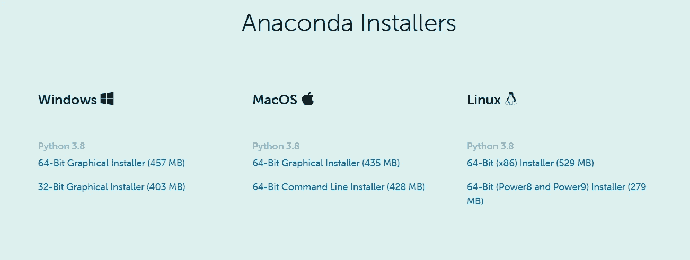
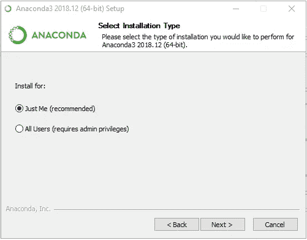
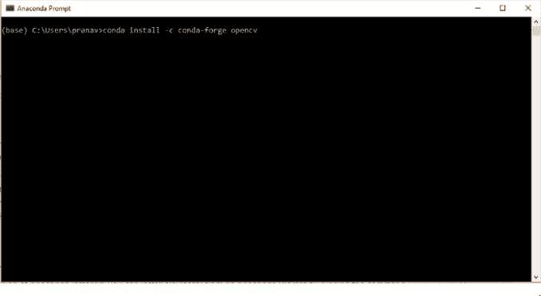
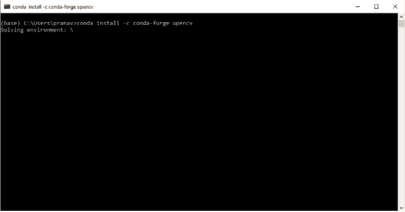
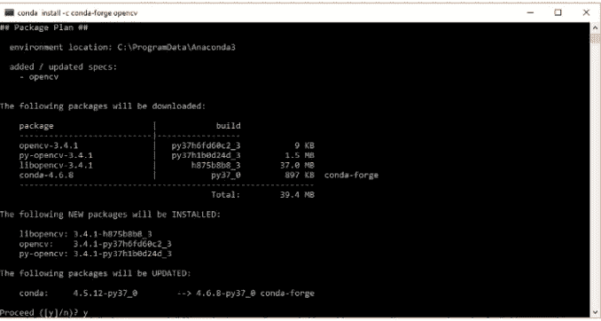
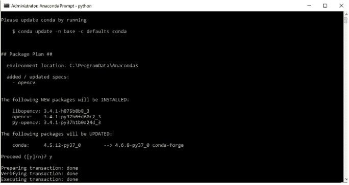
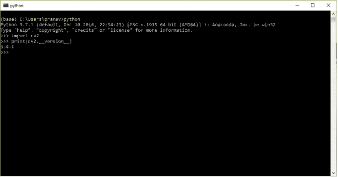

# 使用蟒蛇在 Windows 上安装 Python 的 OpenCV

> 原文：<https://medium.com/geekculture/installing-opencv-for-python-on-windows-using-anaconda-d37300e2e194?source=collection_archive---------4----------------------->

Installing OpenCV for Python on Windows using Anaconda

OpenCV 是一个用于图像处理和计算机可视化的跨平台库。它可以开发实时计算机视觉应用。它主要关注图像处理、视频捕获和分析，包括人脸检测和目标检测等功能。在本教程中，我们将解释如何使用 Anaconda 安装 OpenCV。

## 步骤 01:在 Windows 上安装蟒蛇

前往[蟒蛇网站](https://www.anaconda.com/products/individual)并从[蟒蛇网站](https://www.anaconda.com/products/individual) 中选择最新的蟒蛇视窗图形安装程序。如果是 64 位，则选择 64 位图形安装程序，否则选择 32 位安装程序。选择 Python 3.7 来使用 Python 3。这是首选方案，因为 python 2.7 将在 2020 年寿终正寝。

[https://www.anaconda.com/products/individual](https://www.anaconda.com/products/individual)

找到您的下载并双击它。启动图形安装程序，我们将被提示选择安装哪个用户。您可以按默认设置安装它

Anaconda Installer

## 步骤 02:安装 OpenCV

从开始菜单启动蟒蛇提示

launching Anaconda prompt

如果您在安装时选择了*“所有用户”*，那么您必须通过右键单击并选择“*以管理员身份运行”*来启动提示，以管理员权限执行。 ***这很关键。***

**要安装 OpenCV，我们需要在提示符下键入以下命令:**

conda install-c conda-forge open cv

## 重要:

在您的计算机上安装 OpenCV 需要互联网连接

installing OpenCV through anaconda prompt.

键入该命令后，提示符将显示它是“求解环境”。

solving environment

一旦 conda 解决了环境问题，它将列出将要安装的软件包，即: *opencv、libopencv、py-OpenCV。*

## 输入 y 继续安装。

proceed to install by entering y when prompted as shown.

安装 OpenCV 后，您可以在 anaconda 提示符下显示安装成功消息

installation is successful.

您可以通过启动 python 解释器来验证安装是否成功。OpenCV 在 python 中被称为 cv2。在提示符下键入:

***进口 cv2***

如果显示提示，那么 OpenCV，那么 python 已经成功导入了 OpenCV 库。但是我们也应该验证 OpenCV 的版本，所以我们需要键入:

***打印(cv2。__version__)***

verify the version of OpenCV.

截至 2019 年 3 月，显示的版本为 3.4.1，这是蟒蛇环境官方支持的 OpenCV 版本。如果我们想使用不同的版本，那么在安装时，我们可以指定如下所示的版本为“opencv=3.4.1”

***conda install-c conda-forge opencv = 3 . 4 . 1***

在 anaconda for MacOS 上安装 OpenCV 可以遵循类似的步骤。

*社交媒体:* [*LinkedIn*](https://www.linkedin.com/in/sajith-dilshan/) *，*[*Twitter*](https://twitter.com/sajithd7)*，*[*insta gram*](https://www.instagram.com/sajithd_dilshan/)*，* [*YouTube*](https://www.youtube.com/channel/UCn-a3_icXt1sN1vaFsIzqBg)