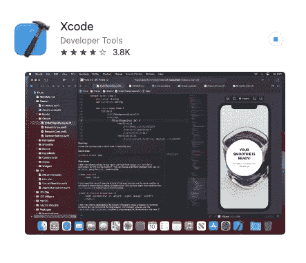
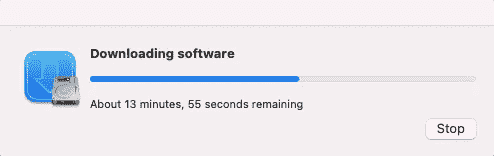
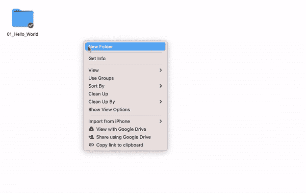

# 以正确的方式在 MacOS 上安装 Python 3.x 开发环境，并使用 Automator 自动设置新项目

> 原文：<https://medium.com/geekculture/installing-python-3-x-development-environment-on-macos-a64c0141b20c?source=collection_archive---------2----------------------->


我最近购买了一台 Macbook Air，自从第一台 MacBook Air 问世以来，我一直将 MacOS 系统作为我的个人电脑。然而，我一直在工作中使用 Windows Thinkpad 进行开发，多年来，Windows 已经为开发社区制作了一些优秀的版本。PowerShell、WSL2 和最近发布的包管理器。

我仍然对苹果产品和设计着迷，并且总是在 Mac 开发环境下执行我的个人项目。我发现有几个步骤可以有效地将我的 python 开发建立在 MacOS 上，现在归结为肌肉内存。在本帖中，我们将了解:

1.  升级到 Python 3+
2.  Python 虚拟环境
3.  [可选] Over engineer Mac 的 automator 使用 VScode

# 升级到 Python 3+(正确的方式)

MacOS 自带 python 版本。您可以通过在终端中执行以下命令来检查您当前安装的 python 版本

```
python --version
```

## 步骤 1: GCC 安装



Xcode app in Mac App store

Python 安装将需要 GCC 安装。在 Mac 上正确安装 GCC 最简单的方法是从 app store 安装 [Xcode](https://apps.apple.com/in/app/xcode/id497799835?mt=12)

如果您已经安装了 Xcode，那么您可以跳过这一步

如果您执行 Xcode 的全新安装，您还需要通过在“终端”中执行以下命令来添加命令行工具

```
$ xcode-select --install
```



## 第二步:安装自制软件

与 linux 不同，MacOS 中缺少包管理器。“家酿安装了你需要的苹果(或你的 Linux 系统)没有的[](https://formulae.brew.sh/formula/)**。”**

**为了[安装家酿](https://brew.sh/#install)，打开`Terminal`或者你喜欢的 OS X 终端模拟器并运行**

```
$ /bin/bash -c "$(curl -fsSL [https://raw.githubusercontent.com/Homebrew/install/HEAD/install.sh](https://raw.githubusercontent.com/Homebrew/install/HEAD/install.sh))"
```

**一旦安装了 Homebrew，在 PATH 环境变量的顶部插入 Homebrew 目录**

**您可以通过在~/的底部添加下面一行来做到这一点。配置文件**

```
export PATH="/usr/local/opt/python/libexec/bin:$PATH"
```

**或者，您也可以在/etc/paths 文件的顶部添加以下内容**

```
/usr/local/opt/python/libexec/bin
```

## **步骤 3:安装 Python 3**

```
$ brew install python
```

**这需要一两分钟。现在，您可以通过使用“python3”和“pip3”来访问 python 版本 3+和 pip**

# **Python 虚拟环境**

## **什么是虚拟环境**

**就其核心而言，python 虚拟环境的主要目的是为 Python 项目创建一个隔离的环境。这意味着每个项目都可以有自己的依赖项，而不管其他项目有什么依赖项**

## **安装和创建虚拟环境**

**首先，如果你没有使用 Python 3，你需要安装带有`pi`的`virtualenv`工具**

```
$ pip3 install virtualenv
```

**您可以选择创建一个新目录，将所有虚拟环境放在一个整洁的地方**

```
$ mkdir python-virtual-environments && cd python-virtual-environments
```

**在目录中创建新的虚拟环境**

```
$ python3 -m venv project_env
```

**要激活上面设置的 project_env 虚拟环境，我们必须从我们新创建的 virtaul_env 的 bin 文件夹中获取激活脚本**

```
$ source project_env/bin/activate
(project_env) $
```

**请注意，您的提示现在是以您的环境名称为前缀的(在我们的例子中是`project_env`)。这表明`env`当前是活动的，这意味着`python`可执行文件将只使用这个环境的包和设置**

**要停止使用虚拟环境，您需要做的就是执行 deactivate，然后您将退出虚拟环境**

```
(project_env) $ deactivate
$
```

# **改造 Mac 的 automator 以使用 VScode**

**这个步骤是可选，且在大多数情况下是不需要的。我使用 VS 代码作为我选择的代码编辑器。每当我创建一个新的 python 项目时，我必须在 VS 代码中设置 python 解释器。我为工作和个人项目制作了许多小的 python 代码库，并且喜欢在设置 VS 代码时节省这些额外的时间。**

**为了解决这个“不是问题”的问题，我使用 Mac 的 Automator 工具来创建服务。本服务的目标是**

1.  **使用我在 finder 中选择的文件夹，在以“_env”为后缀的文件夹中创建一个新的虚拟环境**
2.  **为 VS 代码创建 settings.json 文件**
3.  **更新 settings.json 以指向我的脚本已经创建的虚拟环境**
4.  **创建 main.py 文件**

**为上述任务创建一个自动脚本，使我的工作流程像创建一个文件夹并右键单击该文件夹来选择我的自动脚本一样简单。然后跳转到 VS 代码，用已经配置好的 python 解释器和干净的 main.py 文件来开始我的工作。这一切不知为什么让我真的很开心:)**

**要复制工作流程**

1.  **启动自动机**
2.  **创建新文档**
3.  **创建新的快速动作**

****

**4.添加动作…**

*   **工作流从**查找器**接收当前**文件和文件夹**。**
*   **向工作流添加新的运行 Shell 脚本操作。(将屏幕截图中突出显示的“运行 Shell 脚本”对象拖到右侧的空窗口中)**

**5.配置工作流**

*   **将传递输入设置为**作为参数****
*   **将以下内容粘贴到输入框中:**

```
for f in "$@"
do
 parent="$(dirname "$f")"
 folder="$(basename "$f")"
 cd /$parent/$folder
 python3 -m venv "${folder}_env"
 mkdir $parent/$folder/.vscode
 cat > .vscode/settings.json <<EOF
 {
     "python.pythonPath": "$parent/$folder/${folder}_env/bin/python3"
 }
EOF
touch $parent/$folder/main.py
 cat > $parent/$folder/main.py <<EOF
#!/usr/bin/env pythondef main():
    print("Hello World") if __name__ == "__main__":
    main()EOF
done
```

**6.使用类似于**的名称保存动作，在 VS 代码中创建 Python 项目****

****

**就是这样。**