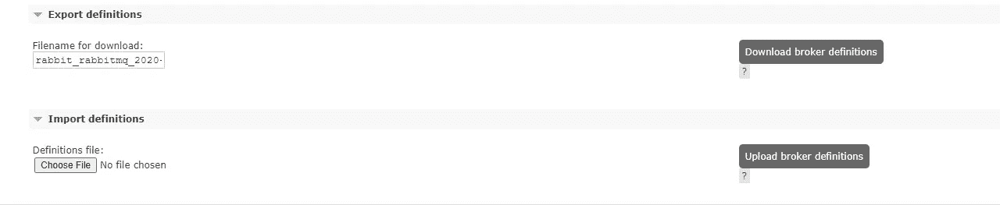
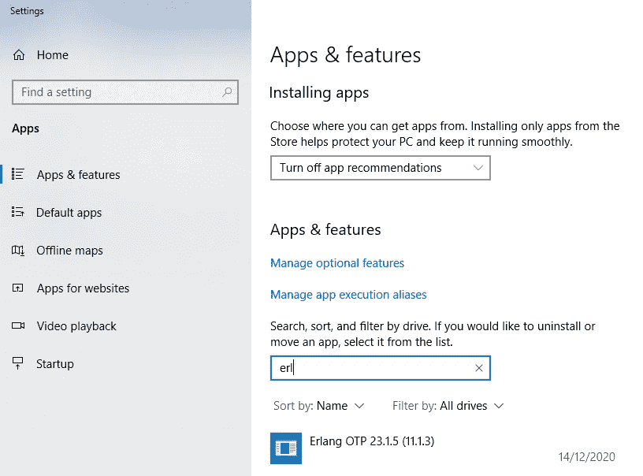
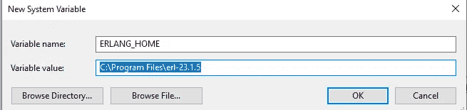
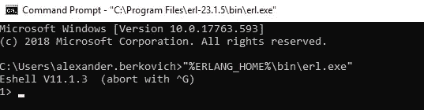
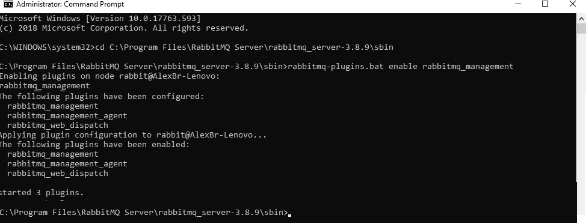
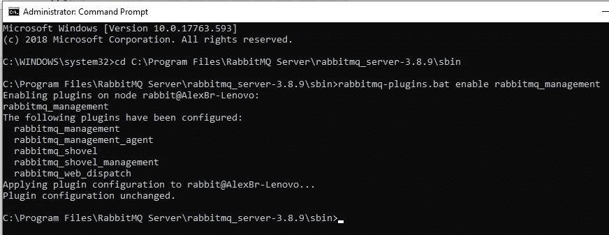
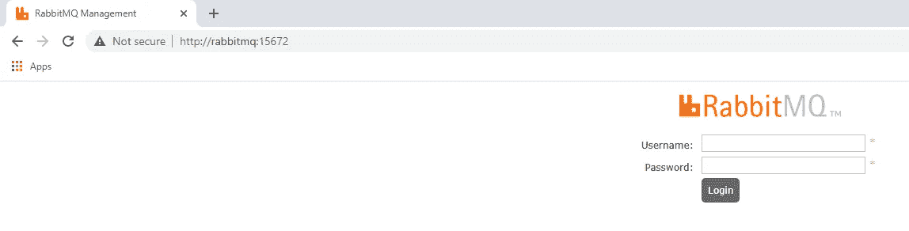

# 在 Windows 上安装 RabbitMQ

> 原文：<https://medium.com/geekculture/installing-rabbitmq-on-windows-4411f5114a84?source=collection_archive---------0----------------------->

这是如何在 Windows 机器上安装 RabbitMQ 的逐步简化教程。

要在 docker 容器中使用 RabbitMQ，请参见这里的。

*注意:*这里假设你使用 [Erlang](https://en.wikipedia.org/wiki/Erlang_(programming_language)) 仅仅是为了 RabbitMQ，而不是其他。

*   如果您安装了旧的 RabbitMQ，首先从管理 UI 导出它的设置:

登录后，向下滚动并点击“下载经纪人定义”和下载文件。

完成新版 RabbitMQ 的安装后，点击“上传代理定义”并上传文件。

*   卸载 [Erlang](https://en.wikipedia.org/wiki/Erlang_(programming_language))

Erlang [编程语言](https://en.wikipedia.org/wiki/Programming_language)具有[不可变](https://en.wikipedia.org/wiki/Immutable_object)数据、[模式匹配](https://en.wikipedia.org/wiki/Pattern_matching)和[函数式编程](https://en.wikipedia.org/wiki/Functional_programming)

*   卸载 RabbitMQ

1.从[https://erlang.org/download/otp_versions_tree.html 下载 23.x](https://erlang.org/download/otp_versions_tree.html%20download%2023.x) 版本&使用**管理用户**安装[https://github . com/Erlang/OTP/releases/download/OTP-23 . 1 . 5/OTP _ win 64 _ 23 . 1 . 5 . exe](https://github.com/erlang/otp/releases/download/OTP-23.1.5/otp_win64_23.1.5.exe)

2.将 ERLANG_HOME 设置为实际放置 ERLANG 安装的位置，例如 C:\Program Files\erl{version}(完整路径，我们有 version=23.1.5)。RabbitMQ 批处理文件预期执行%ERLANG_HOME%\bin\erl.exe。

转到开始>设置>控制面板>系统>高级>环境变量。创建系统环境变量 ERLANG_HOME，并将其设置为包含 bin\erl.exe 的目录的完整路径。

3.重新启动计算机

4.检查 Erlang 是否正常工作:

*   打开 cmd 并键入

" % ERLANG _ HOME % \ bin \ erl . exe "

您应该会看到 Eshell 提示:

5.一旦安装了受支持的 Erlang 版本，下载 RabbitMQ 安装程序 rabbitmq-server-{version}。然后运行它。它将 RabbitMQ 作为 Windows 服务安装，并使用默认配置启动它。前往 https://www.rabbitmq.com/install-windows.html 的
下载&运行[rabbitmq-server-3.8.9.exe](https://github.com/rabbitmq/rabbitmq-server/releases/download/v3.8.9/rabbitmq-server-3.8.9.exe)

另请参见:

[https://www.rabbitmq.com/install-windows-manual.html](https://www.rabbitmq.com/install-windows-manual.html)

6.基于[https://medium . com/@ kiranbs 890/rabbit MQ-setup-on-local-machine-windows-958 bada 6003 c](/@kiranbs890/rabbitmq-setup-on-local-machine-windows-958bada6003c)

打开新的 cmd，键入
CD C:\ Program Files \ rabbit MQ Server \ rabbit MQ _ Server-{ version } \ sbin

*CD C:\ Program Files \ rabbit MQ Server \ rabbit MQ _ Server-3 . 8 . 9 \ sbin*

*rabbitmq-plugins.bat 启用 rabbitmq_management*

你应该看看

类型

*rabbit MQ-插件启用 rabbit MQ _ slope rabbit MQ _ slope _ management*

你应该看看

7.编辑*C:\ Windows \ System32 \ drivers \ etc \ hosts*文件。添加以下一行:

兔子数量

8.一旦全部完成打开: [http://rabbitmq:15672/](http://rabbitmq:15672/ ) 用于打开 rabbitmq 管理。

用户名:guest

密码:来宾

对于与已安装的 RabbitMQ 一起工作的客户端代码，您可以前往**代码示例**部分的[https://Alex-ber . medium . com/rabbit MQ-inside-docker-container-8b 8 bfea 22174](https://alex-ber.medium.com/rabbitmq-inside-docker-container-8b8bfea22174)。如果您已经将`127.0.0.1 rabbitmq`添加到`*C:\Windows\System32\drivers\etc\hosts*` 文件中，相同的代码将与安装的 RabbitMQ 一起工作(或者，您可以将`ConnectionParameters`的`host`参数更改为 localhost)。