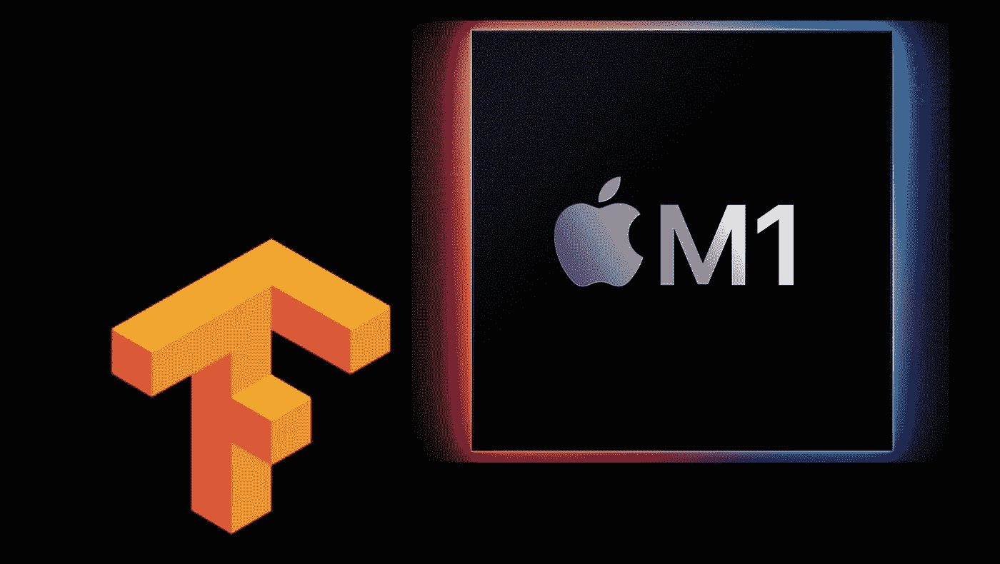
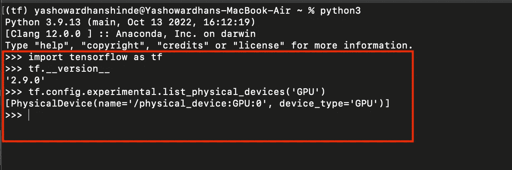
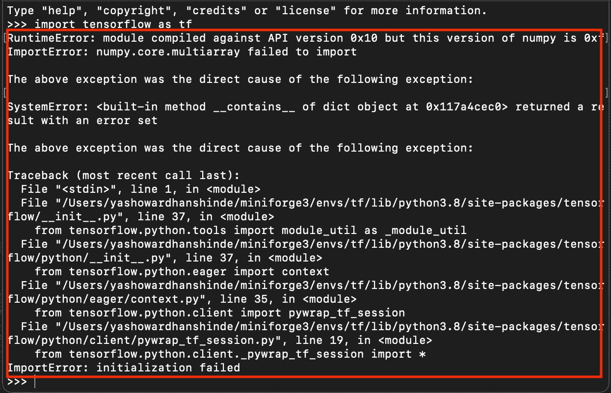

# 在 Apple Silicon 上安装 Tensorflow

> 原文：<https://medium.com/geekculture/installing-tensorflow-on-apple-silicon-84a28050d784?source=collection_archive---------4----------------------->

虽然现在有很多关于在新的 ARM 驱动的 Mac 上安装 Tensorflow 的内容，但我仍然努力在 Macbook Air M1 上设置我的 Tensorflow 环境。因此，我写这篇博客是为了向您介绍一个简单的安装指南，它从来没有让我失望过，每次都可以帮助您在几分钟内设置好 Tensorflow 环境。所以让我们开始吧！

本博客的内容如下:

1.  可以在苹果硅片上使用有 GPU 支持的 TensorFlow 吗？
2.  在 Mac 上设置支持 GPU 的 Tensorflow 的要求
3.  使用 GPU 支持安装 TensorFlow 的分步指南。



# 苹果硅片上可以用 TensorFlow GPU 吗？

早期，我不知道你可以利用苹果推出的新 ARM 芯片中的 GPU 核心。我看到了苹果官方关于在苹果新芯片驱动的 Mac 上安装 Tensorflow GPU 的指南，他们称之为 [TensorFlow-Metal](https://developer.apple.com/metal/tensorflow-plugin/) 。所以是的，你可以在苹果芯片上使用带有 GPU 支持的 TensorFlow。

# 在 Mac 上设置支持 GPU 的 Tensorflow 的要求

所以安装 TensorFlow-Metal 的基本要求是 Miniforge。您可以使用以下步骤轻松下载 Miniforge:

1.  从[这里](https://github.com/conda-forge/miniforge/releases/latest/download/Miniforge3-MacOSX-arm64.sh)下载 Miniforge 文件。
2.  使用如下所示的命令:

```
chmod +x ~/Downloads/Miniforge3-MacOSX-arm64.sh
sh ~/Downloads/Miniforge3-MacOSX-arm64.sh
source ~/miniforge3/bin/activate
```

如果由于某种原因这不起作用，你可以参考 YouTube 上由[杰夫·希顿](https://www.youtube.com/watch?v=w2qlou7n7MA)博士制作的这个视频。这个视频制作精良，深入解释了在 Mac M1 上安装 Miniforge 和 Anaconda 的过程。一旦你安装了 Miniforge，你就可以开始了。我强烈推荐看一遍这个视频。

# 安装 TensorFlow 的分步指南

首先创建一个新的 CONDA 虚拟环境并激活它。使用下面的命令来完成。

```
conda create -n tf python=3.9conda activate tf
```

现在我们需要逐个安装 TensorFlow-Metal 包。其中包括 TensorFlow-deps、TensorFlow-macOS 和 TensorFlow-metal。要安装这些程序，您可以运行以下命令:

```
conda install -c apple tensorflow-depspython -m pip install tensorflow-macos==2.9python -m pip install tensorflow-metal
```

一旦完成，你就可以走了。您可以使用以下命令检查安装是否成功。当您使用***TF . config . experimental . list _ physical _ devices(' GPU ')***命令时，应该可以看到 TensorFlow 版本和一个 GPU 设备。



Figure 1\. Successful Installation Result

但是现在棘手的部分来了。许多人在这个阶段会得到一个错误，而且 99%的时候，这主要是因为所需的和安装的 NumPy 版本不匹配。该错误可能如图 2 所示。问题是每个 TensorFlow 版本都是用特定的 NumPy 版本构建的。



Figure 2\. The most common error after installation is completed

没必要担心。通过卸载 NumPy 并重新安装正确的版本，可以很容易地修复这个错误。

```
conda remove numpyconda install -c conda-forge numpy=x.xx
```

现在你的 TensorFlow 应该没有问题了，你终于完成了安装。使用博客前面显示的代码片段，图 1，您可以确保一切正常工作。我希望这个指南能帮助你，你再也不会有安装 TensorFlow 的麻烦了。考虑在 Medium 上关注我，在 [LinkedIn](https://www.linkedin.com/in/yashowardhan-shinde-1636971b1/) 上与我联系！

[点击这里查看我的其他文章！](https://www.analyticsvidhya.com/blog/author/yasho_191/)