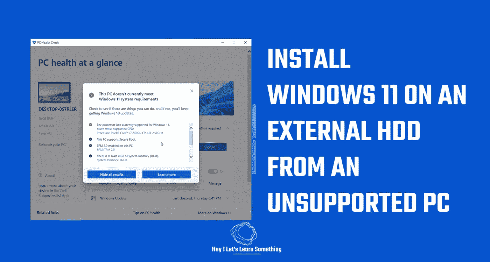

# 将 Windows 11 安装到外置硬盘

> 原文：<https://medium.com/geekculture/installing-windows-11-to-an-external-hard-disk-3d8e0978295e?source=collection_archive---------2----------------------->

我们使用了不支持的 Windows 10 计算机进行安装

**Windows 11 即将推出:**在本文中，我们将展示如何从不满足运行 Windows 11 的最低系统要求的 Windows 10 电脑上将 Windows 11 安装到外置磁盘上。安装过程非常简单，你可以携带硬盘，并从它运行 Windows 11。此外，您还可以…