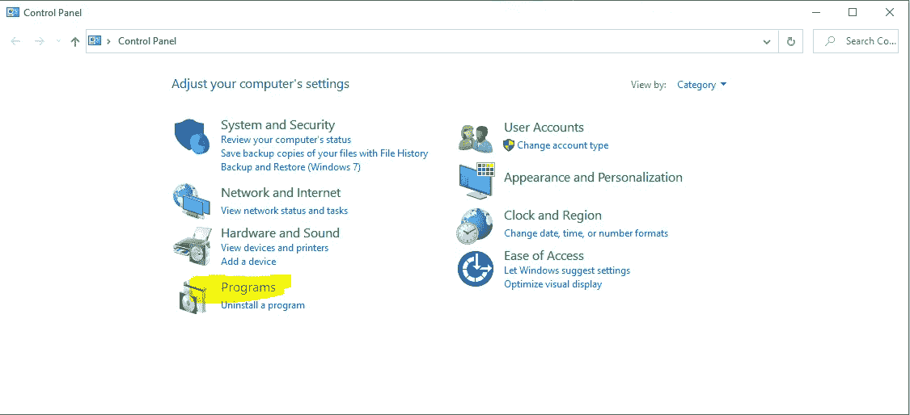
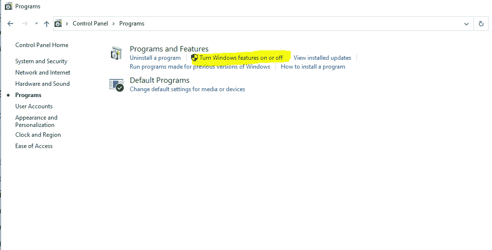
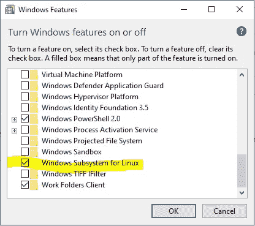
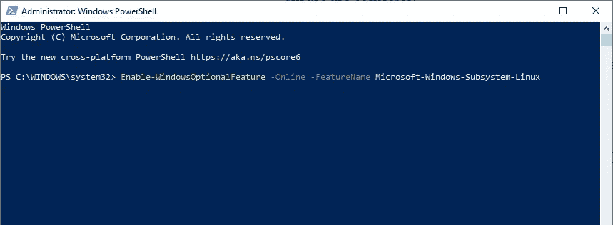
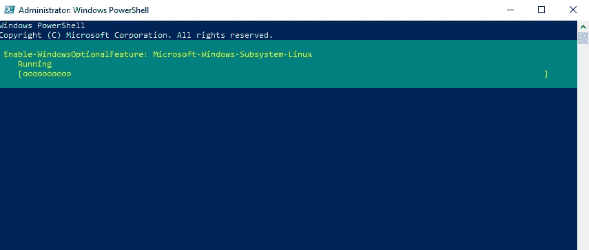
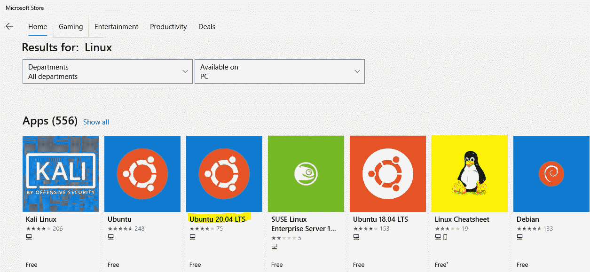
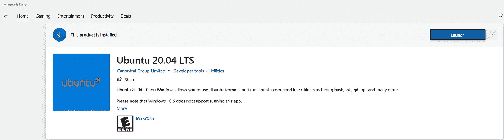

# 为 Windows 10 安装 Windows 子系统 for Linux (WSL)

> 原文：<https://medium.com/geekculture/installing-windows-subsystem-for-linux-wsl-for-windows-10-8fb975f7875d?source=collection_archive---------49----------------------->

Linux and Windows 10

我是一个狂热的 mac 用户，喜欢运行 Linux 发行版所带来的灵活性和强大功能。然而，有时候我还是有勇气使用 Windows。几年前，我认为用 Linux Ubuntu 发行版对我的基于 windows 的台式电脑进行分区是明智的。最后，当我试图从我的电脑上删除它时，问题出现了——我不知道我在做什么，不得不从 USB 驱动器上彻底删除我的电脑，以再次获得功能。

2016 年——微软在 Windows 操作系统上宣布了一项改变游戏规则的新功能。我的问题的答案是 WSL——被称为 Linux 的 Windows 子系统。

> 根据 Technopedia 的说法——“WSL 是 Windows 操作系统中的一种资源，它允许用户在安装了 Windows 操作系统的计算机上运行 Linux 命令行”。

这个新资源将鼓励开发人员和技术人员继续利用 Linux 环境接口，使用 python 和 ruby 等语言，但是是在 windows 上。我将向您展示如何在您的 windows 计算机上安装该工具，以便从今天开始使用它。

# 装置

在下载 WSL for Windows 10 之前，我们需要确保完成几个步骤。

1.  **启用 WSL** 要为 Linux 启用 Windows 子系统，我们需要:
    访问控制面板

选择程序和功能

选择打开和关闭 Windows 功能

搜索用于 Linux 的 Windows 子系统，并选择单选按钮以启用。

接下来，请允许电脑下载所需的资源，完成后，选择立即重启。

**2。使用 Windows PowerShell** 电脑重新启动后，选择 Windows 开始徽标并搜索 Windows PowerShell。请确保当您找到该程序时，您正在以管理员身份运行。

**3。利用 PowerShell 命令** 在 PowerShell 提示符下运行以下命令:

enable-Windows optional feature-Online-feature name Microsoft-Windows-Subsystem-Linux

按 Enter 键运行脚本。然后让系统做好准备，可能会发出系统重启命令来安装所需的资源。

**4。下载 Linux 发行版** 访问微软商店，搜索您的特定 Linux 发行版。我选择安装 Ubuntu 20.04 LTS。

允许下载发行版，完成后选择启动。

这将打开 Linux 应用程序并允许初始启动。这一阶段的初始化大约需要 2-3 分钟，完成后会提示您创建用户名和密码。

成功输入用户名和密码后，您将被置于 Linux 命令行中。这是成功执行安装的主要指标。

**可选:**作为额外的测试手段，输入 ***pwd*** 显示当前所在的目录。

恭喜您，您已经成功下载了 Linux 的 Windows 子系统，可以开始工作了！

真诚地

卡林顿云

**来源**:
[https://www . techopedia . com/definition/33033/windows-subsystem-for-Linux-wsl](https://www.techopedia.com/definition/33033/windows-subsystem-for-linux-wsl)