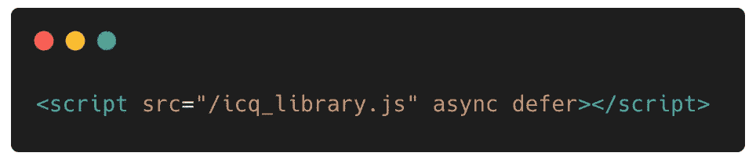
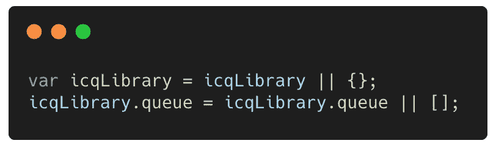
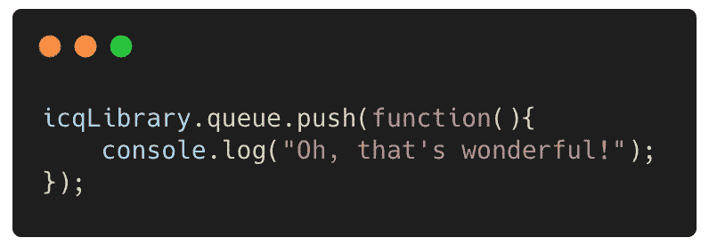
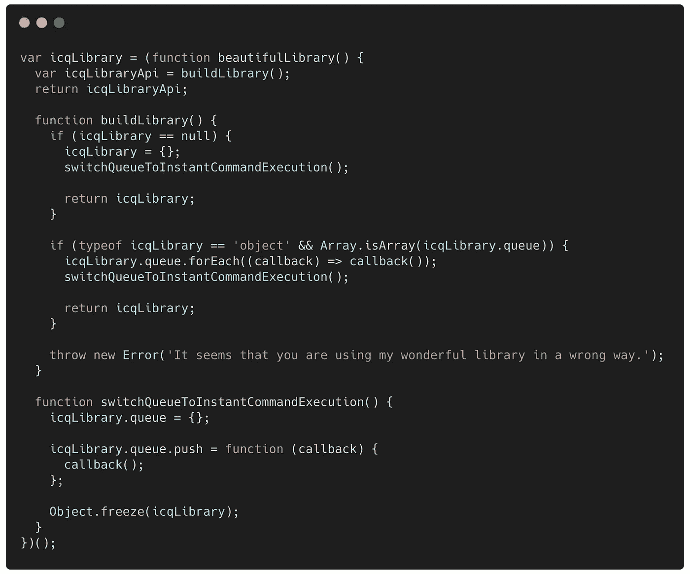

# 即时命令队列模式

> 原文：<https://medium.com/geekculture/instant-command-queue-pattern-5141b30d33dc?source=collection_archive---------24----------------------->

## 处理异步命令执行的一个不错的 JavaScript 技巧

Photo by [Dan Gold](https://unsplash.com/@danielcgold?utm_source=medium&utm_medium=referral) on [Unsplash](https://unsplash.com?utm_source=medium&utm_medium=referral)

在幕后，浏览器做的事情比你想象的要多。将 JavaScript 功能集成或添加到一个简单的网站会影响其性能。作为前端开发人员，当我们创建必须在任何网站上运行的东西时，我们必须时刻关注性能。尤其是对于像我这样在广告界工作的人来说。

在这篇文章中，我想谈谈一些著名的库是如何实现一个很好的模式，允许你在库准备好的时候配置某些代码的运行，而不管它的执行点。我们可以称之为“即时命令队列模式”,因为当库准备好并且特定逻辑运行时，所有命令都被执行，并且随后添加的所有命令都将被直接执行。

## 这个“模式”解决的是什么？

因此，我们有一个基于特定标准的库，它将初始化一个进程，这需要一些时间，并且由于该库将完全异步加载，我们不知道它将在何时实际加载。添加要执行的命令的客户端代码将能够在页面的任何部分执行，而不必担心该库是否存在并准备就绪。

因此，不知道库何时准备好，也不知道客户端代码何时可能想要执行某些命令，我们有两种可能发生的情况:

1.  我们在执行库之前配置所有的命令，然后当库准备好的时候，将按顺序执行所有的命令。
2.  该库已经执行，客户端命令仍必须执行。

我们可以通过一个简单的“模式”实现来防止客户端代码做一些令人讨厌的事情来解决这个问题。此外，这种模式允许不阻塞所有浏览器解析流，有利于用户使用页面内容。

我将向您展示的这个“模式”并不新鲜，事实上，您可以在广告界的知名库中找到它(已经实现了)，一个是 GPT(Google Publisher Tag)[https://developers . Google . com/Publisher-Tag/reference # Google Tag . cmd](https://developers.google.com/publisher-tag/reference#googletag.cmd)

## 包括图书馆

为了防止影响网站的性能，我们将以这种方式加载我们的库:

以下是对您看到的每个属性的作用的解释:

**async** :在 HTML 解析过程中下载文件，下载完成后会暂停 HTML 解析器执行文件。

**延迟**:在 HTML 解析过程中下载文件，只有在解析完成后才会执行。延迟脚本也保证按照它们在文档中出现的顺序执行。(就在 DOMContentLoaded 事件之前)

这使得执行顺序不可预测，因为我们已经用 async 和 defer 配置了脚本。

让我们看看这个机制是如何解决问题的。

## 客户代码

这段简单的代码应该放在将函数“添加”到队列之前的开头。

这两行代码表示:

如果使用的变量没有在全局执行上下文中初始化，那么用一个带有队列属性的对象将所有内容初始化回起点，该对象内部是一个空数组。否则，它使用已经存在于全局执行上下文中的内容。

完成此操作后，客户端代码将开始向队列添加回调。

这是用户不再担心加载库的地方。当然，用户还必须添加带有指向我们库的链接的脚本标签。

现在最好的部分，管理机制的代码。

## 图书馆代码

当我们的库被执行时，我们应该执行队列中的所有函数。

嘿！！为什么要实现 switchQueueToInstantCommandExecution()？没错。

一旦我们的库被加载和执行，我们要做的就是用一个带有“push”方法的对象替换“queue”属性。但是这次不是把它加入队列，而是直接运行！

显然，我们必须确保我们的库对象是不可变的，为此，有一个“Object.freeze()”(对于正在讨论的例子来说足够了)。在文章的最后链接到要点。

## 为什么有效？

javascript 代码的执行是同步的。一旦 javascript 执行器找到一个函数，它就被放在一个“队列”中，称为“调用堆栈”，代码将被连续执行。因此，在执行库之前，我们的“队列”将是一个简单的数组，因此客户端代码可以使用简单的“推送”方法，在执行(“原子”)之后，“队列”将是直接执行客户端代码“推送”的函数的对象。

当然，这只是 Javascript 中事件循环在幕后所做工作的一小部分。

## 结论

仅此而已！现在我们再也不用担心库什么时候被下载和执行了。

看到能够解决“复杂”问题的简单事物背后隐藏着多大的力量，是一件非常美妙的事情。如果你对这些例子有任何建议或修正，请在评论中告诉我！

感谢关注！下次见！

## 资源

*   [https://carbon.now.sh/](https://carbon.now.sh/)
*   [https://262 . ECMA-international . org/12.0/# sec-execution-contexts](https://262.ecma-international.org/12.0/#sec-execution-contexts)
*   [https://gist . github . com/Marco-Prontera/96b 68d 72150 b 98 a3 EFA 51211 e9 BFF 723](https://gist.github.com/Marco-Prontera/96b68d72150b98a3efa51211e9bff723)