# 保险索赔-使用机器学习进行欺诈检测

> 原文：<https://medium.com/geekculture/insurance-claims-fraud-detection-using-machine-learning-78f04913097?source=collection_archive---------0----------------------->

raud 是保险公司面临的最大、最广为人知的问题之一。本文关注一家汽车保险公司的索赔数据。欺诈性索赔对每个保险公司来说都是非常昂贵的。因此，重要的是要知道哪些主张是正确的，哪些是错误的。保险公司亲自检查所有的索赔是不可行的，因为这将花费太多的时间和金钱。在本文中，我们将利用保险公司在反欺诈斗争中拥有的最大资产:数据。我们采用关于索赔、被保险人和其他情况的各种属性，这些属性由保险公司包含在数据中。区分不同的索赔组和这些组中相应的欺诈率提供了新的见解。

此外，我们使用机器学习来预测哪些索赔可能是欺诈性的。这些信息可以缩小需要进一步检查的索赔列表。它使保险公司能够发现更多的欺诈性索赔。

# 问题定义

这个项目的目标是建立一个可以检测汽车保险欺诈的模型。机器学习中欺诈检测背后的挑战是，与合法的保险索赔相比，欺诈远不常见。

鉴于欺诈模式的多样性和典型样本中已知欺诈的相对较小比例，保险欺诈检测是一个具有挑战性的问题。在构建检测模型时，损失预防带来的节约需要与错误警报的成本相平衡。机器学习技术允许提高预测准确性，使损失控制单元能够以低误报率实现更高的覆盖率。

保险欺诈包括个人为了从保险公司获得有利结果而可能实施的一系列不当活动。这可能包括策划事件、歪曲情况(包括相关行为者和事件原因)以及最终造成的损害程度。

# 数据分析

在这个项目中，我们有一个数据集，其中包含保险单的详细信息以及客户的详细信息。它还有据以提出索赔的事故细节。

给定的数据集包含 1000 行和 40 列。列名，如保单号、保单绑定日期、保单年度保费、事故严重性、事故位置、汽车型号等。

这个数据集的明显缺点是样本量小。但是，仍然有很多公司没有大数据集。对于任何希望转型到利用数据科学的公司来说，利用可用资源的能力至关重要。

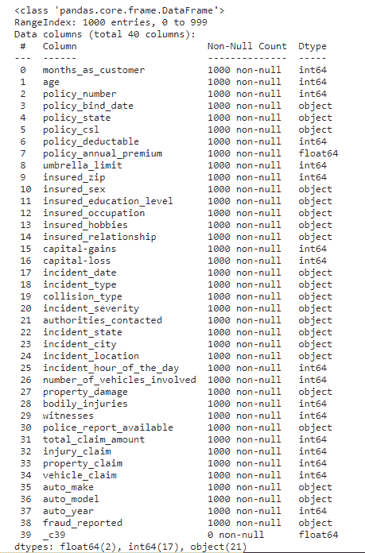

Description of the data

与等待拥有庞大数据集的那一天的公司相比，从小型数据集开始并处理它的公司更有可能在数据科学之旅中更早成功并获得回报。

有些变量包含空值字符“？”。下面给出了空值的数量。

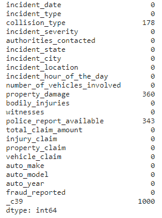

Unique values

# 探索性数据分析

*   **因变量:**从因变量 Fraud_reported 开始进行探索性数据分析。有 247 起欺诈事件，753 起非欺诈事件。24.7%的数据是欺诈性的，而 75.3%是非欺诈性的索赔。

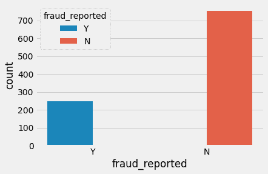

Reported frauds

*   **变量之间的相关性:**为 Pearson 相关系数至少为 0.3 的变量绘制热图，包括 DV。客户的月份和年龄的相关系数为 0.92。可能是因为司机在拥有一辆车时购买了汽车保险，而这一时间尺度只会随着年龄的增长而增加。除此之外，数据中似乎没有太多的相关性。似乎没有多重共线性的问题，除了可能所有的索赔都是相关的，不知何故总索赔已经考虑了它们。但是，其他声明提供了一些粒度，否则总声明将无法捕获这些粒度。因此，这些变量被保留下来。
*   **可视化变量:**报告的欺诈价值因客户的爱好而异。看起来棋手和交叉对手有更高的欺诈倾向。

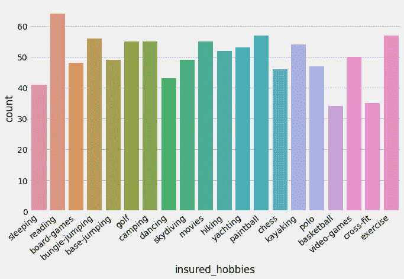

Hobbies of customers with respect to frauds committed

> 重大事件的严重性似乎是欺诈案件最高，超过了非欺诈案件。

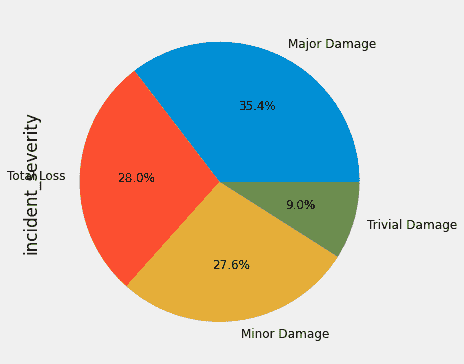

Damage analysis

> 萨博和斯巴鲁 auto_make 的 total_claim_amount 较高。

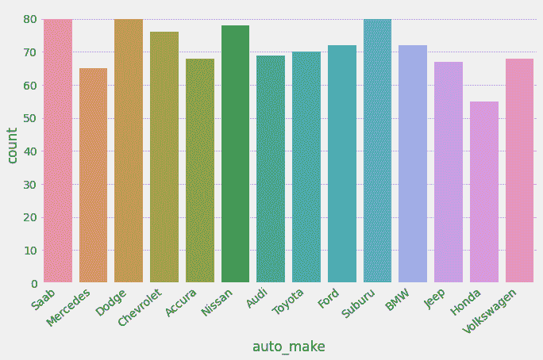

Total insurance claims with respect to car brands

> 日产汽车的伤害索赔最高。

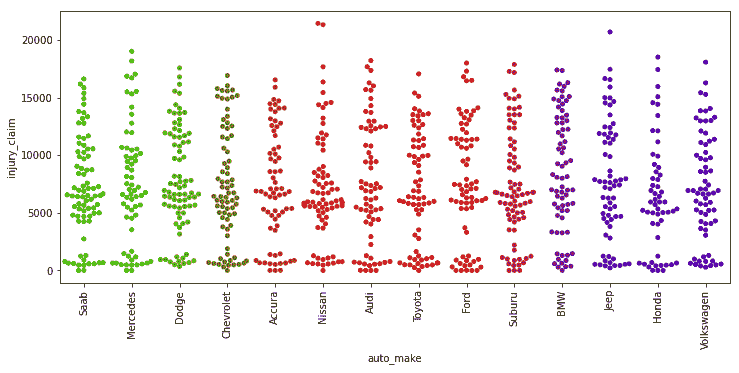

Injury claims with respect to car brands

检验因变量和自变量之间的相关性。

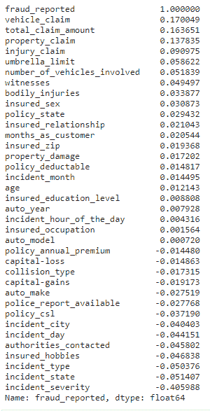

Correlation

## 预处理流水线

数据预处理是机器学习中产生高度准确和深刻结果的主要步骤。数据质量越高，产生的结果越可靠。**不完整、有噪声和不一致的数据**是真实世界数据集的固有特性。数据预处理有助于通过填充缺失的不完整数据、平滑噪声和解决不一致来提高数据质量。

*   **数据不完整**可能是由多种原因造成的。由于误解或仪器缺陷和故障，可能无法保存适当的数据。
*   **噪声数据**可能因多种原因出现(具有不正确的特征值)。用于数据收集的仪器可能有故障。数据输入可能包含人为或仪器错误。也可能发生数据传输错误。

数据预处理涉及许多阶段。

*   **数据清理**试图估算缺失值，从数据集中移除异常值。
*   **数据集成**将来自多个来源的数据集成到一个数据仓库中。
*   **可应用数据转换**，如标准化。例如，归一化可以提高涉及距离测量的挖掘算法的准确性和效率。
*   **数据缩减**可以通过删除冗余特征来缩减数据大小。可以使用特征选择和特征提取技术。

**处理空值**

有时，某些列包含空值，用于指示缺少或未知的值，或者该值可能不存在。在我们的数据集中，空值出现在 collision_type、property_damage、police_report_available 和 _c39 列中，有 178、360、343 和 1000 个空值。

有不同的方法来替换数据集中的空值，但是我们使用 fillna 来替换数据中的空值。

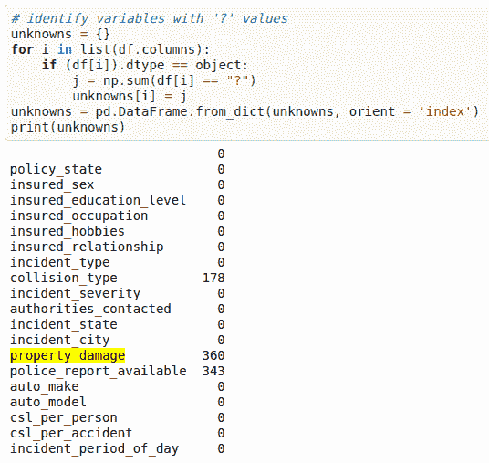

**将标签转换成数字**

在机器学习中，我们通常处理在一列或多列中包含多个标签的数据集。这些标签可以是单词或数字的形式。为了使数据可理解或以人类可读的形式，训练数据通常用文字标记。

在我们的数据中，有包含分类值的列。像事件严重程度、事件状态、事件类型、被保险人爱好、联系机构、事件城市、警察报告可用、汽车制造、碰撞类型、汽车型号、被保险人职业、被保险人教育水平、财产损失、被保险人关系、政策状态、被保险人性别、欺诈报告等列。这些列必须用一个热编码或标签编码器来处理。目标变量 fraud_reported 必须仅使用标签编码器进行转换。

**标签编码器**是将标签转换成数字形式，从而转换成机器可读的形式。然后，机器学习算法可以以更好的方式决定这些标签必须如何操作。这是监督学习中结构化数据集的一个重要预处理步骤。

python 中的标签编码可以从 Sklearn 库中导入。Sklearn 提供了一个非常高效的编码工具。标签编码器使用 0 和 n_classes-1 之间的值对标签进行编码。

> **离群值**是远离其他相似点的数据点。它们可能是由于测量中的可变性或可能表明实验误差。如果可能，离群值应该从数据集中排除。然而，检测这种异常情况可能非常困难，而且并不总是可能的。

去除异常值的方法:

*   **Z-score —** 调用 scipy.stats.zscore()，将给定的数据帧作为其参数，以获取包含数据帧中每个值的 Z-score 的 numpy 数组。使用前面的结果调用 numpy.abs()将 dataframe 中的每个元素转换为其绝对值。使用语法(数组< 3)。all(axis=1)以 array 作为前一个结果来创建一个布尔数组。
*   **四分位数范围** —四分位数范围可用于检测数据框架中存在的异常值。
*   使用 scipy.stats.iqr 模块计算数据的四分位间距。
*   将四分位间距乘以 1.5。
*   第三个四分位数加上 1.5 倍的四分位数间距。任何大于这个值的数字都是可疑的异常值。
*   从第一个四分位数减去 1.5 倍四分位数间距。任何小于这个值的数字都是可疑的异常值。

**平衡我们不平衡的数据**

有不同的算法来平衡目标变量。我们使用 SMOTE()算法来平衡数据。

> **注意:** SMOTE(合成少数过采样技术)的工作原理是从少数类中随机选取一个点，并计算该点的 k 近邻。合成点被添加到所选点及其相邻点之间。

SMOTE 算法在 4 个简单的步骤中工作:

1.  选择一个少数类作为输入向量。
2.  找到它的 k 个最近邻。
3.  选择这些邻居中的一个，并将合成点放置在连接考虑中的点及其选择的邻居的线上的任何位置。
4.  重复该步骤，直到数据平衡。

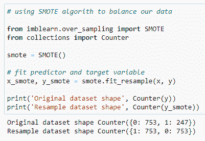

Balancing the data

我们数据的原始形状是 753 代表欺诈 _ 无价值报告，247 代表有。SMOTE 算法将我们的数据与其中存在的最大数量的值进行平衡。

# **建立机器学习模型**

为了构建机器学习模型，Sklearn 模块中有几个模型。

Sklearn 提供回归和分类两种模型。我们数据集的目标变量是预测欺诈是否被举报。因此，对于这类问题，我们使用分类模型。

但在将数据集拟合到其模型之前，我们首先必须分离预测变量和目标变量，然后将该变量传递给 train_test_split 方法，以创建随机测试和训练子集。

> **什么是 train_test_split** ，it 是 sklearn 模型选择中的一个函数，用于将数据组拆分为训练数据和测试数据两个子集。有了这个函数，就不需要手动划分数据集了。默认情况下，sklearn train_test_split 会对这两个子集进行随机分区。但是，您也可以为操作指定随机状态。它给出四个输出 x_train、x_test、y_train 和 y_test。x_train 和 x_test 包含训练和测试预测变量，而 y_train 和 y_test 包含训练和测试目标变量。

在执行 train_test_split 之后，我们必须选择模型来传递训练变量。

我们可以建立尽可能多的模型来比较这些模型给出的精度，并从中选择最佳模型。

我选择了 5 种型号:

*   **来自 sklearn.linear_model 的 Logistic 回归:** Logistic 回归是一种监督学习分类算法，用于预测目标变量的概率。目标或因变量的性质是二元的，这意味着只有两种可能的类别 1(代表成功/是)或 0(代表失败/否)。在数学上，逻辑回归模型预测 P(Y=1)为 x 的函数。这是最简单的 ML 算法之一，可用于各种分类问题，如垃圾邮件检测、糖尿病预测、癌症检测等。

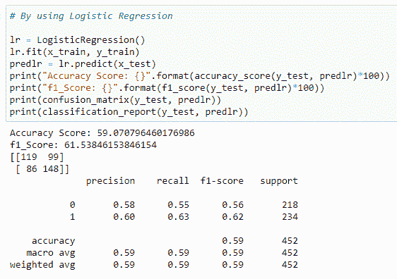

*   **来自 sklearn.tree 的决策树分类器:**决策树可以通过一种算法方法来构建，这种算法方法可以基于不同的条件以不同的方式分割数据集。树的两个主要实体是决策节点，数据在这里被分割，树叶在这里我们得到结果。

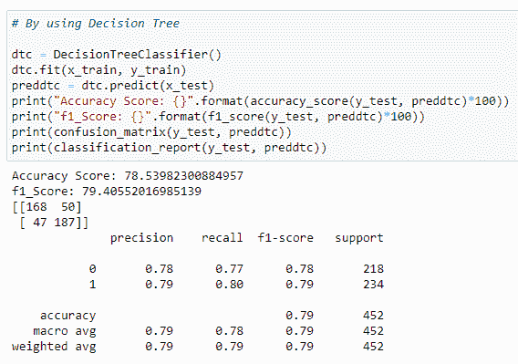

*   **来自 sklearn.ensemble 的 RandomForestClassifier】众所周知，森林是由树木组成的，更多的树木意味着更健壮的森林。类似地，随机森林算法在数据样本上创建决策树，然后从每个样本中获得预测，最后通过投票选择最佳解决方案。这是一种比单一决策树更好的集成方法，因为它通过平均结果来减少过拟合。**

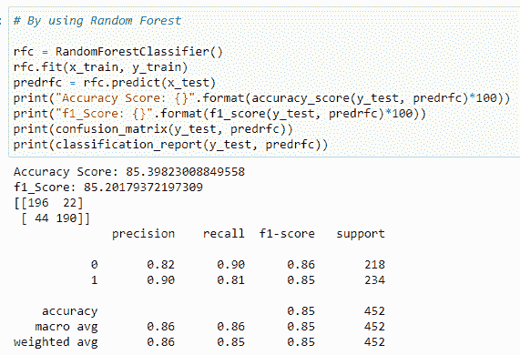

*   **XGBoost 的 XGBClassifier:**XGBoost 是“极端梯度增强”的缩写。“极致”是指并行计算和缓存感知等速度增强，使 XGBoost 比传统的梯度提升快大约 10 倍。此外，XGBoost 包括一个独特的分裂查找算法来优化树，以及内置的正则化来减少过度拟合。一般来说，XGBoost 是一个更快、更精确的渐变增强版本。

*   **来自 sklearn.naive_bayes 的 GaussianNB:**Naive bayes 算法是一种基于应用 Bayes 定理的分类技术，它强烈假设所有预测器都是相互独立的。简而言之，假设一个类中某个特性的存在独立于同一个类中任何其他特性的存在。它是最简单的朴素贝叶斯分类器，假设来自每个标签的数据来自简单的高斯分布。

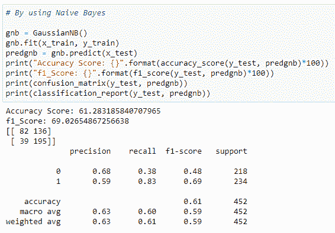

# **从模型中得出的结论**

我们得到了我们最好的模型，即 RandomForestClassifier，准确率达到 85.39%。这里，我们的模型预测 218 个阳性病例中的 196 个真阳性病例和 234 个真阴性病例中的 190 个真阴性病例。它预测 218 个阳性病例中的 22 个假阳性病例和 234 个病例中的 44 个假阴性病例。它给出了 85.20%的 f1 分数。

**了解精确回忆和 f1 分数和准确度的作用**

*   **F1 得分**:这是精确度和召回率的调和平均值，比精确度矩阵更能衡量错误分类的情况。

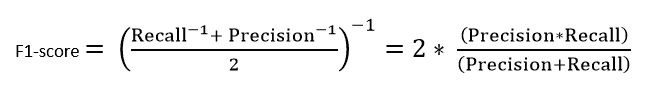

*   **精度:**隐含为从所有预测阳性病例中正确识别出阳性病例的度量。因此，当假阳性的成本很高时，它是有用的。

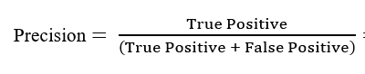

*   **召回:**是从所有实际阳性病例中正确识别出阳性病例的度量。当假阴性的成本很高时，这一点很重要。

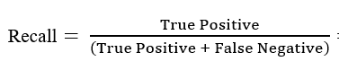

*   **准确性:**更明显的度量之一，它是所有正确识别的案例的度量。当所有的类都同等重要时，它最常用。

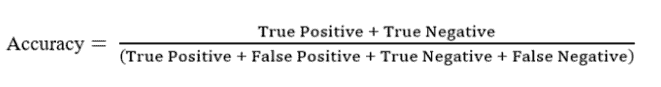

**混淆矩阵**

一种表格，通常用于描述分类模型(或“分类器”)对一组已知真实值的测试数据的性能。

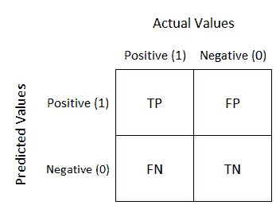

> **注:**
> 
> **TN/真阴性:**病例阴性，预测阴性。
> 
> **TP/真阳性:**病例阳性，预测阳性。
> 
> **FN/假阴性:**病例呈阳性但预测为阴性。
> 
> **TN/真阴性:**病例为阴性但预测为阳性。

# **超参数调谐**

机器学习中的超参数优化旨在找到给定机器学习算法的超参数，这些参数在验证集上测量时提供最佳性能。与模型参数相反，超参数由机器学习工程师在训练之前设置。随机森林中的树的数量是超参数，而神经网络中的权重是在训练期间学习的模型参数。我喜欢将超参数视为要调整的模型设置，以便模型可以最优地解决机器学习问题。

我们将使用 GridSearchCV 进行超参数调优。

**GridSearchCV**

在 GridSearchCV 方法中，针对一系列超参数值来评估机器学习模型。这种方法被称为 GridSearchCV，因为它从超参数值的网格中搜索最佳超参数集。

**ROC 曲线:** It **ROC 是概率曲线，AUC 代表可分性的程度或度量。它告诉我们这个模型在多大程度上能够区分不同的类。AUC 越高，模型预测 0 为 0 和 1 为 1 的能力越强。以此类推，AUC 越高，模型在区分患病和未患病患者方面就越好。**

用 TPR 对 FPR 绘制 ROC 曲线，其中 TPR 在 y 轴上，FPR 在 x 轴上。

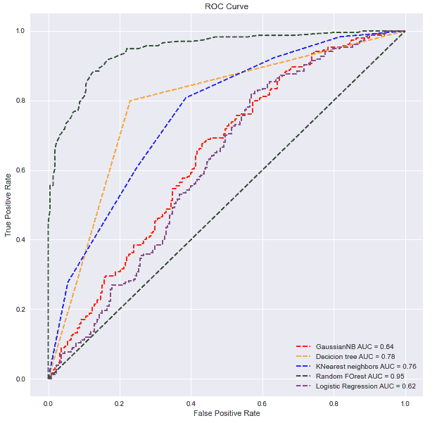

Comparing ROC curves for all the models

# **备注**

这个项目建立了一个可以检测汽车保险欺诈的模型。这样做，该模型可以减少保险公司的损失。机器学习中欺诈检测背后的挑战是，与合法的保险索赔相比，欺诈远不常见。

在这个项目中使用了五种不同的分类器:逻辑回归、K-最近邻、随机森林、决策树、高斯神经网络。用这五个分类器测试了处理不平衡类的四种不同方式:类加权模型、SMOTE 过采样、超参数调整和绘制模型的 roc 曲线。

最佳和最终拟合的模型是加权的 ***随机森林*** ，其 F1 值为 *0.85* ，ROC AUC 为 *0.95* 。该模型表现出色。该模型的 F1 评分和 ROC AUC 评分是其他模型中最高的。总之，该模型能够以较高的准确度正确区分欺诈索赔和合法索赔。

这项研究并非没有局限性。首先，本研究受到样本量小的限制。数据集越大，统计模型越稳定。它也更容易概括，因为它占实际人口的比例更大。此外，该数据仅涵盖 3 个州的事故索赔。

# **参考文献**

*   [XGBClassifier](https://www.youtube.com/watch?v=UaiRkUuzcPI)
*   [超参数调谐](https://www.youtube.com/watch?v=SctFnD_puQI)
*   [重击](https://www.youtube.com/watch?v=YMPMZmlH5Bo)
*   [XGBoost 入门](https://towardsdatascience.com/getting-started-with-xgboost-in-scikit-learn-f69f5f470a97)
*   GridSearchCV 优化&T21:

1.  Sebastian Raschka 和 Vahid Mirjalili 的 Python 机器学习
2.  伊莎贝尔·盖恩的《变量和特征选择导论》