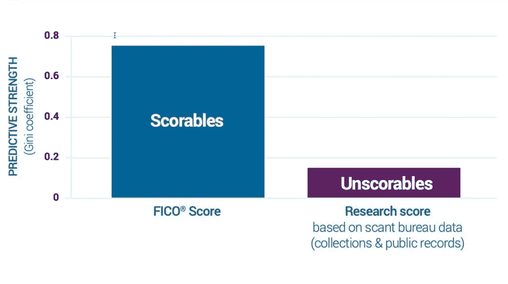
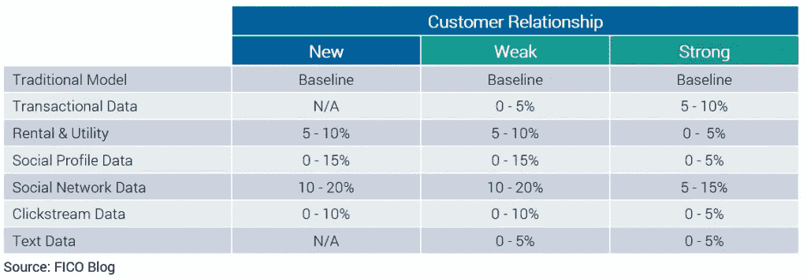
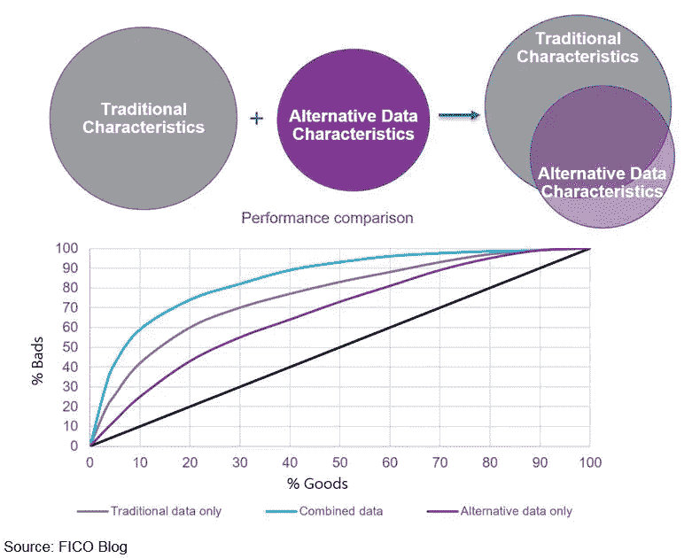

# 使用替代数据的保险和信用评分

> 原文：<https://medium.com/geekculture/insurance-credit-scoring-with-alternative-data-dae50bf54f4d?source=collection_archive---------36----------------------->

无论我们谈论的是信贷发放还是保险承保领域，替代数据通常是指与个人信贷或保险索赔行为没有内在联系的数据集。传统数据通常局限于来自信用机构的数据(想想 Equifax。Experian、TransUnion)、信贷或保险申请数据，或现有客户的机构专有文件。

替代数据有很多含义不仅成为一个热门话题，甚至成为一个流行语，部分原因是过去十年的数据爆炸(IDC 估计，2010 年有 1.2 兆字节的数据被创建。2018 年产生了 330 亿字节的数据，导致 [IDC 预测](https://www.seagate.com/our-story/data-age-2025/)2025 年，全球将产生 175 亿字节的新数据。部分原因是看涨的对冲基金和其他更倾向于尝试“新”方法的机构大肆宣传。在过去的五年中，致力于利用该领域替代数据的全职员工增长了 450%，现在有 44%的基金拥有专门的团队来收获这种替代数据的好处。据 EY 称，数据冲击。

但是硬币的另一面是，据估计全球有 30 亿成年人没有信用，因此没有任何信用档案，根据评分领导者菲科。在世界许多地方，这是一个巨大的服务不足的市场。虽然这些成年人生活在发展中国家和具有早期信用基础设施的前沿市场，但成熟市场中也有大量的人没有信用档案，因此不为征信机构所知。这些就是所谓的‘信用无形资产’。

有人可能会问，为什么“信用隐形”很重要？例如，在美国，如果不是最重要和最成熟的信贷和保险市场，根据[消费者金融保护局](https://www.consumerfinance.gov/)的说法，“三家全国性信用报告机构(NCRAs)维护的信用记录中反映的信用历史有限的消费者在获得大多数信贷或保险方面面临重大挑战。贷方在做出信贷和/或保险承保决策时经常使用 NCRA 记录。在现实中，贷款人和保险公司在决定是否批准贷款申请或设定贷款利率时，经常使用评分解决方案，如来自 NCRA 记录的 FICO 或 VantageScore 评分之一。如果申请人在 NCRAs 中没有信用记录，或者记录中包含的信息不足以评估她的信用度，贷款人&保险公司就不太可能提供信贷服务，或者接受保险计划中的个人部分。因此，信用记录有限的消费者进入这些市场的机会可能会大大减少。

在美国，估计有 5300 万人没有足够的征信机构档案(2800 万)或者在征信机构没有记录(2500 万)。该领域的一些市场领导者公开解释的最低评分标准是:

*   消费者不会死亡
*   信用档案需要至少一个在过去六个月内报告的账户
*   信用档案需要至少一个至少六个月的帐户

FICO [最近完成了一项研究](http://subscribe.fico.com/can-alternative-data-expand-credit-access)，研究如何向不符合上述标准的“不可分”消费者提供信贷。FICO 分析了 2800 万只有稀疏或陈旧的信用局数据的消费者。TL；博士版——不可能吧！研究表明，仅仅基于旧的或无光泽的信用数据创建评分模型在预测未来表现方面表现不佳。

这项研究开发了大约 700 万消费者，至少有一些公共记录可用。结果显示，数据越老，评分模型变得越不可靠。与任何特定分数(比如 650 分)相关的固有风险水平在具有陈旧记录的连续人群中不会相同。

为什么这是一个问题？想想抵押贷款。在给定的分数截止点提出承销策略的贷款人，实际上可能会接受还款风险明显不同的客户，尽管他们都有相同的 650 分。如前所述，出现这种情况是因为首先用于对消费者评分的数据越旧，底层评分模型的性能就越不可靠。FICO 实际上表明“基于 21 个月或更长时间没有更新的文件的 640 分显示出与传统可评分人群的 590 分大致一致的还款风险——大约 50 点的不一致几率。”

底线是，当在稀疏或旧的局数据上评分时，风险辨别是弱的。使用低分数的贷方意味着他们可能会拒绝他们应该接受的客户，反之亦然。对消费者来说，这意味着获得的信贷额度(如果有的话)可能比要求的要少，或者更糟糕的是，比他们实际能够负担的要高。

此外，对于这 2800 万消费者中的绝大多数来说，传统的基于数据的评分模型根本不会让他们在第一时间获得信贷。据三大 NCRAs 中的至少一家报告，超过一半的 NCRAs 有负项目或没有可从中获取信息的活动账户。如果没有数据流入评分模型以产生积极影响，他们就不太可能获得信贷。他们实际上陷入了一个恶性循环:为了获得信贷或保险，他们需要使用信贷或保险设施——但如果没有一种可靠的方法来评估他们的风险，贷款人和保险公司可能不会抓住机会把他们作为客户。

对于美国市场剩余的 2500 多万潜在消费者来说，没有任何文件，统计局的数据也不会有帮助。他们也陷入了这种第 22 条军规的境地。

因此，如果信贷或保险确实要提供给这个相当大的“不可分”的观众，信用局的数据必须附加非传统形式的数据。

现在我们知道了为什么需要利用替代数据，让我们从单词“go”开始解决房间里的大象。

替代数据不会简化为社交媒体来源的数据。事实上，数据来源于脸书、Instagram、Twitter 等有不言而喻的原因。，并不完全是出于信用/保险风险评分目的的高质量数据。

那么，如果替代数据不仅仅是来自社交媒体的数据，那是什么呢？

# 多种类型的替代数据

*-交易数据* **💵**

这种类型的数据通常被定义为信用卡和借记卡的消费者使用模式。有人可能会问，交易数据是如何“替代”的？这些数据中有很多并没有被积极挖掘来建立预测模型。

缺点—时间密集

正-数据通常结构良好且干净

## -公用设施/租赁数据🔌🏡

这通常是历史数据，但很少出现在主要 NCRAs 的报告中。一些评分公司实际上已经把它作为他们产品的一部分，主要是针对美国市场。

## -点击流数据🌐

通俗地说，这就是用户浏览网站的方式。到 2022 年，随着大多数(如果不是所有)浏览器的第三方 cookie 跟踪的“T2”死亡，“T5”，以及去年 Avast 开始关闭其子公司 Jumpshot 的消息，“T5”这种类型的数据变得更加稀缺，我敢说更加不可靠。

## -音频和文本文件🔊📚

这种类型的非结构化数据通常来自信贷/保险申请文档、客户和贷方之间的通话记录等。

## -analysis🕸️社交网络

随着支撑[知识图](https://siren.io/enterprise-knowledge-graphs-advancements/)的技术在过去几年变得越来越成熟，这种分析看似分散的数据集之间关系的方法可以作为数字基础[在数字时代](https://www.zdnet.com/article/5-technology-trends-for-the-roaring-20s-part-2-ai-knowledge-graphs-infinity-and-beyond/)的主数据管理学科中统一知识获取和组织的理念。本体，管理知识图表的精心设计的模式，现在正被摩根斯坦利的世界所使用。

## -⁉️调查/问卷数据

像 [LenddoEFL](https://lenddoefl.com/) 这样的公司正在使用[心理测量学](https://www.psychometricsociety.org/what-psychometrics)，这是一个与心理测量的理论和技术有关的研究领域，将这些数据集挖掘成数学预测得分解决方案。

## -网络数据🔗

这就是 Zyte 大放异彩的地方。这种类型的数据可以是公共在线存储库中的任何内容，可以是特定主题的论坛帖子、产品&定价信息、产品&服务评论等。全球会计公司 [EY](https://eyfinancialservicesthoughtgallery.ie/will-embrace-innovation-illuminate-competitive-advantages/) 实际上称网络数据为第二精确的&有洞察力的替代数据集。

## -地理位置数据🗺️📍

地理位置数据是可用于识别电子设备的物理位置的信息。随着用户基本上随身携带他们的连接设备，它已经成为一个不断增长的数据源，用于评估从商店客流量到人口出行模式的任何事情。

# 数据有多少价值？

[最近的研究](https://www.fico.com/blogs/using-alternative-data-credit-risk-modelling)表明，事实上，上述数据来源确实为基本上基于传统数据的信用和组织保险风险模型增加了预测价值。虽然赋予基础模型的预测值的数量取决于基础变量，例如与贷方的客户关系的强度、传统的基于数据的模型的原始预测性能，但是每个数据集的总体性能增益在 5% -20%的范围内。例如，当将社交网络数据应用于新客户入职场景时(约 10%-20%的模型性能增益)，社交网络数据通常比各方之间已有牢固关系时(5%-15%)更有价值。在这个假设场景中，交易数据是另一个非常强的预测因素。

下图显示了领先的评分解决方案提供商之一的 [FICO](https://www.fico.com/) 在个人贷款组合上开展的一个项目的结果。“传统的信贷特征比替代数据特征获得了更多的价值(替代数据获得了大约 60%的预测能力)，并且两者之间有很高程度的重叠。”也就是说，当这两个数据集相结合时，整体模型性能显著提高。

# 替代数据如何产品化？人工智能和机器学习在图中的什么位置？

正如我在上面所展示的，有效地利用替代数据虽然非常强大，但并非没有挑战。各种分析技术和机器学习方法被用来处理大型非结构化数据集。在信贷和/或保险风险场景中识别可以有效和高效使用的数据模式是一项挑战。

尽管如此，机器学习和人工智能应用的关键要素仍然是数据科学家。模型需要经历严格的质量保证过程，以保证输出的准确性，确定的模式是强有力的，相关的，可解释的。正是这最后一个因素，在未来，引起了最大的眉毛和关注。如何向消费者和监管机构解释人工智能驱动的替代数据赋能评分模型？

模型可解释性与监管和遵从领域交互的一个非常具体的例子是在通用数据保护法规(GDPR)的环境中。

《GDPR》第 22 条涉及"自动化的个人决策，包括特征分析"。在没有人工干预的情况下，处理是自动化的。根据第 22 条，个人有权不受制于仅基于包括貌相在内的自动处理的决定，这种决定会对个人产生法律效力，或对个人产生类似的重大影响。GDPR 引用“自动拒绝网上信贷申请”作为自动决策产生法律或类似重大影响的典型例子。

根据 GDPR，在某些情况下允许自动处理，但只有当有适当的措施来保障个人的权利时，包括允许个人有机会请求人工干预、表达观点和质疑决定。

这就是人工智能得分变得复杂的地方。总的来说，人工智能不会无缘无故地被称为“黑箱”;因此，在风险应用中，客户需要有明确的理由来解释为什么他们会受到决策的不利影响。如果决策是基于模型的，那么模型需要能够解释清楚负得分和正得分的各个驱动因素。如果这是一个简单的传统记分卡，那么解释就不言而喻了。但当人工智能模型不那么清晰时，麻烦就开始了，这再次提高了人工智能可解释性的门槛(来自 FICO 的[斯科特·佐尔迪](https://internetofthingsagenda.techtarget.com/blog/IoT-Agenda/Three-Es-of-AI-Creating-explainable-AI?_ga=2.225768409.2136625243.1592250013-1975352399.1590694323)和来自海洋协议的[特伦特·麦康纳](https://blog.oceanprotocol.com/blockchains-for-artificial-intelligence-ec63b0284984)在这个主题上有一些有趣的文章)。

# 这给我们留下了什么？

为了满足市场的需求，无论是从寻求吸引新客户的贷款人和保险公司的角度，还是从消费者的角度来看，包含替代数据源的风险评分策略都是至关重要的。

虽然随着像[FICO](https://www.fico.com/)&[vantage score](https://vantagescore.com/)这样的公司带着某种程度的替代数据增强的分数进入市场，上述情况可能正在进行中，但显而易见的是，寻找替代数据的欲望；尤其是网络数据，只会越来越多。因此，显而易见的是，评分公司、贷款机构和保险公司需要投资一个弹性的替代数据收集基础设施和流程。

保持对人工智能可解释性的警惕也是至关重要的，以便保持符合当前的监管要求，并向消费者提供相当程度的透明度。

*原载于*[*https://www.zyte.com*](https://www.zyte.com/blog/insurance-credit-scoring-enhanced-with-alternative-data/)*。*