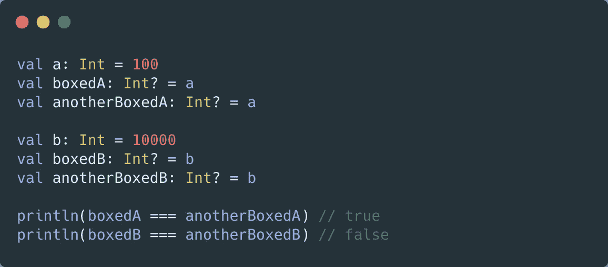

# Kotlin/Java 中的 IntegerCache

> 原文：<https://medium.com/geekculture/integercache-in-kotlin-java-c2044b12de2c?source=collection_archive---------25----------------------->

使用引用相等检查，您可能会偶然发现 *IntegerCache* 的概念。让我们深入研究一下这个私有静态类。

在例子中，你知道为什么对 **200** 的参照检查为假，而对 **127** 的检查为真*吗？如果你知道原因，那么你可以跳过下面的文章。*

# *IntegerCache:*

*为了提高性能和节省内存，Java 5 中引入了 IntegerCache。*

> *"整数缓存*支持 Java 语言规范要求的-128 到 127 之间值的自动装箱的对象标识语义"**

*   *当我们显式创建 Integer 对象的实例时，它不会被缓存。*
*   **IntegerCache* 仅适用于自动装箱。*

**IntegerCache* 的优点是可以重用常用的整数值，这意味着可以进行标识比较和自动装箱。
它还阻止 GC 运行常见的整数运算。*

# *IntegerCache 是如何工作的？*

*缓存在第一次使用时初始化。 *IntegerCache* 存储从 *IntegerCache.low (-128)* 到 *IntegerCache.max(127)* 的所有实例。
这意味着 *Integer.valueOf(127)* 将总是给出相同的实例。*

*当一个值超过缓存限制时，每次都会创建一个新对象。*

# *解释是:*

*为了理解身份比较，我们需要理解来自 *Integer* 类的
*Integer.valueOf* 方法。*

*如果你看下面的要点，你会看到方法的*value 试图检查提供的 int 是否在缓存的范围内，如果是，则返回实例。因此总是给出整数
的相同实例。
任何超出 *IntegerCache* 范围的值都将触发新的整数创建。**

*因此，对于外部价值来说，进行同一性比较是错误的。*

*当调用方法的*value 进行自动装箱时，缓存范围内的数字将始终保证提供相同的实例，而超出缓存范围限制的数字每次将给出不同的实例。**

# *缓存:*

*缓存是在 JVM init 上加载的，所以值是预先填充的。
在 VM 参数中增加
***-XX:AutoBoxCacheMax =<size>****可以改变缓存的大小。**

*因此，如果我们运行上面的程序，通过添加-XX:AutoBoxCacheMax=200，将缓存大小设置为 **200** ，我们得到的标识在我们的例子中是相等的。*

*正如在 *IntegerCache* 的 init，第 25 和 26 行中看到的，整数被缓存以备重用。*

*JVM 启动时会预先填充缓存。
它不是按需缓存，因此内存占用始终是恒定的。
缓存可以更改为更大的值，但是会消耗相应的内存。*

# *JVM 上的数字表示*

*数字作为原始类型存储在 JVM 平台上，如`int`、`double`等。*

*当我们在 Kotlin 中创建一个可空的数字引用，比如`Int?`
或者使用泛型时，会有一些例外。在这些特殊情况下，数字被打包成 Java 类，如`Integer`、`Double`等等。*

*因此，在 Kotlin 和 java 上可能出现以下情况，其中相同编号的可空引用可能是不同的对象:*

**