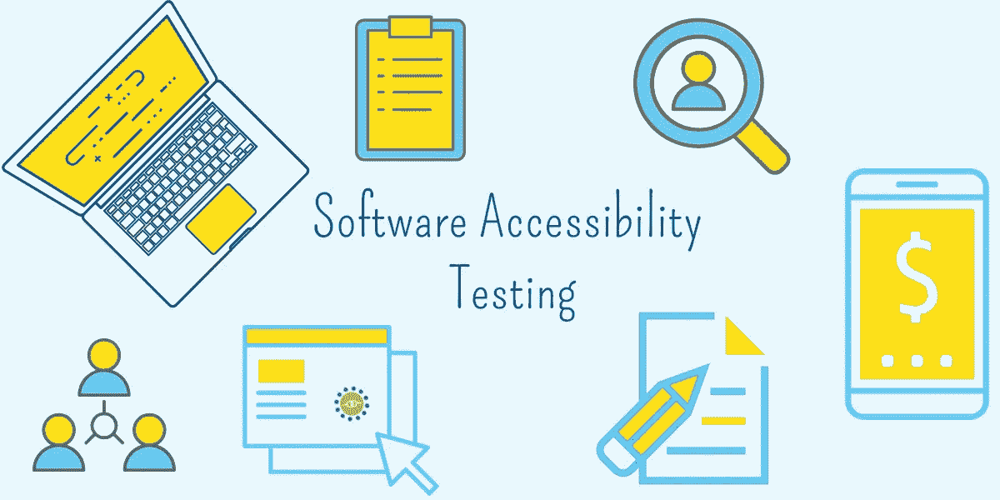

# 使用 AXE 4 和 Selenium + Java 进行自动化可访问性测试

> 原文：<https://medium.com/geekculture/integrate-axe-4-with-selenium-java-fbc36edd12b5?source=collection_archive---------6----------------------->

在 Java 上使用带有 Selenium Web 驱动程序的新 Axe 4.0 进行可访问性测试！

UX 意义重大！借助 Selenium，通过自动化消除令人头痛的 UI A11Y 测试！

**可访问性测试，**简而言之 **A11Y 测试**(因为在 a & y:)之间有 11 个字母)是一个独立的部分，承担着很大的责任。