# 集成哈希公司保险库与 CICD 工具(詹金斯)

> 原文：<https://medium.com/geekculture/integrate-hashicorp-vault-with-cicd-tool-jenkins-4bf712ad3f45?source=collection_archive---------0----------------------->

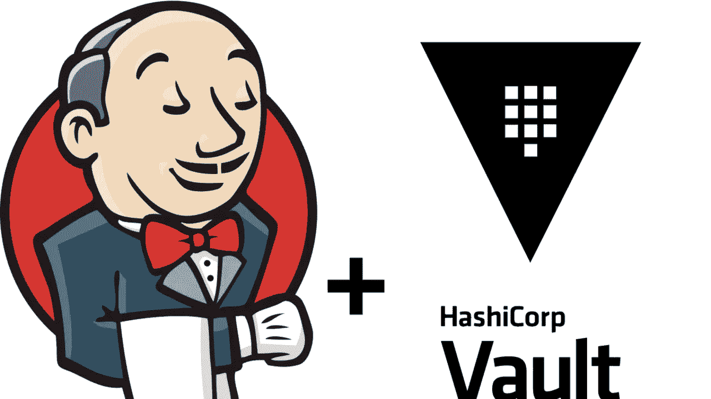

# **什么是跳马？**

HashiCorp Vault 旨在帮助组织管理对机密的访问，并在组织内安全地传输它们。机密被定义为需要严格控制和监控的任何形式的敏感凭证，可用于解锁敏感信息。秘密可以是密码、API 密钥、SSH 密钥、RSA 令牌或 OTP 的形式。

HashiCorp Vault 通过为您提供一个单边界面来管理基础架构中的每个秘密，使控制和管理访问变得非常容易。不仅如此，您还可以创建详细的审计日志，并跟踪谁访问了什么。

# **为什么要和詹金斯一起使用金库？**

将我们的秘密凭证保存在 Jenkins 中的一个非常常见的问题是 pipeline 如何处理凭证。每当管道获得一个限定了范围的秘密时，对于管道可以使用它们的数量和方式没有限制。考虑到管道可能与不受控制的外部环境相互作用，这构成了潜在的安全威胁。

Jenkins 的下一个问题是其加密方法的使用。有一个静态的单个公共主密钥和静态的单个公共 hudson.util.Secret 对象。这两者结合起来加密我们的凭证。如果对我们的 Jenkins 主机的访问受到威胁，我们就有泄露这两个密钥的风险，因此凭据将会暴露。

这就是 Vault 拯救我们的地方。它做的第一件事是在 Jenkins 上添加了另一层身份验证。它的下一个优势是它的访问控制策略。我们可以添加多个策略来访问同一个秘密。然后我们可以在管道中调用它，记住我们要给多少访问权。我们甚至可以为机器和程序定义访问权限。这为我们提供了更好的隔离和模式化的访问规则。

下面是工作流程图，直观地展示了他们是如何相互沟通的。

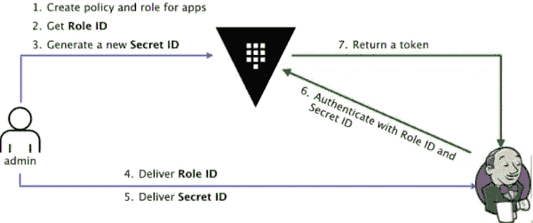

Workflow diagram

# **先决条件**

*   已安装保险库。
*   詹金斯安装了。
*   启用对 vault 的访问需要安装 *hashicorp-vault-plugin* 和一个正在运行的 Vault 实例。
*   接下来，我们需要决定访问它的身份验证方法。Hashicorp 为我们提供了多种身份验证方法，列举如下:
    AWS
    Azure
    Google Cloud
    AppRole
    GitHub
    Kubernetes
    LDAP
    TLS 证书
    令牌
    用户名和密码
    MFA(遗留/不支持)…等等..

由于我们的目标是将 Jenkins 连接到 Vault，因此最好的方法是使用 AppRole。

# 合适的认证方法

“AppRole”代表一组保险库策略和登录限制，必须满足这些策略才能接收令牌。可以为一台特定的机器，甚至是该机器上的一个特定用户，或者跨机器的一个服务创建一个 AppRole。

# **1。创建 AppRole**

要首先启用 approle，您必须添加 vault url &token 以通过 vault 进行身份验证。在我的例子中，我以 dev 和 local 的身份运行 vault，因此我给出了环回地址(如下所示)。下面我使用我的测试 vault 根令牌来连接 vault:

```
$ *export VAULT_ADDR='*[*http://127.0.0.1:8200'*](http://127.0.0.1:8200')
*$ export VAULT_TOKEN=”s.qZXTYvG…….ecF9uoX”*
```

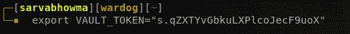

下面是在 vault 中启用适当身份验证的命令。

```
*$ vault auth enable approle*
```

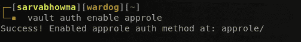

然后，创建一个角色在 Jenkins 中使用它，

```
*$* vault write auth/approle/role/jenkins-role token_num_uses=0 secret_id_num_uses=0 policies="jenkins"
```

***注意:*** *如果你想让你的 token 和 secret_it_ttl 永远存在，那么就把 token_ttl 和 secret_id_ttl 设置为 0* 。

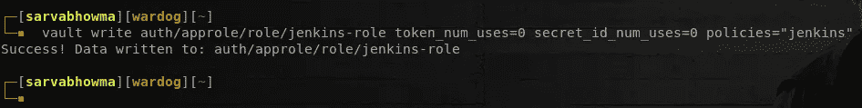

现在我们已经创建了我们的角色，要成功登录，我们需要角色 ID 和秘密 ID，要获取它们，运行下面的命令。

```
*$ vault read auth/approle/role/jenkins-role/role-id**$ vault write -f auth/approle/role/jenkins-role/secret-id*
```

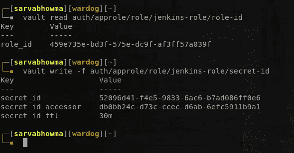

在保管库中创建凭据。(我们在 jenkins 管道中使用它)，这里我给出了测试凭证。

```
*$* vault kv put secret/dev-creds/git-pass test-git-creds=123456789
```

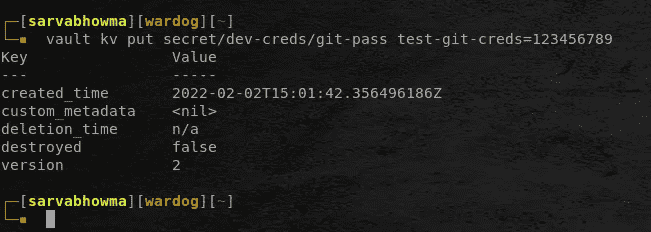

因此，到目前为止，我们已经在 vault 中创建了一个 approle 和凭证，但这并不意味着创建的 app role 可以自由地获取机密(因为我们已经明确提到 approle 可以使用特定的策略)。为了解读这些秘密，我们必须创建策略并添加规则。

首先，创建一个文件来提到策略，在我的例子中，我创建了***Jenkins-policy . HCl***文件并添加了下面的代码。

```
*path "secret/data/dev-creds/git-pass" {
 capabilities = ["read", "list"]
}*
```

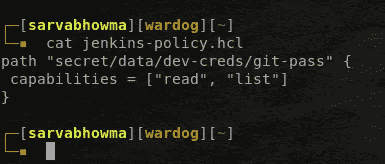

然后，在此规则的帮助下创建一个 jenkins 策略。运行下面的命令。

```
*$ vault policy write jenkins jenkins-policy.hcl*
```

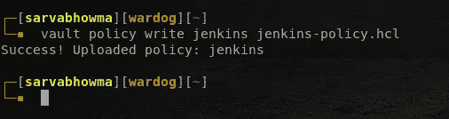

# 2.安装保险库插件并与 Jenkins 集成保险库

首先登录 Jenkins，点击管理 Jenkins，然后导航到管理插件。


然后点击可用，键入哈希公司保险库，然后点击安装。

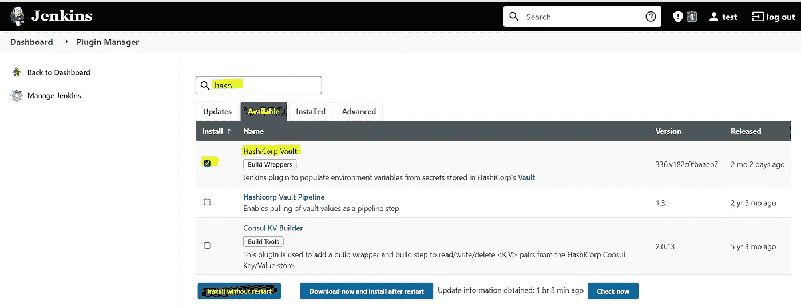

安装插件后，导航到管理詹金斯和配置系统。找到 vault 插件并填写 URL，然后单击添加凭证以添加适当的身份验证，选择种类作为 ***Vault 适当凭证*** ，并填写 ***角色 ID、秘密 ID、路径和 ID*** 作为通用名称以进行识别，然后单击添加。

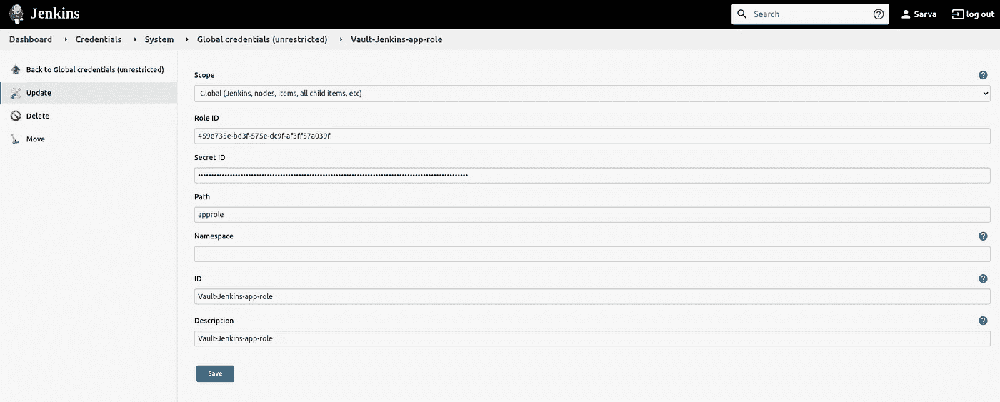

Vault authentication credentials configure in jenkins

然后单击高级设置禁用 ssl 证书。(在生产中，不建议禁用它)。(根据这些设置，Jenkins 实际上向 Vault 进行了身份验证。)

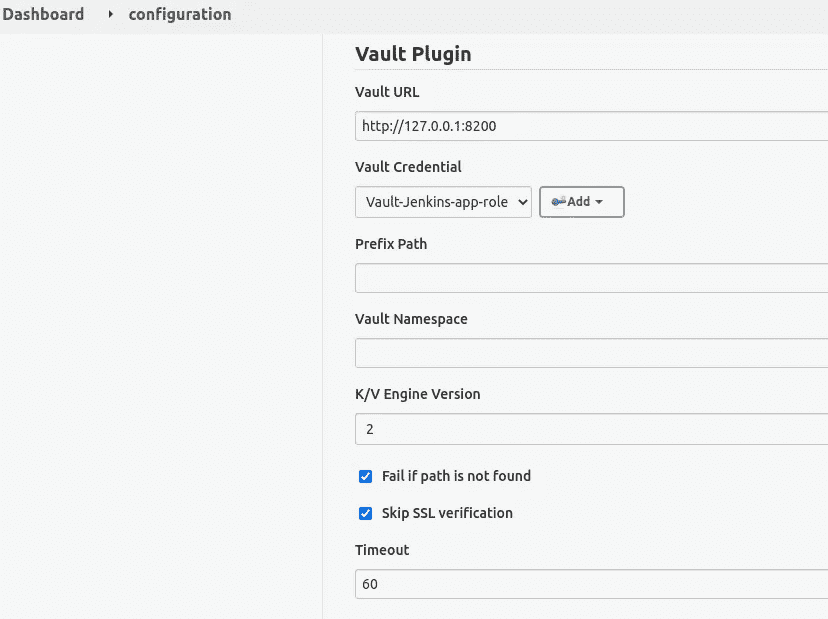

Vault plugin configure in jenkins

现在，创建一个 Jenkins 管道，并添加下面的管道代码来测试从 vault 的秘密获取。

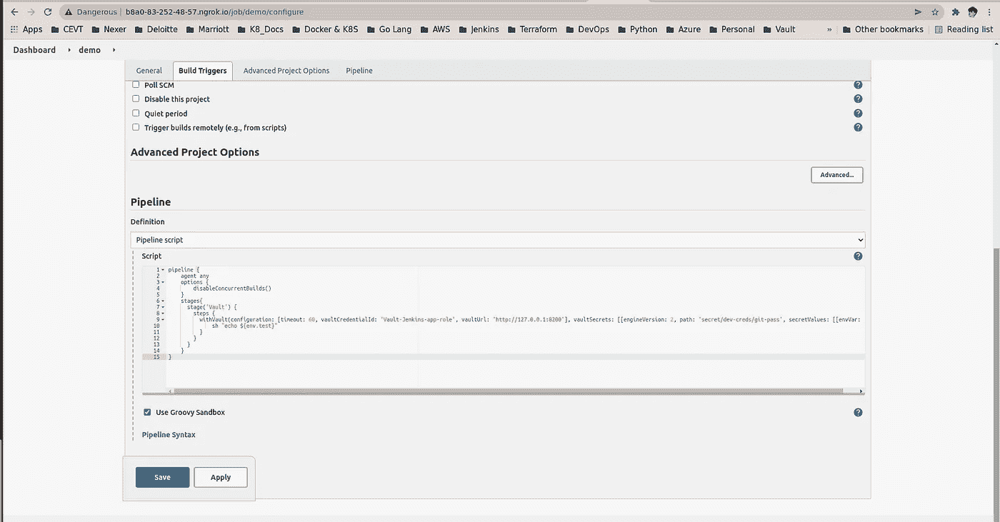

Pipeline configure

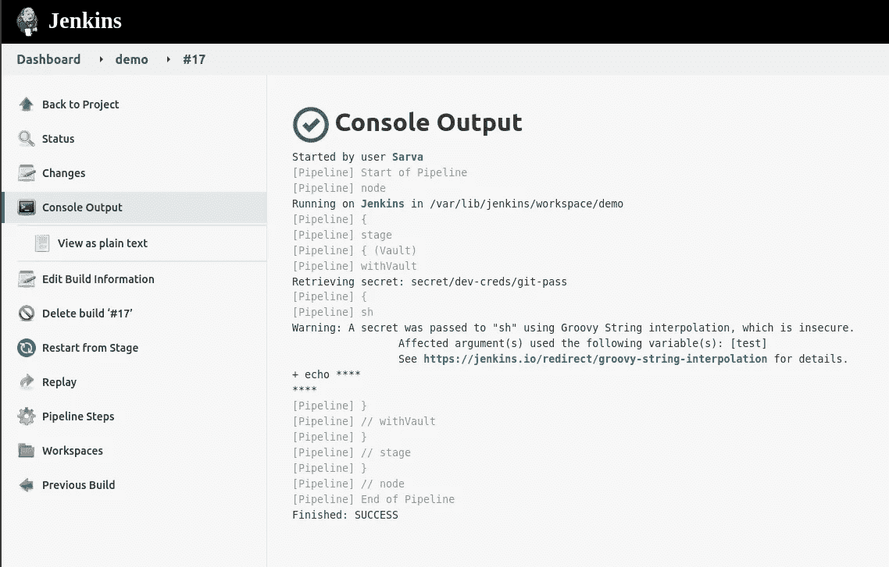

Pipeline Output

就这样，正如你看到的，它连接到 vault 并获取值。因为它是秘密的，所以不会在输出中粘贴实际值。

> **注意:
> 如果任何一步有错误，我们将看到一条拒绝访问的消息，并且环境变量将打印 null。(以下是错误截图)**

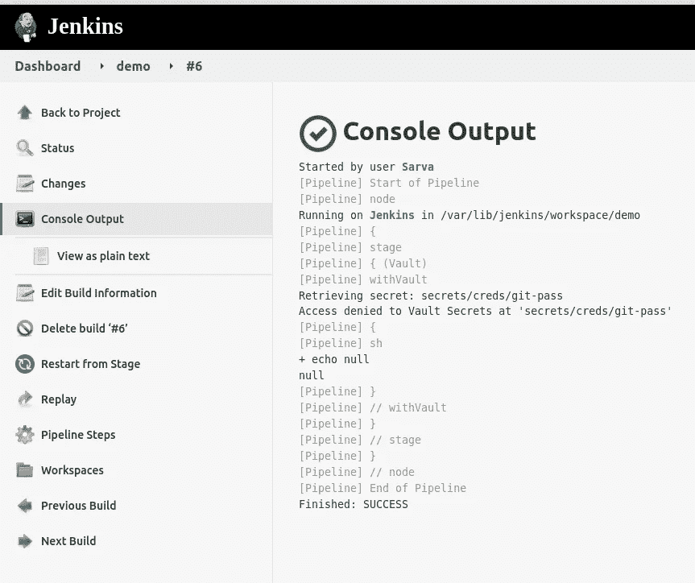

Failed vault connection pipeline output

# **结论:**

如您所见，将 vault 集成到 Jenkins pipeline 并不复杂，如果您做得正确，并在继续之前花一些时间了解您正在使用的引擎和版本。我希望这篇文章对你有帮助，现在集成过程似乎更明显了。

感谢您的阅读。