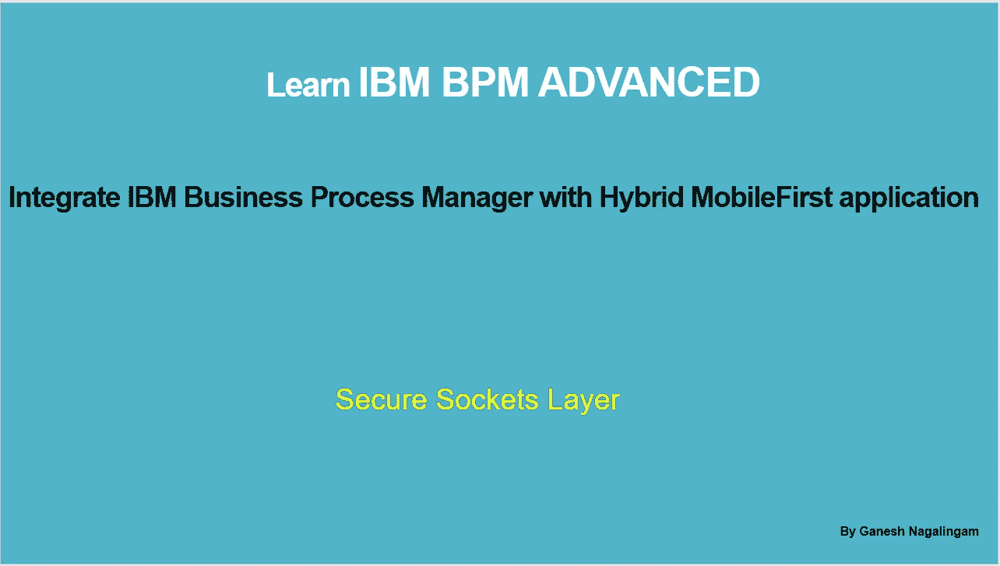
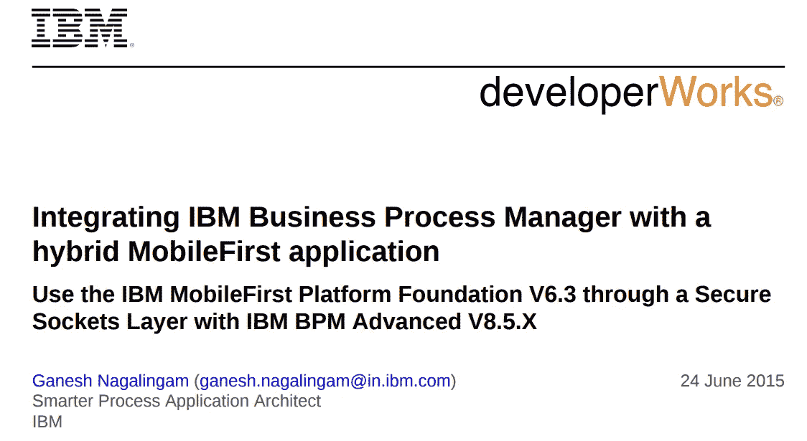
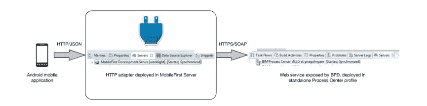
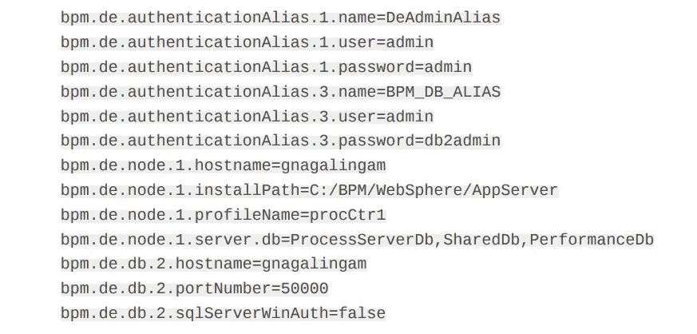
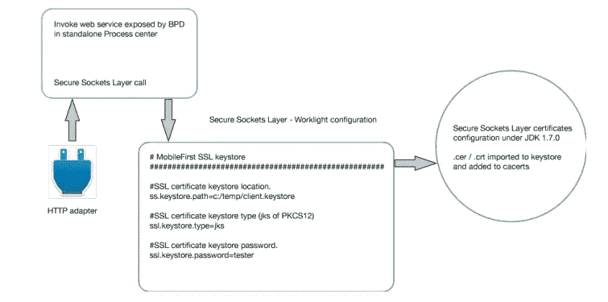
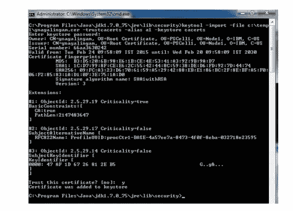
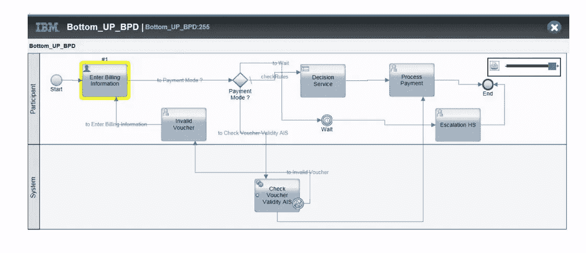
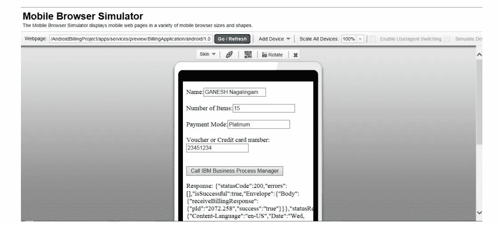
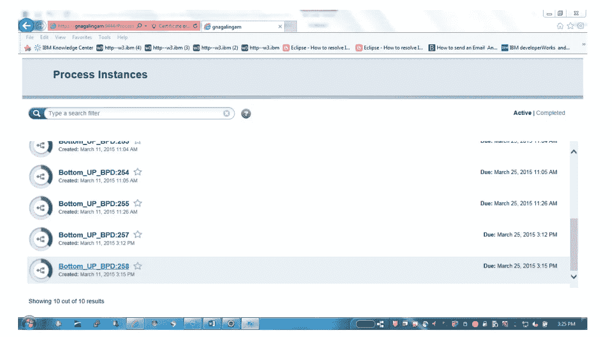

# 将 IBM 业务流程管理器与混合 MobileFirst 应用程序集成

> 原文：<https://medium.com/geekculture/integrate-ibm-business-process-manager-with-hybrid-mobilefirst-application-5aed20841bf3?source=collection_archive---------29----------------------->

## 设计以用户和系统为中心的组件

## 通过 IBM BPM Advanced 的安全套接字层使用 IBM MobileFirst 平台基础

## 读者注意

本文最初发表于 2015 年***6 月*** 期间的***IBM developer works***刊物，如下图所示。由于这篇文章的链接已经被移走，我想在 MEDIUM 中重新发布它，以帮助可能对这个主题感兴趣的初学者和中级读者。

Article initially published in IBM developerWorks

# 介绍

如果业务流程包含从业务流程建模符号(BPMN)到业务流程执行语言(BPEL)的通信活动，您可以将 IBM BPM Advanced 与 IBM mobile first Platform Foundation 集成。然后，流程参与者(业务用户)不需要坐在计算机前。他们可以从移动设备触发请求，并调用业务流程，这是获得相同结果的简单方法。
本文介绍了一个业务用例，该用例通过高级集成服务(AIS)定义了混合 MobileFirst 应用程序、IBM Process Designer 中以用户为中心的 BPMN 和 IBM Integration Designer 中以系统为中心的 BPEL 之间的交互。
本文中使用的解决方案展示了业务用户如何从移动设备发送请求，并通过 SSL 集成在 IBM Business Process Manager 中创建流程实例。当流程实例成功创建后，流程实例 ID 将返回给移动设备以供参考。由于涉及到人工活动，业务用户使用 IBM BPM 流程门户来声明流程实例。在只涉及系统活动的情况下，不需要人工干预，业务流程会根据移动设备的请求自动完成。

# 范围

本文展示了如何通过安全套接字层(SSL)使用 IBM MobileFirst 平台基础将 IBM Business Process Manager(BPM)Advanced 与混合 MobileFirst 应用程序集成。

# 先决条件

IBM BPM Advanced
IBM 流程设计师
IBM 集成设计师
IBM MobileFirst 平台基础
Eclipse
Android SDK

# 集成步骤概述

本文通过一个概念验证来说明集成技术。
首先，创建一个独立的 Process Center 概要文件，用于开发环境。对于测试和生产环境，创建一个流程服务器，并将其用于应用程序部署。
a .安全访问 HTTPS web 服务，该服务由业务流程定义(BPD)公开，并由检查***SSL . keystore . path***，s***sl . keystore . type***，***SSL . keystore . password***的***work light . properties***文件控制。
b .混合 MobileFirst 应用程序与流程中心的 BPD 公开的入站 web 服务进行通信。
c .在 IBM BPM Advanced 和 hybrid MobileFirst 应用之间通过 SSL 集成 HTTP 适配器。
d .生成 SSL 证书。在***work light . properties***中创建并配置 keystore。通过先进的集成服务，协调 BPMN 与 BPEL 的连接。
f .在开发环境中创建一个独立的 Process Center 概要文件，在 IBM BPM Advanced 中发布和部署业务流程应用和服务组件架构(SCA)应用。一个优点是运行一个 Java 虚拟机，这有利于低内存系统。
g .在 IBM mobile first Platform Foundation 中创建并部署 HTTP SOAP 适配器。

# 体系结构

Fig 1\. Architecture

IBM BPM Advanced 构建在 IBM WebSphere 应用服务器网络部署之上。创建独立的 Process Center 概要文件的优点是支持流程应用程序和 SCA 应用程序。
图 1 中的高层集成图显示了混合 MobileFirst 应用程序、部署在 IBM mobile first Platform Foundation 中的 HTTP 适配器以及由 Process Center 中的 BPD 公开的 web 服务之间的通信模式。BPMN 通过高级集成服务(AIS)连接 BPEL。
混合 MobileFirst 应用程序向 HTTP SOAP 适配器发送请求。HTTP SOAP 适配器部署在 IBM MobileFirst 平台基础(一个 IBM Liberty 单节点模板)中。HTTP SOAP 适配器向 Process Center 公开的入站 web 服务发送一个 SSL 请求。web 服务返回一个响应，该响应在混合 MobileFirst 应用程序中被转换为 Java Script Object Notation (JSON)。

# 什么是 IBM BPM Advanced？

业务流程管理是检查组织现有业务流程并实施改进以使您的工作流程更加有效和高效的系统方法。每个组织都使用业务流程来完成工作。业务流程是一组业务活动，代表实现业务目标所需的步骤。业务流程通常需要内部活动和必须由人工执行的活动的组合。因此，您可以将业务流程管理视为人员、流程和技术之间的交集。当您定期设计、建模、创建、模拟、监控和优化您的流程时，业务流程管理方法是迭代的。您从测试和监控流程中获得的反馈推动了您组织的工作流程的持续改进。Process Center 存储库包含所有 IBM BPM 资产。高级资产是流程应用程序、工具包、跟踪和快照。业务分析师和集成开发人员都对相同的流程应用程序和工具包做出贡献。流程设计者提供业务流程和数据类型。集成设计器提供模块、库和 BPEL 业务逻辑。

# 使用 BPMConfig 工具创建独立的流程中心配置文件

独立的 Process Center 概要文件具有使用单个概要文件分别发布和部署流程应用程序和 SCA 应用程序的优势。可以使用 ***BPMConfig*** 命令行工具创建一个独立的 Process Center 概要文件，并将概要文件 ***属性*** 文件作为参数。下一节将详细介绍如何创建一个独立的 Process Center 概要文件。屏幕截图显示了要设置的关键属性和要执行的命令，以成功创建概要文件。

您可以采用自顶向下的方法或者自底向上的方法来创建、发布和单元测试，这将在本地机器上运行一个服务器概要文件(一个 Java 虚拟机)。如果您有低内存系统，请采用独立的流程中心方法，因为它有助于存储、测试在 IBM Process Designer 和 IBM Integration Designer 中创作的流程应用程序和工具包。

**自顶向下方法**
在 Process Designer 中创建工具包或流程应用程序，其中包含可以导入到 IBM Integration Designer 中的接口和业务对象，您可以在其中实现业务逻辑。这种方法通常被涉众和业务分析师所遵循。

**自底向上的方法**
开发人员和架构师创建 SCA 模块，实现并测试它们。在 Process Center 透视图中，将工具箱或流程应用程序导入 IBM Integration Designer。然后，SCA 模块可以与流程应用程序或工具包相关联。
独立的流程中心配置文件能够部署流程应用程序和 SCA 应用程序。安装 IBM BPM 高级二进制文件。
**BPM config**命令行工具将**配置文件属性**文件作为一个参数来成功创建一个独立的流程中心。

***完成以下步骤:***
1 .通过运行以下命令，从命令提示符创建一个独立的 Process Center 概要文件:
**BPM config . bat–create–de standalone PC . properties**
2。在属性文件中，创建并设置项目的值，如下所示。为成功创建概要文件而设置的键值显示在下面的示例属性文件中。根据本地设置的需要，替换适当的值。

Fig 2\. profile.properties

# 在 IBM MobileFirst 平台基础上设计和配置混合 MobileFirst 应用程序

IBM MobileFirst 平台基金会，前身是 IBM Worklight，帮助企业实现他们的移动战略。它提供了一个开放、全面的平台，不仅可以构建，还可以测试、运行和管理您的本地、混合和移动 web 应用。
IBM mobile first Platform Studio 为移动应用程序开发提供领先的工具，帮助最大化代码重用和加速开发。

## 商业价值主张

企业应用集成(EAI)为连接企业内部或企业之间的应用程序提供了一个开放的、可扩展的框架。EAI 解决方案通过开放消息传递、开放队列、开放开发工具、适配器(应用程序、web、电子商务、通信、传统、通用)和跨所有主要平台的数据标准(XML、EDI、HL7、Swift)确保合规性和互操作性。在 EAI 框架中，web 服务集成存在于适配器和业务流程级别。适配器提供通信和数据转换功能，能够快速集成到打包的、传统的和定制的应用程序中。这些应用程序中的任何一个都可以通过 SOAP 适配器访问 web 服务或被 web 服务调用，从而支持这些现有的应用程序。适配器通过将现有系统映射到 web 服务接口来完成这项艰巨的工作。混合 MobileFirst 应用程序可以通过部署在 IBM mobile first Platform Foundation 中的 HTTP 适配器无缝集成，并调用由 Process Center 中的 BPD 公开的 web 服务。在业务流程层面，业务流程管理解决方案用于控制跨系统和相关用户的业务流程活动的流程。BPM 解决方案通常提供流程建模、实现、监控、管理和流程优化服务，以简化流程并提高效率。可以根据需要从业务流程中的任何活动调用 web 服务，反过来，更大的业务流程可以作为 web 服务公开，供其他系统或合作伙伴调用。web 服务是遵循新的连接标准(SOAP、WSDL 和 UDDI)的应用程序，这些标准基于更成熟的互联网标准(HTTP 和 XML)。这种基于标准的连接允许 web 服务实现自动地动态发现其他 web 服务并与之交互。IBM BPM Advanced 中的独立 Process Center 概要文件为面临低内存的系统提供了优势，因为在开发环境中只有一个 Java 虚拟机在运行。该配置文件有助于存储、测试和管理使用 Process Designer 和 Integration Designer 创作的流程应用程序和工具包。

## 以下小节描述了主要的集成特性。

由进程中心中的 BPD 公开的 web 服务是 HTTPS 服务。为了从混合 MobileFirst 应用程序访问 SSL 服务，必须导入来自 Process Center 服务器的证书，并将其添加到 cacerts 文件中的密钥库中。该证书使移动应用程序能够成功调用 Process Center 中的 web 服务。
**图 3** 显示了在 Process Center 中调用 web 服务之前，适配器检查配置文件中的 SSL 证书。

Fig 3\. SSL configuration

## IBM MobileFirst 平台基础和适配器配置

通过选择适当的适配器，可以在混合 MobileFirst 应用程序中发现 web 服务。为了在 HTTP 服务上创建 SOAP，在 IBM mobile first Platform Foundation 中创建和部署了 HTTP SOAP 适配器。由于 Process Center 公开的 web 服务启用了 SSL，因此证书应该作为密钥库导入和转换，并添加到 cacerts 文件中。在调用 web 服务之前，适配器检查 worklight.properties 文件中的证书*路径*、*类型*和*密码*。
**图 4** 展示了如何创建证书并将其导入到密钥库中，以及如何将它们添加到 cacerts 文件中。只有当后端 web 服务的证书不是由知名的证书颁发机构签名时，才需要此步骤。

Fig 4\. Create keystore using keytool

# 部署并运行流程应用程序

独立的流程中心概要文件用于发布和部署流程应用程序(BPMN)和 SCA 应用程序(BPEL/ESB)。

# IBM 流程设计器中的 BPMN

BPMN 进程通过高级集成服务连接到 BPEL。流程应用程序中的业务流程定义公开了一个由混合 MobileFirst 应用程序使用的 HTTPS web 服务。为了启动业务流程，混合 MobileFirst 应用程序调用由 BPD 公开的 web 服务，该服务由封装在 BPD 中的集成服务执行。集成服务执行***tw . system . startprocessbyname***来启动从混合 MobileFirst 应用程序接收的输入参数所指定的业务流程，并返回 ***processId*** 以供参考。
流程支付活动成功后，业务流程向客户发送邮件通知状态，如
**图 5** 所示。

Fig 5\. Business process Definition(BPD)

## 流程执行

**图 6** 显示了 Android 手机浏览器模拟器*中给出的输入值。一个业务用户通过发送请求在 IBM Business Process Manager 中执行一个流程，并返回一个成功的响应，该响应具有在 IBM BPM Advanced 中创建的流程 ID。
***pId…258 和“success”:“true”***
业务用户使用移动设备提交所需的数据，移动设备会自动在 IBM BPM 中创建一个流程实例 Id，并向移动设备返回一个响应，显示成功创建了 ID 为 258 的流程实例 ID。*

**

*Fig 6\. Mobile browser simulator*

*下一节展示了在 Process Portal 中创建的可以声明的业务流程实例。由于流程图中的第一个活动是一个人为活动，它必须被声明，并且需要人的干预。*

# *IBM BPM 流程门户*

***图 7** 显示了从混合 MobileFirst 应用程序发送的请求已经成功地在流程门户中创建了一个流程实例。流程实例(**流程 ID 258** )是在 IBM BPM 流程门户中创建的。*

**

*Fig 7\. Process portal and process instance*

# *结论*

*我们已经到达了终点，我们已经学会了如何通过 SSL 配置集成混合 MobileFirst 应用程序和 IBM BPM Advanced。
使用 **BPMConfig** 工具创建一个独立的流程中心概要文件，并将属性文件作为参数传递。
在 IBM BPM Advanced 中使用独立的 Process Center 概要文件的优点是，您可以在只有一个 **Java 虚拟机(JVM)** 运行的低内存系统中发布和部署**流程应用程序**和 **SCA 应用程序**。*

***发布于 2021 年 4 月 17 日***

> ****其他媒体文章，*by*Ganesh Nagalingam*** [联邦 OKTA IdP 与 WSO2 API Manager 作为 Spring boot 微服务集成的网关](https://ganesh-nagalingam.medium.com/federate-okta-idp-wso2-api-manager-as-gateway-to-spring-boot-microservices-integration-ba567567e81)*
> 
> *[*将 KERBEROS 与 SPRING SECURITY 集成:身份和访问管理(IAM)*](https://ganesh-nagalingam.medium.com/kerberos-v5-sso-authentication-in-windows-10-home-using-apache-directory-studio-fb0151899185)*
> 
> *[*整合服务提供商(SPs)与 OKTA 身份提供商(IdP)*](https://ganesh-nagalingam.medium.com/integrate-service-providers-sps-with-okta-identity-provider-idp-ce64a4e262ae)*