# 将 IBM WebSphere 服务注册和存储库与 IBM Process Server 集成

> 原文：<https://medium.com/geekculture/integrate-ibm-websphere-service-registry-and-repository-with-ibm-process-server-f97eeb0e2ea?source=collection_archive---------20----------------------->

## 将 IBM WebSphere 服务注册和存储库( **WSRR** )与 IBM Process Server 连接起来

## 面向服务的架构— SOA

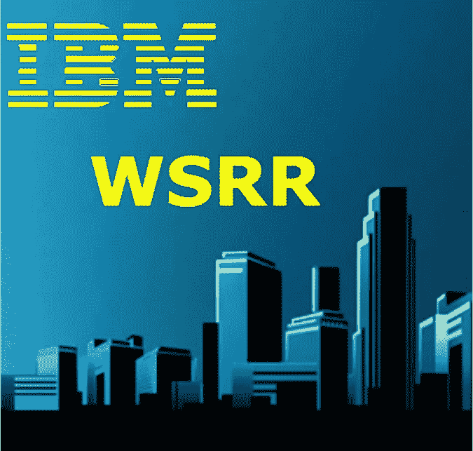

IBM WSRR and IBM Process server

## 读者注意

本文最初发表于 2013 年 6 月*的***IBM developer works***出版物中，如下所示。由于这篇文章的链接已经被移走，我想在 MEDIUM 中重新发布它，以帮助可能对这个主题感兴趣的初学者和中级读者。*

*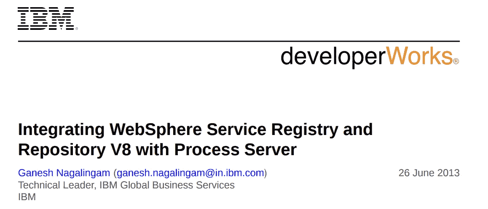*

*Article initially published in IBM developerWorks*

# *介绍*

*本文展示了如何将 IBM WebSphere Service Registry and Repository(WSRR)与 Process Server 集成。它解释了如何配置 SSL、WSRR 定义和执行动态端点查找。这种方法的优点是，当 web 服务 URL 发生变化时，可以直接在 WSRR 进行更新，不需要修改或重新部署中介模块。*

# *先决条件*

*a.IBM 集成设计器
b . WebSphere Service Registry and Repository
c . IBM Process Server*

# *关于 Process Server 的更多信息*

*2011 年 4 月，IBM 发布了 IBM Business Process Manager，这是一个单一的统一 BPM 平台，支持整个业务流程改进项目。IBM Business Process Manager 合并了 WebSphere Process Server、WebSphere Lombardi Edition 和其他 IBM 产品的功能，并取代了它们。IBM Business Process Manager 向后兼容 WebSphere Process Server V6 和 V7。在本文中，流程服务器指的是 IBM Business Process Manager Advanced V8 的流程服务器组件。*

# *WSRR*

*WSRR 提供了一个存储、访问和管理信息(通常称为服务元数据)的系统，这些信息用于 SOA 中服务的选择、调用、管理、治理和重用。换句话说，它是您存储关于您的系统或其他组织的系统中使用的服务的信息的地方，您已经使用、计划使用或希望将来了解这些信息。例如，应用程序可以在调用服务之前检查 WSRR，以找到最能满足其功能和性能需求的服务实例。WSRR 使您能够发布 web 服务构件，包括 XML 模式定义(XSD)、Web 服务描述语言(WSDL)和服务组件架构(SCA)模块。WSRR 可以更好地管理和治理您的服务。通过其注册中心和存储库功能以及与 IBM SOA Foundation 的集成，WSRR 是 SOA 实现的重要基础组件。WSRR 使您能够在 SOA 中存储、访问和管理关于服务和服务交互端点描述(服务元数据)的信息。您可以使用这些信息来选择、调用、治理和重用 SOA 中的服务。这些服务信息可以包括使用 SOAP/HTTP 绑定实现 WSDL 接口的传统 web 服务，以及可以使用 WSDL、XSD 和策略声明来描述的各种 SOA 服务，但是这些服务可能会使用各种协议，并根据各种编程模型来实现。*

# *WebSphere ESB*

*WebSphere ESB 将服务提供者从服务消费者中分离出来，因此它们都连接到 WebSphere ESB，而不是直接的点对点连接。它负责路由请求、丰富消息、映射服务提供者和服务消费者之间的接口，并将它们转换为服务消费者的接口格式。
WebSphere ESB 可以使用端点查找原语执行动态端点查找，以在 WSRR 查找已发布的服务 URL，然后动态应用目标地址以调用服务实现。WebSphere ESB 管理服务提供者和服务消费者之间的消息流。WebSphere ESB 中的中介模块处理服务提供者和服务消费者之间的不匹配，包括协议、交互风格接口和服务质量(QoS)的不匹配。
在 SCA 解决方案中，中介模块是一种执行特殊角色的 SCA 模块，具有与其他业务级别组件不同的特征。
中介组件对服务端点之间交换的消息进行操作。与常规的业务应用程序组件相比，它们关心的是通过基础设施的消息流，而不仅仅是消息的业务内容。它们不是执行业务功能，而是对消息执行路由、转换和日志记录操作。*

# *传票送达员*

*Process Server 是许多业务流程管理解决方案的核心。它确保您在 IBM Integration Designer 中设计的流程得到一致、可靠、安全的执行，并且具有事务完整性。它建立在开放标准的基础上，在您的 SOA 或非 SOA 基础设施中部署和执行编排服务(人员、信息、系统和贸易伙伴)的流程。
Process Server 构建于其上，并包含 ESB 功能。Process Server 使用 WebSphere Application Server 的强大功能，提供了一个基于标准的业务流程引擎。它还包括与 WebSphere ESB 相同的技术，提供相同的 ESB 功能。
Process Server 是一个高性能的业务引擎，通过为业务流程应用程序提供一个托管的运行时环境，使流程能够满足业务目标。它使您能够在 SOA 中部署基于标准的业务集成应用程序，SOA 将日常业务应用程序分解为单独的业务功能和流程，并将其作为服务呈现。
Process Server 支持跨人员、系统、应用程序、任务、规则以及它们之间的交互的流程部署。它支持长期运行和短期运行的业务流程，为松散耦合的业务流程提供类似事务回滚的功能。*

# *商业价值*

*本文中描述的方法提供了在 WSRR 中更改 web 服务 URL 的灵活性，而无需修改或重新部署中介模块。成功实现 SOA 需要支持 SOA 原则的应用程序和基础设施。可以通过创建到由应用托管的新的或现有功能的服务接口来启用应用。应该使用能够将服务请求路由和传输到正确的服务提供者的基础设施来访问服务接口。
随着组织将更多的功能作为服务公开，他们必须确保该基础设施支持 SOA 的企业级管理。
ESB 是一个中间件基础设施组件，它通过以下方式支持 SOA 实现:
将消费者对服务的看法与服务的实际实现分离
将服务交互的技术方面分离
在企业中集成和管理服务
ESB 不仅仅是一个传输层。它必须提供中介支持来促进服务交互(例如，查找提供消费者所要求的功能的服务，或者处理消费者和提供者之间在功能方面兼容的接口不匹配)。
它必须支持各种进出 ESB 的方式，比如对现有应用程序或业务连接的适配器支持，使外部合作伙伴能够进行 B2B 交互。为了支持这些不同的进出 ESB 的方式，它必须支持与各种服务端点的服务交互。
每个端点可能有自己的集成技术、协议、安全模型等等。这种复杂程度应该对服务消费者隐藏，以便向他们提供一个更简单的模型。为了对消费者隐藏复杂性，ESB 必须在服务提供者理解的多种交互模型和提供给消费者的简化视图之间进行协调。
在运行时，可以动态访问 WSRR 来选择服务提供商，或者动态执行调用策略。它管理支持将服务消费者动态绑定到服务提供者的信息，并支持基础设施实施注册的策略。*

*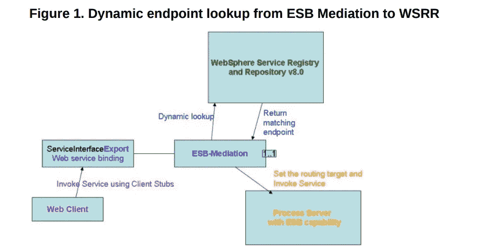*

*Dynamic endpoint lookup in WSRR*

# *关键集成特性*

*部署到 Process Server 的中介模块可以通过动态查找机制与 WSRR 进行通信，以提供有关服务端点和中介策略的信息。*

# *服务端点*

*当您开发需要从 WSRR 访问服务端点的 SCA 模块时，中介流可以包括端点查找中介原语，以便在运行时，它可以从 WSRR 获得服务端点。*

# *调解政策*

*您还可以使用 WSRR 来存储中介策略信息，这有助于您通过动态覆盖模块属性来控制服务请求。如果 WSRR 包含 SCA 模块和附加的中介策略，那么中介策略可以覆盖模块属性。
如果您希望在不同的上下文中应用不同的中介策略，您可以创建中介策略条件。当您开发需要使用中介策略的 SCA 模块时，您可以在中介流中包含一个策略解析中介原语。在运行时，它可以从 WSRR 获得中介策略信息。*

# *WSRR 如何加强 WebSphere ESB 对服务和接口的控制*

*许多 SOA 缺乏监管。企业不知道网络中实际运行的是什么样的服务，不管是批准的还是其他的。没有一种机制来规范服务提供者和消费应用程序之间的合同(如服务级别协议)，也不可能跟踪谁在访问服务和业务信息。
企业希望实时了解服务性能和可用性，并希望通过跟踪服务使用情况来衡量和展示投资回报。他们希望建立一个现有服务的目录，提供对功能的可见性，并帮助减少冗余。该目录可以帮助企业了解现有服务变更的影响，并使他们能够通过策略控制服务消费者和提供者。WSRR 提供了服务发现特性，以帮助清点运行时环境中部署的服务。
在预定的基础上，WSRR 还可以被配置为发现运行时环境中的服务，以检查流氓服务。WSRR 的 GEP(Governance Enablement Profile)给出了服务消费者和服务提供者治理的规范方法。它管理用户和提供商之间的订阅、谅解文档和服务级别协议，从而能够跟踪谁在使用给定的服务。*

# *更大的 ESB 灵活性*

*ESB 提供了一个连接层，支持灵活简单的服务集成，将集成逻辑从应用程序中分离出来。然而，由于需要额外的开发和测试，很难快速更改中介代码来响应不断变化的业务需求。将中介与它们调用的服务的运行时状态同步也很复杂。ESB 开发本质上涉及调用许多端点，当端点没有从中介代码中分离出来时，升级到其他开发环境需要对 ESB 配置进行重大更改。支持对服务、策略和元数据的动态和高效访问，使中介能够动态选择服务提供者和端点，并快速适应关键服务的状态，从而大大提高 ESB 的灵活性。
在 ESB 外部存储和定义一些应用程序和翻译逻辑意味着您可以更新逻辑，而不需要更改和重新部署中介。类似地，在 ESB 之外存储和管理策略意味着您可以独立于中介来定义和管理策略。然后，ESB 可以在运行时查询 WSRR，以确定服务所需的策略，然后实施这些策略。
WSRR 通过端点查找、SLA 检查和策略解析中介原语增加了 WebSphere ESB 的敏捷性，这些原语是加速健壮和灵活的中介的关键，您可以快速更改这些中介，而无需重新部署中介。*

# *提供业务所需的服务*

*许多企业发现，尽管采用了 SOA 原则，但他们无法快速响应新的业务请求，快速交付新的和更新的服务，或者处理新的业务机会。服务开发周期过长，没有标准化，缺乏服务信息和现有能力的动态发现。
这些问题通常会导致服务重复以及业务分析师和 IT 之间的脱节。对于一个成功的 SOA，您需要创建开放的标准化服务和可重用资产，它们可以被多个业务线使用，并且您需要通过多个服务实现重用服务资产来提高生产率。
为了实现这种标准化和重用，您需要存储、编目和灵活地组织资产和服务，然后实施指导方针以防止不协调或未经批准的变更。WSRR 为服务生命周期提供了一种规范的方法，支持自顶向下的开发，为业务用户提供建议和批准服务的视角。
该解决方案附带了实施标准化服务和可重用资产的示例生命周期和治理策略，以及帮助完善治理流程和优化服务开发生命周期的策略分析。*

# *将流程服务器与 WSRR 集成*

## *管理控制台和 SSL 配置*

*本节说明如何在两台服务器上都启用了安全性的情况下执行集成，以及如何将 WSRR 签名者证书导入到 Process Server 信任存储中。
1。在流程服务器管理控制台中，选择服务集成= > WSRR 定义:*

*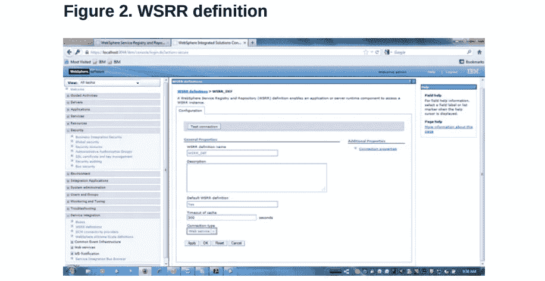*

*WSRR definition*

*2.单击连接属性。
3。为 WSRR 定义指定以下属性，如图 3 所示:
·WSRR 服务器的注册 URL，包括用于安全连接的 https://和正确的 TCP/IP 端口。
用于向 WSRR 认证的认证别名。这个例子使用了 wsrr80-auth。
包含签名者证书的 SSL 配置。此示例将配置设置为 NodeDefaultSSLSettings。*

**

*Connection properties*

*4.单击签名者证书和从端口检索，然后输入 WSSR 的主机名和 HTTP 端口号:*

*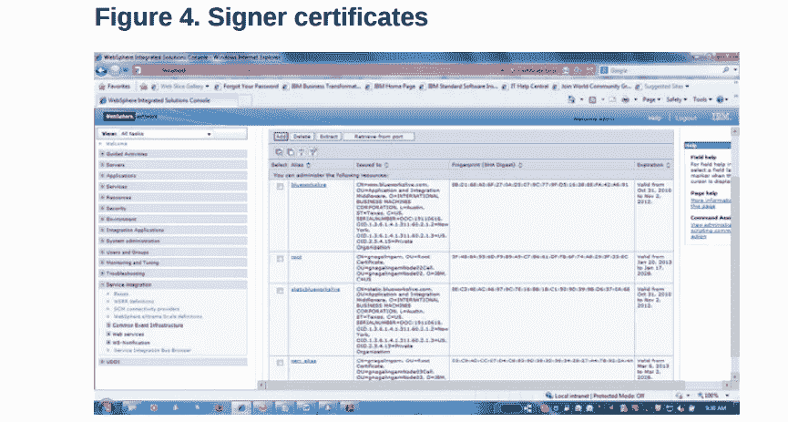*

*Signer certificates*

*5.单击“测试连接”以确认 Process Server 与 WSRR 成功集成。
6。在 WSRR 管理控制台中，单击 Signer certificates 和 Retrieve from port，然后输入 Process Server 的主机名和 HTTP 端口号。*

# *动态端点选择的优势*

*WebSphere ESB 中的 SCA 导入组件包含指向服务提供者的硬编码端点 URL，这当然有缺点。如果服务提供者的端点 URL 发生变化，您必须用新的 URL 更新 SCA 导入。
使用 WSRR 和端点查找中介原语支持动态端点选择，通过查询 WSRR 在运行时检索服务提供者的端点 URL，您可以在 WSRR 对端点 URL 进行任何更改。
每个服务提供商的 WSDL 文件被加载到 WSRR，您可以向这些 WSDL 文件添加自定义属性或分类。WebSphere ESB 中的端点查找中介原语查询 WSRR，指定要检索的服务端口类型，WSRR 返回在其注册表中找到的匹配服务的端点 URL。端点查找中介原语可以检索与各种协议绑定相关的端点信息，包括 SOAP/HTTP。
端点查找原语查询不仅可以查找特定的端口类型，因为它支持其他属性，如名称空间和版本，以及自定义属性和分类。
端点查找原语还指定了一个匹配策略，它告诉 WSRR 返回多少匹配的端点 URL，并告诉 WebSphere ESB 这些端点 URL 应该存储在 SMO 消息中的什么位置。*

*端点查找原语支持以下匹配策略:
返回第一个匹配的端点并设置路由目标
返回所有匹配的端点
返回所有匹配的端点并设置备用路由目标
返回匹配最新兼容服务版本的端点以下是动态端点选择具有优势的示例:
如果端点不是在中介中硬编码的，则在环境之间移动代码会更容易，例如在开发、测试和生产端点之间移动时。如果端点被移到中介代码之外，您不需要更改中介来将其提升到不同的环境。
如果被调用的服务的端点发生变化，例如，它被移动到不同的服务器，那么您可以更新 WSRR，而不需要更新中介代码。*

*可以根据服务可用性在 WSRR 更新端点。例如，如果一个端点不可用，那么 WSRR 可以改为指向一个可用的端点。您可以根据输入数据选择适当的服务。*

# *构建中介流:*

## *返回所有匹配的端点*

*中介模块包含指向服务提供者的端点 URL 的 SCA 导入。这个端点 URL 被硬编码到 SCA 导入组件中。服务提供者偶尔会更改其位置，目前，必须手动修改中介模块以反映这个新的 URL，并且必须重新部署中介模块。
使用动态端点查找，在运行时从 WSRR 检索端点 URL。对端点 URL 的任何更改只需要更改 WSRR 中的服务定义，不需要修改或重新部署中介模块。*

*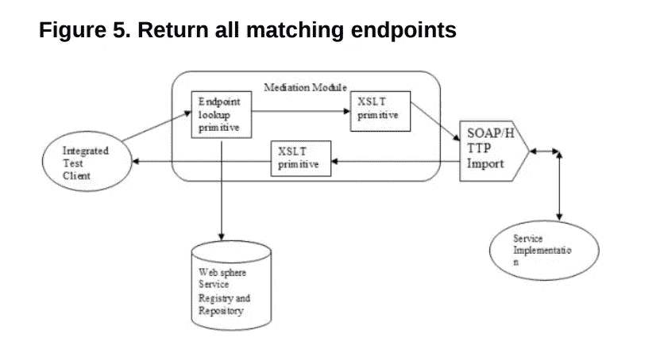*

*Mediation architecture*

***本解决方案中使用了以下中介原语:**
1。端点查找中介原语向 WSRR 查询服务端口类型的端点 URL。端点查找匹配策略设置为返回与服务端口类型匹配的所有匹配端点 URL。
2。自定义中介原语检查 WSRR 返回的所有端点 URL，并基于 WSRR 的自定义属性选择服务。
3。XSLT 中介原语用于转换服务接口。
4。如果服务提供者以错误响应，则使用失败原语。*

*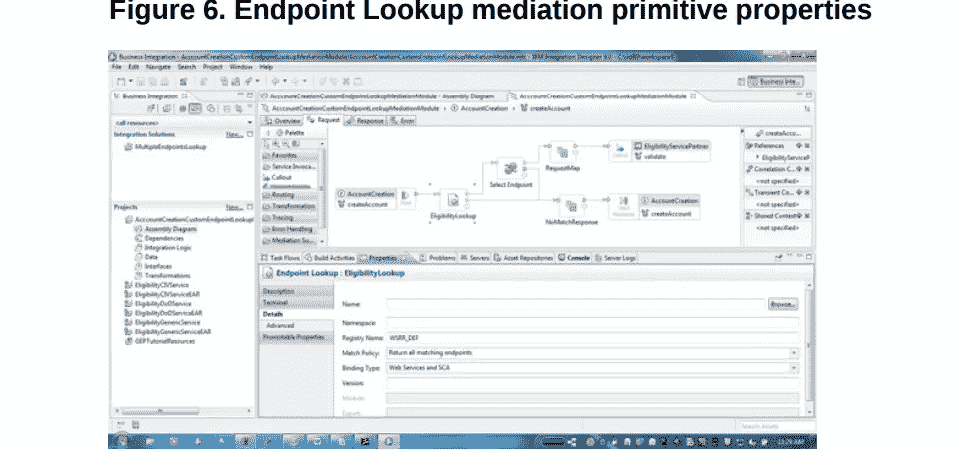*

*Assembly editor — Mediation sequence*

*5.设置匹配策略以返回所有匹配的端点，并设置路由目标。此设置确保 WSRR 返回匹配此查询的所有端点。
匹配的端点被填充在 SMO 消息的 ***上下文/primitive context/EndpointLookupContext***元素中。
下面的清单 1 显示了定制中介原语逻辑，它执行以下步骤:*

*1.将从 WSRR 返回的所有服务的 ***CustomerSubType*** 自定义属性与 SMO 消息正文中指定的名字进行比较。
2。如果 ***CustomerSubType*** 和 first name 匹配，则 SMO 消息的***headers/smo header/Target***元素将使用匹配的服务端点 URL 进行更新。此端点 URL 用于动态端点查找。自定义原语的常规输出终端被触发。3.如果没有名字与 WSRR 的***customer subtype***自定义属性相匹配，则写入一条失败消息，并触发自定义原语的第二个输出终端。*

*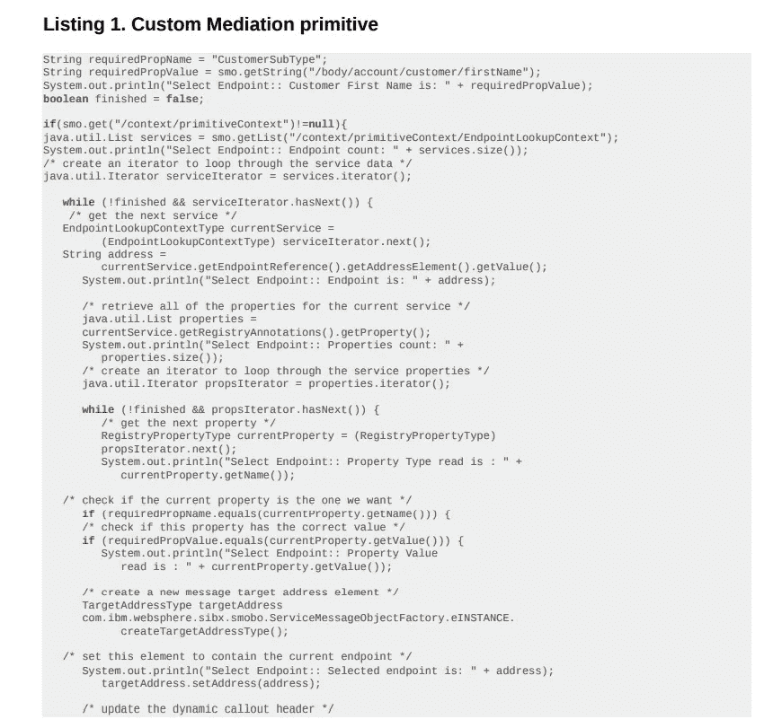*

*Custom mediation primitive*

**

*Custom mediation primitive (cont.)*

*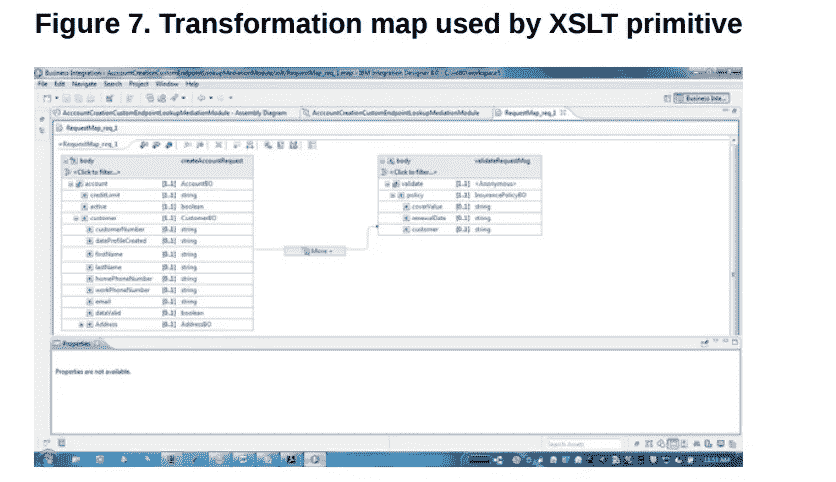*

*XSLT Transformation map*

# *将元数据填充到 WSRR 并配置属性*

*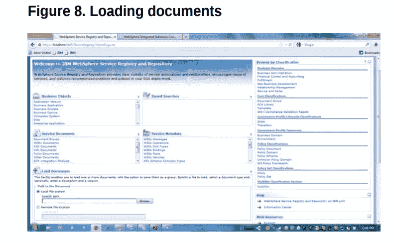*

*Populate metadata into WSRR*

1.  *点击浏览导入服务的 WSDL 和 XSD 文件
    ***\ EligibilityCIVService \ WEB content \ we b-INF \ wsdl \ eligibilityserviceschema . xsd******\ EligibilityCIVService \ WEB content \ we b-INF \ wsdl \ eligibilityservice . wsdl******\ EligibilityCIVService \ WEB content \ we b-INF \ wsdl \ EligibilityCIVService****

*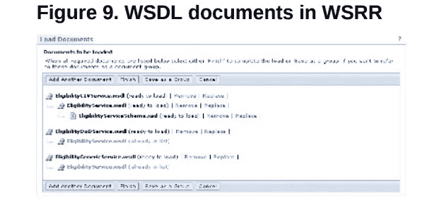*

*WSDL documents*

*以***eligibilitydoservice _ EligibilityServiceHttpPort***为例，属性名***customer subtype***和值 ***Reuters-DoD。****

****图 10 显示了 WSRR 的房产配置:****

*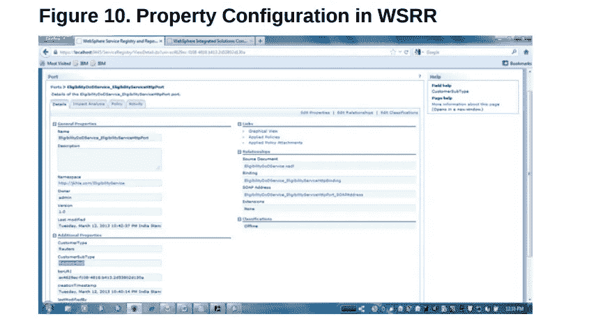*

*Property configuration*

# *测试中介模块*

*在 WSRR 完成上述步骤后，您可以通过将*作为 ***Reuters-DoD*** 来动态查找服务，从而测试中介模块执行对 WSRR 的动态查找。
***图 11 下面的*** 显示了对中介模块的输入。
***AccountCreationCustomEndpointLookupMediation***中介流正在集成测试客户端中进行测试。以 ***开始的 ***名字*** 值导致 ***资格 DoD*** 服务返回成功的帐户激活:*****

*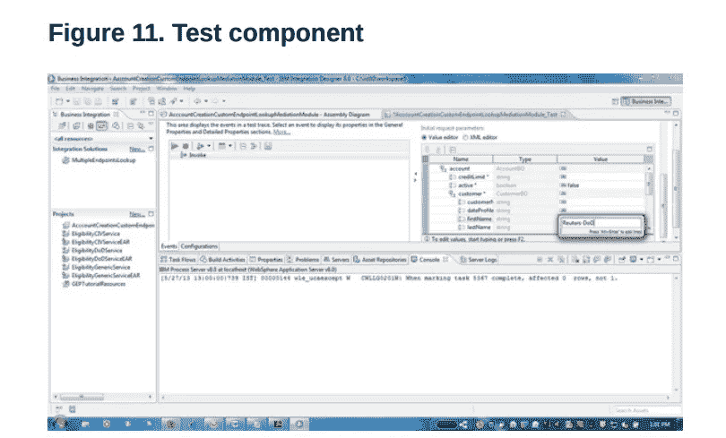*

*Integration Test Client*

*在中介模块中传递了 ***名字*** 作为 ***Reuters-DoD*** 之后，
***图 12*** 显示了服务器日志中的最后五行，显示了来自 WSRR 的正确服务 URL 并调用了适当的服务。调用的服务返回值为真，如右上方所示:*

*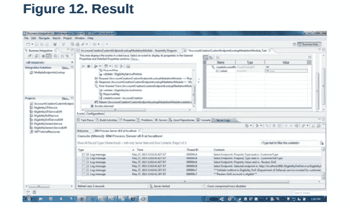*

*Test Output*

# *另一种方法*

*另一种方法是使用 ESB 网关模式和虚拟服务，通过网关端点查找原语来执行动态查找，如图 13 所示。本文不讨论这种方法的细节。*

*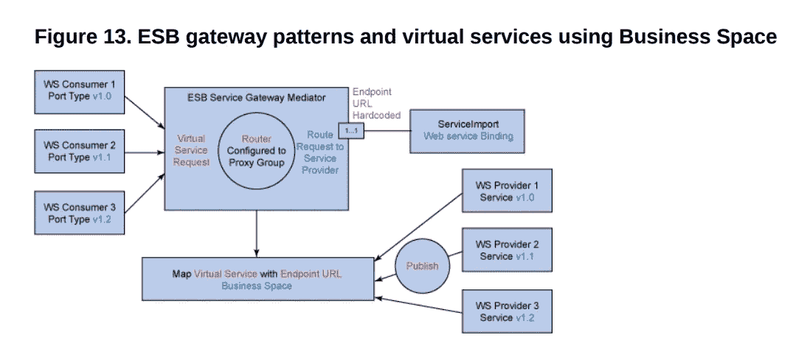*

*Another approach*

# *结论*

*本文展示了如何将 Process Server 与 WSRR 集成。它解释了如何构建中介模块来使用端点查找和定制中介原语执行对 WSRR 的动态查找。*

## *发布于 2021 年 5 月 4 日*