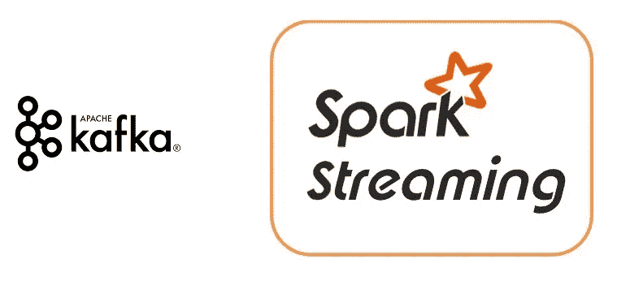

# 整合卡夫卡与 PySpark

> 原文：<https://medium.com/geekculture/integrate-kafka-with-pyspark-f77a49491087?source=collection_archive---------0----------------------->

如何在 pyspark 上配置 Kafka 消费者和生产者？

本文介绍了如何在 PySpark 上设置 Kafka Producer 和 Kafka Consumer，以在一定的时间间隔内批量读取数据并处理消息。

# 什么是 PySpark

Apache Kafka 是一个开源的流处理软件平台，由 Apache 软件基金会开发，用 Scala 编写…