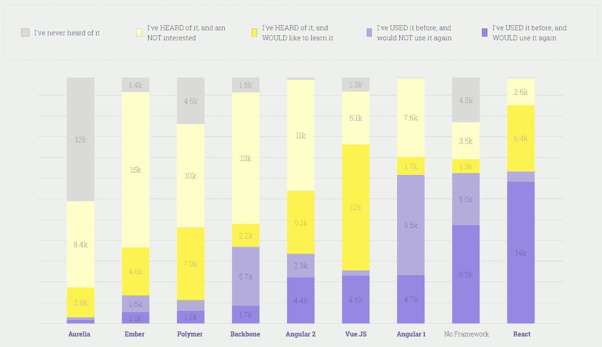
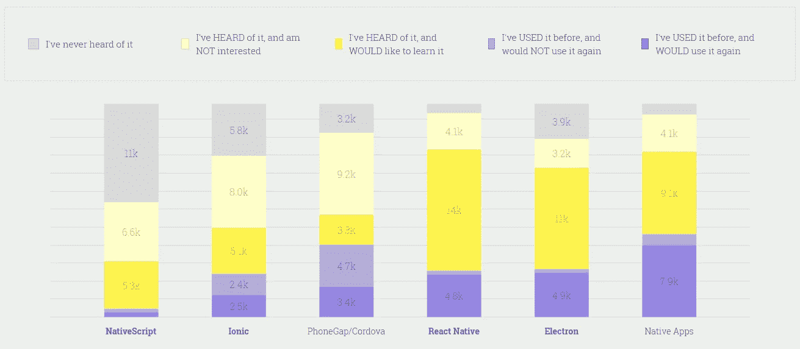

# 将移动应用与 React Native 集成的分步指南

> 原文：<https://medium.com/geekculture/integrate-mobile-app-with-react-native-c2027737ded8?source=collection_archive---------9----------------------->

Integrate Mobile App with React Native

React Native 是快速启动和运行您的应用程序的好方法。你可以使用它，如果你是一个初学者或有经验的开发人员，因为这个框架是为每个人设计的！有大量关于一切如何工作的文档也很有帮助。

这项技术已经成为需要快速完成项目的开发人员的首选。凭借其提供跨多种设备工作的组件的能力，难怪越来越多有经验的移动应用程序构建者转向这项技术，而不是编写本机代码！

# **什么是 React？**

React 是脸书创建的基于 JavaScript 的库，可用于构建用户界面。React 提供了一种管理随时间变化的数据的方法。React 使用基于组件的方法，将组件分为数据(输入)、容器(状态)和输出。

根据[的 JavaScript 研究](https://2017.stateofjs.com/2017/front-end/results/)，React 是最受欢迎的库:

React 还鼓励您使用声明式编程方法。不是给代码一套操作数据的指导，而是给它简单的语句，告诉它数据在初始状态下是什么样子，以及当它改变时应该是什么样子。这有两个主要的好处:它简化了调试，因为当需要检查的代码更少时，bug 更容易被跟踪；它保持了代码的可读性。

# **什么是 React Native？**

React Native 是一个著名的使用 React 构建原生应用的框架。它允许您像使用 React 一样编写 Javascript，但是代码在与您习惯的环境完全不同的环境中执行。如果您来自常规的 React 开发，学习如何开始使用 React Native 将非常简单。以下是一些显示 React Native 日益流行的统计数据:

此外，您将使用 JSX 语法和其他常见反应模式的知识，并以新的方式应用它们。如果没有，或者已经有一段时间没有看 JavaScript 了，请继续阅读！我们有一个介绍，分解了 JS 的一些基本原理，所以它们更容易理解。

## **了解 React 和 React Native 的区别**

React Native 是一个高度认可的使用 React 构建原生移动应用的框架。React Native 也使用与 React 相同的设计，允许开发人员从声明性组件构建丰富的移动 UI。这两者的区别在于 React Native 将你的代码编译成原生 iOS 和 Android 视图，而不是在浏览器中渲染组件。

它使用与 React 相同的视图系统(因此它不会替换现有的视图),因此可以与现有的 JavaScript 代码和库一起工作，这使得那些已经了解 React 的人很容易学习。使用 React Native，您不用用 XML 构建 ui；相反，您可以使用熟悉的 JavaScript 结构——类和函数调用——来创建可以在 React Native 运行的任何设备或平台上运行的 ui。

**组件、API 和本机模块**

有太多的内置组件。但是，如果您需要更具体的东西，还有许多 API 和第三方库。以下是 React 原生平台的一些特性:

*   视角
*   文本
*   图像
*   文本输入
*   滚动视图

> **这里有一些特定于 Android 平台的组件和 API:**

*   **BackHandler**

BackHandler 类提供了一种为支持多导航的活动创建后台堆栈的简单方法。这使您能够构建更加身临其境的应用程序，用户可以在不同的上下文中一个接一个地导航。

支持多导航的活动是指当用户按 back 时显示一堆后退条目的活动。例如，如果你在手机上阅读电子书，鼓励返回会让你回到图书馆；再次按下它会返回到图书列表。

*   **datepickrandroid**

这个新的 DatePickerAndroid 类允许您使用时间选择器对话框，为格式化时间提供了几个选项。它支持 12 小时和 24 小时时钟格式，相对时间如 5 分钟前或明天早上 6:30，还可以支持用户定义的自定义格式。以下示例显示了如何将 DatePickerAndroid 集成到您的应用程序中。

*   **DrawerLayoutAndroid**

一个片段代表一个滑动菜单。SlideMenuFragment 类方便地实现了一个滑出菜单，您可以将它用作活动的内容视图。要了解有关编写 SlideMenuFragment 子类的更多信息，请参见滑动片段。

您还应该查看将任务添加到您的任务列表，以了解如何让用户直接从您的应用程序中将任务添加到他们的任务列表中(以及对 TaskListActivity 进行其他常见添加)。

*   **许可和类固醇**

向应用程序添加新权限非常简单；开发人员在创建新项目时需要这样做。框架定义了一组默认授予的权限。这包括 INTERNET、READ_PHONE_STATE、ACCESS_COARSE_LOCATION、ACCESS_FINE_LOCATION、CAMERA 和其他核心功能所需的权限。

*   **ProgressBarAndroid**

该组件显示一个水平条，显示任务完成时的进度。它还可以广泛用作纺车或另一个在制品指示器的替代物。

ProgressBarAndroid 表示相对于某个最大值的剩余工作量，其中 0 表示没有剩余工作量，1 表示所有剩余工作量都已完成。

*   **to stand roid**

祝酒词是通常在你的屏幕上弹出的信息。祝酒词不会占据焦点，也不会阻碍用户与活动的互动。它们会短暂地出现在你移动的顶端，然后在一小段时间(由你定义)后自动消失。

除了标准的 toast 消息，您还可以将操作或自定义视图设置为 toast 消息的一部分。如果你想让你的应用对这样的系统事件做出反应，使用通知管理器。

*   **ViewPagerAndroid**

ViewPager 子类，添加了对将单击侦听器附加到各个页面的支持。这是 PagerTabStrip 的附加组件，因此在使用 ViewPagerAndroid 时，它的所有功能(如水平滑动动画)也是可用的。

## **将 React Native 与现有移动应用集成的逐步流程:**

移动应用程序与 react native 集成是提高开发速度、制作更复杂的应用程序并同时为两个 iOS & Android 实现功能的最佳方式。如果你对将它集成到你的原生应用中有任何顾虑，我可以向你保证它会很好地工作。

为了获得无缝体验，最好使用 React Native 从头创建您的应用程序。但是如果你想要一种简单的方法来添加用户流和屏幕，而不需要自己写代码，这可能就是答案！

> **第一步:先决条件**

首先，您需要在系统上设置 React Native。

开始使用 React Native 最简单的方法是通过 Create React native app (CRNA)。它将帮助您避免安装在您的系统上编写代码所必需的任何库或工具，只专注于构建新的应用程序！

您需要安装 Node V6 +, CRNA 才能正常工作——但是；我们建议使用 NPM3/4 版本，而不是它的最新版本，据报道，它在与 yarn 脚本一起使用时会出现错误。

现在，全局安装 CRNA(创建 React 原生应用程序):

> **NPM install-g create-react-native-app**
> 
> **或**
> 
> **$ yarn global 添加 create-react-native-app**

如果您想要创建新的应用程序，请运行以下命令:

> **$ create-react-native-app your-app-name**
> 
> **$ cd 你的应用程序名称**

React 本地项目在您当前使用的工作目录中创建一个名为 your-app name 的目录。

在这个新文件夹中，它将生成一个初始项目结构，并通过 npm 脚本安装我们的应用程序所需的所有依赖项。

*   npm 开始
*   npm 测试
*   npm 运行 ios
*   npm 运行 android
*   npm 运行弹出

如果您从设备中弹出应用程序，将需要设置 Xcode 或 Android Studio 环境。您可以使用版本控制系统，如 Git，在必要时进行恢复，避免在未来的项目中出现任何数据丢失的问题。

> **第二步:现有项目重组**

如果您需要将 RN 集成到您的项目中，但只希望它用于应用程序的反应原生部分，而不是两者同时使用，那么以下是方法。

您将在根目录外创建一个名为“android”的文件夹(在本例中为 C:\YourProject)。接下来，复制/yourricetnanaapp/中的所有文件，包括它的项目引用和资产，这样它们就会出现在另一个名为“Android”的子文件夹中现在也在工作室 3 中打开它们。

**安装 JavaScript 依赖项**

*   移动到应用程序/您的桌面应用程序的根目录
*   创建名为 package.json 的文件
*   将以下代码粘贴到其中:

> ***{***
> 
> ***"姓名":" YourAndroidApp "，***
> 
> ***【版本】:【0.0.1】，***
> 
> ***“私”:真、***
> 
> ***【剧本】:{***
> 
> ***【start】:【node node _ modules/react-native/local-CLI/CLI . js start】***
> 
> ***}***
> 
> ***}***

接下来，您需要确保安装了纱线卷装管理器。

之后，安装反应原生和反应包。并且，打开终端或命令提示符。然后，导航到包含您的 package.json 文件的目录，并运行以下命令:

> **$纱线添加反应-原生**

如果您看到类似以下所述的消息，无需担心:

警告“react-native@0.52.2”有未满足的对等依赖关系“react@16.2.0”。

这意味着您还需要安装 React:

> **$纱线添加反应@ version _ printed _ over**
> 
> **第 3 步:将 React Native 集成到项目中**

您需要将“反应原生”依赖项添加到移动应用程序的构建中。渐变文件:

> **属地{**
> 
> **……**
> 
> **编译" com . Facebook . react:react-native:+"//From node _ modules**
> 
> **}**

然后，为要构建的本地 React Native 目录添加一个条目。

如果您确定要将其添加到“所有项目”块中，这将很有帮助

将其添加到 Android/build . grade le，而不是 Android/app/build . grade le

> **所有项目{**
> 
> **储存库{**
> 
> **maven {**
> 
> **URL "/yourAnDroidap/node _ modules/react-native/Android "**
> 
> **}**
> 
> **……**
> 
> **}**
> 
> **……**
> 
> **}**

您还需要确保这条路径是完全正确的！

> **第四步:添加权限**

如果在 Android Studio 中打开 AndroidManifest.xml 会有所帮助，它位于 Android/app/src/main/Android manifest . XML 路径下。

之后，将此权限添加到它:

> **第五步:反应原生代码**

您需要在根目录/YourAndroidApp 中创建一个 index.android.js 文件。它将成为 React 原生应用的入口。

**反应视图**

您需要在 Android Studio 中创建新的活动，并将其命名为 MyReactActivity。添加此代码后:

> **公共类 MyReactActivity 扩展 Activity 实现 defaulthardwarebacktnhandler {**
> 
> **私有 ReactRootView mReactRootView**
> 
> **私有 react instance manager mReactInstanceManager；**
> 
> **@覆盖**
> 
> **受保护的 void onCreate(Bundle saved instancestate){**
> 
> **super . oncreate(savedInstanceState)；**
> 
> **mReactRootView = new react rootview(this)；**
> 
> **mReactInstanceManager = react instancemanager . builder()**
> 
> **。set application(get application())**
> 
> **。setBundleAssetName(" index . Android . bundle ")**
> 
> **。setJSMainModulePath(" index ")**
> 
> **。add package(new MainReactPackage())**
> 
> **。setUseDeveloperSupport(build config。调试)**
> 
> **。setinitiallifecyclrestate(lifecyclrestate。续)**
> 
> **。build()；**
> 
> **//这里的字符串(例如“YourAndroidApp”)必须与**匹配
> 
> **//index . js**中 AppRegistry.registerComponent()中的字符串
> 
> **mreactrootview . startreactapplication(mReactInstanceManager，" YourAndroidApp "，null)；**
> 
> **setContentView(mReactRootView)；**
> 
> **}**
> 
> **@超驰**
> 
> **public void invokeDefaultOnBackPressed(){**
> 
> **super . onbackpressed()；**
> 
> **}**
> 
> **}**

在这之后，您需要将一些活动生命周期回调传递给 ReactRootView 和 ReactInstanceManager。如果你在运行这段代码时遇到任何困难，你可以从任何一家 react-native 开发公司获得帮助。

> **@超驰**
> 
> **受保护的 void onPause() {**
> 
> **super . on pause()；**
> 
> **if (mReactInstanceManager！= null) {**
> 
> **mreactinstancemanager . onhostpause(this)；**
> 
> **}**
> 
> **}**
> 
> **@覆盖**
> 
> **protected void onResume() {**
> 
> **super . on resume()；**
> 
> **if (mReactInstanceManager！= null) {**
> 
> **mreactinstancemanager . onhostresume(这，这)；**
> 
> **}**
> 
> **}**
> 
> **@覆盖**
> 
> **受保护的 void onDestroy() {**
> 
> **super . on destroy()；**
> 
> **if (mReactInstanceManager！= null) {**
> 
> **mreactinstancemanager . onhostdestroy(this)；**
> 
> **}**
> 
> **if (mReactRootView！= null) {**
> 
> **mreactrootview . unmountreactapplication()；**
> 
> **}**
> 
> **}**
> 
> **:**

您还需要将按钮事件传递回 React Native:

> **@覆盖**
> 
> **public void onBackPressed(){**
> 
> **if (mReactInstanceManager！= null) {**
> 
> **mreactinstancemanager . onbackpressed()；**
> 
> **}其他{**
> 
> **super . onbackpressed()；**
> 
> **}**
> 
> **}**

它将允许 JS 控制当用户按下硬件后退按钮时会发生什么(例如，实现导航)。当 JS 不处理 back 按钮按下时，可能会调用 invokeDefaultOnBackPressed 方法。默认情况下，它只是完成您的活动。

> **第六步:打开 React 应用**

之后，您需要添加打开 MyReactNative 活动的逻辑，以便根据您的移动应用程序的业务逻辑启动 ReactNative 移动应用程序。

> **Intent Intent = new Intent(this，myreactactivity . class)；**
> 
> **startActivity(意图)；**

要运行您的移动应用程序，您需要首先启动服务器。您需要在根目录/YourAndroidApp 中运行以下命令:

> **$纱线开始**
> 
> **//或者**
> 
> **$ npm 开始**

您可以像往常一样从 Android Studio 运行移动应用程序，并测试您的代码。

## **让我们总结一下:**

React Native 是需要同时构建 iOS 和 Android 应用的开发者的最佳框架之一。它不断更新，使集成这个软件变得容易！如果你在这个过程中需要专业帮助，你可以 [**雇佣 react 原生开发者**](https://www.alcax.com/services/hire-react-native-app-developers/) 在这个过程中帮助你。