# 整合服务提供商(sp)和 OKTA 身份提供商(IdP)

> 原文：<https://medium.com/geekculture/integrate-service-providers-sps-with-okta-identity-provider-idp-ce64a4e262ae?source=collection_archive---------7----------------------->

## 使用 OKTA 设计服务提供商发起的单点登录流程:IAM

## SAML 2.0 平台+ OKTA 作为身份提供者

Service provider initiated SSO Flow

# 范围

T 这篇文章解释了 SAML2.0 SSO 与使用 Spring Security 构建的多个服务提供者，并将它们注册到充当身份提供者的 *OKTA* 。

# 什么是 SAML SSO？

SAML 单点登录的目标是最小化用户登录不同网站的次数。它便于用户在一个站点手动登录(称为身份提供商(IdP))，然后在一个或多个其他站点(称为服务提供商(SP))自动登录，而无需提供凭据。身份提供者和服务提供者之间必须存在信任关系。服务提供商相信身份提供商已经对用户进行了身份验证。

# SAML2.0 术语

a.**主体**是尝试认证的用户。
b .服务提供者( **SP** )是请求关于主体的认证和身份信息的服务。SP 将从 IdP 获取身份验证响应，并使用该信息来创建和配置会话。
c .身份提供者( **IdP** )是提供身份信息和身份验证决策的来源。IdP 认证主体并将身份信息返回给 SP。
d. **SAML 支持两个单点登录流程。** SP 发起的单点登录和 IdP 发起的单点登录。 ***在本文中，我们将关注 SP 发起的单点登录*** 。
e. **绑定**是服务提供商和身份提供商之间传输数据的格式。最流行的两种是 HTTP 重定向绑定和 HTTP POST 绑定。HTTP 重定向绑定使用 HTTP 重定向和查询参数传输数据。这种类型的绑定通常用于身份验证请求。HTTP POST 绑定使用 HTTP POST 表单传输数据，这种类型的绑定通常用于身份验证响应。
f. **断言**是由身份提供者做出的关于委托人的陈述。它定义了关于主体的身份信息如何从身份提供者传递到服务提供者。
例如，委托人的电子邮件地址和/或委托人可能关联的组/角色。服务提供者使用断言为主体创建和配置会话。
g. **SAML 请求**，也称为认证请求，由服务提供商生成以“请求”认证。身份提供者生成 SAML 响应。它包含经过身份验证的用户的实际断言。此外，SAML 响应可能包含附加信息，如用户配置文件信息和组/角色信息，这取决于服务提供商可以支持的内容。

# 什么时候使用 SAML 认证协议？

## 用例

a.SAML SP 始终是一个网站。所以应该是 web 应用。
b .为了利用现有的 SAML 身份验证并探索 OAuth2 授权，可以使用 SAML 断言授权类型来交换 OAuth2 访问令牌的断言。
*举例:*
`**grant_type**` : `**urn:ietf:params:oauth:grant-type:saml2-bearer**`

# SAML2.0 流程

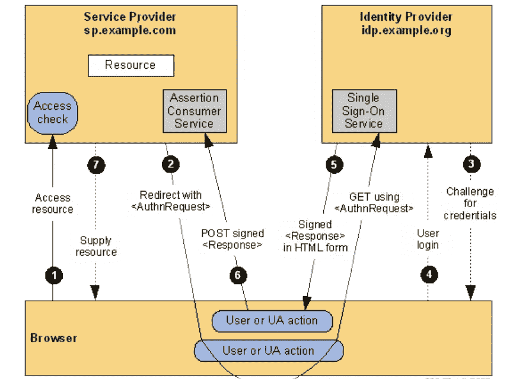

SP initiated Single Sign-on flow

***服务提供商*** —运行在 HTTP Secure **端口 8443** 和**端口 7342** 的 Spring boot 应用程序。
***身份提供者*** — OKTA。
1。假设用户使用 Windows 桌面登录(Kerberos)登录，并需要访问 web 应用程序 SSO 服务。❸ & ❹的步骤不是必需的。用户体验是，他们点击应用程序链接，立即无缝地被授予访问应用程序的权限
2。假设用户直接访问网站而无需认证会话，则需要步骤❸ & ❹向身份提供商进行认证，以访问应用程序。

## 步伐

a)用户点击 web 应用程序的链接(❶).
b)应用程序识别出用户没有有效的 SSO 会话令牌，并将用户的浏览器重定向到 IdP 服务(❷).
c) IdP 服务使用 Kerberos 在用户现有登录的基础上对用户进行身份验证(或),如果 Kerberos 未实现，则 IdP 会要求用户进行身份验证，并通过用户的浏览器向应用程序(❺ & ❻)发送 SAML 断言令牌。
d)应用程序接收包含用户标识符(如电子邮件地址)的 SAML 声明，并确定其是否拥有该用户的帐户，以及是否允许他们使用该应用程序。应用程序向用户呈现适当的页面(❼).

# OKTA，作为身份提供者

## 服务提供商配置

a. ***凭您的证件登录*** 到秋田。

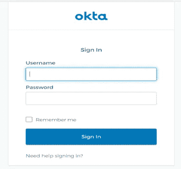

OKTA Login

b.点击最右边的 ***管理*** 。

Click ADMIN

c.点击 ***应用、*** *和* ***添加应用***

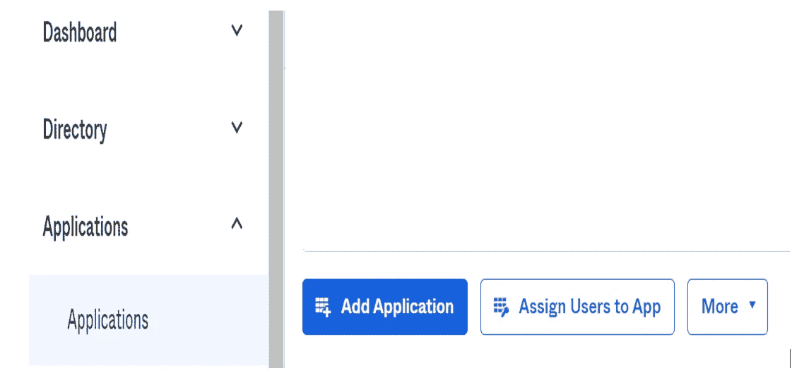

Add Application

d.创建 ***新应用***

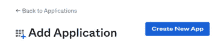

Create New App

e.在 ***创建新的应用集成*** 界面，选择如下，点击 ***创建***；

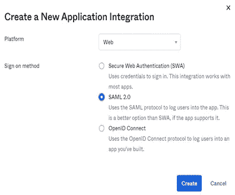

Create New Application Integration

f. ***一旦创建，打开*** 应用程序。
g .在**通用**选项卡中，最低配置如下所示；

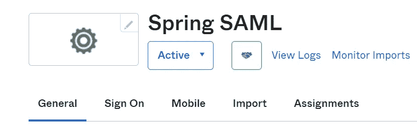

General Tab

1.下面显示的单点登录 URL 是断言消费者服务(ACS) URL。ACS URL 是服务提供者上的一个端点，身份提供者会将其身份验证响应重定向到该端点。此端点应该是 HTTPS 端点，因为它将用于传输个人身份信息(PII)。
2。受众 URI 是身份提供者发送的 SAML 声明的预期受众。

## OKTA 中的服务提供商 1 配置

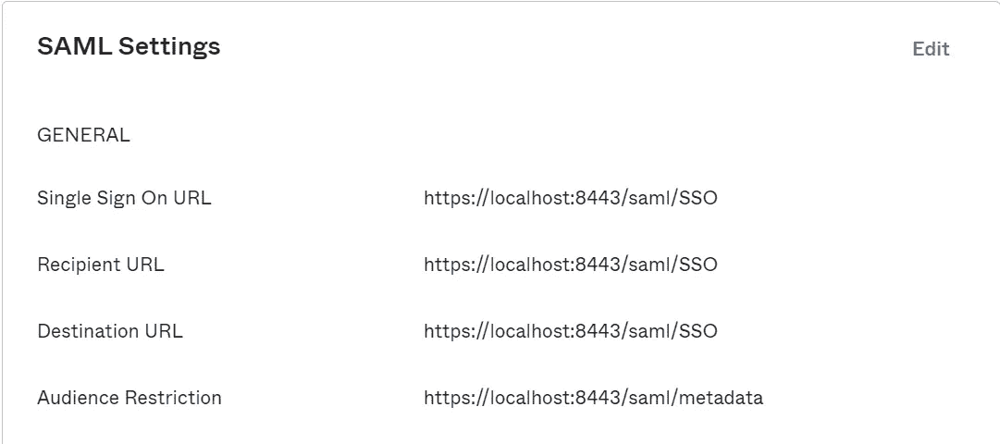

SAML settings — OktaIS application configuration

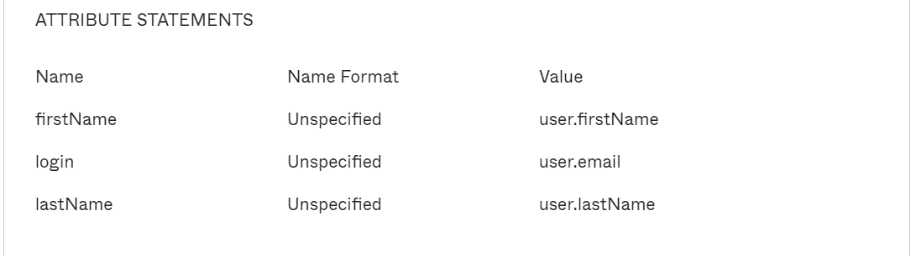

Create Attributes

## OKTA 中的服务提供商 2 配置

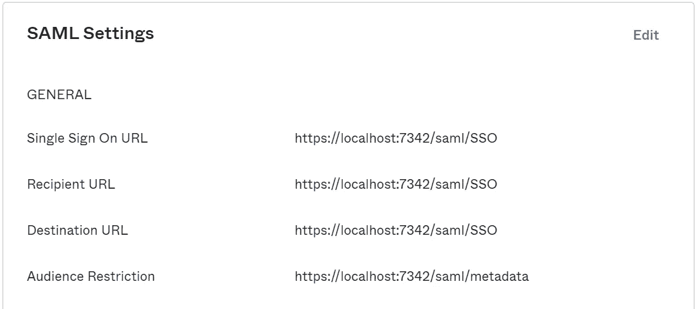

SAML settings — OktaIS2 application configuration

在选项卡上的**标志中，
1。下载 ***IdP 元数据*** 配置 Spring boot 应用。
2。在 ***IdP 元数据*** 中要寻找的重要标签是***SingleSignOnService***和***key descriptor***。***SingleSignOnService***标签定义向其发送认证请求的绑定和端点，而***key descriptor***标签包含身份提供者的公钥，该公钥将用于验证认证响应。**

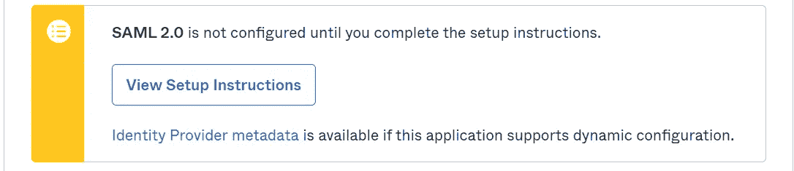

Download SAML IdP metadata

在**分配**选项卡中，
1。选择用户和/组，以提供对应用程序的访问。

# 使用 Keytool 创建 JKS 密钥库

a. **JKS 直到 Java 8
b**。**由于 **Java 9** ，**默认的密钥库格式是 PKCS12****

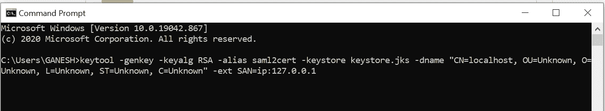

Create JKS keystore

由于 IdP 将个人身份信息(PII)传输到断言消费者服务(ACS) URL，我们使 HTTP **变得安全**。因此，我们在服务提供者处创建一个密钥库来发起 HTTPS 请求。

# Spring Boot 安全

为了演示单点登录，我们创建了两个 Spring boot 安全应用程序。

## 最低配置

**OktaIS 应用程序作为服务提供者 1** 运行在**安全端口 8443**

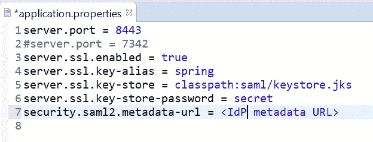

Spring boot — application.properties

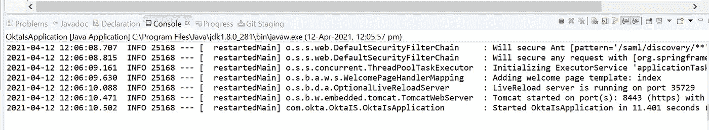

**OktaIS** running on **secure port 8443**

**OktaIS2 应用程序作为服务提供者 2** 运行在**安全端口 7342**

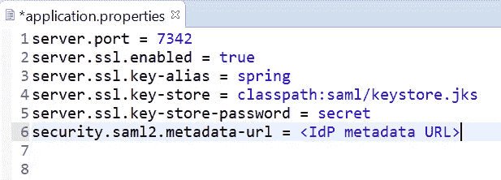

Spring boot — application.properties

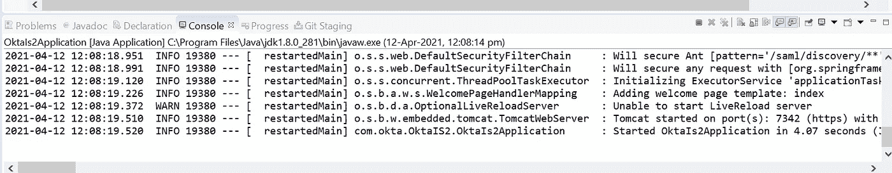

**OktaIS2** running on **secure port 7342**

# 启动用户代理

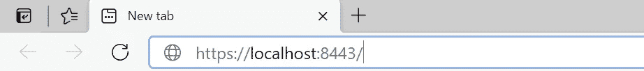

Service provider URL

a.当用户点击上述服务提供者 URL 时，用户代理将重定向到身份提供者，如下所示；
b .服务提供商生成的 SAML **AuthnRequest** 可以在下面的屏幕截图中看到。XML 文档将被序列化 **(base64、压缩和 URL 编码)**，作为查询参数添加到 URL，并将主体的浏览器重定向到身份提供者的登录页面。

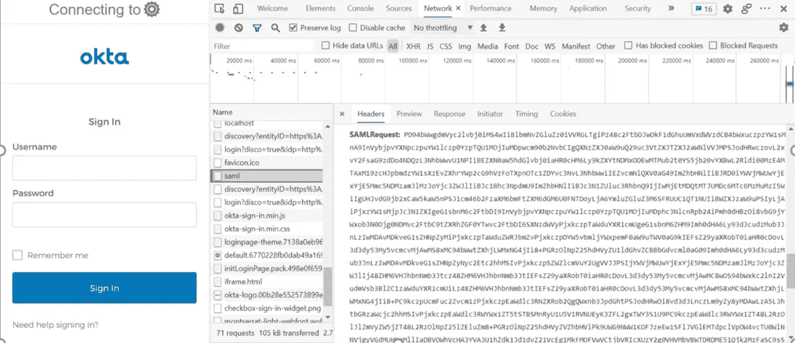

OktaIS application — **AuthN request**

c.如果主体输入了正确的登录凭据，身份提供者将执行 302 重定向到服务提供者的 ACS URL，其正文包含身份验证响应，如下所示。

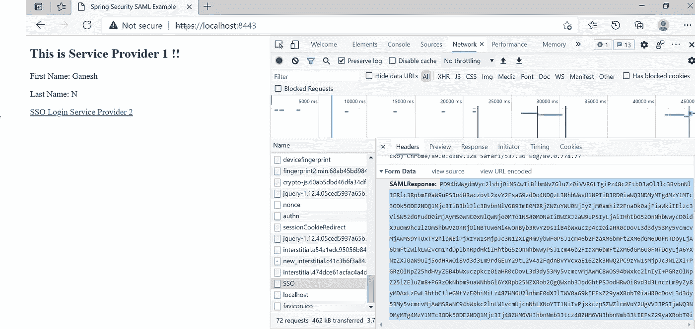

OktaIS application(Service provider 1)

d.当服务提供者收到认证响应时，它应该首先检查 **InResponseTo** 属性是否引用了服务提供者实际发送的 **AuthnRequest** 的 **ID** 。此外， **IssueInstant** 属性应该用于限定响应的有效性窗口。
e .身份验证响应所传递到的 ACS URL 不执行客户端的身份验证，这就是为什么必须检查身份验证响应中的签名以确保客户端是身份提供者。
f .信息提前在带外交换，然后用于验证客户端

## 导航至服务提供商 2

a.使用 **OktaIS** 应用程序中给出的导航超链接，点击使用 SSO 访问 **OktaIS2** 应用程序，如下所示。

OktaIS2 application(Service provider 2)

# 结论

在本文中，我们看到了 SAML2.0 SSO 与 Spring Security 和 Spring boot 应用程序的集成，OKTA 作为身份提供者。
可以在[**GitHub**](https://github.com/ganesh-nag/Integrate-SAML2.0-SP-with-OKTA-IDP)**中查看代码进行学习和了解。**

## **发布于 2021 年 4 月 12 日**

> ****其他中等文章，*由* Ganesh Nagalingam****
> 
> **[使用 JAPA 访问者模式探索语法树和补救代码气味](/geekculture/quest-syntax-tree-and-remedy-code-smell-using-japa-visitor-patterns-f023a89842cf)**
> 
> **[*异步 WebSocket 消息中间件和微服务*](/nerd-for-tech/asynchronous-websocket-messaging-middleware-and-microservices-1a50a8f14e4b)**
> 
> **[*通过 CORS*](/geekculture/amalgamate-angular-with-spring-cloud-architecture-through-cors-7f13b5fdb98f) 将棱角与春云建筑融合**
> 
> **[多代理洞察 Apache Kafka 集群架构](/geekculture/multi-broker-insights-into-apache-kafka-cluster-architecture-617b0abfc53e)**
> 
> **[*远程队列定义:IBM MQ v9.2*](https://ganeshblog.medium.com/remote-queue-definition-ibm-mq-v9-2-c3ec4f568dab?source=user_profile---------5----------------------------)**
> 
> **[*Kubernetes Pods&Docker Containers:在 Windows 10 Home 中使用虚拟盒子旋转 VM*](https://ganeshblog.medium.com/kubernetes-pods-docker-containers-spin-vm-using-virtual-box-in-windows-10-home-d3be783ff087?source=user_profile---------0----------------------------)**
> 
> **[*联邦 OKTA IdP + WSO2 API Manager 作为 Spring boot 微服务集成的网关*](https://ganeshblog.medium.com/federate-okta-idp-wso2-api-manager-as-gateway-to-spring-boot-microservices-integration-ba567567e81?source=user_profile---------1----------------------------)**
> 
> **[*集成 IBM 业务流程管理器和混合 MobileFirst 应用*](https://ganeshblog.medium.com/integrate-ibm-business-process-manager-with-hybrid-mobilefirst-application-5aed20841bf3?source=user_profile---------2----------------------------)**
> 
> **[*Kerberos v5:使用 Apache directory studio 的 Windows 10 Home 中的 SSO 认证*](https://ganeshblog.medium.com/kerberos-v5-sso-authentication-in-windows-10-home-using-apache-directory-studio-fb0151899185?source=user_profile---------3----------------------------)**
> 
> **[*将 IBM WebSphere Service Registry and Repository 与 IBM Process Server 集成*](https://ganeshblog.medium.com/integrate-ibm-websphere-service-registry-and-repository-with-ibm-process-server-f97eeb0e2ea?source=user_profile---------6----------------------------)**