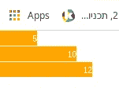

# 将 D3.js 集成到 Typescript React 应用程序中

> 原文：<https://medium.com/geekculture/integrating-d3-js-to-a-typescript-react-application-d77580756b20?source=collection_archive---------2----------------------->


在今天的前端应用程序开发中，ReactJS 库已经成为最流行的 Javascript/Typescript 框架。

另一方面，D3.js 是在 Web 上创建动态图表最常用的 Javascript 库。

使用 Typescript 语言集成这两个框架甚至更多可能有点棘手。但是绝对有可能。这就是本文的目的。

## 创建并安装库

首先，我们必须创建一个新的 react 项目。如果我们选择 Typescript 语言，那么建议定义一个 Typescript 模板。这是通过以下 NPM 命令完成的:

```
npx create-react-app react-ts-chart — template typescript
```

下一步不是强制性的，但是如果您想为您的项目使用 Sass 预编译器，建议您这样做:

```
npm install node-sass — save
```

现在，让我们导入 D3.js 库。第一行是 D3.js 文件，第二行是 Typescript 定义:

```
npm i d3npm i [@types/d3](http://twitter.com/types/d3)
```

这将足以创建我们的第一个图表。

## 创建我们的第一页

让我们创建包含第一个图表的第一个页面。基本的 Typescript 模板如下所示:

## D3 原则

D3 是一个 javascript 框架，它在一个`SVG` 元素上展示了它的图形。所以我们必须定义这样一个元素。首先，让我们定义一个`SVGSVGElement` 对象:

```
ref!: SVGSVGElement;
```

并将它链接到一个`SVG` 元素:

```
<svg className=”container” ref={(ref: SVGSVGElement) => this.ref = ref} width=’100' height=’100'></svg>
```

现在让我们将 D3.js 库导入到组件中:

```
import * as d3 from ‘d3’;
```

对于本教程，我们将实现一个非常简单的条形图，数据将是一个简单的硬编码的`Number` 数组。让我们构建一个私有函数来说明该图:

在 React 组件中，有几个生命周期阶段。其中一个是`componentDidMount()`功能。这个阶段在构造器和渲染(在这个阶段中，你实际上绘制 HTML)阶段之后执行。所以让我们在舞台上执行`buildGraph` 功能。

最终的组件应该如下所示:

现在让我们通过一个`SCSS` 模板来设计我们的新图表:

我们的新图应该如下所示:



## 结论:

恭喜你！我们已经向 react 应用程序实现图形和图表迈出了第一步。

完整的源代码可以在[https://github.com/krasnoff/react-ts-chart](https://github.com/krasnoff/react-ts-chart)找到