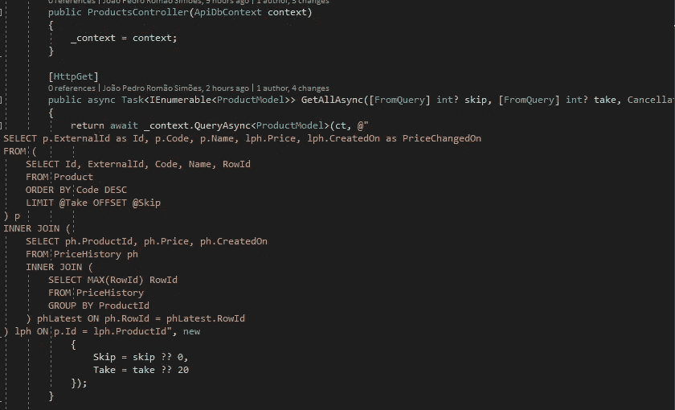

# 将 Dapper 与实体框架核心集成

> 原文：<https://medium.com/geekculture/integrating-dapper-with-entity-framework-core-55aacc94b5b0?source=collection_archive---------1----------------------->

## 通过使用 Dapper 执行原始 SQL 克服限制或性能瓶颈

如今，实现一个应用程序而不使用任何类型的库来进行*对象-关系映射* ( *ORM* )来减少开发时间是非常罕见的，因为这样可以消除实现大量样板代码来访问数据库的需要。在。网络…