# 为多种环境集成 Firebase Crashlytics 的 iOS 小部件扩展—第三部分

> 原文：<https://medium.com/geekculture/integrating-firebase-crashlytics-for-ios-widget-extensions-for-multiple-environments-part-iii-59f40101ec02?source=collection_archive---------16----------------------->

在本教程中，我们将了解如何将 Crashlytics 添加到您的 iOS widget 扩展中。如果你还没有在应用中集成 firebase，我建议你快速浏览一下本教程的[第一部分](/flawless-app-stories/integrating-firebase-crashlytics-for-multiple-targets-in-ios-part-i-2c262b25f1c2)和[第二部分](/swlh/integrating-firebase-crashlytics-for-multiple-targets-in-ios-part-ii-b1a7d116ad1c)。链接也附加在末尾。

# 要求

您的小部件中发生的所有崩溃都应该在开发/测试和生产阶段报告。开发/测试崩溃应该记录在开发项目中，而生产崩溃应该记录在生产中。

# 先决条件

我假设您已经将小部件扩展集成到您的应用程序中，并将 **FirebaseCrashlytics** 添加到您的项目中。我还假设您正在与**协同工作**。

# 问题

**有一个 GoogleService-Info.plist，它报告一个项目中的所有崩溃**

在 Firebase 上只有一个项目，所有环境只有一个应用程序，这变得越来越混乱，因为越来越难以确定崩溃发生在哪个目标上。下面是我们必须处理的环境列表，将用作示例

> ***环境*** *开发、QA、发布。*

# 解决方案:

我在 firebase 仪表板上创建了一个新项目，并添加了 3 个应用程序开发、QA 和发布。

> 注:如果你想了解我是如何创建多个应用程序的，请在 https://bit.ly/3rv4K38阅读本系列的第一部分

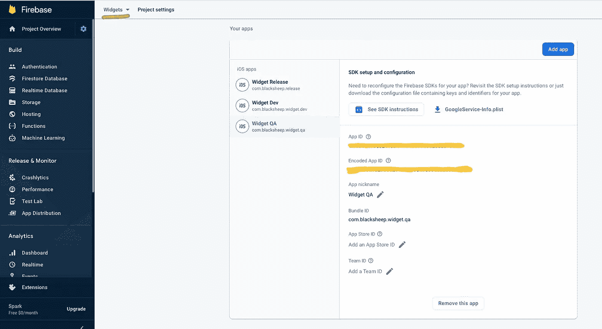

**下载所有 3 个 GoogleService-Info.plist，放入各自的文件夹**。
例如，为开发创建的 plist 将驻留在`Widget --> DEV`中，
QA plist 将驻留在`Widget --> QA`中，并将 plist 发布到`Widget --> Release`。排列看起来像这样。

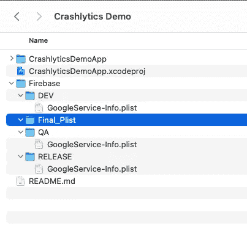

## 可选:

你可以把这些 plist 添加到你的 *widget 扩展，* **但是**你不应该链接它们。取消选中该复选框可以确保不会将所有 plist 复制到包中。

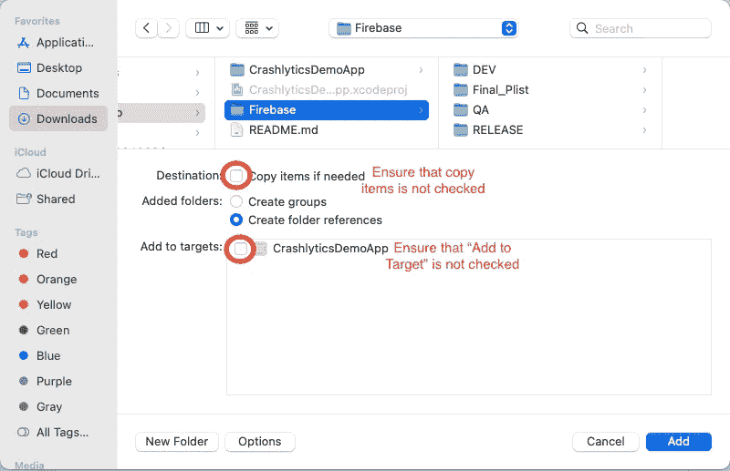

# 添加 shell 脚本以将正确的 plist 复制到小部件包

如何确保将正确的 plist 添加到 widget bundle 中，并且我们会因为它而崩溃？

为此，我们将编写一个脚本，负责将给定环境的正确 Plist 复制到包中。我将添加脚本，并尝试解释它是如何工作的。
我已经将脚本作为`widgetscript.sh`保存在项目根目录下的文件夹 shell 脚本中。

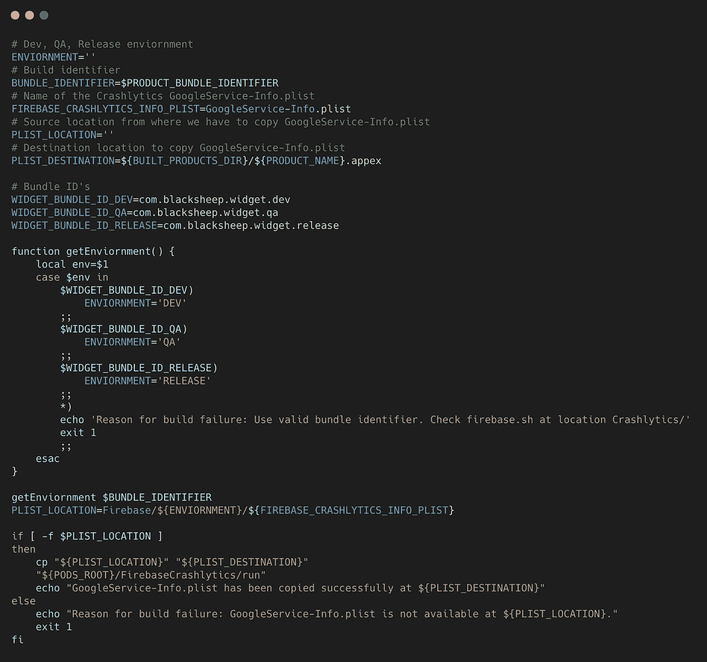

## 获取源路径

为了选择正确的 plist 路径，我们需要以下东西:
1 .`Bundle Identifier` -我们已经添加了所有将要使用的包 id
2。`Environment` -开发，质量保证，发布

基于`Bundle identifier`我们算出了`Environment`。
`PLIST_LOCATION`是通过将 plist 名称附加到它们上而创建的。
这里有一个例子
`Firebase/${Environment}/GoogleService-info.plist`，如果 bundle ID id com.blacksheep.dev，它将成为
`Firebase/DEV/GoogleService-info.plist`您的源路径

## 获取目标路径

创建目的地很简单；这基本上是最终 WidgetExtension.appex `${BUILT_PRODUCTS_DIR}/${PRODUCT_NAME}.appex`的路径

## 将 plist 从源复制到目标

一旦我们有了这两个位置，我们就将 plist 从源路径复制到目标路径。

# 将 shell 脚本添加到 Xcode

打开 Xcode，进入 Widget 目标的构建阶段。
点击窗口左侧的+图标，选择新建脚本阶段。
将`shellscript/widgetscript.sh`添加到项目中。这将在构建目标后运行自定义 shell 脚本。

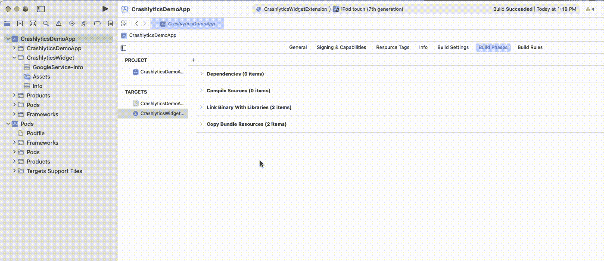

脚本添加完毕，现在是时候构建应用程序并检查是否复制了正确的 plist。一旦脚本执行完毕，您可以在`${BUILT_PRODUCTS_DIR}/${PRODUCT_NAME}.appex`打开路径，检查是否复制了正确的 plist。

如果您在构建应用时遇到错误，我们会在适当的位置添加日志来帮助您解决问题。

> ***问题:*** *如果您的构建因以下错误而失败，您需要提供运行 shell 脚本的权限。*
> 
> /Users/username/Library/Developer/Xcode/derived data/CrashlyticsDemoApp-afuovelrzqqgzdazlyioykmuqloh/Build/intermediates . no index/CrashlyticsDemoApp . Build/Debug-iphone simulator/CrashlyticsDemoApp . Build/Script-af D5 C5 b 026 ad 46 bb 001 BF 8 aa . sh:第 2 行:shellscript/widgetscript . sh:**权限被拒绝**
> 
> ***修复:*** *打开终端，导航到 widgetscript.sh 的位置，在终端上运行以下命令。* 
> 
> ***问题:*** *捆绑包 id 与 plist 文件中指定的捆绑包 id 不匹配。*
> 
> ***修复:*** *检查你的* widget 目标*的* bundle id *和*Google service-info . plist .
> *两者应该匹配。*

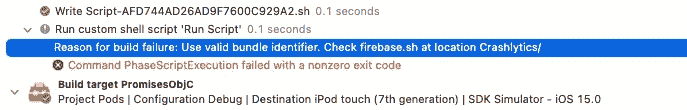

> ***问题:***
> *当捆绑标识符无效或 plist 不在有效路径中或路径不正确时的错误消息。在继续之前修复这些问题。*
> 
> ***修复:*** *检查文件夹*中是否有 Plist

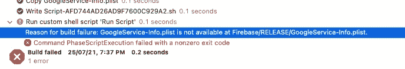

# 最后的步骤

如果一切正常，您将在位置`${BUILT_PRODUCTS_DIR}/${PRODUCT_NAME}.appex`看到正确的`GoogleService-info.plist`。您可以在项目导航器中检查构建状态，以获得已安装应用程序的路径。

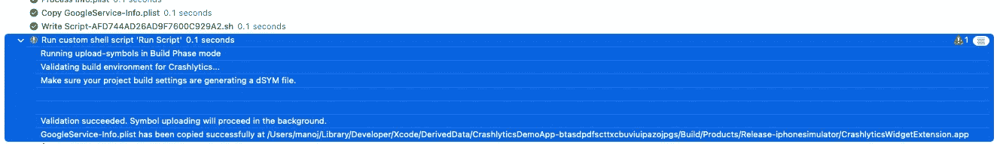

让我们验证是否将正确的 plist 复制到了包中。
你可以从项目中打开`CrashlyticsWidgetExtension.appex`，查看包的内容，检查 GoogleService-Info.plist 是否存在。

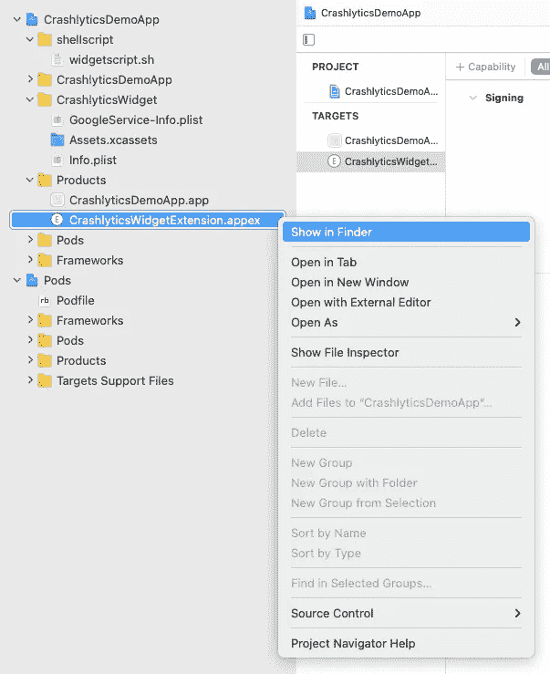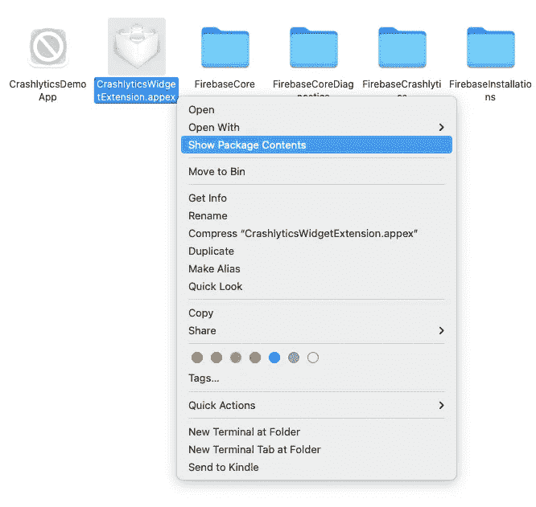

# 将 firebase 配置为小部件扩展

转到您的小部件文件并配置 crashlytics。类似这样的东西

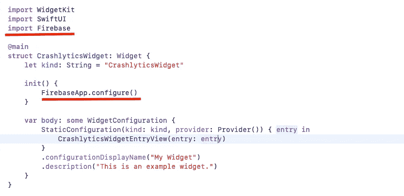

在你的`Arguments passed on launched`中添加`-FIRDebugEnabled`作为你的 widget 方案。这将显示 XCode 控制台中 firebase 的任何问题。大概是这样的:

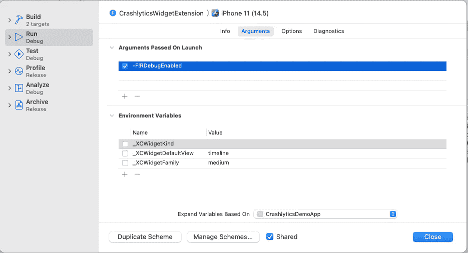

# Firebase 控制台崩溃

一旦完成。在代码中添加一个强制崩溃，并检查 firebase 控制台。

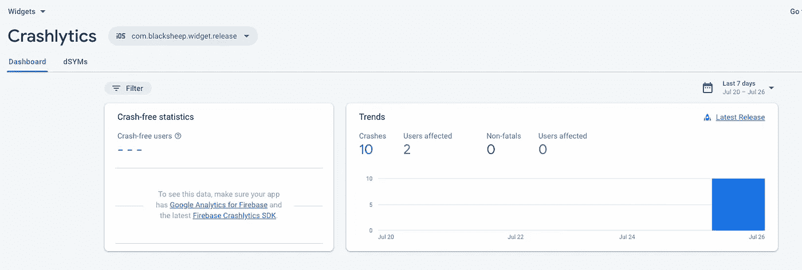

> ***重要:*** *1。如果你是在* ***调试模式下运行 app******你* *需要将*`*Debug Information Format*`**设置为* `*DWARF with dsym File*` ***。*** *这将报告以调试格式运行时模拟器或设备的崩溃。
> 2。在调试模式下连接到 Xcode 时，您不会看到任何崩溃。您需要崩溃并重新打开应用程序，而不是在调试模式下从 Xcode 运行。
> 3。如果遵循以上 2 个步骤，15 分钟内会报告第一次碰撞。有点耐心，这不是你的错。****

*这就是我们如何为您的小部件完成 crashlytics 设置。
我在这里添加了一个完整的项目[。如果你被卡住了，就用这个项目来解决你的问题。](https://github.com/manojaher88/CrashlyticsDemoApp)*

*我错过了什么用例吗？请在评论中告诉我。如果你在添加 crashlytics 时仍然遇到问题，请在下面的评论中告诉我。我将非常乐意帮助你。*

# *我的其他与 crashlytics 相关的线程:*

* [## GitHub-manojaher 88/CrashlyticsDemoApp:向小部件扩展添加 crashlytics

### 向小部件扩展添加 crashlytics。通过创建帐户，为 manojaher88/CrashlyticsDemoApp 的发展做出贡献…

github.com](https://github.com/manojaher88/CrashlyticsDemoApp)  [## 为 iOS 中的多个目标集成 Firebase Crashlytics 第一部分

### Firebase Crashlytics 是一个崩溃报告工具，可以帮助您实时跟踪崩溃，并突出显示…

medium.com](/flawless-app-stories/integrating-firebase-crashlytics-for-multiple-targets-in-ios-part-i-2c262b25f1c2)  [## 为 iOS 中的多个目标集成 Firebase Crashlytics 第二部分

### 在本教程中，我们将看看如何处理多个目标和环境。如果您还没有集成…

medium.com](/swlh/integrating-firebase-crashlytics-for-multiple-targets-in-ios-part-ii-b1a7d116ad1c)*